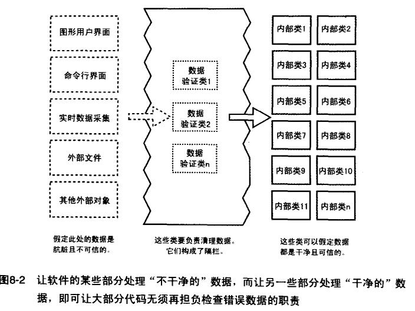

# 基本功

## 目錄

* [資料結構](./資料結構.md)
* [演算法](./演算法.md)
* [設計模式](./設計模式.md)

## 防禦式編程

1. 保護程序免遭非法數據的破壞
    1. 檢查所有來源於外部的數據
        * 當從外部接口中獲取數據時，應檢查所獲得的數據值，以確保它在允許的范圍內。
    2. 檢查子程序所有輸入參數的值
    3. 決定如何處理錯誤的輸入數據
        * 一旦檢測到非法參數，選擇適合的錯誤處理方式處理（見第3項）。
2. 斷言
    1. 建立自己的斷言機制
    2. 用錯誤處理代碼處理預期發生的狀況，用斷言去處理那些不該發生的錯誤
    3. 利用斷言來註解前條件和後條件
        * 前條件（先驗條件）：調用方在調用子程序前，保證入參的合法性。
        * 後條件（後驗條件）：子程序的返回結果保證合法性。
    4. 避免將需要執行的子程序放到斷言中
3. 錯誤處理
    * 程序的健壯性：健壯性具體指的是應用在不正常的輸入或不正常的外部環境下仍能表現出正常的程度。
        * 健壯性的原則：
            1、不斷嘗試採取措施來包容錯誤的輸入以此讓程序正常運轉（對自己的代碼要保守，對用戶的行為要開放）
            2、考慮各種各樣的極端情況，「沒有什麼是不可能的」
            3、即使終止執行，也要准確/無歧義的向用戶展示全面的錯誤信息
            4、拋出有助於 debug 的錯誤信息

    * 程序的正確性：和健壯性是有一定沖突的。健壯性盡可能不出錯。正確性是寧可出錯也不返回不准確的值。
        1. 返回中立值 / 默認值：處理錯誤的最佳做法就是繼續執行操作並簡單的返回一個沒有危害的值。
        2. 換用下一個正確的數據：在輪詢中，如返回數據有誤就丟掉，進行下一輪查詢。
        3. 返回上一次正確的數據：同上，不跳過的也可以返回上一次正確的數據。
        4. 選擇最接近的合法值
        5. 上報錯誤日誌
        6. 返回一個錯誤狀態碼
        7. 啟動錯誤處理子程序或對象
        8. 顯示對用戶友好的出錯消息
        9. 正確性要求高的話，就直接退出程序
4. 異常處理（出錯後，調用方利用try/catch/finally捕獲子程序異常，並進行善後處理）
    1. 用異常通知程序的其他部分，發生了不可忽略的錯誤
    2. 只在真正例外的情況下才拋出異常
    3. 不能用異常來推卸責任：能在局部處理掉就在局部解決掉，不要簡單拋出去。
    4. 避免在構造函數和析構函數中拋出異常，除非你在同一個地方把它們捕獲
    5. 在恰當的抽象層次拋出異常：不要把底層的異常拋給高層的調用方，暴露具體實現的細節。
    6. 異常消息中加入關於導致異常發生的全部信息
    7. 避免使用空 catch 語句
    8. 考慮創建一個集中的異常上報機制
    9. 考慮異常的替換機制
5. 建立隔欄
    
    * 左側外部接口數據假定是髒數據、不可信，通過中間這些類（子程序）構成隔欄，負責清理、驗證數據，並返回可信的數據，最右側的類（子程序）全部在假定數據干淨（安全）的基礎上工作，這樣可以讓大部分的代碼無須再擔負檢查錯誤數據的職責，類似的適配器模式和門面模式用來隔離或適配變化，都是對不可控變化的防禦。
6. 輔助調試代碼（Debugging Aids）
    1. 在早期的引入輔助調試代碼
    2. 採用進攻式編程
        “盡量讓異常的情況在開發期間暴露出來，而在產品上線時自我恢復。”在開發階段考慮到最壞的情況。
    3. 發布時移除調試輔助的代碼

## 其他

大量可以看相關論文的地方

[papers-we-love](https://github.com/papers-we-love/papers-we-love)

## 參考文章

* [防禦性設計和開發](https://mp.weixin.qq.com/s/G4pME9xFHdWnFckgytnofQ)
