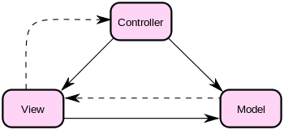
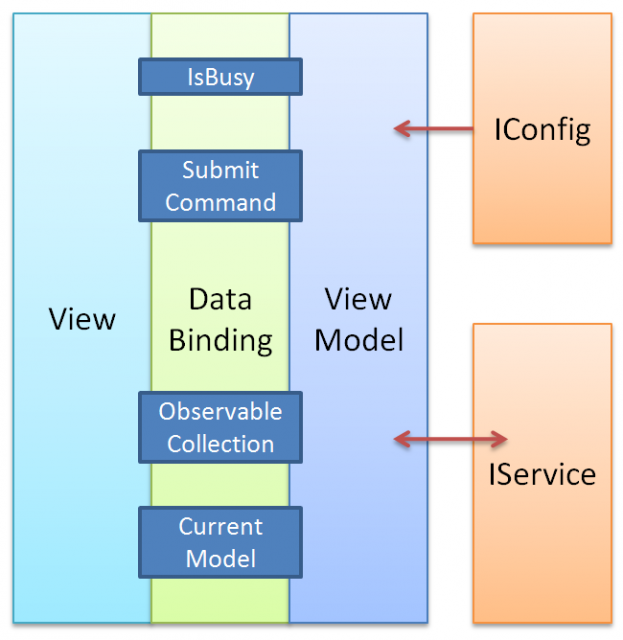

# 設計模式學習筆記

> A pattern is a proven solution to a recurring problem in a specific context.
> 模式是在一個特定情境下針對重複出現的問題的一個成熟的解決方案

## 物件導向設計基本原則 SOLID

Robert C. Martin 提出的物件導向五個原則，這五個設計原則都是針對「應付改變」這件事

* S：單一職責原則 (Single*Responsibility Principle, SRP)
    * There should never be more than one reason for a class to change. (不應該有超過一個修改一個類別的理由)
        * 若要達成這個要求，那麼一個類別就應該只有一個功能(職責)，否則就有可能因為不只一個理由而改變。
    * 好處是因為類別只有一個功能，這樣可以降低單一類別被改變時影響的範圍
    * 根據「單一職責原則」，將一個系統劃分為若干個子系統有利於降低整個系統的複雜性，一個常見的設計目標是使子系統間的通信和相互依賴關係達到最小，而達到該目標的途徑之一就是引入一個外觀對象，它為子系統的訪問提供了一個簡單而單一的入口。
* O：開放封閉原則 (Open*Close Principle, OCP)
    * Open for extension, but closed for modification (對擴充開放，但對修改封閉)
    * 新增需求時，盡可能讓所有修改擴充都是「新增程式碼」而不是「修改程式碼」。
        * 開發軟體最怕的不是「寫程式」而是「改程式」，因為一旦改動，所有相依的模組都可能需要修改，就有可能出問題。
            * 雖然如果有足夠的測試可以減少這種「漣波效應（ripple effect）」，但如果能完全避免掉這種效應當然更好。避免的方式最簡單的就是－－只新增程式碼，不修改任何舊有的程式碼，既然沒修改，自然不會有漣波效應。
    * 要做到這一點，實作就必須符合 LSP 原則才行。
* L：立次克夫替換原則 (Liskov Substitution Principle)
    * Subtypes must be substitutable for their base types (只要是父類別(介面)出現的地方，都可以用子類別(介面實作)取代)
        * 也就是說子類別要有與父類別一致的行為，反過來說，父類別(介面)必須遵守定義介面的人所期待的行為。
    * 針對繼承時子類別所造成的「行為變化」要如何設計的原則
* I：介面隔離原則 (Interface segregation principle, ISP)
    * 客戶端不應依賴它不需要的介面，類別之間的依賴應該建立在最小的介面上，避免客戶端因為不相關介面改變也一起被迫需要改變。
        * 也就是說不應該用大的總體介面，而是用較小的專門介面，介面的方法盡可能少，減少改變的機會。
* D：依賴倒轉原則 (Dependency*Inversion Principle, DIP)
    * 又稱「相依性反向原則」、「依存關係反轉原則」...
    * High-level modules should not depend on low-level modules. Both should depend on abstractions. (高層模組不應該依賴低層模組，兩個都應該依賴抽象)
    * Abstractions should not depends on details. Details should depend on abstractions. (抽象不應該依賴細節，細節應該依賴抽象)
    * 正常情況下，上層模組自然會相依於下層模組(因為上層模組會用到下層模組的功能)，但 DIP 告訴我們要變成「上層和與下層模組都相依於抽象介面(abstractions)，這樣上層模組就不會因為底層模組改變而被迫改變。白話文的說就是依賴抽象，而不是具體實現，另一個說法－－細節依賴策略，而策略不依賴細節。
    * 這種設計方式也符合開放封閉原則 (Open*Closed Principle)

## 領域驅動設計 (Domain-Driven Design, DDD)

可以看到領域驅動設計（domin-driven design）不同於傳統的針對數據庫表結構的設計，領域模型驅動設計自然是以提煉和轉換業務需求中的領域知識為設計的起點。在提煉領域知識時，沒有數據庫的概念，亦沒有服務的概念，一切圍繞著業務需求而來，即：

* 現實世界有什麼事物 -> 模型中就有什麼對象
* 現實世界有什麼行為 -> 模型中就有什麼方法
* 現實世界有什麼關系 -> 模型中就有什麼關聯

DDD 按照單一職責原則（Single responsibility principle）進行領域建模，軟件系統中每個元素只完成自己職責內的事，將其他的事交給別人去做。

我們需要根據業務相關性、耦合的強弱程度、分離的關注點對這些活動進行歸類，找到不同類別之間存在的邊界，這就是限界上下文的含義。上下文（Context）是業務目標，限界（Bounded）則是保護和隔離上下文的邊界，避免業務目標的不單一而帶來的混亂與概念的不一致。

DDD 的大體流程如下：

1. 建立統一語言
    * 統一語言是提煉領域知識的產出物，獲得統一語言就是需求分析的過程，也是團隊中各個角色就系統目標、范圍與具體功能達成一致的過程。
    * 使用統一語言可以幫助我們將參與討論的客戶、領域專家與開發團隊拉到同一個維度空間進行討論，若沒有達成這種一致性，那就是雞同鴨講，毫無溝通效率，相反還可能造成誤解。因此，在溝通需求時，團隊中的每個人都應使用統一語言進行交流。
    * 一旦確定了統一語言，無論是與領域專家的討論，還是最終的實現程式碼，都可以通過使用相同的術語，清晰准確地定義領域知識。重要的是，當我們建立了符合整個團隊皆認同的一套統一語言後，就可以在此基礎上尋找正確的領域概念，為建立領域模型提供重要參考。
        * 舉個例子，不同玩家對於英雄聯盟（league of legends）的稱呼不盡相同；國外玩家一般叫“League”，國內玩家有的稱呼“擼啊擼”，有的稱呼“LOL”等等。那麼如果要開發相關產品，開發人員和客戶首先需要統一對“英雄聯盟”的語言模型。
2. 事件風暴（Event Storming）
    * 事件風暴會議是一種基於工作坊的實踐方法，它可以快速發現業務領域中正在發生的事件，指導領域建模及程序開發。它是 Alberto Brandolini 發明的一 種領域驅動設計實踐方法，被廣泛應用於業務流程建模和需求工程，基本思想是將軟件開發人員和領域專家聚集在一起，相互學習，類似頭腦風暴。
    * 會議一般以探討領域事件開始，從前向後梳理，以確保所有的領域事件都能被覆蓋。
        * 領域事件是領域模型中非常重要的一部分，用來表示領域中發生的事件。一個領域事件將導致進一步的業務操作，在實現業務解耦的同時，還有助於形成完整的業務閉環。
        * 領域事件可以是業務流程的一個步驟，比如投保業務繳費完成後，觸發投保單轉保單的動作；也可能是定時批處理過程中發生的事件，比如批處理生成季繳保費通知單，觸發發送繳費郵件通知操作；或者一個事件發生後觸發的後續動作，比如密碼連續輸錯三次，觸發鎖定賬戶的動作。

3. 進行領域建模，將各個模型分配到各個限界上下文中，構建上下文地圖。
領域建模時，我們會根據場景分析過程中產生的領域對象，比如命令、事件等之間關系，找出產生命令的實體，分析實體之間的依賴關系組成聚合，為聚合劃定限界上下文，建立領域模型以及模型之間的依賴。

## DRY 原則 (Don't Repeat Yourself)

DRY 原則並不是盡一切可能避免「重複」，「避免重複」並不等於「抽象」，適當的重複程式碼是有好處的。

程式碼的「抽象」和「可讀性」其實是一對矛盾的關係。適度的抽象和避免重複可以提高可讀性，然而如果你盡「一切可能」把一些微不足道的「共同點」也提出來進行「共享」，它就開始有害了。因為這往往會使得閱讀程式碼時不能一目瞭然，損失了閱讀時的直觀性。

抽象的思想，關鍵在於「發現兩個東西是一樣的」。然而很多時候，你開頭覺得兩個東西是一回事，但結果最後卻發現它們其實只是膚淺的相似，而本質完全不同。還有的時候，有些東西開頭貌似同類，後來你增添了新的邏輯之後，發現它們的用途開始特殊化，後來就分道揚鑣了。過早的提取模板，反而捆住了你的手腳，使得你為了所謂「一致性」而重複一些沒用的東西。這樣的一致性，其實還不如針對每種情況分別做特殊處理。

防止過早抽象的方法其實很簡單，它的名字叫做「等待」。其實就算你不重用程式碼，真的不會死人的。時間能夠告訴你一切。如果你發現自己彷彿正在重複以前寫過程式碼，請先不要停下來，請堅持把這段重複的程式碼寫完。如果你不把它寫出來，你是不可能準確的發現重複的程式碼的，因為它們很有可能到最後其實是不一樣的。

你還應該避免沒有實際效果的抽象。如果程式碼才重複了兩次，你就開始提取模板，也許到最後你會發現，這個模板總共也就只用了兩次！只重複了兩次的程式碼，大部分時候是不值得為它提取模板的。因為模板本身也是程式碼，而且抽象思考本身是需要一定代價的。所以最後總的開銷，也許還不如就讓那兩段重複的程式碼待在裡面。

## 寫入時複製 Copy-On-Write

好文參考：

* [让 Node.js 变“懒”的 COW 技术](https://mp.weixin.qq.com/s/nQ6wHZ4H7ULcvN-rwLP-GA?utm_source=pocket_mylist)

## 防腐層

早在 Windows 誕生之前，工程師為瞭解決上文中硬件、固件與軟件的可維護性問題，引入了 HAL（Hardware Abstraction Layer）的概念， HAL 為軟件提供服務並且屏蔽了硬件的實現細節，使得軟件不必由於硬件或者固件的變更而頻繁修改。

HAL 的設計思想在領域驅動設計（DDD） 中又被稱為防腐層（Anticorruption Layer）。在 DDD 定義的多種上下文映射關系中，防腐層是最具有防禦性的一種。它經常被使用在下游團隊需要阻止外部技術偏好或者領域模型入侵的情況，可以幫助很好地隔離上游模型與下游模型。

引入防腐層的概念可以降低或避免當前後端的上下文映射接口變更對前端程式碼造成的影響。

防腐層不僅僅是多了一層對接口的封裝與隔離，它還能起到以下作用。

* 概念映射
    * 接口語義與前端需要數據的語義有時並不能完全對應，當在組件層直接調用接口時，所有開發者都需要對接口與界面的語義映射足夠瞭解。有了防腐層後，防腐層提供的調用方法包含了數據的真實語義，減少了開發者的二次理解成本。
* 格式適配
    * 在很多情況下，接口返回的數據結構與格式與前端需要的數據格式並不符合，通過在防腐層增加數據轉換邏輯，可以降低接口數據對業務程式碼的入侵。
* 接口緩存
    * 對於多種業務依賴同一接口的情況，可以通過防腐層增加緩存邏輯，從而有效降低接口的調用壓力。
    * 與格式適配類似，將緩存邏輯封裝在防腐層可以避免組件層對數據的二次緩存，並可以對緩存數據集中管理，降低程式碼的復雜度，一個簡單的緩存示例如下。
* 穩定性兜底
    * 當接口穩定性較差時，通常的做法是在組件層對 response error 的情況進行處理，這種兜底邏輯通常比較復雜，組件層的維護成本會很高。我們可以通過防腐層對穩定性進行兜底，當接口出錯時可以返回兜底業務數據，由於兜底數據統一維護在防腐層，後續的測試與修改也會更加方便。
* 聯調與測試
    * 接口和前端可能會存在並行開發的狀態，此時，前端的開發並沒有真實的後端接口可用。與傳統的搭建 mock api 的方式相比，在防腐層直接對數據進行 mock 是更方便的方案。

## MVC (Model-View-Controller)

MVC 是將 Model, View 和 Controller 分離，確保彼此的職責能夠明確的分開，不論是改 M、V 還是 C，都能讓另外兩層可不用做任何修改。

同時這樣的分層也可以加強程式的可測試性 (testability)，View 和 Model 基本上是相關的，但它們並不會有直接的相依關係，而是由 Controller 去決定 Model 產生的資料，然後丟給 View 去做呈現，也就是說，Controller 是 Model 和 View 之間的協調者 (coordinator)，View 和 Model 不能直接溝通，以確保責任的分離。

而 Controller 可以只是一個繫結 Model 和 View 的小類別，也可以是大到包含 Workflow, Enterprise Services 或是做為外部系統的 Proxy Services 等的邏輯系統，MVC 各元件是可以分離的組件，也可以是分離的系統 (當然要設計一些機制在相互溝通)。

## MVVM

MVVM 的架構一樣是 M, V 分離，但中間是以 VM (ViewModel) 來串接。

ViewModel 比較像是 View 的一個代理程式，它負責直接對 Model 做溝通，而 View 可以透過一些機制 (ex: Events, Two-way Databindings, ...) 來和 ViewModel 溝通以取得資料或將資料拋給 Model 做存取等工作。

MVVM 和 MVC 不同的地方，就是 ViewModel 和 View 的黏合度比較高，因為 View 必須要透過 ViewModel 才可以取得 Model，而 ViewModel 又必須要處理來自 View 的通知訊息，所以雖然職責一樣分明，但是卻不像 MVC 那樣可以擴展到整個系統元件都能用。

適合像 XAML 這種與程式碼無關 (code ignorance) 的使用者介面設計，只要 View 中下特定的指令與 ViewModel 串接，就可以享有 ViewModel 溝通的功能，而 ViewModel 只需做一些特別的介面實作，即可平順的和 View 溝通。

### MVP

MVP 一樣也是職責分明，且 Model 與 View 分離的架構，但是這個 P (Presenter) 和 ViewModel 就很類似，不過就如同 Presenter (主持人) 這個字所代表的意義，所有主控 View 呈現的工作，都是由 Presenter 來做，而 View 本身只是 Presenter 所要使用的舞台而已。

所以 View 原則上會相依於 Presenter，但是為了要做到關注點分離 (SoC 原則)，所以在 View 和 Presenter 間都會加入一個介面 (ex: IView)，然後以 IoC 的方式將 View 注射到 Presenter 中，而 Presenter 就使用介面所定義的方法去操控，而 View 就透過介面所定義的方法去呈現介面即可。但也因為受限於介面，所以 Presenter 只能依介面定義的動作去回應與處理，而不能再做更多的延伸功能，除非更改 View 的介面。

## 參考文章

* [領域驅動設計 ( DDD) 能給前端帶來什麼](https://mp.weixin.qq.com/s/Pp_H8ijxjZmCJCx753LmXQ)
* [基於 RxJS 構建穩健前端應用（講稿）](https://zhuanlan.zhihu.com/p/451099107)
* [MVP, MVC, MVVM, 傻傻分不清楚~](https://dotblogs.com.tw/regionbbs/2011/09/29/compare_to_mvp_mvc_mvvm)
