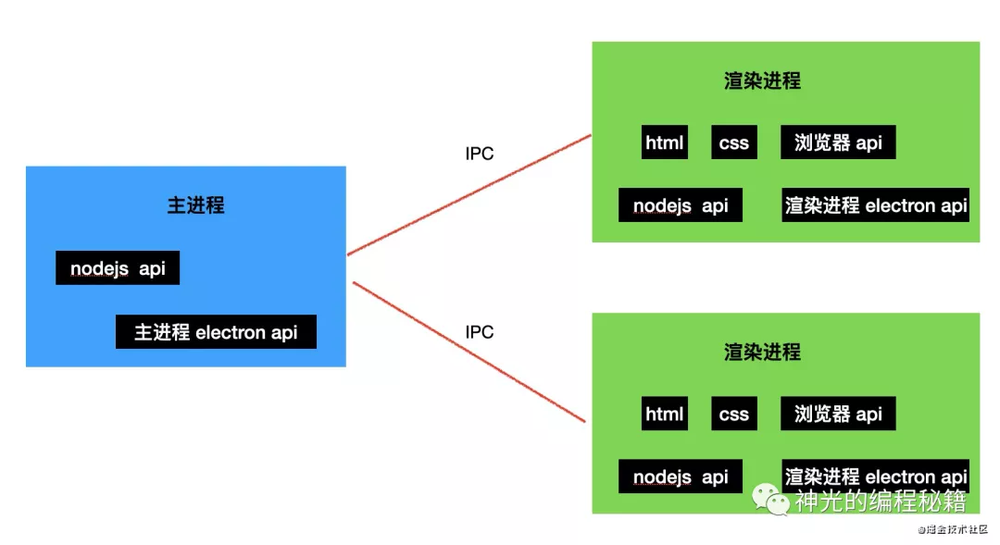
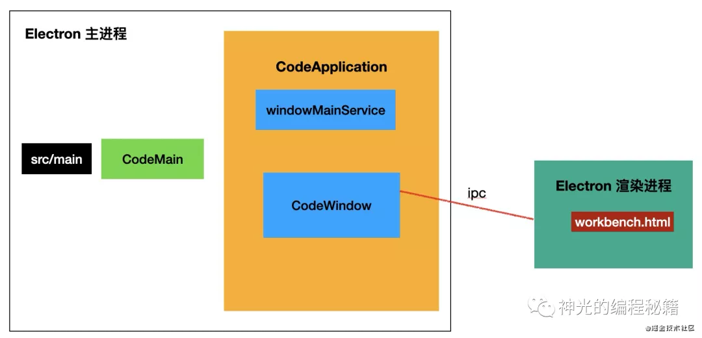

# Electron 學習筆記

## 基本架構

Electron 基於 node 和 chromium 做 JS 邏輯的執行和頁面渲染，並且提供了 BrowserWindow 來創建窗口，並提供相關 API 執行一些操作系統的功能，比如打開檔案、進程通信等。

每個 BrowserWindow 窗口內的 JS 都跑在一個渲染進程，而 electron 有一個主進程，負責和各個窗口內的渲染進程通信。



主進程可以使用 Node.js 的 API 和 Electron 自身提供給主進程的 API。渲染進程可以使用瀏覽器本身的 API 和 electron 提供給渲染進程的 api，除此以外，渲染進程還可以使用 html 和 css 來做頁面的佈局。

VSCode 的每個窗口就是一個 BrowserWindow，我們啟動 vscode 的時候是啟動的主進程，然後主進程會啟動一個 BrowserWindow 來加載窗口的 html，這樣就完成的 vscode 窗口的創建。（後續新建窗口也是一樣的創建 BrowserWindow，只不過要由渲染進程通過 ipc 通知主進程，然後主進程再創建 BrowserWindow，不像第一次啟動窗口直接主進程創建 BrowserWindow 即可。）

## VSCode 研究

### 應用啟動進入點

**src/main**

```typescript

// src/main.js
const {app} = require('src/前端相關/Electron 學習筆記');

app.once('ready', onReady);

async function onReady() {
    try {
        startup(xxxConfig);
    } catch (error) {
        console.error(error);
    }
}

function startUp() {
    require('./bootstrap-amd').load('vs/code/electron-main/main');
}

```

可以看到，./src/main.js 裡面只是一段引導代碼，在 app 的 ready 事件時開始執行入口 js。也就是 vs/code/electron-main/main，這是主進程的入口邏輯。

**CodeMain**

```typescript=
// src/vs/code/electron-main/main.ts
class CodeMain {
    main(): void {
        try {
            this.startup();
        } catch (error) {
            console.error(error.message);
            app.exit(1);
        }
    }
    private async startup(): Promise<void> {
        // 創建服務
        const [
            instantiationService,
            instanceEnvironment,
            environmentMainService,
            configurationService,
            stateMainService
        ] = this.createServices();

        // 初始化服務
        await this.initServices();

        // 啟動
        await instantiationService.invokeFunction(async accessor => {
            //創建 CodeApplication 的對象，然後調用 startup
            return instantiationService.createInstance(CodeApplication).startup();
        });

    }
}

const code = new CodeMain();
code.main();

```

可以看到，vscode 創建了 CodeMain 的對象，這個是入口邏輯的開始，也是最根上的一個類。它創建和初始化了一些服務，然後創建了 CodeApplication 的對象。

**CodeApplication**

```typescript=
// src/vs/code/electron-main/app.ts

export class CodeApplication {

    // 依賴注入
    constructor(
        @IInstantiationService private readonly mainInstantiationService: IInstantiationService,
        @IEnvironmentMainService private readonly environmentMainService: IEnvironmentMainService
    ){
        super();
    }

    async startup(): Promise<void> {
        const mainProcessElectronServer = new ElectronIPCServer();
        this.openFirstWindow(mainProcessElectronServer)
    }

    private openFirstWindow(mainProcessElectronServer: ElectronIPCServer): ICodeWindow[] {
        this.windowsMainService.open({...});
    }
}
```

CodeApplication 裡面通過裝飾器的方式聲明依賴，當通過容器創建實例的時候會自動注入聲明的依賴。

startup 裡面啟動了第一個窗口，也就是渲染進程，因為主進程和渲染進程之間要通過 ipc 通信，所以還會創建一個 ElectronIPCServer 的實例（其實它只是對 ipc 通信做了封裝）。

最終通過 windowMainService 的服務創建了窗口。

雖然比較繞，但是通過 service 和 ioc 的方式，能夠更好的治理復雜度，保證應用的架構不會越迭代越亂。

然後我們來看具體的窗口創建邏輯。

**windowMainService**

```typescript=
//src/vs/platform/windows/electron-main/windowsMainService.ts

export class WindowsMainService {

    open(openConfig): ICodeWindow[] {
       this.doOpen(openConfig);
    }

    doOpen(openConfig) {
        this.openInBrowserWindow();
    }

    openInBrowserWindow(options) {
        // 創建窗口
        this.instantiationService.createInstance(CodeWindow);
    }
}

```

在 windowMainService 裡面最終創建了 CodeWindow 的實例，這就是對 BrowserWindow 的封裝，也就是 vscode 的窗口。（用 xxx.createIntance 創建是因為要受 ioc 容器管理）

**CodeWindow**

```typescript=
//src/vs/platform/windows/electron-main/window.ts
import {BrowserWindow} from 'electron';

export class CodeWindow {
    constructor() {
        const options = {...};
        this._win = new BrowserWindow(options);
        this.registerListeners();
        this._win.loadURL('vs/code/electron-browser/workbench/workbench.html');
    }
}
```

CodeWindow 是對 electron 的 BrowserWindow 的封裝，就是 vscode 的 window 類。

它創建 BrowserWindow 窗口，並且監聽一系列窗口事件，最後加載 workbench 的 html。這就是 vscode 窗口的內容，也就是我們平時看到的 vscode 的部分。

至此，我們完成了 electron 啟動到展示第一個 vscode 窗口的邏輯，已經能夠看到 vscode 的界面了。

**總結**



vscode 是基於 electron 做窗口的創建和進程通信的，應用啟動的時候會跑主進程，從 src/main 開始執行，然後創建 CodeMain 對象。

CodeMain 裡會初始化很多服務，然後創建 CodeApplication，這是 ioc 的實現，全局唯一。對象的創建由容器來管理，裡面所有的對象都可以相互依賴注入。

最開始會先通過 windowMainSerice 服務來創建一個 CodeWindow 的實例，這就是窗口對象，是對 electron 的BrowserWindow 的封裝。

窗口內加載 workbench.html，這就是我們看到的 vscode 的界面。

[參考來源](https://mp.weixin.qq.com/s/BuUvuU_UGoA09B_lX7gj_Q?utm_source=pocket_mylist)
