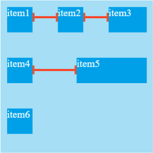
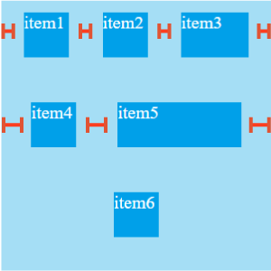
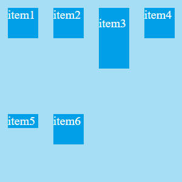
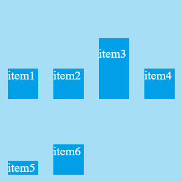
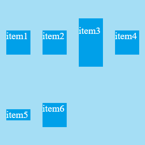
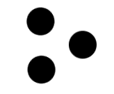
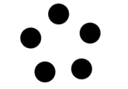

# CSS 學習筆記

> 沒有 CSS 的 HTML 是一個語義系統而不是 UI 系統。

CSS 是瀏覽器提供給開發者的描述界面的方式，而描述界面分為兩部分：

* 佈局 - 內容繪制在什麼地方？
    * 確定每個元素的位置，由 display 配合 position 來確定。
* 具體元素的渲染 - 內容怎麼繪制？
    * 具體內容相關，font、text、image 等分別有不同的樣式來描述如何渲染

## 歷史

於 1994 年由 Hakon Wium Lie 提出 CSS，將結構和樣式的表達分離，並由 W3C 於 1996 年發布 CSS（CSS1）第一條規範建議。

全球資訊網協會（World Wide Web Consortium, W3C），又稱 W3C 理事會，由 Tim Berners-Lee 成立於 1994，是全球資訊網路的主要國際標準組織之一，以開放論壇 https://www.w3.org/ 的方式來促進開發互通技術，目的在使全球資訊網技術標準化，促進業界成員間的相容性，規範的標準囊括 HTML、CSS、DOM、SVG、XML 等。

CSS 部分也有自己的工作團隊，又稱為 CSSWG（Cascading Style Sheets working group），工作團隊的組成通常是瀏覽器廠商、主流網站、大學、CSS專家、研究機構和技術公司等成員。

制定流程：

* 流程 1：編輯草案 ED（Editor’s Draft）
    * 規範的開始階段，工作團隊會指定一個新的 CSS 屬性或選擇器的想法，並且在 CSSWG 內部進行討論及研究。如果工作團隊及會員同意將其發佈，將進入工作草案。
* 流程 2：工作草案 FPWD（First Public Working Draft）
    * 其實就是第一個發布的工作草案。
* 流程 3：工作草案 WD（Working Draft）
    * 工作團隊會依據 charter（章程） 發布一系列的工作草案（想看的可以到這邊 CSSWG charter），W3C 的會員和大眾可以提出評論和問題，並由工作團隊處理，一版接著一版的改進。
    * 瀏覽器裡對於早期實驗性功能的支持最早通常是從這個階段開始。
* 流程 4：最終工作草案 LCWD（Last Call Working Draft）
    * 工作團隊完成工作，要求大眾和 W3C 會員提出最後評論，並同樣由工作團隊處理回饋。如果情況不 OK，會再回到工作草案階段。
* 流程 5：候選推薦標準 CR（Candidate Recommendation）
    * 當問題都解決，結束最終工作草案階段，將進入候選推薦標準階段。此時該規範已經有一個相對穩定的版本，可以展開測試，工作團隊會將實施所得到的回饋整合到規範中。如果狀況不 OK，同樣會再返回到工作草案階段。
* 流程 6：建議推薦標準 PR（Proposed Recommendation）
    * 如果測試沒有意外，規範將進入建議推薦標準階段。W3C 創辦人（Tim Berners-Lee）會正式請求 W3C 會員審閱這份建議推薦標準。如果不 OK，同樣會再返回到工作草案階段或回到候選推薦標準。
* 流程 7：推薦標準 REC（Recommendation）
    * 進入最終階段，審閱結果 OK，便由創辦人（Tim Berners-Lee）宣布該規範成為推薦標準，也就是成為 W3C 的標準。

## 語法

CSS 規則集（rule-set）由選擇器(selector)和聲明塊組成。

由一個選擇器起頭。它選擇了我們將要用來添加樣式的 HTML 元素。接著輸入一對大括號 { }。 在大括號內部定義一個或多個形式為 `屬性(property):值(value` 的聲明。每個聲明都指定了我們所選擇元素的一個屬性，之後跟一個我們想賦給這個屬性的值。

冒號之前是屬性，冒號之後是值。不同的 CSS 屬性對應不同的合法值。


* 選擇器指向您需要設置樣式的 HTML 元素。
* 聲明塊包含一條或多條用分號分隔的聲明。
* 每條聲明都包含一個 CSS 屬性名稱和一個值，以冒號分隔。
* 多條 CSS 聲明用分號分隔，聲明塊用花括號括起來。

### 屬性的寫法

方法有兩種，第一種寫小屬性；第二種寫綜合屬性，用空格隔開。

* 小屬性的寫法：

    ```css=
    .a {
        padding-top: 30px;
        padding-right: 20px;
        padding-bottom: 40px;
        padding-left: 100px;
    }
    ```
* 綜合屬性的寫法：(上、右、下、左)（順時針方向，用空格隔開）
    ```css
    .a {
        padding:30px 20px 40px 100px;
    }
    ```
    * 如果寫了四個值，則代表：上、右、下、左。
    * 如果只寫了三個值，則代表：上、左右、下。
    * 如果只寫了兩個值，則為：上下、左右

* 後面會蓋前面

    ```css
    .a {
        padding: 20px;  /*上、下、右為 20px */
        padding-left: 30px; /* 左為 30px */
    }

    .a {
        padding: 20px;  /*上、下、右為 20px */
        padding-left: 30px; /* 左為 30px */
    }

    ```

### 套用規則順序

有三個因素需要考慮，根據重要性排序如下，前面的更重要：

* 重要程度
    * 是否用 !important
* 優先級
    * 越特定就越優先
    * 計算規則
        * 一個選擇器的優先級可以說是由四個部分相加 (份量)，可以認為是個十百千 — 四位數的四個位數：
            * 千位：如果聲明在 style 的屬性（內聯樣式）則該位得一分。這樣的聲明沒有選擇器，所以它得分總是1000。
            * 百位：選擇器中包含ID選擇器則該位得一分。
            * 十位：選擇器中包含類選擇器、屬性選擇器或者偽類則該位得一分。
            * 個位：選擇器中包含元素、偽元素選擇器則該位得一分。
        * 在進行計算時不允許進行進位，例如，20 個類選擇器僅僅意味著 20 個十位，而不能視為 兩個百位，也就是說，無論多少個類選擇器的權重疊加，都不會超過一個 ID 選擇器
* 資源順序
    * 如果有超過一條規則，而且都是相同的權重，那麼最後面的規則會應用。可以理解為後面的規則覆蓋前面的規則，直到最後一個開始設置樣式。

#### 例子

| 選擇器                                  | 千位 | 百位 | 十位 | 個位 | 優先級 |
|-----------------------------------------|------|------|------|------|--------|
| h1                                      | 0    | 0    | 0    | 1    | 0001   |
| h1 + p::first-letter                    | 0    | 0    | 0    | 3    | 0003   |
| li > a[href*="en-US"] > .inline-warning | 0    | 0    | 2    | 2    | 0022   |
| #identifier                             | 0    | 1    | 0    | 0    | 0100   |
| 內聯樣式                                | 1    | 0    | 0    | 0    | 1000   |

### 單位

html 中的單位只有一種，那就是像素 px，所以單位是可以省略的，但是在 CSS 中不一樣。 CSS 中的單位是必須要寫的，因為它沒有默認單位。

單位可以分為「網頁」和「印刷」兩大類，通常對於 CSS 來說只會應用到網頁的樣式，畢竟真正要做印刷，還是會傾向透過排版軟體來進行設計。

#### 網頁 ( 單位 )

* px：絕對單位，代表螢幕中每個「點」( pixel )。
* em：相對單位，每個子元素透過「倍數」乘以父元素的 px 值。
* rem：相對單位，每個元素透過「倍數」乘以根元素的 px 值。
* %：相對單位，每個子元素透過「百分比」乘以父元素的 px 值。

#### 印刷

    1 in = 2.54cm = 25.4mm = 72pt = 6pc。

* pt：印表機的每個「點」，定義為 1 pt ＝ 1/72 in，如果在 72 dpi 的系統上 1 px = 1 pt，但如果在 96 dpi 的系統上 1 px = 0.75 pt ( 72/96 = 0.75 )。
* in：英吋，在 96 dpi 的系統上 1 in = 96 px。
* cm：公分，在 96 dpi 的系統上 1 cm = 37.795275593333 px。
* mm：公釐，在 96 dpi 的系統上 1 cm = 3.7795275593333 px。

* 網頁 (屬性名稱)
    * medium：預設值，等於 16px ( h4 預設值 )
    * xx-small：medium 的 0.6 倍 ( h6 預設值 )
    * x-small：medium 的 0.75 倍
    * small：medium 的 0.8 倍 ( h5 預設值，W3C 定義為 0.89，實測約為 0.8 )
    * large：medium 的 1.1 倍 ( h3 預設值，W3C 定義為 1.2，實測約為 1.1 )
    * x-large：medium 的 1.5 倍 ( h2 預設值 )
    * xx-large：medium 的 2 倍 ( h1 預設值 )
    * smaller：約為父層的 80%
    * larger：約為父層的 120%

各種單位的含義：

* in：英吋 Inches (1 英吋 = 2.54 釐米)
* cm：釐米 Centimeters
* mm：毫米 Millimeters
* pt：點 Points，或者叫英鎊 (1點 = 1/72英吋)
* pc：皮卡 Picas (1 皮卡 = 12 點)

#### 相對單位

* px：像素
* em：印刷單位相當於12個點 
* %：百分比，相對周圍的文字的大小

之所以說 px 是相對單位，是因為在電腦螢幕的尺寸不變的情況下，可以使用顯示不同的解析度，在不同的解析度下，單個像素的長度自然是不一樣的。

## 盒模型

盒子模型，英文即 box model。無論是 div、span、還是 a 都是盒子。

在 CSS 中我們廣泛地使用兩種「盒子」

* 塊級盒子 (block box)
* 內聯盒子 (inline box)

我們通過對盒子 display 屬性的設置，比如 inline 或者 block ，來控制盒子的外部顯示類型。

display 有一個特殊的值，它在內聯和塊之間提供了一個中間狀態。這對於以下情況非常有用:您不希望一個項切換到新行，但希望它可以設定寬度和高度。

這兩種盒子會在頁面流（page flow）和元素之間的關系方面表現出不同的行為。

### 塊級盒子 (block box)

一個被定義成塊級的（block）盒子會表現出以下行為：

* 盒子會在內聯的方向上擴展並佔據父容器在該方向上的所有可用空間，在絕大數情況下會和父容器一樣寬
* 會換行
* width 和 height 屬性可以發揮作用
* 內邊距（padding）, 外邊距（margin） 和 邊框（border） 會將其他元素從當前盒子周圍「推開」

除非特殊指定，諸如標題(如 `<h1>`)和段落(如 `<p>`)默認情況下都是塊級的盒子。

### 內聯盒子 (inline box)

如果一個盒子對外顯示為 inline，那麼他的行為如下:

* 盒子不會換行。
* width 和 height 屬性沒用。
* 垂直方向的內邊距、外邊距以及邊框會被應用但是不會把其他處於 inline 狀態的盒子推開。
* 水平方向的內邊距、外邊距以及邊框會被應用且會把其他處於 inline 狀態的盒子推開。

用做鏈接的 `<a>` 元素、 `<span>` 、 `<em>` 以及 `<strong>` 都是默認處於 inline 狀態的。

### CSS 盒模型

所有的內容都會有一些空白和與其他元素的間距，所以 css 抽象出了盒模型的概念，也就是任何一個塊都是由 content、padding（空白）、border、margin（間距）這幾部分構成。

完整的 CSS 盒模型應用於塊級盒子，內聯盒子只使用盒模型中定義的部分內容。

但是，圖片、表單元素一律看作是文本，它們並不是盒子。這個很好理解，比如說，一張圖片裡並不能放東西，它自己就是自己的內容。

一個盒子中主要的屬性就5個：width、height、padding、border、margin。

組成：

* Content box
    * 這個區域是用來顯示內容
    * 大小可以通過設置 width 和 height.
* Padding box
    * 包圍在內容區域外部的空白區域
    * 大小通過 padding 相關屬性設置。
* Border box
    * 邊框盒包裹內容和內邊距。
    * 大小通過 border 相關屬性設置。
* Margin box
    * 這是最外面的區域，是盒子和其他元素之間的空白區域。
    * 大小通過 margin 相關屬性設置。


#### 寬度計算實例

```css
/* 長寬 302 * 302 */
.box1 {
    width: 100px;
    height: 100px;
    padding: 100px;
    border: 1px solid red;
}
```

* 真實佔有長度 = 上 border + 上 padding + height + 下 padding + 下 border
* 真實佔有寬度 = 左 border + 左 padding + width + 右 padding + 右 border


> **注：** margin 不計入實際大小 —— 當然，它會影響盒子在頁面所佔空間，但是影響的是盒子外部空間。盒子的範圍到邊框為止 —— 不會延伸到 margin。

#### Margin 外邊距

外邊距是盒子周圍一圈看不到的空間。它會把其他元素從盒子旁邊推開。 外邊距屬性值可以為正也可以為負。設置負值會導致和其他內容重疊。無論使用標准模型還是替代模型，外邊距總是在計算可見部分後額外添加。

我們可以使用 margin 屬性一次控制一個元素的所有邊距，或者每邊單獨使用等價的普通屬性控制：

* margin-top
* margin-right
* margin-bottom
* margin-left

##### 外邊距折疊（Margin Collapse）

理解外邊距的一個關鍵是外邊距折疊的概念。如果你有兩個外邊距相接的元素，這些外邊距將合並為一個外邊距，即最大的單個外邊距的大小。

例子中，我們有兩個段落。頂部段落的頁 margin-bottom 為 50px。第二段的 margin-top 為 30px。因為外邊距折疊的概念，所以框之間的實際外邊距是 50px，而不是兩個外邊距的總和。

##### `<body>` 標簽也有 margin

整個網頁最大的盒子是 `<document>`，即瀏覽器，而 `<body>` 是 `<document>` 的兒子。瀏覽器給 `<body>` 預設的 margin 大小是 8 個像素，此時 `<body>` 佔據了整個頁面的一大部分區域，而不是全部區域。

### Border 邊框

邊框是在邊距和填充框之間繪制的。如果正在使用標准的盒模型，邊框的大小將添加到框的寬度和高度。如果使用的是替代盒模型，那麼邊框的大小會使內容框更小，因為它會佔用一些可用的寬度和高度。

分別設置每邊的寬度、顏色和樣式，可以使用：

* border-top
* border-right
* border-bottom
* border-left

### Padding 內邊距

內邊距位於邊框和內容區域之間。與外邊距不同，您不能有負數量的內邊距，所以值必須是0或正的值。

我們可以使用 padding 簡寫屬性控制元素所有邊，或者每邊單獨使用等價的普通屬性：

* padding-top
* padding-right
* padding-bottom
* padding-left

### `padding` 也有顏色

padding 就是內邊距，padding的區域有背景顏色，並且背景顏色一定和內容區域的相同。

```css=
.a {
    width: 100px;
    height: 100px;
    padding: 50px;
    background-color: lightgreen;
    border: 10px;
}
```


### 預設就有 `padding` 的元素

有些元素預設就有 padding，所以為了方便控制，通常會清除掉 (不過一般都用套件，而非自己清)

```css
body,div,dl,dt,dd,ul,ol,li,h1,h2,h3,h4,h5,h6,pre,code,form,fieldset,legend,input,textarea,p,blockquote,th,td{
    margin:0;
    padding:0;
}
```

### 屬性 border

border 就是邊框。邊框有三個要素：

* 像素（粗細）border-width
    * 若無就不會有邊框
* 線型 border-style
    * 若無就不會有邊框
* 顏色 border-color
    * 預設為黑

border屬性是能夠被拆開的，有兩大種拆開的方式：

* 按三要素拆開：border-width、border-style、border-color
* 按方向拆開：border-top、border-right、border-bottom、border-left。

#### 線型 border-style


* 不同瀏覽器顯示會有區別
* 如果要追求完全的一致性，就不能用 CSS 來做邊框

## 佈局

下列佈局技術會覆蓋預設的佈局行為：

* display 屬性
    * 如 block、inline、flex, grid, table
* position
    * 允許精準設置盒子中的盒子的位置，正常佈局流中，預設為 static，使用其它值會引起元素不同的佈局方式，例如將元素固定到瀏覽器視口的左上角。
* float
    * float 值，諸如 left 能夠讓塊級元素互相並排成一行，而不是一個堆疊在另一個上面。
* 表格佈局
    * 除了 table 外，也可以用在非表格內容上(display: table)
* 多列佈局
    * 使用 Multi-column layout 屬性 可以讓塊按列佈局，比如報紙的內容就是一列一列排布的。

### display

display 是設置盒的類型，不同的盒有不同的佈局規則，比如 BFC、IFC、FFC、GFC 等。

盒與盒之間也是有區別的，有的盒可以在同一行顯示，有的則是獨佔一行，而且對內容的位置的計算方式也不一樣。於是提供了 display 樣式來設置盒類型，不同的盒類型就會使用不同的計算規則。

* block
    * 元素會獨佔一行、可以設置內容的寬高，具體計算規則叫做 BFC。
* inline
    * 元素寬高由內容撐開不可設置，不會獨佔一行，具體計算規則叫做 IFC。
* flex
    * 子元素可以自動計算空白部分，由 flex 樣式指定分配比例，具體計算規則叫做 FFC。
* grid
    * 子元素則是可以拆分成多個行列來計算位置，具體計算規則叫 GFC。

這些都是不同盒類型的佈局計算規則。

#### Flexbox

Flexbox 是CSS 彈性盒子佈局模塊（Flexible Box Layout Module）的縮寫，它被專門設計出來用於創建橫向或是縱向的一維頁面佈局。

##### Flexbox 歷史

早在 2008 年，CSS 的工作團隊其實已經對 "彈性框架模型" 有想法，隔年 2009 年便發布了第一版本的 flexbox 工作草案，然而草案中還有許多含糊的地方，而且在不同的瀏覽器會出現不同的外觀。

在 2011 年，Tab Atkins 接下了 flexbox 規範的編輯。重新修訂語法。隔年 2012 年 Flexbox 的規範就被 W3C 作為候選推薦標準， flexbox 也在各瀏覽器中陸續受到支持。而後 Tab Atkins 也陸續的增強 flexbox 的功能。

##### Flexbox 用法

要使用 flexbox，需要在想要進行 flex 佈局的父元素上應用 display: flex，這樣所有直接子元素都將會按照 flex 進行佈局

flexbox 基本上都是靠主軸 (main axis) 和交叉軸 (cross axis) 運作的。


```css
.container {
  display: flex | inline-flex; /* 會成為彈性容器 */
}

.item {  /* 子層則變成彈性項目 */

}
```

彈性項目脫離了和標籤的關係，所以不論是 div、span、a 標籤等都會變成彈性項目，所以不會出現因為 div 是 block 要占據整行、span 和 a 是 inline 而沒有尺寸等這些特性。

可以想像成你把它變成了一個彈性的大盒子（容器），裡面裝著很多彈性的小盒子（項目），而這些"彈性大小盒"擁有自己獨特的屬性和屬性值可以做有趣的操控。

##### 彈性容器

彈性容器之屬性值 flex 和 inline-flex 的差別

```css
{
    display: flex;
}
```
當在 display 屬性宣告 flex，如果沒有設定寬高，可以看到彈性容器像 block 一樣佔據了整行。但如果是 inline-flex 則是會變成子層彈性項目的尺寸撐開。

如果是 flex，第二個彈性容器會移到下一行，而 inline-flex 則會變成併排。

和 block / inline-blox 的差異：

* float 和 clear 無法使用於彈性容器內
* vertical-align 對彈性項目沒有效果（但對彈性項目裡面的內容還是有用的）
* 偽元素 ::first-line 和 ::first-letter 無法使用於彈性容器本身

軸向：


主軸（main axis） 和相交軸（cross axis）：

* 主軸
    * 表現上為彈性項目的"文字方向"。當宣告屬性值 flex 後，預設中主軸會朝向，文字方向相同的方向，如同我們常見的語言幾乎都是由左至右的方向。
* 相交軸
    * 又稱次軸，表現上為彈性項目的"換行方向"。也就是說如果彈性項目單行的數量多到超過容器，你想要讓它換行，預設中相交軸會以 彈性項目換到下一行的方向，常見的是由上而下。

* 主軸相關
    * flex-direction
        * 設定主軸 (main axis) 的方向，可讓主軸旋轉。
            * row
                * 主軸為橫向。
                    
            * row-reverse
                * 主軸為橫向，但反序排列。
                    
            * column
                * 主軸為直向。
                    
            * column-reverse
                * 主軸為直向，但反序排列。
                    
    * flex-wrap
        * 設定小方塊是要強制排成一列或依照容器的包圍而排成多列。
            * wrap
                * 小方塊依照容器的大小分列排列
                    
            * wrap-reverse
                * 概念同 wrap，只是順序相反。
                    
            * nowrap
                * 小方塊排成一列不折行，可使用 flex-direction 調整主軸方向，即小方塊對齊的方向。
                    
    * flex-flow
        * 就是 flex-direction 和 flex-wrap 的屬性寫在一起。
            ```css
            .container {
                flex-flow: flex-direction + flex-wrap;  /* 預設：row nowrap */
            }
            ```
    * justify-content
        * 主軸的對齊方式
            * flex-start
                * 預設，對齊主軸的開頭 (通常是靠左對齊)。
                    
            * center
                * 對齊主軸的中間（常用來做置中處理）
                    
            * flex-end
                * 對齊主軸的尾巴 (通常是靠右對齊)。
                    
            * space-between
                * 將空白空間分配在東西之間(每個小方塊擁有相同的間隔，但與父容器之間沒有間隔)
                    
                    * 此例會有 10px 的空隙是因為方塊預設設有 10px 的 margin
            * space-around
                * 將空白空間分配在東西兩側(每個小方塊之間與父容器有間隔，但小方塊與父容器之間的間隔是小方塊彼此間隔的一半)
                    
            * space-evenly
                * 將空白剩下的空間均勻分配(每個小方塊之間和與父容器之間擁有相同的間隔)
                    

    * flex-basis
        * 更改主軸 (main axis) 的預設屬性值，現在主軸是水平的，位於主軸上的屬性是 width。
        * 假設使用 flex-direction: column 讓主軸旋轉為直向，那 main axis 對應的屬性就是 height，會被更動到的屬性是方塊的高度。
    * flex-grow
        * 每個區塊 (這裡是指小方塊) 可在主軸上佔容器的多少部份，或說是如何分配剩餘空間
        * 計算方式
            假設剩餘空間為 x，三個元素的 flex-grow 分別為 a，b，c。設 sum 為 a + b + c。那麼三個元素將得到剩餘空間分別是 `x * a / sum`、`x * b / sum`、`x * c / sum`
            * 例子：
                * 父元素寬度 500px，三個子元素的 width 分別為 100px，150px，100px。於是剩餘空間為 150px
                * 三個元素的 flex-grow 分別是 1，2，3，於是 sum 為 6
                * 則
                    ```plain
                    三個元素所得到的多餘空間分別是：
                    150 * 1 / 6 = 25px
                    150 * 2 / 6 = 50px
                    150 * 3 / 6 = 75px

                    三個元素最終的寬度分別為：
                    100px + 25px = 125px
                    150px + 50px = 200px
                    100px + 75px = 175px
                    ```
    * flex-shrink
        * 與 flex-grow 相反，flex-grow 是膨脹，flex-shrink 是縮小
        * 元素本身的寬度也會影響收縮多少
        * 例子：
            * 父元素 500px。三個子元素分別設置為 150px，200px，300px (溢出 150px)。三個子元素的 flex-shrink 的值分別為 1，2，3。
                * 具體的計算方式為：每個元素收縮的權重為其 flex-shrink 乘以其寬度。
                    ```plain
                    總權重為： 1 * 150 + 2 * 200 + 3 * 300 = 1450

                    三個元素分別收縮：
                    150 * 1(flex-shrink) * 150(width) / 1450 = -15.5
                    150 * 2(flex-shrink) * 200(width) / 1450 = -41.4
                    150 * 3(flex-shrink) * 300(width) / 1450 = -93.1
                    
                    最終寬度為：
                    150 - 15.5 = 134.5
                    200 - 41.4 = 158.6
                    300 - 93.1 = 206.9
                    ```
    * flex
        * 以上 flex 屬性的綜合設定 `flex: flex-grow flex-shrink flex-basis`
            * 預設值分別是 flex-grow: 0、flex-shrink: 1、flex-basis: auto
* 交叉軸相關
    * align-items
        * 交叉軸 (cross axis) 的對齊方式
            * flex-start
                * 若小方塊不等高，則會依容器的頂端對齊，類似過去使用的 vertical-align: top。
                    
            * flex-end
                * 若小方塊不等高，則會依容器底部對齊，類似過去使用的 vertical-align: bottom。
                    
            * stretch
                * 小方塊不設定寬、高、間距，充滿整個容器。
                    
            * baseline
                * 若小方塊不等高，則會依容器的基準線對齊，類似過去使用的 vertical-align: baseline。
                    
            * center
                * 若小方塊不等高，則會依容器的中線對齊，類似過去使用的 vertical-align: middle。
                    
    * align-self
        * 設定單一元素的對齊方式，會覆寫父層 align-items 的設定。
            
            ```css
            .red {
                background: red;
                height: 30px;
                align-self: flex-start;
            }
            ```

##### Flexbox 學習工具

[Flexbox Froggy](https://flexboxfroggy.com/#zh-tw)

一個幫助學習 CSS Flexbox 的在線遊戲，一共 24 關。

#### Grid

Flexbox 用於設計橫向或縱向的佈局，而 Grid 佈局則被設計用於同時在兩個維度上把元素按行和列排列整齊。

### position

根據不同盒類型的佈局計算規則往往不夠用，很多場景下需要一些用戶自定義的佈局規則，所以 css 提供了 position 樣式，包括：

* 流式 (具體什麼內容顯示在什麼位置是不固定的，適合文字、圖片等內容的佈局)
    * static [預設]
    * relative
* 非流式
    * absolute
    * fixed
* 特殊
    * sticky

盒與盒之間預設是流式的，也就是 position 為 static，但有的時候想在流中做下偏移，用 relative。當不想跟隨文檔流了，可以設置 absolute 來相對於上個非 static 位置來計算一個固定的位置，如果想直接相對於窗口，就用 fixed。

當需要做吸頂效果的時候，要根據滾動位置切換 static 和 fixed，這時候 css 還有一個 sticky 的定位方式可以直接用。

#### static (預設)

* 是每個元素默認的屬性——它表示「將元素放在文檔佈局流的默認位置——沒有什麼特殊的地方」。
* 塊級元素生成一個矩形框，是文檔流的一部分
* 行內元素則會創建一個或多個行框，置於其父元素中
* 流式的，上個盒子顯示到什麼地方了，下個盒子就在下面繼續計算位置，顯示在什麼位置是由內容多少來決定的。
* 最開始的時候網頁主要是用來顯示一些文本，所以流式的位置計算規則就很方便。

#### relative

* 允許我們相對於元素在正常的文檔流中的位置移動它——包括將兩個元素疊放在頁面上。這對於微調和精準設計(design pinpointing)非常有用
* 根據上個盒子的位置自動計算出下個盒子的位置，可以使用 relative 做一些偏移
* 元素框相對於之前正常文檔流中的位置發生偏移，並且原先的位置仍然被佔據
* 發生偏移的時候，可能會覆蓋其他元素。
* 可通過 top、bottom、left、right 來指定如何偏移。
* 相對佈局給流式佈局增加一些靈活性，可以在流式計算規則的基礎上做一些偏移。

#### absolute

* 元素框不再佔有文檔流位置，並且相對於包含塊進行偏移(所謂的包含塊就是最近一級外層元素 position 不為 static 的元素)
    * 如果一些面板需要固定在某個位置不動，就可以設置為 absolute 脫離文檔流。這時候就可以根據上個非流式的 position 來計算現在的 position。
* 絕對定位在創建復雜佈局效果時非常有用，例如通過標簽顯示和隱藏的內容面板或者通過按鈕控制滑動到屏幕中的信息面板

#### fixed

* 元素框不再佔有文檔流位置，並且相對於視窗進行定位
* 與絕對定位非常類似，但是它是將一個元素相對瀏覽器視口固定，而不是相對另外一個元素。
* 在創建類似在整個頁面滾動過程中總是處於屏幕的某個位置的導航菜單時非常有用

#### sticky (CSS3 新增)

* 相當於 relative 和 fixed 混合。最初會被當作是relative，相對於原來的位置進行偏移；一旦超過一定閾值之後，會被當成fixed定位
* sticky 的效果在滾動的時候如果超過了一定的高度就 fixed 在一個位置，否則的話就 static。相當於基於 static 和 fixed 做的一層封裝，實現導航條吸頂效果的時候可以直接用。
* 或許就是因為太常用，才封裝出了這樣一個 position 的屬性值吧，之前都是通過 js 監聽滾動條位置來分別設置 static 和 fixed 的。

### float

把一個元素「浮動(float)」起來，會改變該元素本身和在正常佈局流（normal flow）中跟隨它的其他元素的行為。這一元素會浮動到左側或右側，並且從正常佈局流(normal flow)中移除，這時候其他的周圍內容就會在這個被設置浮動(float)的元素周圍環繞。

float 屬性有四個可能的值：

* none [預設]
    * 不浮動
* left
    * 將元素浮動到左側
* right
    * 將元素浮動到右側
* inherit
    * 繼承父元素的浮動屬性

### 表格佈局

HTML 表格對於顯示表格數據是很好的，過去也常常使用表格來完成整個網頁佈局——將它們的頁眉、頁腳、不同的列等等放在不同的表行和列中。這在當時是有效的。

但它有很多問題——表佈局是不靈活的，繁重的標記，難以調試和語義上的錯誤（比如，屏幕閱讀器用戶在導航表佈局方面有問題）。

一個 `<table>` 之所以能夠像表格那樣展示，是由於css默認給 `<table>` 標簽設置了一組table佈局屬性。當這些屬性被應用於排列非`<table>` 元素時，這種用法被稱為“使用CSS表格”。

### 多列佈局

多列佈局模組給了我們 一種把內容按列排序的方式，就像文本在報紙上排列那樣。由於在web內容裡讓你的用戶在一個列上通過上下滾動來閱讀兩篇相關的文本是一種非常低效的方式，那麼把內容排列成多列可能是一種有用的技術。

```html
<div class="container">
    <h1>Multi-column layout</h1>

    <p>Paragraph 1.</p>
    <p>Paragraph 2.</p>

</div>
```

```css
.container {
    column-width: 200px;
}
```


## 屬性

### cursor

cursor 屬性設置鼠標指針的類型，在鼠標指針懸停在元素上時顯示相應樣式。

```css
cursor: auto;
cursor: pointer;
...
cursor: zoom-out;
/* 使用圖片 */
cursor: url(hand.cur)
/* 使用圖片，並且設置 fallback 兜底 */
cursor: url(hand.cur), pointer;
```


* 特殊玩法： [有意思的鼠標指針交互探究](https://mp.weixin.qq.com/s/sb6Ze7ew-fDYt3m1mHkpig)

## 顏色

### 命名顏色

CSS中提供了148個命名顏色，所有瀏覽器都支援這些名稱，這些名稱都是被預定義過色值的。下面是部分顏色名稱以及對應的十六進制顏色值。

所有命名顏色的名稱： [HTML Color Names](https://www.w3schools.com/colors/colors_names.asp)

注意： 所有命名顏色都不區分大小寫。

特殊顏色：

* transparent
    * transparent 關鍵字用作 rgba(0, 0, 0, 0) 的快捷方式，它表示完全透明。該關鍵字目前在所有瀏覽器都是支援的。它是 background-color 屬性的預設值。
* currentColor
    * currentColor 表示當前的顏色。如果沒有指定，就會從父容器繼承的文字顏色。
        ```css
        div {
            color: red;
            background-color: red;
        }

        /* 等同上例 */
        div {
            color: red;
            background-color: currentColor;
        }
        ```
    * SVG 中使用時很方便，可以將指定的填充或描邊顏色設定為currentColor，以確保SVG顏色與其父級的文字顏色匹配。
* inherit
    * inherit 是一個保留字，它不侷限於顏色，表示該屬性採用與元素父級的屬性相同的值。對於繼承的屬性，主要用途就是覆蓋另一個規則。
* 系統顏色
    * 特殊的顏色關鍵字，用來匹配一些系統元素，旨在保持瀏覽器上應用程式的一致性。
    * 系統顏色會成對出現：
        * 前景顏色 / 背景顏色
            * buttonText / buttonFace
            * activeText、canvasText、linkText、visitedText / canvas
            * fieldText / field
            * highlightText / highlight

### RGB 顏色

RGB 值也是我們常用的顏色表示方式。RGB 指的就是紅-綠-藍，這個順序非常重要。每種顏色使用 0 到 255 之間的數字指定。最常見的 RGB 值黑色：rgb(0,0,0) 和白色：rgb(255,255,255)。

```css
div {
  color: rgb(0,0,0);
  border: 1px solid rgb(155,55,89);
  background: rgb(255,255,255);
}
```

除此之外，我們還可以使用名為rgba() 的屬性為 rgb 值定義 alpha 值，alpha 值是透明度的百分比。它類似於 rgb，但允許新增第四個值。不透明度範圍可以是 0 到 1 之間的任何值，0 是最小值（無不透明度），1 是最大值（完全不透明度）：

```css
div {
  color: rgba(0,0,0,0.5);
  border: 1px solid rgba(255,0,0,0.8);
  background: rgba(0,125,0,0.2);
}
```

注意： 十六進制顏色值不區分大小寫。所以 #ff0000、#FF0000、#Ff0000 的顯示效果是一致的。

### Hex 顏色

我們還可以使用十六進制值來表示 CSS 中的顏色，這也是我們用的最多的顏色表示方式。

在 CSS 中，使用 6 個十六進制數字來表示顏色。這意味著分別使用兩個數字來表示紅色 (R)、綠色 (G) 和藍色 (B) 份量。例如，#000000表示黑色，它是最小的十六進制值；#FFFFFF表示白色，它是最大的十六進制值。

```css
div { 
  color: #000000;
  border: 1px solid #00FF00;
  background: #FF0000;
}
```

也可以使用 3 個值（每種顏色一個）來縮短十六進制值，如果每兩位的值相同，就可以縮寫一半

```css
div {
  color: #000;
  border: 1px solid #0F0;
  background: #F00;
}
```

也可以給十六進制顏色定義 alpha 值，alpha 值是透明度的百分比。在十六進制程式碼中，將另外兩位數字新增到六位數字序列中，形成一個八位數字序列。例如，要在十六進制程式碼中設定黑色#000000，要新增 50% 的透明度，可以將其更改為#00000080。

### HSL 顏色

HSL 全稱是 Hue-Saturation-Lightness，分別表示色調、飽和度和亮度。它基於 RGB 色輪的。每種顏色都有一個角度以及飽和度和亮度值的百分比值。

* 色調：色調描述了色輪上的值，從 0 到 360 度，從紅色開始（0 和 360）
    
* 飽和度： 飽和度是所選色調的鮮豔程度，100% 表示完全飽和的亮色，0% 表示完全不飽和的灰色
    
* 亮度： 顏色的亮度等級，較低的值會更暗，更接近黑色，較高的值會更亮，更接近白色。
    

HSL顏色函數的表示形式： hsl(Hue, Saturation, Lightness)

其中Hue是色調值，即在色輪上的位置，可以是 0到360deg之間的任何值，該參數還可以接 角度單位 turn（圈）和無單位。下面三種規則的顯式效果是一樣的：

```css
div {
  background-color: hsl(180deg, 50%, 50%);
}

div {
  background-color: hsl(0.5turn, 50%, 50%);
}

div {
  background-color: hsl(180, 50%, 50%);
}
```

除此之外，HSL顏色值也可以新增alpha值，表示透明度，其使用形式： hsla(Hue, Saturation, Lightness / alpha)

```css
div {
  background-color: hsl(0 100% 50% / 0.5);
}
```

### HWB 顏色

HWB 全稱為 Hue-Whiteness-Blackness，表示色調、白度和黑度。

* 色調：色輪中的一個角度；
* 白度：表示要混合的白色量的百分比。值越高，顏色越白。
* 黑度：表示要混合的黑色量的百分比。值越高，顏色越黑。

與 HSL 一樣，色調可以是 0 到 360 內的任何值。黑度和白度用來控制有多少黑色和白色混合在已選色調中，它們也是0-100%之間的值，當為 100% 時，就會出現全黑或者全白。如果等量的白色或者黑色混合在一起，顏色就會變得越來越灰。這個函數對於建立單色調色盤非常有用：

hwb()也可以新增alpha值來表示透明度，也使用斜槓來分隔：

* hwb(194 0% 0%) 
* hwb(194 0% 0% / .5) 

注意：這種顏色格式目前只在Safari 15上得到了支援

### LAB 顏色

LAB 是一個可以在 Photoshop 等軟體中訪問的顏色空間，它代表了人類可以看到的整個顏色範圍。它使用三個軸表示：亮度、a 軸和b 軸。

* 亮度： 從黑色到白色。值越低，顏色越接近黑色。
* a軸： 從綠色到紅色。較低的值接近綠色，較高的值更接近紅色。
* b軸： 從藍色到黃色。較低的值接近藍色，越高的值更接近黃色。

亮度的值可以是任意百分比，不限於0%和100%，可以超過 100%。超亮白色可以使用高達 400% 的百分比。a和b軸的值可以是正值或者負值。兩個負值將導致顏色朝向光譜的綠色/藍色端，而兩個正值可以產生更橙色/紅色的色調。所有參數由空格分隔：

```css
div {
  background-color: lab(80% 100 50);
}

div {
  background-color: lab(80% -80 -100);
}
```

lab()也可以新增alpha值來表示透明度，也使用斜槓來分隔：

```css
div {
  background-color: lab(80% -80 -100 / .5);
}
```

注意：這種顏色格式目前只在Safari 15上得到了支援

### LCH 顏色

LCH 代表亮度、色度和色調。它與 Lab 具有相同的 L 值，但不是使用坐標 a* 和 b*，而是使用 C（色度）和 H（色調）。色調可以是 0 到 360 之間的值。色度代表顏色的量，它類似於 HSL 中的飽和度。但是色度值可以超過 100，理論上它是無上限的。

```css
div {
  background-color: lch(80% 100 50);
}
```

這個方法也可以新增第四個可選參數 alpha。該函數遵循空格分隔（alpha 帶有斜槓）：

```css
div {
  background-color: lch(80% 100 50 / .5);
}
```

注意：這種顏色格式目前只在Safari 15上得到了支援

### CMYK 顏色

CMYK 代表 Cyan、Magenta、Yellow 和 Key，它們與印表機中的墨水顏色相匹配。雖然螢幕通常以 RGB 來顯示顏色，而印表機通常使用青色、品紅色、黃色和黑色的組合來表示顏色，這些是最常見的墨水顏色。

可以使用device-cmyk()來指定CMYK顏色，使用空格來分隔參數，也可以新增alpha值來設定透明度。

```css
div {
  background-color: device-cmyk(1 0 0 0);
}
```

## 函數

在 CSS 中，其實存在各種各樣的函數。具體分為：

* Transform functions
* Math functions
* Filter functions
* Color functions
* Image functions
* Counter functions
* Font functions
* Shape functions
* Reference functions
* CSS grid functions

### calc()

calc 函數允許在聲明 CSS 屬性值時執行一些計算。

```css
{
    width: calc(100% - 80px);
}
```

一些需要注意的點：

* `+` 和 `-` 運算符的兩邊必須要有空白字符。比如，`calc(50% -8px)` 會被解析成為一個無效的表達式，必須寫成 `calc(8px + -50%)`
* 和 `/` 這兩個運算符前後不需要空白字符，但如果考慮到統一性，仍然推薦加上空白符
* 用 0 作除數會使 HTML 解析器拋出異常
* 涉及自動佈局和固定佈局的表格中的表列、表列組、表行、表行組和表單元格的寬度和高度百分比的數學表達式，auto 可視為已指定。
* calc() 函數支持嵌套，但支持的方式是：把被嵌套的 calc() 函數全當成普通的括號。（所以，函數內直接用括號就好了。）
* calc() 支持與 CSS 變量混合使用

看一個最常見的例子，頁面結構如下：

```css
<div class="g-container">
    <div class="g-content">Content</div>
    <div class="g-footer">Footer</div>
</div>
```

頁面的 `g-footer` 高為 80px，我們希望不管頁面多長，`g-content` 部分都可以佔滿剩餘空間，像是這樣：


除了可以用 flex 的彈性佈局實現，也可以使用 calc()：

```css
.g-container {
    height: 100vh;
}

.g-content {
    height: calc(100vh - 80px);
}

.g-footer {
    height: 80px;
}
```

#### Calc 中的加減法與乘除法的差異

加減法與乘除法要單位，但乘除不用

```css
{
    font-size: calc(1rem + 10px);
    width: calc(100px + 10%);
}
```

可以看到，加減法兩邊的操作數都是需要單位的，而乘除法，需要一個無單位數，僅僅表示一個倍率：

```css
{
    width: calc(100% / 7);
    animation-delay: calc(1s * 3);
}
```

#### Calc 的嵌套

calc() 函數是可以嵌套使用的，像是這樣：

```css
{
  width: calc(100vw - calc(100% - 64px));
}
```

此時，內部的 calc() 函數可以退化寫成一個括號即可 ()，所以上述代碼等價於：

```css
{
  width: calc(100vw - (100% - 64px));
}
```

也就是嵌套內的 calc()，calc 幾個函數字符可以省略。

#### Calc 內不同單位的混合運算

calc() 支持不同單位的混合運算，對於長度，只要是屬於長度相關的單位都可以進行混合運算，包含這些：

* px
* %
* em
* rem
* in
* mm
* cm
* pt
* pc
* ex
* ch
* vh
* vw
* vmin
* vmax

這裡有一個有意思的點，運算肯定是消耗性能的，早年間，有這樣一段 CSS 代碼，可以直接讓 Chrome 瀏覽器崩潰 Crash：

```html
<div></div>
```

CSS 樣式如下：

```css
div {
  --initial-level-0: calc(1vh + 1% + 1px + 1em + 1vw + 1cm);

  --level-1: calc(var(--initial-level-0) + var(--initial-level-0));
  --level-2: calc(var(--level-1) + var(--level-1));
  --level-3: calc(var(--level-2) + var(--level-2));
  --level-4: calc(var(--level-3) + var(--level-3));
  --level-5: calc(var(--level-4) + var(--level-4));
  --level-6: calc(var(--level-5) + var(--level-5));
  --level-7: calc(var(--level-6) + var(--level-6));
  --level-8: calc(var(--level-7) + var(--level-7));
  --level-9: calc(var(--level-8) + var(--level-8));
  --level-10: calc(var(--level-9) + var(--level-9));
  --level-11: calc(var(--level-10) + var(--level-10));
  --level-12: calc(var(--level-11) + var(--level-11));
  --level-13: calc(var(--level-12) + var(--level-12));
  --level-14: calc(var(--level-13) + var(--level-13));
  --level-15: calc(var(--level-14) + var(--level-14));
  --level-16: calc(var(--level-15) + var(--level-15));
  --level-17: calc(var(--level-16) + var(--level-16));
  --level-18: calc(var(--level-17) + var(--level-17));
  --level-19: calc(var(--level-18) + var(--level-18));
  --level-20: calc(var(--level-19) + var(--level-19));
  --level-21: calc(var(--level-20) + var(--level-20));
  --level-22: calc(var(--level-21) + var(--level-21));
  --level-23: calc(var(--level-22) + var(--level-22));
  --level-24: calc(var(--level-23) + var(--level-23));
  --level-25: calc(var(--level-24) + var(--level-24));
  --level-26: calc(var(--level-25) + var(--level-25));
  --level-27: calc(var(--level-26) + var(--level-26));
  --level-28: calc(var(--level-27) + var(--level-27));
  --level-29: calc(var(--level-28) + var(--level-28));
  --level-30: calc(var(--level-29) + var(--level-29));

  --level-final: calc(var(--level-30) + 1px);

    border-width: var(--level-final);                                 
    border-style: solid;
}
```

可以看到，從 --level-1 到 --level-30，每次的運算量都是成倍的增長，最終到 --level-final 變量，展開將有 2^30 = 1073741824 個 --initial-level-0 表達式的內容。

並且，每個 --initial-level-0 表達式的內容 -- calc(1vh + 1% + 1px + 1em + 1vw + 1cm)，在瀏覽器解析的時候，也已經足夠復雜。

混合在一起，就導致了瀏覽器的 BOOM（Chrome 70之前的版本），為了能看到效果，我們將上述樣式賦給某個元素被 hover 的時候，得到如下效果：


當然，這個 BUG 目前已經被修復了，我們也可以通過這個小 DEMO 瞭解到，一是 calc 是可以進行不同單位的混合運算的，另外一個就是注意具體使用的時候如果計算量巨大，可能會導致性能上較大的消耗。

當然，不要將長度單位和非長度單位混合使用，像是這樣：

```css
{
    animation-delay: calc(1s + 1px);
}
```

#### Calc 搭配 CSS 自定義變量使用

calc() 函數非常重要的一個特性就是能夠搭配 CSS 自定義以及 CSS @property 變量一起使用。

最簡單的一個 DEMO：

```css
:root {
    --width: 10px;
}
div {
    width: calc(var(--width));
}
```

當然，這樣看上去，根本看不出這樣的寫法的作用，好像沒有什麼意義。實際應用場景中，會比上述的 DEMO 要稍微復雜一些。

假設我們要實現這樣一個 loading 動畫效果，一開始只有 3 個球：



可能的寫法是這樣，我們給 3 個球都添加同一個旋轉動畫，然後分別控制他們的 animation-delay：

```html
<div class="g-container">
    <div class="g-item"></div>
    <div class="g-item"></div>
    <div class="g-item"></div>
</div>
```

```css
.item:nth-child(1) {
    animation: rotate 3s infinite linear;
}
.item:nth-child(2) {
    animation: rotate 3s infinite -1s linear;
}
.item:nth-child(3) {
    animation: rotate 3s infinite -2s linear;
}
```

如果有一天，這個動畫需要擴展成 5 個球的話，像是這樣：



我們就不得已，得去既添加 HTML，又修改 CSS。而如果借助 Calc 和 CSS 變量，這個場景就可以稍微簡化一下。

假設只有 3 個球：

```html
<div class="g-container">
    <div class="g-item" style="--delay: 0"></div>
    <div class="g-item" style="--delay: 1"></div>
    <div class="g-item" style="--delay: 2"></div>
</div>
```

我們通過 HTML 的 Style 標簽，傳入 --delay 變量，在 CSS 中直接使用它們：

```css
.g-item {
    animation: rotate 3s infinite linear;
    animation-delay: calc(var(--delay) * -1s);
}
@keyframes rotate {
    to {
        transform: rotate(360deg);
    }
}
```

而當動畫修改成 5 個球時，我們就不需要修改 CSS，直接修改 HTML 即可，像是這樣：

```html
<div class="g-container">
    <div class="g-item" style="--delay: 0"></div>
    <div class="g-item" style="--delay: 0.6"></div>
    <div class="g-item" style="--delay: 1.2"></div>
    <div class="g-item" style="--delay: 1.8"></div>
    <div class="g-item" style="--delay: 2.4"></div>
</div>
```

核心的 CSS 還是這一句，不需要做任何修改：

```css
{
    animation-delay: calc(var(--delay) * -1s);
}
```

#### calc 搭配自定義變量時候的默認值

還是上述的 Loading 動畫效果，如果我的 HTML 標簽中，有一個標簽忘記填充 --delay 的值了，那會發生什麼？

像是這樣：

```html
<div class="g-container">
    <div class="g-item" style="--delay: 0"></div>
    <div class="g-item" style="--delay: 0.6"></div>
    <div class="g-item"></div>
    <div class="g-item" style="--delay: 1.8"></div>
    <div class="g-item" style="--delay: 2.4"></div>
</div>
```

```css
{
    animation-delay: calc(var(--delay) * -1s);
}
```

由於 HTML 標簽沒有傳入 --delay 的值，並且在 CSS 中向上查找也沒找到對應的值，此時，animation-delay: calc(var(--delay) * -1s) 這一句其實是無效的，相當於 animation-delay: 0，效果也就是少了個球的效果：

图片
所以，基於這種情況，可以利用 CSS 自定義變量 var() 的 fallback 機制：

```css
{
    // (--delay, 1) 中的 1 是個容錯機制
    animation-delay: calc(var(--delay, 1) * -1s);
}
```

此時，如果沒有讀取到任何 --delay 值，就會使用默認的 1 與 -1s 進行運算。

#### Calc 沒有字符串拼接的能力

calc 的沒有字符串拼接的能力，唯一可能完成字符串拼接的是在元素的偽元素的  content 屬性中。但是也不是利用 calc。

```css
:root {
    --stringA: '123';
    --stringB: '456';
    --stringC: '789';
}

div::before {
    /* 錯誤的寫法 */
    content: calc(var(--stringA) + var(--stringB) + var(--stringC));

    /* 正確的寫法，直接相加即可 */
    content: var(--stringA) + var(--stringB) + var(--stringC);

    /* 不支持字符串拼接 */
    content: calc("My " + "counter");

    /* 更不支持字符串乘法 */
    content: calc("String Repeat 3 times" * 3);
}
```

### max(), min(), clamp()

* max()：從一個逗號分隔的表達式列表中選擇最大（正方向）的值作為屬性的值
* min()：從一個逗號分隔的表達式列表中選擇最小的值作為屬性的值
* clamp()：把一個值限制在一個上限和下限之間，當這個值超過最小值和最大值的范圍時，在最小值和最大值之間選擇一個值使用

#### min()、max() 支持多個值的列表

min()、max() 支持多個值的列表，譬如 `width: max(1px, 2px, 3px, 50px)`。

當然，對於上例其實就是 `width: 50px`。因此上述這種代碼，雖然語法支持，但其實沒有意義。

#### min()、max()、clamp() 都可以配合 calc 一起使用

```css
div {
    width: max(50vw, calc(300px + 10%));
}

/* 括號可以省略，因此，上述代碼又可以寫成 */
div {
    width: max(50vw, 300px + 10%);
}
```

#### 使用 min 的例子

```html
<div class="container"></div>
```

```css
.container {
    height: 100px;
    background: #000;
}
```

`.container` 會隨著屏幕的增大而增大，始終佔據整個屏幕，對於一個響應式的項目，我們肯定不希望它的寬度會一直變大，而是當達到一定的閾值時，寬度從相對單位變成了絕對單位，這種情況就適用於 `min()`：

```css
.container {
    width: min(100%, 500px);
    height: 100px;
    background: #000;
}
```

在類似的場景，也可以用 `max()`。

### clamp

clamp() 函數的作用是把一個值限制在一個上限和下限之間，當這個值超過最小值和最大值的范圍時，在最小值和最大值之間選擇一個值使用。它接收三個參數：最小值、首選值、最大值。

有意思的是，clamp(MIN, VAL, MAX) 其實就是表示 max(MIN, min(VAL, MAX))。

```css
p {
    font-size: max(12px, min(3.75vw, 20px));

    /* 等價 */
    font-size: clamp(12px, 3.75vw, 20px);
}
```

在移動端適配，更為推崇的是 vw 純 CSS 方案，它的本質也是頁面的等比例縮放。它的一個問題在於，如果僅僅使用 vw，隨著屏幕的不斷變大或者縮小，內容元素將會一直變大變小下去，這也導致了在大屏幕下，許多元素看著實在太大了！

因此需要一種能夠控制最大、最小閾值的方式，這時就可以採用 clamp()。

#### clamp 反向響應例子

可以反向操作，得到一種屏幕越大，字體越小的反向響應式效果：

```css
p {
    font-size: clamp(20px, -5vw + 96px, 60px);
}
```


## at-rule @規則

以 at 符號開頭， '@' (U+0040 COMMERCIAL AT), 後跟一個識別碼，并包括直到下一個分號的所有內容， ';' (U+003B SEMICOLON), 或下一個 CSS 塊，以先到者為準。

常見 @ 規則：

* @charset
    * 指定樣式表中使用的字元編碼。
* @import
    * 用於從其他樣式表匯入樣式規則。
* @namespace
    * 用來定義使用在 CSS 樣式表中的 XML 命名空間的 @規則
* @media
    * 如果滿足媒介查詢的條件則條件規則組裡的規則生效。
* @supports
    * 如果滿足給定條件則條件規則組裡的規則生效。
* @keyframes
    * 描述 CSS 動畫的中間步驟。
* @font-face
    * 描述將下載的外部的字型。
* @page
    * 描述列印文件時佈局的變化。
* @document
    * 如果文件樣式表滿足給定條件則條件規則組裡的規則生效。 (推延至 CSS Level 4 規範)
* @viewport（已廢棄）
    * 規則讓我們可以對文件的大小進行設定。這個特性主要被用於移動裝置，但是也可以用在支援類似“固定到邊緣”等特性的桌面瀏覽器，如微軟的 Edge。
* @counter-style
    * 一個 @counter-style 規則定義了如何把一個計數器的值轉化為字串表示。
* @font-feature-values (plus @swash, @ornaments, @annotation, @stylistic, @styleset and @character-variant)
    * 允許作者在font-variant-alternates[14] 中使用通用名稱，用於在 OpenType 中以不同方式啟動功能。它允許在使用幾種字型時簡化 CSS。
* @property（實驗性）
    * 是CSS Houdini[16] API 的一部分，它允許開發者顯式地定義他們的css 自訂屬性, 允許進行屬性類型檢查、設定預設值以及定義該自訂屬性是否可以被繼承。
* @layer
    * 聲明了一個 級聯層，同一層內的規則將級聯在一起，這給予了開發者對層疊機制的更多控制。

### @charset

指定樣式表中使用的字元編碼。它必須是樣式表中的第一個元素，而前面不得有任何字元。
像是這樣：

```css

@charset "UTF-8";
```

注意，如果有多個 @charset @規則被聲明，只有第一個會被使用。

很多人會有疑惑，這個聲明到底有什麼用呢？

事實上，如果 CSS 檔案中有任何非 ASCII 文字，例如字型名稱，偽元素的 content 屬性值、選擇器等中的非 ASCII 字元，都需要確保 CSS 解析器知道如何轉換位元組正確轉換為字元，以便它理解 CSS 程式碼。

所以如果當你發現你的偽元素 content 中插入了一些內容，但是經過打包編譯後它亂碼了，很有可能是因為你忘了聲明這個字元集。

### @import

用於從其他樣式表匯入樣式規則。這些規則必須先於所有其他類型的規則，@charset 規則除外

@import 有兩種語法：

* url() 內包含 style sheet 的 URI
* 直接寫 style sheet 的 URI 的字串

還可以直接在後面定義媒體查詢規則，像是這樣：

```css
@import 'custom.css';
@import url('landscape.css');
@import url('landscape.css') screen and (orientation:landscape);
```

合理的使用 @import 其實也是有好處的：

* 可以合理的控制 CSS 檔案的大小
* 更好的分治與復用

網路上有各種抵制 @import的文章，因為會影響性能，主要體現在兩個方面：

* 影響瀏覽器的平行下載
* 優先順序問題，樣式互相覆蓋
* 導致頁面閃爍

這裡可以簡單解釋一下。首先我們得知道，載入頁面時，link 標籤引入的 CSS 被同時載入，而 @import 引入的 CSS 將在頁面載入完畢後被載入。

CSS 解析引擎在對一個 CSS 檔案進行解析時，如在檔案頂部遇到 @import 規則，將被取代為該 @import 匯入的 CSS 檔案中的全部樣式。而 @import 內的規則其後被載入，卻會在載入完畢後置於樣式表頂部，最終渲染時，如果存在同名同優先順序樣式，會被下面的同名樣式層疊，導致所謂的優先順序衝突。

實際上，瀏覽器渲染的動作一般會執行多次的。最後一次渲染，一定是基於之前載入過的所有樣式整合後渲染樹進行繪製頁面的， 而由於 @import 內的規則的載入時機問題，會在頁面內容載入完後再載入。相當於把 CSS 放在了 body 底部，從而造成了頁面的閃爍。當網路較差時，閃爍體驗更為明顯。

### @namespace

用來定義使用在 CSS 樣式表中的 XML 命名空間的 @規則。定義的命名空間可以把通配、元素和屬性選擇器限制在指定命名空間裡的元素。

並且，任何 @namespace 規則都必須在所有的 @charset 和 @import規則之後，並且在樣式表中，位於其他任何樣式聲明之前。

總的來說，@namespace 在現如今的 CSS 生態中，屬於非常冷門的一個規則。

### @media

如果滿足媒介查詢的條件則條件規則組裡的規則生效

#### prefers-color-scheme 適配明暗主題

prefers-color-scheme 非常好理解的，它用於匹配使用者通過作業系統設定的明亮或夜間（暗）模式。

它有兩個不同的取值：

* prefers-color-scheme: light： 明亮模式
* prefers-color-scheme: dark： 夜間（暗）模式

語法如下，如果我們默認的是明亮模式，只需要適配夜間模式即可：

```css
body {
    background: white;
    color: black;
}

@media (prefers-color-scheme: dark) {
    body {
        background: black;
        color: white;
    }
}
```

#### prefers-reduced-data 減少資料傳輸

對於部分網速較差的地區，或者流量很貴的情況，使用者會希望減少頁面中的流量請求，基於此有了 prefers-reduced-data。

prefers-reduced-data 該 CSS 媒體查詢功能是用於告知使用者代理，希望減少頁面的流量請求。

* prefers-reduced-data: no-preference：預設值，不作任何變化
* prefers-reduced-data: reduce：希望介面元素消耗更少的網際網路流量

以 prefers-reduced-data: reduce 為例子，語法如下：

```css
.ele {
    background-image: url(image-1800w.jpg);
}

// 降低圖片質量
@media (prefers-reduced-data: reduce) {
    .ele {
        background-image: url(image-600w.jpg);
    }
}
```

當檢測到使用者開啟了 prefers-reduced-data: reduce，我們將提供壓縮度更高，尺寸更小，消耗流量更少的圖片。

不過，這是仍處於實驗室的功能，暫時沒有任何瀏覽器支援該媒體查詢~ 😢

當然，從 Chrome 85+ 開始，可以通過開啟 #enable-experimental-web-platform-features 實驗室選項開啟該功能！

### @supports 特性檢測

傳統的 CSS 特性檢測都是通過 javascript 實現的，但是如今，原生 CSS 即可實現特性檢測的功能。

CSS @supports 通過 CSS 語法來實現特性檢測，並在內部 CSS 區塊中寫入如果特性檢測通過希望實現的 CSS 語句。

語法：

```css
@supports <supports_condition> {
    /* specific rules */
}
```

舉個例子：

```css
div {
    position: fixed;
}

@supports (position:sticky) {
    div {
        position:sticky;
    }
}
```

上面的例子中，position: sticky 是 position 的一個比較新的屬性，用於實現黏性佈局，可以輕鬆實現一些以往需要 Javascript 才能實現的佈局，但是不一定在一些低端機型上相容。

上面的寫法，首先定義了 div 的 position: fixed ，緊接著下面一句 @supports (position:sticky) 則是特性檢測括號內的內容，如果當前瀏覽器支援 @supports 語法，並且支援 position:sticky 語法，那麼 div 的 則會被設定為 position:sticky 。

我們可以看到，@supports 語法的核心就在於這一句：@supports (...) { } ，括號內是一個 CSS 表示式，如果瀏覽器判斷括號內的表示式合法，那麼接下來就會去渲染括號內的 CSS 表示式。

### @keyframes

定義 CSS 動畫的中間步驟

### @layer

@layer 可謂是 CSS 圈 2022 年最受矚目的新特性。

它的出現，目的在於讓大型項目中的 CSS 檔案及內容，可以得到更好的控制和管理。

CSS @layer 從 CSS Cascading and Inheritance Level 5 被規範定義。

@layer 聲明了一個級聯層， 同一層內的規則將級聯在一起， 這給予了開發者對層疊機制的更多控制。

語法也非常簡單，看這樣一個例子：

```css
@layer utilities {
  /* 建立一個名為 utilities 的級聯層 */
}
```

這樣，我們就建立一個名為 utilities 的 @layer 級聯層。

通過 @layer 級聯層管理樣式優先順序

@layer 級聯層最大的功能，就是用於控制不同樣式之間的優先順序。

看下面這樣一個例子，我們定義了兩個 @layer 級聯層 A 和 B：

```html
<div></div>
```

```css
div {
    width: 200px;
    height: 200px;
}
@layer A {
    div {
        background: blue;
    }
}
@layer B {
    div {
        background: green;
    }
}
```

由於 @layer B 的順序排在 @layer A 之後，所以 @layer B 內的所有樣式優先順序都會比 @layer A 高，最終 div 的顏色為 green：

當然，如果頁面內的 @layer 太多，可能不太好記住所有 @layer 的順序，因此，還有這樣一種寫法。

我們可以同時命名多個 @layer 層，其後再補充其中的樣式規則。

```html
<div></div>
```

```css
@layer B, C, A;

div {
    width: 200px;
    height: 200px;
}

@layer A {
    div {
        background: blue;
    }
}

@layer B {
    div {
        background: green;
    }
}

@layer C {
    div {
        background: orange;
    }
}
```

上述程式碼，我們首先定義了 @layer B, C, A 三個 @layer 級聯層。而後再後面的 CSS 程式碼中補充了每個級聯層的 CSS 程式碼，但是樣式的優先順序為：

A > C > B

因此，最終的 div 的顏色值為 @layer A 中定義的顏色，為 blue

到這裡，CSS @layer 的作用可以清晰的被窺見。

利用 CSS @layer，我們可以將 CSS 不同模組劃入不同的 @layer 中，利用先後順序，非常好的去控制全域的樣式優先順序。

CSS @layer 的誕生，讓我們有能力更好的劃分頁面的樣式層級，更好的處理內部樣式與外部引用樣式的優先順序順序，屬於比較重大的一次革新。

## 方法論

### OOCSS

### BEM

### 其他常見體系

應用中，有很多這樣的體系。其他流行的方式包括 Jonathan Snook 創造的 Scalable and Modular Architecture for CSS (SMACSS)、Harry Roberts 的 ITCSS 以及原本由 Yahoo! 創造的 Atomic CSS (ACSS)。

## 實用技巧

### 使用 CSS Reset

CSS Reset 可以幫你在不同的瀏覽器上維持一致的樣式風格。你可以使用像 Normalize 這類的 CSS Reset 套件，或使用更簡潔的 CSS Reset 方法：

```css
*,
*::before,
*::after {
  box-sizing: border-box;
  margin: 0;
  padding: 0;
}
```

現在元素的 margin 和 padding 已重設，且 box-sizing 可以讓你透過 CSS Box Model 管理版面配置。

### 使用 unset 而不是重置所有屬性

當重置元素的屬性時，並不需要重置元素中每個屬性：

```css
button {
  background: none;
  border: none;
  color: inherit;
  font: inherit;
  outline: none;
  padding: 0;
}
```

你可以用 all 來代表元素中所有的樣式屬性。 將該值設定為 unset 意味著將元素中所有樣式屬性回復到預設值：

```css
button {
  all: unset;
}
```

注意： IE11不支持all和unset的简写。

### CSS 開發中的防禦規則

* 採用扁平化的 HTML 結構，用 CSS 控制佈局
    * HTML的結構設計是基本前提，避免“表格思維”，避免多餘的行 / 列元素（過度包裝元素）。
    * 所以不要用 JavaScript 實現的佈局組件。它會多出很多層沒用的嵌套，同時把佈局定義的很死，難以再用 CSS 控制。而且永遠沒有原生的流暢，同時增加代碼的復雜，容易用問題。除非解決一些必要的兼容性問題。
        * js
            
        * css
            

* 避免用 float / position: absolute / display: table 等過時的佈局技術
    * 優先用 Flexbox/Grids 佈局。

* 避免定高/定寬，用 min-width/min-height 替代
    * 固定寬/高最容易出現的問題是內容溢出。沒必要通過定寬高對齊，可以利用 Flexbox 的位伸/收縮特性。一般情況下用最小寬/高、calc()、相對單位替代。

* 避免侵入性（損人利自己）的寫法
    * 避免影響全局樣式，如：`* { ... }`、:`root {...}` 、`div { ....}` 等。
    * 避免影響通用組件樣式，如：`.next-card {...}`，如果要定製單加一個 class 名。
    * 不要直接修改全局 CSS 變量，把自己的 CSS 變量定義在模塊的范圍內。
    * 不要寫 `z-index:999`。一般 1～9，防止被遮擋 10～99，絕對夠用了。
    * 不要在標簽上定義 `style` 屬性。不要在 JS 代碼中做樣式微調，這樣今後無法統一升級 CSS 樣式。
    * 只有完全不可修改的樣式才能用 `!important`，利用選擇器優先級調整樣式。

* 避免 CSS 代碼的誤改 / 漏改
    * 將選擇器拆開寫，如 `.card-a, .card-b { ... }`，寫時方便改時難，修改時容易影響其它元素，不如分開寫（除非像css reset這種特別確定的情況）。
    * 將樣式集中在一起，容易改錯。保持 CSS 代碼和文件在相應的層級上，同一模塊的放一起。避免混入通用樣式中，為了避免改錯，允許適當冗餘。
    * 用 @media 時，會集中覆寫一批元素的樣式，更新樣式時非常容易遺漏。所以必須拆開寫，和對應模塊的樣式放在一起。不要集中放在文件底部，或是集中放在某一個文件裡。
    * 及時清除「死代碼」。

* 避免 CSS 樣式衝突
    * 寫的時候限定作用範圍可以避免樣式衝突，如 `.my-module .xxx { ... }`。
    * 可以使用 CSS Module。
    * 注意選擇器的精確性。層級過長過於複雜的 CSS 選擇器會影響性能，但要注意：有時需要精確選擇某些元素，如僅選擇一級子元素，`.overview-card-content > .item { ... }`。

* 防止內容不對齊
    * flexbox 側重「對齊」，Grids 是專為佈局設計的。受字體、行高等因素影響，用 Flexbox 實現對齊最可靠：
        1. height / line-height 不可靠。
        2. display:inline-block / vertical-align:middle 不可靠。

* 防止內容溢出
    * 文字 / 圖表等內容在寬度變化時或是英文版下容易出現溢出。
        
        * 圖表要支持自動 resize。
        * 圖片要限制大小范圍，如：max-width、max-height、min(100px, 100%)、max(100px, 100%)
            * （注意：min() / max() 兼容性：chrome 79+ / safari 11 / firefox 75）
        * 不要固定寬/高

* 防止內容過度擁擠
    * 為了防止內容過長時緊帖到後面的內容，水平排列元素之間要設置間距，一般是 8px。
        ```css
        .item {
            margin: 0 8px 0 0;
        }
        .item:last-child {
            margin-right: 0;
        }
        ```
        

    * 如果用 flexbox 可以用 gap (但要考慮兼容性問題，穩定起見可用 margin)。

* 防止內容被遮擋
    * 避免定義負值（負 margin / top / left），小心內容被遮擋。定義 margin 統一朝一個方向，向下和向右定義，再重置一下:last-child。position: relative 平時很常用，發生遮擋時會造成鏈接無法點擊。
        

* 防止可點擊區域過小
    * 小於 32x32 像素的可點擊元素，通過下面的方式擴大可點擊區域：
        ```css
        .btn-text {
            position: relative;
        }

        /* 比 padding 副作用小 */
        .btn-text::before {
            content: '';
            position: absolute;
            top: -6px;
            left: -8px;
            right: -8px;
            bottom: -6px;
        }
        ```
        

* 防止內容顯示不全 / 被截斷
    
    * 在定義 overflow:hidden 時，就要考慮內容是否有被截斷的可能。一般不要加在容器元素上。
    * 防止長文字被生生截斷，加省略號。UI實現過程中要對內容做出判斷，哪些是不應該折行的，哪些是不應該省略的，如：
        * white-space: nowrap;
        * overflow: hidden;
        * text-overflow: ellipsis;

* 防止該折行不折行 / 不該折行的折行
    
    * 首先必須理解UI，折行有3種情況：哪些需要折行，哪些不能折行，哪些不能從中間斷行。    
        1. 大部分情況需要折行，不能為了保持 UI 美觀而損失內容的完整性。一般用overflow-wrap，盡量不要用 word-wrap（不符CSS標准）：
            * overflow-wrap: break-word 配合 overflow-wrap，可再加上 hyphens: auto（目前兼容性不夠）
        2. 不能折行，如標題 / 列頭 / 按鈕等。
        3. 避免表頭折行。表格列數過多（>5列）時，會要求鎖列，此時，th定義white-space: nowrap強制不折行。
        4. 不能從中間斷行

* 防止滾動鏈問題
    * 浮層的場景下需要避免滾動鏈問題：子元素可滾動，如果父元素也有滾動區域，在子元素上滾動時，觸頂/觸底後，會影響父元素滾動。關掉浮層後，用戶會發現頁面滾到了其它位置。
        ```css
        overscroll-behavior: contain;
        overflow-y: auto;
        overflow-x: hidden;
        ```
    * 注意：避免出現同時出現水平/垂直滾動條

* 防止圖片變形
    * 圖片被置於特定比例的容器中時，固定寬/高和約束最大寬/高，都可能會導致圖片變形。
        ```css
        .head img {
            width: 100%;
            height: 100%;
        }
        ```
        
        ```css
        .head img {
            width: 100%;
            height: 100%;
            object-fit: cover;
        }
        ```
        
    * 在 Flexbox 容器內，圖片高度會被自動拉伸。因為不要定義 align-items，預設是stretch。

* 防止圖片加載失敗
    * 需要考慮圖片加載慢或加載失敗的情景。在圖片的容器上加邊或加底色。
        
        

* 防止CSS變量未引入
    * 在標准化開發中，我們提倡使用全局的CSS變量。業務代碼中，利用CSS變量也可以方便的進行全局的控制。在使用CSS變量時要加上預設值。
        ```css
        font-size: var(--tab-item-text-size-s, 12px); /* 加上預設值 */
        ```

* 防止CSS兼容性問題
    * 不要加瀏覽器廠商前綴，讓CSS預編譯自動處理，像-webkit-、-moz-。
    * 不要用僅特定瀏覽器廠商支持的屬性。

* Flexbox常見防禦性寫法
    * Flexbox的默認表現比較多，不能簡單的定義 `display:flex`，或是 `flex:1`。
        * Flexbox容器元素通常要做如下定義：
            * 要支持多行（預設是單行）
            * 交叉軸上垂直居中（預設是stretch）
            * 主軸上採用 space-between，將自由空間分配到相鄰元素之間。
        * 一般都要寫上：
            ```css
            {
                display: flex;
                flex-wrap: wrap;
                justify-content: space-between;
                align-items: center;
            }
            ```
    * Flexbox的盒子元素要定義間距。

* Grid常見防禦性寫法
    * 不固定網格的寬度，用 minmax (最小值，1fr)。
    * 定義間距，如grid-gap: 8px。
    * 不固定列數, 利用auto-fit / auto-fill自動適配。

## 例子 - VSCode

vscode 是上中下嵌套左中右的結構，窗口改變或者拖動都可以調整每塊大小，所以使用嵌套的 absolute 的方式來做整體的佈局。每一塊的內部則綜合使用流式、彈性等方式配合 position 分別做更細節的佈局。

### vscode 是如何佈局的


vscode 分為了標題欄、狀態欄、內容區，是上中下結構，而內容區又分為了活動欄、側邊欄、編輯區，是左中右結構。窗口可以調整大小，而這個上中下嵌套左中右的結構是不變的。

這種佈局如何實現呢？

css 的佈局就是 display 配合 position 來確定每一塊內容的位置。我們的需求是窗口放縮但每一塊的相對位置不變，這種用 absolute 的佈局就可以實現。

首先，最外層是上中下的結構，可以把每一塊設置為 absolute，然後分別設置 top 值，然後中間部分由分為了左中右，可以再分別設置左中右部分的 left 值，這樣就完成了每一塊的佈局。


這是整體的佈局，每一塊內部則根據不同的佈局需求分別使用流式、彈性等不同的盒，配合絕對、相對等定位方式來佈局。

但是，絕對定位是要指定具體的 top、bottom、left、right 值，是靜態的，而窗口大小改變的時候需要動態的設置具體的值。這時候就需要監聽窗口的 resize 事件來重新佈局，分別計算不同塊的位置。

而且 vscode 每一塊的大小是也是可以拖動改變大小的，也要在拖動的時候重新計算 left、top 的值。

## 工具庫

### PostCSS

PostCSS，一個使用 JavaScript 來處理CSS的框架。

PostCSS 主要做了三件事：

* parse
    * 把 CSS 文件的字符串解析成抽象語法樹（Abstract Syntax Tree）的框架，解析過程中會檢查 CSS 語法是否正確，不正確會給出錯誤提示。
* runPlugin
    * 執行插件函數。
    * PostCSS 本身不處理任何具體任務，它提供了以特定屬性或者規則命名的事件。有特定功能的插件（如 autoprefixer、CSS Modules）會注冊事件監聽器。PostCSS 會在這個階段，重新掃描 AST，執行注冊的監聽器函數。
* generate
    * 插件對 AST 處理後，PostCSS 把處理過的 AST 對象轉成 CSS string。


* [零基础理解 PostCSS 的主流程](https://mp.weixin.qq.com/s/PKiTypGuD78xe82TAbC6Ow)

### 計算

* [Utopia](https://utopia.fyi/)
    * 字體大小計算

## 參考資料

* [06-CSS盒模型詳解](https://github.com/qianguyihao/Web/blob/master/02-CSS%E5%9F%BA%E7%A1%80/06-CSS%E7%9B%92%E6%A8%A1%E5%9E%8B%E8%AF%A6%E8%A7%A3.md)
* [CSS 布局的本质是什么](https://mp.weixin.qq.com/s/ulp8BbbeZAneS4NajDF6-g)
* [防禦性設計和開發](https://mp.weixin.qq.com/s/G4pME9xFHdWnFckgytnofQ)
* [層疊與繼承](https://developer.mozilla.org/zh-CN/docs/Learn/CSS/Building_blocks/Cascade_and_inheritance)
* [現代 CSS 解決方案：CSS 數學函數之 calc](https://mp.weixin.qq.com/s?__biz=Mzg2MDU4MzU3Nw==&mid=2247491089&idx=1&sn=84aecbf783859c930bf57660b46d06ef&chksm=ce257de7f952f4f17b49c890910d995362a1a7247fdf20bd427d868a15cef08e1c3d9e68eba1)
* [现代 CSS 解决方案：数学函数之 min、max、clamp](https://mp.weixin.qq.com/s/a6CxCvmhQz4Os4j_60gnOg)
* [圖解 Flexbox 基本屬性](https://cythilya.github.io/2017/04/04/flexbox-basics/)
* [圖解 Flexbox 進階屬性](https://cythilya.github.io/2017/04/06/flexbox-advance/)
* [詳解 flex-grow 與 flex-shrink](https://github.com/xieranmaya/blog/issues/9)
* [現代 CSS 顏色指南](https://mp.weixin.qq.com/s/ZnfbAvjRGUz0f-oUomKd1g)
* [重新認識 Flex 和 Grid 系列](https://ithelp.ithome.com.tw/users/20128346/ironman/3396)
