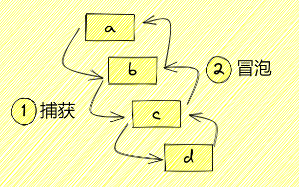

# HTML 學習筆記

## HTML 5 的語義標籤

HTML 5 中，採用了 `<figure>` 與 `<figcaption>` 元素來做到更完整的語意標記。

更有效的分離「圖片的說明」與圖說「想要傳達的概念」，讓內容更具結構。

```html
<figure>
  
  <figcaption>手機改變了這世界</figcaption>
</figure>
```

## link

```html
<link rel="prefetch" href="/style.css" as="style"/>
<link rel="preload" href="/style.css" as="style"/>
<link rel="preconnect" href="https://example.com"/>
<link rel="dns-prefetch" href="https://example.com"/>
<link rel="prerender" href="https://example.com"/>
```

瀏覽器對於資源的載入順序是有規則的，是以檔案類型來決定下載的優先順序，以 chrome 為例：

* High priority
    * style
    * font
    * XHR (sync)
* Medium priority
    * 位於可視區域的圖片
    * Preload without as
    * XHR (async)
* Low priority
    * favicon
    * script async
    * defer
    * block
    * 不在可視區域的圖片
    * 媒體檔
    * SVG

### Preload

在當前頁面中，你可以指定可能或很快就需要的資源在其頁面生命週期的早期——瀏覽器的主渲染機制介入前就進行預載入，這可以讓對應的資源更早的得到載入並使用，也更不易阻塞頁面的初步渲染，進而提升性能

這樣做的好處就是讓在當前頁面中可能被訪問到的資源提前載入但並不阻塞頁面的初步渲染，進而提升性能

可以預載入的資源有很多，現在瀏覽器支援的主要有：

* audio：音訊檔案，通常用於 audio 標籤
* document: 旨在由 frame 或嵌入的 HTML 文件
* embed：要嵌入到 embed 元素中的資源
* fetch：要通過 fetch 或 XHR 請求訪問的資源，例如 ArrayBuffer 或 JSON 檔案
* font: 字型檔案
* image： 圖像檔案
* object：要嵌入到 object 元素中的資源
* script: JavaScript 檔案
* style: CSS 樣式表
* track: WebVTT 檔案
* worker：一個 JavaScript 網路工作者或共享工作者
* video：視訊檔案，通常用於 video 標籤

### Prefetch

與 preload 不同的是 prefetch 抓取的資源不限於當前頁面使用，也就是可以跨越 navigation，例如你很確定使用者會點擊下一頁，就可以使用 prefetch 預先抓取下一頁的資源。

preload 與 prefetch 都是在提早取得將來會用到的資源，然而兩者的差別在於：

* Preload：取得當前頁面的資源（例如字體 font）。
* Prefetch：告訴瀏覽器「這些資源我待會會用到，先幫我下載吧！」

### Preconnect

preconnect 相當於告訴瀏覽器：「這個網頁將會在不久的將來下載某個 domain 的資源，請先幫我建立好連線。」

通常只會對確定短時間內就會用到的 domain 做 preconnect，因為如果 10 秒內沒有使用的話瀏覽器會自動把連線 close 掉

* CDN：如果網站中有很多資源要從 CDN 拿取，可以 preconnect CDN 的域名，這在不能預先知道有哪些資源要抓取的情況，是蠻適合的 use case。
* Streaming 串流媒體

### DNS Preconnect

跟 preconnect 類似，差別在於只提示瀏覽器預先處理第一步 DNS lookup 而已。也就是說

    dns-preconnect = DNS look up
    preconnect = DNS look up + TCP Handshake +  SSL Negotiation

### Prerender

prerender 比 prefetch 更進一步。不僅僅會下載對應的資源，還會對資源進行解析。解析過程中，如果需要其他的資源，可能會直接下載這些資源，基本上就是盡可能預先渲染下個頁面，這樣一來當用戶在從當前頁面跳轉到目標頁面時，瀏覽器可以快速的響應。適合用在用戶很高機率會轉到另一個頁面的狀況下使用

不過瀏覽器支援度有點低。

## img

### 懶加載

懶加載是一種常見的技術，通過按需加載資源來減少網頁的數據使用。

如今懶加載已經是一種 Web 標准，大部分的主流瀏覽器都支持通過 loading="lazy" 屬性使用懶加載。

```html
<!-- with img tag -->


<!-- with IFrame -->
<iframe src="about-page.html" loading="lazy"></iframe>
```

一旦啟用懶加載，只有當用戶滾動到需要該內容顯示的地方才會去加載。

懶加載肯定可以提升應用性能以及用戶體驗，這也是為什麼它已成為開發者在開發應用時的首選優化措施。

懶加載可以實現兩種優勢：

* 減少頁面加載時間（PLT）
    * 通過延遲資源加載減少首屏頁面加載時間。
* 優化資源消耗
    * 通過資源懶加載優化系統資源使用，這在內存以及處理能力較低的移動設備上效果比較好。

懶加載會對性能的負面影響：

* 減慢快速滾動的速度
    * 如果你有一個 Web 應用 (比如在線商店) 需要讓用戶可以快速上下滾動以及導航。對這樣的應用使用懶加載會減慢滾動速度，因為我們需要等待數據加載完成。這會降低應用性能以及引發用戶體驗問題。

* 因為內容變化而導致的延遲
    * 如果沒有為懶加載的圖片定義的 width 和 height 屬性，那麼在圖片渲染過程中會出現明顯的延遲。因為資源在頁面初始化時沒有加載，瀏覽器不知道適用於頁面佈局的內容尺寸。
    * 一旦內容加載完成，而用戶滾動到特定視圖中，瀏覽器需要處理內容以及再一次改變頁面佈局。這會使其他元素移位，也會帶來糟糕的用戶體驗。

* 內容緩沖
    * 如果你在應用中使用非必要的懶加載，這會導致內容緩沖。當用戶快速向下滾動而資源卻還在下載中時會發生這種情況。尤其是帶寬連接較慢時會發生這種情況，這會影響網頁渲染速度。

使用懶加載的時機：

1. 在正確的地方懶加載正確的資源
    * 如果一個需要很多資源的冗長的網頁，可以考慮使用懶加載，但只能針對用戶視圖外或者被折疊的內容使用。
    * 確保你沒有懶加載後台任務執行所需的資源，比如 JavaScript 組件，背景圖片或者其他多媒體內容。
    * 可以使用谷歌瀏覽器的 Lighthouse 工具來檢查，識別那些可添加懶加載屬性的資源。
2. 懶加載那些不妨礙網頁使用的內容
    * 懶加載最好是用於不重要的非必需的 Web 資源。另外，如果資源沒有像預期那樣懶加載，那麼不要忘記錯誤處理和提供良好的用戶體驗。
    * 注意原生懶加載依然沒有被所有平台和瀏覽器普遍支持。如果你在使用一個庫或者自定義的 JavaScript 腳本，那麼這不會對所有用戶都生效。

3. 懶加載對搜索引擎優化（SEO）而言不重要的資源
    * 隨著內容懶加載，網站將逐漸渲染，這也就是說某些內容在首屏加載時並不可用，但我們並不希望 SEO 遺漏我們重要的業務數據。所以不要將懶加載用在針對 SEO 的

## iframe

```html
<body>
  <iframe>
  </iframe>
  <script>
    const win = frames[0].window;
    console.assert(win.globalThis !== globalThis); // true
    console.assert(win.Array !== Array); // true
  </script>
</body>
```

每個 iframe 都有一個獨立的運行環境，document 的全局對象不同於 iframe 的全局對象，類似的，全局對象上的 Array 肯定也不同。

## Event

### target 和 currentTarget 的差別

當你觸發一個元素的事件的時候，該事件從該元素的祖先元素傳遞下去，此過程為捕獲，而到達此元素之後，又會向其祖先元素傳播上去，此過程為冒泡

```html
<div id="a">
  <div id="b">
    <div id="c">
      <div id="d">哈哈哈哈哈</div>
    </div>
  </div>
</div>
```



addEventListener 是為元素綁定事件的方法，他接收三個參數：

* 第一個參數：綁定的事件名
* 第二個參數：執行的函數
* 第三個參數：
    * false：默認，代表冒泡時綁定
    * true：代表捕獲時綁定

如果為 a、b、c、d 都綁定事件，而且都用默認的 false，看看輸出的東西可以發現觸發的是 d，而執行的順序是冒泡的順序

    target是 d currentTarget是 d
    target是 d currentTarget是 c
    target是 d currentTarget是 b
    target是 d currentTarget是 a

如果改為第三個參數都設置為 true，我們看看輸出結果，可以看出觸發的是 d，而執行的元素是捕獲的順序

    target是 d currentTarget是 a
    target是 d currentTarget是 b
    target是 d currentTarget是 c
    target是 d currentTarget是 d

可以總結出：

* e.target：觸發事件的元素
* e.currentTarget：綁定事件的元素

## Open Graph

Open Graph Protocol（開放圖譜協議），簡稱 OG 協議。它是 Facebook 在 2010 年 F8 開發者大會公佈的一種網頁元信息（Meta Information）標記協議，屬於 Meta Tag （Meta 標簽）的範疇，是一種為社交分享而生的 Meta 標簽，用於標准化網頁中元數據的使用，使得社交媒體得以以豐富的“圖形”對象來表示共享的頁面內容。

簡單來說，該協議就是用來標注頁面的類型和描述頁面的內容。

如果網頁採用 OG 協議，分享結果會結構化展示，這樣站點在被鏈接分享時會有更豐富的內容展現，同時站點的轉化率將會提升。

添加方式如下：

```html
<meta property="[NAME]" content="[VALUE]" />
```

範例 - 以下是 IMDB 上 The Rock 的 Open Graph 協議標記

```html
<html prefix="og: https://ogp.me/ns#">
  <head>
    <title>The Rock (1996)</title>
    <meta property="og:title" content="The Rock" />
    <meta property="og:type" content="video.movie" />
    <meta property="og:url" content="https://www.imdb.com/title/tt0117500/" />
    <meta
      property="og:image"
      content="https://ia.media-imdb.com/images/rock.jpg"
    />
    <!-- ... -->
  </head>
  <!-- ... -->
</html>
```

### 基礎屬性

要將你的網頁轉換為可控結構化圖形對象，你需要向頁面添加基本元數據。四個基本開放圖形標簽是：

#### og:title

* 指定想要在共享時展示的標題。這通常與網頁的 `<title>` 標簽相同，例如「百度一下，你就知道」。
* 最多 35 個字符

```html
<meta property="og:title" content="short title of your website/webpage" />
```

#### og:type

* 對象的類型，例如 `video.movie`。根據你指定的類型的不同，可能還需要添加一些其他的不同屬性。

```html
<meta property="og:type" content="article" />
```

[所有可用的 og:type 類型](http://ogp.me/#types)

#### og:image

* 一個圖片 URL。
* 尺寸小於 300KB 且最小尺寸為 300 x 200 的圖像（JPG 或 PNG）。此圖像一般應通過具有有效非自簽名證書的 HTTPS 鏈接提供。

```html
<meta
  property="og:image"
  content="//cdn.example.com/uploads/images/webpage_300x200.png"
/>
```

雖然使用 `og:image` 添加圖像比較容易，但有時讓你的圖像正確顯示可能具有挑戰性。開放圖譜協議包括一些圖像標簽，例如`og:image:url`、 `og:image:secure_url` 以及 `og:image:width` 和 `og:image:height`，可以對圖像進行更細致的控制。

一些社交網絡可能會對圖像有特殊要求。例如，Twitter 要求比例為 2:1，最小尺寸為 300x157，最大尺寸為 4096x4096，小於 5MB，JPG、PNG、WEBP 或 GIF 格式。

#### og:url

* 當前網頁地址的完整鏈接
* 可以是短鏈接，例如， `https://www.baidu.com/[2]`。

```html
<meta property="og:url" content="https://www.example.com/webpage/" />
```

### 其他屬性

#### og:site_name

你的內容所在的整個網站的名稱。如果你的對像是較大網站的一部分，則應為整個網站的名稱。

#### og:description

頁面的描述，最多 65 個字符。類似 og:title，這通常應該和網站的 `<meta type="description">` 標簽相同。

```html
<meta property="og:description" content="description of your website/webpage" />
```

#### og:video

og:video 標簽與 og:image 標簽相同，用於補充“圖形”對象的視頻文件的 URL

#### og:locale

資源的語言環境。如果你有其他語言翻譯可用，你也可以使用 og:locale:alternate。如果不指定 og:locale，則默認為 en_US。

```html
<meta property="og:locale" content="en_GB" />
<meta property="og:locale:alternate" content="fr_FR" />
<meta property="og:locale:alternate" content="es_ES" />
```

### 改進在社交平台支持

#### Twitter

Twitter 允許你指定 `twitter:card`，這是你在展示你的網站時可以使用的“卡片”類型。他們的卡類型包括：

* summary
* summary_large_image
* app
* player

[參考](https://developer.twitter.com/en/docs/twitter-for-websites/cards/guides/getting-started)

#### facebook

[參考](https://developers.facebook.com/docs/sharing/webmasters)

#### Pinterest

[參考](https://developers.pinterest.com/docs/rich-pins/overview/)

#### Linkedin

[參考](https://www.linkedin.com/help/linkedin/answer/46687/making-your-website-shareable-on-linkedin)

#### 測試工具

* [Twitter](https://cards-dev.twitter.com/validator)
* [Facebook](https://developers.facebook.com/tools/debug/)
* [Pinterest](https://developers.pinterest.com/tools/url-debugger)

## 無障礙網站

  無障礙網站之於某些使用者是必需的，卻能使全部的使用者受益。


無障礙網站又稱為 Web Accessibility，常以關鍵字 a11y 來代表無障礙技術，它是 Accessibility 的縮寫，代表網頁可訪問性。

以人類的機能來區分障礙類型：

* 物理，肢體上的障礙
    * 開發基本原則
        * 大多數的肢體障礙者都可以透過鍵盤瀏覽網站，所以開發時專注鍵盤的可訪問性。
* 聽覺
    * 開發基本原則
        * 影片提供字幕或是手語翻譯、專注於螢幕閱讀器的可訪問性。
* 視覺
    * 開發基本原則
        * 提升顏色對比度、填寫替代文字、減少顏文字的使用、確保超連結文字的提示性、超連結的路徑不要寫無意義的 JavaScript（ href="javascript: void;" ）、勿僅靠顏色作為傳達重要訊息的唯一方式、資訊結構順序設計、文字不要壓在圖上...。

開發無障礙網頁的好處：

* 提高 SEO 搜尋引擎排名
* 吸引更廣泛的受眾、拓展市場機會
* 展示社會責任
* 提高易用性（Usability）
* 編寫更清晰的程式碼
* 降低產品成本：避免日後產品迭代時才需要從零導入無障礙的窘境
* 協助網路速度慢的使用者訪問

### 可訪問性計畫 Web Accessibility Initiative (WAI)

WAI 是由 W3C 推動的網路無障礙計畫組織，制定了 WCAG、ATAG、UAAG 三個不同面向的可訪問指南及多個技術規範（如 WAI-ARIA、音訊、影片、發音、如何評估...等等），讓工程師對無障礙網站實務有個依歸得以遵循。

* Web Content Accessibility Guidelines (WCAG)
    * Web 內容無障礙指南
* Authoring Tool Accessibility Guidelines (ATAG)
    * 創作工具無障礙指南，為網頁內容編輯工具提供了指南，促進所有開發者、設計師能更易於創造出無障礙的網站內容。
* User Agent Accessibility Guidelines (UAAG)
    * 使用者代理無障礙指南，針對 Web 瀏覽器、瀏覽器擴充套件、媒體播放器、閱讀器等，在輔助技術方面製定標準，使未來的瀏覽器更易於使用。

### 國家通訊傳播委員會的無障礙規範 

國家通播傳播委員會又稱 NCC， NCC 也是遵從國際的規範來訂定臺灣的無障礙規範，目前是以 2.0 版作為基準。

我們想提高自己網站的可訪問性，要先來了解「三級別、四原則、十二指引」：

* 三個一致性級別：（查看 WAI 一致性級別的說明）
    * A：最低級別，要符合 A 級需要符合 A 級的成功準則。
    * AA：要符合 AA 級需要符合 A、AA 級的成功準則。通常符合這個級別的話，已經可以讓大多數的使用者順利瀏覽。
    * AAA：是最高的級別，要符合 AＡA 級需要符合 A、AA、AAA 級的成功準則。

* 四原則與十二指引：（查看 WAI 快速導覽、2.1 新增的內容）
    * 第一原則：可感知 Perceivable
        * 訊息和使用者介面組件必須以「可感知」的方式呈現給使用者。
        * 指引
            * 替代文字
                * 為文字以外的內容提供「相等意義的替代文字」，使其可以轉化為人們需要的其他形式（如字版、點字、語音、符號...等）。
            * 時間媒體
                * 為所有基於「時間」的媒體（如影片、音訊）提供一個替代的方案。
            * 適應性
                * 能以不同方式呈現，不喪失資訊或結構的內容。
            * 可辨識
                * 讓使用者能容易地看見及聽到內容、並區分前景與背景。
    * 第二原則：可操作 Operable
        * 是否能夠使用鍵盤全程瀏覽網站，使用者遇到錯誤（如表單欄位格式不符），都需要足夠的訊息提示。
        * 指引
            * 可以鍵盤操作
                * 讓所有的功能都能透過鍵盤使用。
            * 時間充分
                * 給使用者足夠時間閱讀並使用內容。
            * 癲癇
                * 不以會誘發癲癇的方式設計內容。
            * 可導覽
                * 提供協助使用者導覽、尋找內容及判斷所在的方法。            * 
    * 第三原則：可理解 Understandable
        * 讓使用者可以理解每個元素的目的，將所有的文字打得明確、有指示性。
        * 指引
            * 可讀
                * 文字訊息需可讀並易理解。
            * 可預測
                * 網頁的呈現與操作需可預測。
            * 輸入協助
                * 協助使用者避免並更正錯誤。
    * 第四原則：健壯性 Robust
        * 讓每個人使用不同裝置或設備都能瀏覽網站，並且要能與時俱進。
        * 指引
            * 相容性
                * 針對目前及未來的使用者代理與輔助科技，最大化其相容性。

### 替代文字 Alternative text

替代文字的作用：

* 當圖片失效時，瀏覽器將顯示替代文字。
* 為圖片提供語義的描述，提供給搜尋引擎抓取。
* 使用螢幕閱讀器瀏覽網站，將讀取替代文字，使視覺障礙及某些認知障礙的使用者可以取得圖片的資訊。

原則：

* 幫圖片加上替代文字是最基本的原則。
    * 可以選擇在圖片 alt 屬性中，或圖片周遭環境中提供「替代文字」說明。
    * 每一張圖片都一定要有 alt 屬性，這是 HTML 的規範。
* 替代文字應該遵守：
    * 能如實呈現照片的內容或是功能性
    * 簡潔
* 替代文字應該避免：
    * 冗贅（比如說重複已經在照片相鄰敘述過的內容）
    * 使用「這是一張...的照片」
    * 使用檔案名稱
* 圖片的上下文內容對於替代文字要如何撰寫影響甚大
* 一張有功能性的圖片（比如超連結中的圖片），應以「功能描述」作為替代文字內容
* 裝飾性的圖片還需要有 alt 屬性，值為空即可（比如 alt="" ）
* 使用正確的標點符號（如逗號或句點字符），這有助於螢幕閱讀器以更“人性化”的聲音方式描述圖像

### tabindex

在 WCAG 2.0 及 2.1 中，提及「頁面上的所有功能都應該可透過鍵盤操作。」，除非像是無法使用鍵盤操作的功能，如：手寫功能。

開發網頁時，有時我們會需要去調整 tab 的順序，在 HTML 中，有一個叫做 tabindex 的屬性可以幫我們辦到這件事情。

tabindex 特性：

* 可以使用在任何一個 HTML 元素上。
* 通常不建議針對 `<h1>`、 `<p>`、 `` 加上 tabindex 屬性，針對「需要和使用者互動的元件」加上「對焦的行為」才是最合適的，比如：按鈕、頁籤、搜尋框或任何要使用者輸入資料的元素。

### WAI-ARIA

是由一個無障礙組織與一個重要標準規範組成，分別以它們的縮寫名稱的串接，可以簡稱 ARIA：

* Web Accessibility Initiative (WAI)
    * Web 可訪問性計畫組織
* Accessible Rich Internet Applications Suite (ARIA)
    * 可訪問的豐富網路應用程式規範

WAI-ARIA 可以做到的事：

* 在沒有隱含語義的元素加上語義，如 `<div>`。
* 修改隱含語義元素的「現有語義」，如 `<button>` 實現 switch，需要加上 role 設定。
* 表達不存在語義的 UI patterns，如巢狀的 ul ，透過 role 表達群組的概念。
* 額外的標籤（label）與描述（descriptions）
* 表達元素與元素之間的關係。
* 因應基於時間或事件的變化而根據重新渲染的畫面提供資訊給使用者知曉。

完整的語義內容將包含： role 、 name 、 state、 value 。

#### 角色 Role

WAI-ARIA 中定義一系列的角色模型，每個角色有其定位與可以使用的 aria-* 屬性，以讓使用者能夠預期該功能的操作行為。

注意事項：

* 使用原生語法時，不需用 ARIA 覆蓋原生語義
    ```html
    <input type="checkbox"> <!-- 不用加上 role="checkbox" -->
    
    <!-- 需要的情況 -->
    <div id="percent-loaded" role="progressbar" aria-valuenow="75" aria-valuemin="0" aria-valuemax="100" /></div>
    ```

角色一共分為六類：

* Abstract Roles 抽象
    * 用於定義通用角色概念，開發者不可使用。
        * command、composite、input、landmark、range 、roletype、section、sectionhead 、select、structure、widget、window。
* Document Structure Roles 文件結構
    * 描述文件頁面內容的結構，通常不是可互動式的。
        * application、article、cell、columnheader、definition、directory、document、feed 、figure、group、heading、img、list、listitem、math、none、note、presentation、row、rowgroup、rowheader、separator(當無法取得焦點時)、table、term、toolbar 、tooltip
* Widget Roles 組件功能
    * 作為小組件或較大組件中的小項目之一
        * button、checkbox、gridcell、link、menuitem、menuitemcheckbox、menuitemradio、option、progressbar、radio、scrollbar、searchbox、separator（當可取得焦點時）、slider、spinbutton、switch、tab、tabpanel、textbox、treeitem。
    * 通常做為組件的容器的角色：
        * combobox、grid、listbox、menu、menubar、radiogroup、tablist、tree、treegrid。
* Landmark Roles 標誌
    * 最容易實現的 Role 角色之一，也是為螢幕閱讀器使用者提供顯著直接好處的屬性之一
        * banner、complementary、contentinfo、form、main、navigation、region、search。
            ```html
            <!-- 一個頁面中若有重複的導航列 -->
            <div role="navigation" aria-label="Main menu"> ... </div>
            <div role="navigation" aria-label="User menu"> ... </div>
            ```
* Live Region Roles 實時區域
    * 隨時依據狀況更新的角色。
        * alert、log、marquee、status、timer。
* Window Roles 視窗
    * 在應用程式中作為新視窗來展示資訊的角色。
        * alertdialog、dialog。

#### 屬性

* aria-label
    * 指定用作可訪問標籤的字，與 aria-labelledby 相同意思。
    * 定義一字串作為元素的描述
        ```html
        <ul role="navigation" aria-label="This is a pagination list">...</ul>
        ```
* aria-labelledby
    * 標示另一個元素的內容是此元素的敘述
        ```html
        <p id="paginglabel"></p>
        <ul role="navigation" aria-labelledby="paginglabel">...</ul>
        ```
    * 用途雖與 aria-label 相同，但當兩個屬性都存在時，根據 accessible name 演算法，aria-labelledby 的權重比較高

### 注意事項

* DOM 順序就是一切。
    * 大部分人用看的方式瀏覽網頁，有些人用聽的瞭解內容，這時確保元素順序與所呈現訊息的邏輯順序相符很重要，要簡單檢測最快的方式是刪除 CSS 樣式，並檢查內容的順序是否合理。
* 絕對不要移除 outline 的樣式，除非..
    * 我們絕對不該移除 outline 的樣式，比如說： outline: none 。因為元素被 focus 時，表示使用者正在使用的元件就是「它」，如果看不出任何差異，會有辨識的困難。 
* .visually-hidden 影響資訊是否能被讀取
    * 會有這個 class 的設定是因為 visibility: hidden & display: none 這兩種屬性的設定，都是在可視介面上隱藏元素，基本上會讓螢幕閱讀器的使用者受到影響，他們的輔助工具也將遺漏你設定隱藏的資訊。

## 參考文章

* [連 OG 都不知道還好意思說自己開發過 H5？](https://mp.weixin.qq.com/s/DiLZZaJ8ru2VqOEzB1EIbA)
* [e.target 和 e.currentTarget 的区别？你到底知不知道？](https://mp.weixin.qq.com/s/B3AHkbdr7wlQB8-Fk5CgTg)
* [過度使用懶加載對 Web 性能的影響](https://mp.weixin.qq.com/s/4Oo4FtNO-mviTiS_dPT1Uw)
* [今晚，我想來點 Web 前端效能優化大補帖！](https://medium.com/starbugs/%E4%BB%8A%E6%99%9A-%E6%88%91%E6%83%B3%E4%BE%86%E9%BB%9E-web-%E5%89%8D%E7%AB%AF%E6%95%88%E8%83%BD%E5%84%AA%E5%8C%96%E5%A4%A7%E8%A3%9C%E5%B8%96-e1a5805c1ca2)
* [React 官網為什麼那麼快？](https://juejin.cn/post/7128369638794231839)
* [實踐無障礙網頁設計（Web Accessibility） 系列](https://ithelp.ithome.com.tw/users/20108045/ironman/2454)