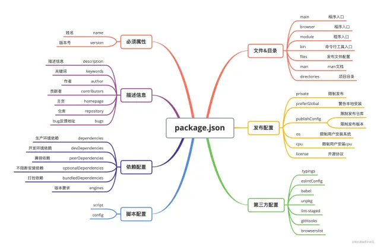

# Node.js 學習筆記

## package.json



### 必要屬性

#### name

`name` 就是項目的名稱，它是一個字串。

在命名時，需要注意以下幾點：

* 名稱的長度必須小於等於 214 個字元，不能以 `.` 和 `_` 開頭，不能包含大寫字母（這是因為當軟件包在npm上發布時，會基於此屬性獲得自己的 URL，所以不能包含非URL安全字符（non-url-safe））；
* 名稱可以作為參數被傳入 require("")，用來導入模塊，所以應當盡可能的簡短、語義化；
* 名稱不能和其他模塊的名稱重復，可以使用 `npm view` 命令查詢模塊明是否重復，如果不重復就會提示 404：

不過如果不會發在 npm 上，就不用太過講究了。

#### version

version 表示該項目包的版本號，它是一個字串。在每次項目改動後，即將發布時，都要同步的去更改項目的版本號。

版本號的使用規範如下：

* 版本號的命名遵循語義化版本 2.0.0 規范，格式為：主版本號.次版本號.修訂號，通常情況下，修改主版本號是做了大的功能性的改動，修改次版本號是新增了新功能，修改修訂號就是修復了一些bug；
* 如果某個版本的改動較大，並且不穩定，可能如法滿足預期的兼容性需求，就需要發布先行版本，先行版本通過會加在版本號的後面，通過“-”號連接以點分隔的標識符和版本編譯信息：內部版本（alpha）、公測版本（beta）和候選版本（rc，即release candiate）。


可以通過以下命令來查看 npm 包的版本信息，以 react 為例：

```shell
// 查看最新版本
npm view react version

// 查看所有版本
npm view react versions
```

### 描述信息

#### description

description 用來描述這個項目包，它是一個字串，可以讓其他開發者在 npm 的搜索中發現我們的項目包。

#### keywords

keywords 是一個字符串數組，表示這個項目包的關鍵詞。和description 一樣，都是用來增加項目包的曝光率的。

#### author

author 表示該項目包的作者。它有兩種形式，一種是字符串格式：

```jsonc
{
    // ...
    "author": "CUGGZ <xxxxx@xx.com> (https://juejin.cn/user/3544481220801815)"
}
```

另一種是物件形式：

```jsonc
{
    // ...
    "author": {
        "name" : "CUGGZ",
        "email" : "xxxxx@xx.com",
        "url" : "https://juejin.cn/user/3544481220801815"
    }
}
```

#### contributors

contributors 表示該項目包的貢獻者，它同樣有兩種寫法：

```jsonc
{
    // ...
    "contributors": [
        "CUGGZ0 <xxxxx@xx.com> (https://juejin.cn/user/3544481220801815)",
        "CUGGZ1 <xxxxx@xx.com> (https://juejin.cn/user/3544481220801815)"
    ]
}
```

```jsonc
{
    // ...
    "contributors": [
        {
            "name" : "CUGGZ0",
            "email" : "xxxxx@xx.com",
            "url" : "https://juejin.cn/user/3544481220801815"
        },
        {
            "name" : "CUGGZ1",
            "email" : "xxxxx@xx.com",
            "url" : "https://juejin.cn/user/3544481220801815"
        }
    ]
}
```

#### homepage

homepage 就是項目的主頁地址。

#### repository

repository 表示代碼的存放倉庫地址，通常有兩種書寫形式。第一種是字串形式：

```jsonc
{
    // ...
    "repository": "https://github.com/facebook/react.git"
}
```

除此之外，還可以顯式地設置版本控制系統，這時就是對象的形式：

```jsonc
{
    // ...
    "repository": {
        "type": "git",
        "url": "https://github.com/facebook/react.git"
    }
}
```

#### bugs

bugs表示項目提交問題的地址，該字段是一個對象，可以添加一個提交問題的地址和反饋的郵箱：

```jsonc
{
    // ...
    "bugs": { 
        "url" : "https://github.com/facebook/react/issues",
        "email" : "xxxxx@xx.com"
    }
}
```

最常見的 bugs 就是Github 中的 issues 頁。

### 依賴配置

#### dependencies

dependencies字段中聲明的是項目的生產環境中所必須的依賴包。當使用 npm 或 yarn 安裝 npm 包時，該 npm 包會被自動插入到此配置項中

```shell
npm install <PACKAGENAME>
yarn add <PACKAGENAME>
```

該字串的值是一個對象，該對象的各個成員，分別由模塊名和對應的版本要求組成，表示依賴的模塊及其版本范圍。

```jsonc
{
    // ...
    "dependencies": { 
        "react": "^17.0.2", 
        "react-dom": "^17.0.2", 
        "react-scripts": "4.0.3",
    },
}
```

這裡每一項配置都是一個鍵值對（key-value）， key表示模塊名稱，value 表示模塊的版本號。版本號遵循主版本號.次版本號.修訂號的格式規定：

* 固定版本： 上面的 react-scripts 的版本 4.0.3 就是固定版本，安裝時只安裝這個指定的版本；
* ~： 比如~4.0.3，表示安裝4.0.x的最新版本（不低於4.0.3），也就是說安裝時不會改變主版本號和次版本號；
* ^： 比如上面 react 的版本 ^17.0.2，表示安裝17.x.x的最新版本（不低於17.0.2），也就是說安裝時不會改變主版本號。如果主版本號為0，那麼 ~ 和 ^ 的行為是一致的；
* latest：安裝最新的版本。

注意不要把測試或者過渡性的依賴放在 dependencies，避免生產環境出現意外的問題。

#### devDependencies

devDependencies中聲明的是開發階段需要的依賴包，如Webpack、Eslint、Babel 等，用於輔助開發。不同於 dependencies，因為它們只需安裝在開發設備上，而無需在生產環境中運行代碼。

當打包上線時並不需要這些包，所以可以把這些依賴添加到 devDependencies 中，這些依賴依然會在本地指定 npm install 時被安裝和管理，但是不會被安裝到生產環境中。

當使用 npm 或 yarn 安裝軟件包時，指定以下參數後，新安裝的npm包會被自動插入到此列表中：

```shell
npm install --save-dev <PACKAGENAME>
yarn add --dev <PACKAGENAME>
```

```jsonc
{
    // ...
    "devDependencies": { 
        "autoprefixer": "^7.1.2", 
        "babel-core": "^6.22.1"
    }
}
```

#### peerDependencies

有些情況下，我們的項目和所依賴的模塊，都會同時依賴另一個模塊，但是所依賴的版本不一樣。比如，我們的項目依賴 A 和 B 的 1.0 版，而 A 本身又依賴 B 的 2.0 版。

大多數情況下，這不是問題，B 的兩個版本可以並存，同時運行。

但是有一種情況會出現問題，最典型的場景就是插件，比如 A 是 B 的插件。用戶安裝的 B 是 1.0 版本，但是 A 插件只能和 2.0 版本的 B 一起使用。這時用戶要是將 1.0 版本的 B 的實例傳給 A 就會出現問題。

因此，需要一種機制在模板安裝的時候提醒用戶，如果 A 和 B 一起安裝，那麼 B 必須是 2.0 模塊。

peerDependencies 字段就是用來供插件指定其所需要的主工具的版本。

```jsonc
{
    // ...
    "name": "chai-as-promised",
    "peerDependencies": { 
    "chai": "1.x"
    }
}
```

上面代碼指定在安裝chai-as-promised模塊時，主程序chai必須一起安裝，而且chai的版本必須是1.x。如果項目指定的依賴是chai的2.0版本，就會報錯。

注意，從npm 3.0版開始，peerDependencies 不再會默認安裝了。

#### optionalDependencies

如果需要在找不到包或者安裝包失敗時，npm 仍然能夠繼續運行，則可以將該包放在 optionalDependencies 對象中，optionalDependencies 對象中的包會覆蓋 dependencies 中同名的包，所以只需在一個地方進行設置即可。

需要注意，由於 optionalDependencies 中的依賴可能並為安裝成功，所以一定要做異常處理，否則當獲取這個依賴時，如果獲取不到就會報錯。

#### bundledDependencies

上面的幾個依賴相關的配置項都是一個對象，而bundledDependencies 配置項是一個數組，數組裡可以指定一些模塊，這些模塊將在這個包發布時被一起打包。

需要注意，這個字段數組中的值必須是在 dependencies, devDependencies 兩個裡面聲明過的包才行。

#### engines

當我們維護一些舊項目時，可能對npm包的版本或者Node版本有特殊要求，如果不滿足條件就可能無法將項目跑起來。為了讓項目開箱即用，可以在engines字段中說明具體的版本號：

```jsonc
{
    // ...
    "engines": { 
        "node": ">=8.10.3 <12.13.0",  
        "npm": ">=6.9.0"
    }
}
```

需要注意，engines只是起一個說明的作用，即使用戶安裝的版本不符合要求，也不影響依賴包的安裝。

### 腳本配置

#### scripts

scripts 是 package.json中內置的腳本入口，是key-value鍵值對配置，key為可運行的命令，可以通過 npm run 來執行命令。除了運行基本的scripts命令，還可以結合 pre 和 post 完成前置和後續操作。

```jsonc
{
    // ...
    "scripts": {
        "dev": "node index.js",  
        "predev": "node beforeIndex.js", // 在執行 dev 前執行
        "postdev": "node afterIndex.js" // 在執行 dev 後執行
    }
}
```

執行順序是 predev→dev→postdev。如果scripts命令存在一定的先後關系，則可以使用這三個配置項，分別配置執行命令。

#### config

config字段用來配置scripts運行時的配置參數。

```jsonc
{
    // ...
    "config": { 
        "port": 3000
    }
}
```

如果運行 npm run start，則port字段會映射到npm_package_config_port 環境變量中：

```js
console.log(process.env.npm_package_config_port) // 3000
```

用戶可以通過 npm config set foo:port 3001 命令來重寫port的值。

### 文件&目錄

#### main

main 用來指定加載的入口文件，在 browser 和 Node 環境中都可以使用。如果我們將項目發布為npm包，那麼當使用 require 導入 npm 包時，返回的就是 main 字段所列出的文件的module.exports 屬性。

如果不指定該字段，默認是項目根目錄下的 index.js。如果沒找到，就會報錯。

該字段的值是一個字符串：

```jsonc
{
    // ...
    "main": "./src/index.js",
}
```

#### browser

browser 可以定義 npm 包在 browser 環境下的入口文件。如果 npm 包只在 web 端使用，並且嚴禁在 server 端使用，使用 browser 來定義入口文件。

```jsonc
{
    // ...
    "browser": "./src/index.js" 
}
```

#### module

module 可以定義 npm 包的 ESM 規范的入口文件，browser 環境和 node 環境均可使用。如果 npm 包導出的是 ESM 規范的包，使用 module 來定義入口文件。

```jsonc
{
    // ...
    "module": "./src/index.mjs",
}
```

需要注意，.js 文件是使用 commonJS 規范的語法(require('xxx'))，.mjs 是用 ESM 規范的語法(import 'xxx')。

上面三個的入口入口文件相關的配置是有差別的，特別是在不同的使用場景下。在Web環境中，如果使用loader加載ESM（ES module），那麼這三個配置的加載順序是browser→module→main，如果使用require加載CommonJS模塊，則加載的順序為main→module→browser。

Webpack在進行項目構建時，有一個target選項，默認為Web，即構建Web應用。如果需要編譯一些同構項目，如node項目，則只需將webpack.config.js的target選項設置為node進行構建即可。如果再Node環境中加載CommonJS模塊，或者ESM，則只有main字段有效。

#### bin

bin字段用來指定各個內部命令對應的可執行文件的位置：

```jsonc
{
    // ...
    "bin": {
        "someTool": "./bin/someTool.js"
    }
}
```

這裡，someTool 命令對應的可執行文件為 bin 目錄下的 someTool.js，someTool.js會建立符號鏈接node_modules/.bin/someTool。

由於node_modules/.bin/目錄會在運行時加入系統的PATH變量，因此在運行 npm 時，就可以不帶路徑，直接通過命令來調用這些腳本。因此，下面的寫法可以簡寫：

```jsonc
{
    // ...
    "scripts": {  
        "start": "./node_modules/bin/someTool.js build"
    }
}
```

```jsonc
{
    // 簡寫
    "scripts": {  
        "start": "someTool build"
    }
}
```

所有node_modules/.bin/目錄下的命令，都可以用npm run [命令]的格式運行。

上面的配置在package.json包中提供了一個映射到本地文件名的bin字段，之後npm包將鏈接這個文件到prefix/fix裡面，以便全局引入。或者鏈接到本地的node_modules/.bin/文件中，以便在本項目中使用。

#### files

files 配置是一個數組，用來描述當把 npm 包作為依賴包安裝時需要說明的文件列表。當 npm 包發布時，files 指定的文件會被推送到npm 服務器中，如果指定的是文件夾，那麼該文件夾下面所有的文件都會被提交。

```jsonc
{
    // ...
    "files": [  
        "LICENSE",   
        "Readme.md",  
        "index.js",  
        "lib/" 
    ]
}
```

如果有不想提交的文件，可以在項目根目錄中新建一個 .npmignore 文件，並在其中說明不需要提交的文件，防止垃圾文件推送到 npm 上。這個文件的形式和 .gitignore 類似。寫在這個文件中的文件即便被寫在 files 屬性裡也會被排除在外。比如可以在該文件中這樣寫：

```npmignore
node_modules
.vsco

debuild
```

#### man

man 命令是 Linux 中的幫助指令，通過該指令可以查看 Linux 中的指令幫助、配置文件幫助和編程幫助等信息。如果 node.js 模塊是一個全局的命令行工具，在 package.json 通過 man 屬性可以指定 man 命令查找的文檔地址：

```jsonc
{
    // ...
    "man": [
        "./man/npm-access.1", 
        "./man/npm-audit.1"
    ]
}
```

man 字段可以指定一個或多個文件, 當執行 man {包名}時, 會展現給用戶文檔內容。

需要注意：

* man文件必須以數字結尾，如果經過壓縮，還可以使用.gz後綴。這個數字表示文件安裝到哪個 man 節中；
* 如果 man 文件名稱不是以模塊名稱開頭的，安裝的時候會加上模塊名稱前綴。

對於上面的配置，可以使用以下命令來執行查看文檔：

```shell
man npm-access
man npm-audit
```

#### directories

directories 字段用來規范項目的目錄。node.js 模塊是基於 CommonJS 模塊化規范實現的，需要嚴格遵循 CommonJS 規范。模塊目錄下除了必須包含包項目描述文件 package.json 以外，還需要包含以下目錄：

* bin ：存放可執行二進制文件的目錄
* lib ：存放js代碼的目錄
* doc ：存放文檔的目錄
* test ：存放單元測試用例代碼的目錄

在實際的項目目錄中，我們可能沒有按照這個規范進行命名，那麼就可以在directories字段指定每個目錄對應的文件路徑：

```jsonc
{
    // ...
    "directories": { 
        "bin": "./bin",  
        "lib": "./lib", 
        "doc": "./doc",   
        "test": "./test",  
        "man": "./man"
    },
}
```

這個屬性實際上沒有什麼實際的作用，當然不排除未來會有什麼比較有意義的用處。

### 發布配置

#### private

private字段可以防止我們意外地將私有庫發布到 npm 服務器。只需要將該字段設置為 true：

```jsonc
{
    //...
    "private": true
}
```

#### preferGlobal

preferGlobal 字段表示當用戶不把該模塊安裝為全局模塊時，如果設置為 true 就會顯示警告。它並不會真正的防止用戶進行局部的安裝，只是對用戶進行提示，防止產生誤解：

```jsonc
{
    //...
    "preferGlobal": true
}
```

#### publishConfig

publishConfig 配置會在模塊發布時生效，用於設置發布時一些配置項的集合。如果不想模塊被默認標記為最新，或者不想發布到公共倉庫，可以在這裡配置tag或倉庫地址。更詳細的配置可以參考 npm-config（https://docs.npmjs.com/cli/v7/using-npm/config）。

通常情況下，publishConfig會配合private來使用，如果只想讓模塊發布到特定npm倉庫，就可以這樣來配置：

```jsonc
{
    //...
    "private": true,
    "publishConfig": {
        "tag": "1.1.0", 
        "registry": "https://registry.npmjs.org/",
        "access": "public"
    }
}
```

#### os

os字段可以讓我們設置該npm包可以在什麼操作系統使用，不能在什麼操作系統使用。如果我們希望開發的 npm 包只運行在 linux，為了避免出現不必要的異常，建議使用Windows系統的用戶不要安裝它，這時就可以使用os配置：

```jsonc
{
    //...
    "os" ["linux"]   // 適用的操作系統
}
```

```jsonc
{
    //...
    "os" ["!win32"]  // 禁用的操作系統
}
```

#### cpu

該配置和 OS 配置類似，用CPU可以更準確的限制用戶的安裝環境：

```jsonc
{
    //...
    "cpu" ["x64", "AMD64"]   // 適用的cpu
}
```

```jsonc
{
    //...
    "cpu" ["!arm", "!mips"]  // 禁用的cpu
}
```

#### license

license 字段用於指定軟件的開源協議，開源協議表述了其他人獲得代碼後擁有的權利，可以對代碼進行何種操作，何種操作又是被禁止的。常見的協議如下：

* MIT ：只要用戶在項目副本中包含了版權聲明和許可聲明，他們就可以拿你的代碼做任何想做的事情，你也無需承擔任何責任。
* Apache ：類似於 MIT ，同時還包含了貢獻者向用戶提供專利授權相關的條款。
* GPL ：修改項目代碼的用戶再次分發源碼或二進制代碼時，必須公佈他的相關修改。

可以這樣來聲明該字段：

```jsonc
{
    //...
    "license": "MIT"
}
```

### 第三方配置

常用的第三方配置項。

#### typings

typings字段用來指定 TypeScript 的入口文件：

```jsonc
{
    //...
    "typings": "types/index.d.ts",
}
```

該字段的作用和 main 配置相同。

#### eslintConfig

eslint的配置可以寫在單獨的配置文件 .eslintrc.json 中，也可以寫在 package.json 文件的eslintConfig配置項中。

```jsonc
{
    //...
    "eslintConfig": {   
        "root": true, 
        "env": {   
            "node": true   
        },   
        "extends": [   
            "plugin:vue/essential",   
            "eslint:recommended"   
        ],  
        "rules": {},  
        "parserOptions": {    
            "parser": "babel-eslint"   
        },
    }
}
```

#### babel

babel用來指定Babel的編譯配置，代碼如下：

```jsonc
{
    //...
    "babel": { 
        "presets": ["@babel/preset-env"],
        "plugins": [...]
    }
}
```

#### unpkg

使用該字段可以讓 npm 上所有的文件都開啟 cdn 服務，該CND服務由unpkg提供：

```jsonc
{
    //...
    "unpkg": "dist/vue.js"
}
```

#### lint-staged

lint-staged是一個在Git暫存文件上運行linters的工具，配置後每次修改一個文件即可給所有文件執行一次lint檢查，通常配合gitHooks一起使用。

```jsonc
{
    //...
    "lint-staged": { 
        "*.js": [ 
            "eslint --fix", 
            "git add"
        ]
    }
}
```

使用 lint-staged 時，每次提交代碼只會檢查當前改動的文件。

#### gitHooks

gitHooks用來定義一個鉤子，在提交（commit）之前執行ESlint檢查。在執行lint命令後，會自動修復暫存區的文件。修復之後的文件並不會存儲在暫存區，所以需要用git add命令將修復後的文件重新加入暫存區。在執行pre-commit命令之後，如果沒有錯誤，就會執行git commit命令：

```jsonc
{
    //...
    "gitHooks": {
        "pre-commit": "lint-staged"
    }
}
```

這裡就是配合上面的lint-staged來進行代碼的檢查操作。

#### browserslist

browserslist字段用來告知支持哪些瀏覽器及版本。Babel、Autoprefixer 和其他工具會用到它，以將所需的 polyfill 和 fallback 添加到目標瀏覽器。比如最上面的例子中的該字段值：

```jsonc
{
    //...
    "browserslist": {
        "production": [
            ">0.2%",
            "not dead",
            "not op_mini all"
        ],
        "development": [
            "last 1 chrome version",
            "last 1 firefox version",
            "last 1 safari version"
        ]
    }
}
```

這裡指定了一個對象，裡面定義了生產環境和開發環境的瀏覽器要求。上面的development就是指定開發環境中支持最後一個版本的chrome、Firefox、safari瀏覽器。

這個屬性是不同的前端工具之間共用目標瀏覽器和 node 版本的配置工具，被很多前端工具使用，比如Babel、Autoprefixer等。

## 參考資料

* [关于前端大管家 package.json，你知道多少？](https://mp.weixin.qq.com/s/csGiBBvsZLI76yrXjD6NGg)
