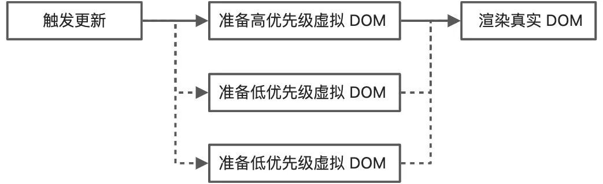
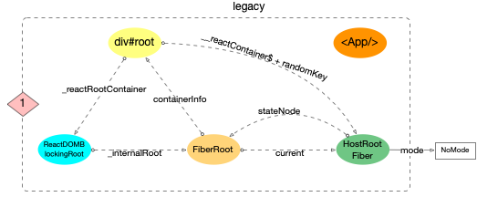
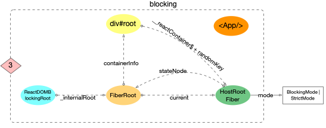
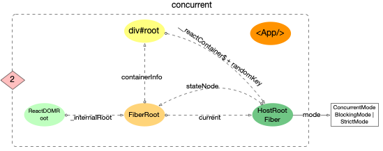

# React 學習筆記

## 簡介

* 純粹的 View 函式庫，沒有其他的功能，由 Facebook 出品
* 特性
    * 將 CSS, HTML 的內容全移至 JS 裡，讓 HTML 變得很單純
    * Immediate-mode GUI
    * JSX

開發 React 的時候，很容易會忍不住將 View 拆成一個個 Component，而個別的的 Component 也會有衝動繼續拆成一個個 Component。在React的世界中，我們要做的事情只要將畫面切割成各種元件，將元件獨立完成後再組裝。

* 拆成多個 Component 後……
    * Component 本身很單純，容易除錯
    * 各別的 Component 容易複用
    * 容易了解應用程式的結構 (理論上大概吧？但……)
* 也因為很容易重用……
    * 所以有一大堆現成的第三方 components 可以直接使用
        * material-ui

## 概念

### CSR vs SSR vs SSG

#### CSR (Client Side Rendering)

CSR 如同其名，是將渲染資料的所有過程都交由瀏覽器端處理，使用者在瀏覽網站時，第一次跟伺服器請求的 HTML 檔裡面幾乎不包含任何的內容，伺服器並沒有傳入資料到 HTML。接著，後續會再透過載入的 bundle，也就是 JavaScript 的檔案，再讓 JS 執行 AJAX 跟伺服器請求資料，最後將資料渲染到畫面上。

例子：

```html
<html>
    <head>
        <link href="/static/css/main.css" rel="stylesheet">
    </head>
    <body>
        <div id="app"></div>
    </body>
    <script src="/static/js/bundle.js"></script>
</html>
```

而且因為 bundle 需要包含呼叫 API 的程式碼，一般來說整體會檔案大小會比較大一點，因此載入的時間就會稍微長一些。在載入完之後，也需要呼叫 API 也是一段時間成本。

但是 CSR 也不是沒有優點，因為 bundle 在一開始就載入進來，後續渲染畫面就不用不斷地跟伺服器端交互，體感上會比 SSR 快，而且在切換頁面的使用者體驗也會更好。使用 CSR 對於伺服器來說，也會有較小的負擔。

#### SSR (Server Side Rendering)

在過去的時代，傳統的 SSR 像是 PHP 透過伺服器端處理任何的資料，然後再直接編譯成 HTML 檔案，最後使用者看到的就是完整包含資料的 HTML。

但這種傳統的做法有一個缺點是在切換頁面時，瀏覽器的畫面很明顯地閃爍，在這種情況下瀏覽網站的使用者體驗 (UX) 不是很好。

後來因為 SPA 開始逐漸盛行，使用者切換頁面不必再因為畫面不斷閃爍，而感到體驗不佳，但因為資料都是在瀏覽器端由 AJAX 發送請求跟伺服器端拿資料，如此一來 google 的爬蟲就沒辦法拿到資料，對於有礙於 SEO。

因此，其中一個解決辦法就是 SSR，但是不像似過去傳統的 SSR，而是保有 SPA 換頁時不會閃爍的優點，還可以讓伺服器動態地注入資料到 HTML 的檔案中，讓瀏覽器端第一次請求拿到的 HTML 就已經包含所有的資料，因此 google 爬蟲也就可以順利地爬到網站中的內容。

網頁的資料都是動態的，而且使用者在看到瀏覽網頁時還不用等待 API 回來後，再透過 JS 渲染資料到畫面上，大部分的時候這種方式的使用者體驗更好。但問題就在於使用 SSR 就必須有個伺服器一直處理使用者的請求，一直產生有資料的 HTML，並送到瀏覽器端，這樣的工作對於伺服器來說是一個負擔。

#### SSG (Static Side Generation)

SSG 意味著所有的內容都在 bulid 的時候都打包進入檔案中，所以使用者在瀏覽網站時，就可以拿到完整的 HTML 檔案。優點除了可以有利於 SEO 之外，還有因為每次使用者拿到的 HTML 內容都不會變，所以還可以讓 HTML 被 cache 在 CDN 上，很適合用在資料變動較小的網站中，像是部落格、產品介紹頁這種應用中。

但使用 SSG 這項技術時，除了必須考量到頁面資料更新頻率的問題，再者要衡量隨著應用越來越大時，打包的時間也會隨之增長。

### Retained-mode GUI v.s. Immediate-mode GUI

* Retained mode GUI
    * 一般的 GUI 都是 retained mode，畫面上的 GUI 也會保存資料和狀態
    * 在元件數量越多時，互動的成本就會越高
* Immediate-mode GUI 
    * 將資料和 GUI 獨立開來
    * 在元件數量越多寡，不影響互動的成本
    * 此做法意味著任何小變動都得重新 render 整個畫面，會有效能問題

React 會先將元件都 render 成 virtual DOM，它會自己找出有變動的部份，然後只重繪這些變動。既享有 immediate-mode 的好處，也不用擔心 UI 效能問題 (至少是減少對於效能的影響)

## 基礎

### JSX

* Facebook
* A JavaScript syntax extension that looks similar to XML
* 就是為了偷懶，以上。
* 一些小細節
    * 內建 tag 小寫，自定義 component 大寫
        ```jsx
        <div>
            <HelloWorld />
        </div>
        ```
    * Built-in keyword 會改名 (如：class  是 JS 的 keyword，所以改為 className)
        ```jsx
        <div className="haha"></div>
        ```
* JSX 不能直接上，Browser 看嘸！
    * 需要 tool 將 JSX 轉為普通的 JS
    * 聽到「轉為普通的 JS」，就會想到 Babel !!

### 啟動 React

```js
export function createRoot(
  container: Container,
  options?: RootOptions,
): RootType {
  return new ReactDOMRoot(container, options);
}

function ReactDOMRoot(container: Container, options: void | RootOptions) {
  // 创建一个fiberRoot对象, 并将其挂载到this._internalRoot之上
  this._internalRoot = createRootImpl(container, ConcurrentRoot, options);
}
```

無論哪一個模式，在 ReactDOM(Blocking)Root 的創建過程中, 都會調用一個相同的函數createRootImpl。

```js
function createRootImpl(
  container: Container,
  tag: RootTag,
  options: void | RootOptions,
) {
  // ... 省略部分源碼(有關hydrate服務端渲染等, 暫時用不上)
  // 1. 創建fiberRoot
  const root = createContainer(container, tag, hydrate, hydrationCallbacks); // 注意RootTag的傳遞
  // 2. 標記dom對象, 把dom和fiber對象關聯起來
  markContainerAsRoot(root.current, container);
  // ...省略部分無關代碼
  return root;
}

export function createContainer(
  containerInfo: Container,
  tag: RootTag,
  hydrate: boolean,
  hydrationCallbacks: null | SuspenseHydrationCallbacks,
): OpaqueRoot {
  // 創建fiberRoot對象
  return createFiberRoot(containerInfo, tag, hydrate, hydrationCallbacks); // 注意RootTag的傳遞
}

export function createFiberRoot(
  containerInfo: any,
  tag: RootTag,
  hydrate: boolean,
  hydrationCallbacks: null | SuspenseHydrationCallbacks,
): FiberRoot {
  // 創建fiberRoot對象 ()
  const root: FiberRoot = (new FiberRootNode(containerInfo, tag, hydrate): any);

  // 1. 這裡創建了`react`應用的首個`fiber`對象, 稱為`HostRootFiber`
  const uninitializedFiber = createHostRootFiber(tag);
  root.current = uninitializedFiber;
  uninitializedFiber.stateNode = root;
  // 2. 初始化HostRootFiber的updateQueue
  initializeUpdateQueue(uninitializedFiber);

  return root;
}

export function createHostRootFiber(tag: RootTag): Fiber {
  // fiber.mode屬性, 會與 3 種RootTag(ConcurrentRoot,BlockingRoot,LegacyRoot)關聯起來
  let mode;
  if (tag === ConcurrentRoot) {
    mode = ConcurrentMode | BlockingMode | StrictMode;
  } else if (tag === BlockingRoot) {
    mode = BlockingMode | StrictMode;
  } else {
    mode = NoMode;
  }
  return createFiber(HostRoot, null, null, mode); // 注意這裡設置的mode屬性是由RootTag決定的
}
```

更新：

```js
ReactDOMRoot.prototype.render = ReactDOMBlockingRoot.prototype.render = function(
  children: ReactNodeList,
): void {
  const root = this._internalRoot;
  // 執行更新
  updateContainer(children, root, null, null);
};

export function updateContainer(
  element: ReactNodeList,
  container: OpaqueRoot,
  parentComponent: ?React$Component<any, any>,
  callback: ?Function,
): Lane {
  const current = container.current;
  // 1. 獲取當前時間戳, 計算本次更新的優先級
  const eventTime = requestEventTime();
  const lane = requestUpdateLane(current);

  // 2. 設置fiber.updateQueue
  const update = createUpdate(eventTime, lane);
  update.payload = { element };
  callback = callback === undefined ? null : callback;
  if (callback !== null) {
    update.callback = callback;
  }
  enqueueUpdate(current, update);

  // 3. 進入reconciler運作流程中的`輸入`環節
  scheduleUpdateOnFiber(current, lane, eventTime);
  return lane;
}
```

### 生命周期

(React 舊的生命周期)


(React 新的生命周期)


React 16.3 新增的生命周期方法

* getDerivedStateFromProps()
* getSnapshotBeforeUpdate()

逐漸廢棄的生命週期方法：

* componentWillMount()
* componentWillReceiveProps()
* componentWillUpdate()

一般將生命週期分成三個階段：

* 創建階段（Mounting）
* 更新階段（Updating）
* 卸載階段（Unmounting）

特殊：

* 錯誤處理（Error Handling）

#### 創建階段 Mounting

組件實例創建並插入 DOM 時，按順序調用以下方法：

* constructor()
* static getDerivedStateFromProps()
* componentWillMount()/UNSAFE_componentWillMount()
* render()
* componentDidMount()

##### constructor()

* 常用於初始化 state，給事件處理函數綁定 this
* ES6 子類的構造函數必須執行一次 super()。React 如果構造函數中要使用 this.props，必須先執行 super(props)

##### static getDerivedStateFromProps()

* 當創建時、接收新的 props 時、setState 時、forceUpdate 時會執行這個方法
* 父組件傳入新的 props 時，用來和當前的 state 對比，判斷是否需要更新 state。以前一般使用 componentWillReceiveProps 做這個操作

這個方法在建議盡量少用，只在必要的場景中使用，一般使用場景如下：

* 無條件的根據 props 更新 state
* 當 props 和 state 的不匹配情況更新 state

```jsx
class ExampleComponent extends React.Component {
  // Initialize state in constructor,
  // Or with a property initializer.
  state = {
    isScrollingDown: false,
    lastRow: null,
  };

  static getDerivedStateFromProps(props, state) {
    if (props.currentRow !== state.lastRow) {
      return {
        isScrollingDown: props.currentRow > state.lastRow,
        lastRow: props.currentRow,
      };
    }

    // Return null to indicate no change to state.
    return null;
  }
}
```

##### componentWillMount()/UNSAFE_componentWillMount()

* 這個要被淘汰了
* 如果有定義getDerivedStateFromProps 就會忽略這個函式

這個方法已經不推薦使用。因為在未來異步渲染機制下，該方法可能會多次調用。它所行使的功能也可以由 componentDidMount() 和 constructor() 代替：

* 之前有些人會把異步請求放在這個生命週期，其實大部分情況下都推薦把異步數據請求放在 componentDidMount() 中。
* 在服務端渲染時，通常使用 componentWillMount() 獲取必要的同步數據，但是可以使用 constructor() 代替它。

可以使用 setState，不會觸發 re-render

##### render()

每個類組件中，render() 唯一必須的方法。

render() 正如其名，作為渲染用，可以返回下面幾種類型：

* React 元素（React elements）
* 數組（Arrays）
* 片段（fragments）
* 插槽（Portals）
* 字符串或數字（String and numbers）
* 布爾值或 null（Booleans or null）

裡面不應該包含副作用，應該作為純函數。

##### componentDidMount()

組件完成裝載（已經插入 DOM 樹）時，觸發該方法。這個階段已經獲取到真實的 DOM。

一般用於下面的場景：

* 異步請求 ajax
* 添加事件綁定（注意在 componentWillUnmount 中取消，以免造成內存洩漏）

可以使用 setState，觸發re-render，影響性能。

#### 更新階段 Updating

按順序調用以下方法：

* componentWillReceiveProps()/UNSAFE_componentWillReceiveProps()（being deprecated）
* static getDerivedStateFromProps()
* shouldComponentUpdate()
* componentWillUpdate()/UNSAFE_componentWillUpdate()（being deprecated）
* render()
* getSnapshotBeforeUpdate()
* componentDidUpdate()

##### componentWillReceiveProps()/UNSAFE_componentWillReceiveProps()（being deprecated）

這個方法在接收新的 props 時調用，需要注意的是，如果父組件導致組件重新渲染，即使 props 沒有更改，也會調用此方法。

一般用這個方法來判斷 props 的前後變化來更新 state，如下面的例子：

```jsx
class ExampleComponent extends React.Component {
  state = {
    isScrollingDown: false,
  };

  componentWillReceiveProps(nextProps) {
    if (this.props.currentRow !== nextProps.currentRow) {
      this.setState({
        isScrollingDown:
          nextProps.currentRow > this.props.currentRow,
      });
    }
  }
}
```

這個方法將被棄用，推薦使用 getDerivedStateFromProps 代替。

可以使用 setState

##### static getDerivedStateFromProps()

同 Mounting 時所述一致。

##### shouldComponentUpdate()

在接收新的 props 或新的 state 時，在渲染前會觸發該方法。

該方法通過返回 true 或者 false 來確定是否需要觸發新的渲染。返回 false， 則不會觸發後續的 UNSAFE_componentWillUpdate()、render() 和 componentDidUpdate()（但是 state 變化還是可能引起子組件重新渲染）。

所以通常通過這個方法對 props 和 state 做比較，從而避免一些不必要的渲染。

PureComponent 的原理就是對 props 和 state 進行淺對比（shallow comparison），來判斷是否觸發渲染。

##### componentWillUpdate()/UNSAFE_componentWillUpdate()

當接收到新的 props 或 state 時，在渲染前執行該方法。

在以後異步渲染時，可能會出現某些組件暫緩更新，導致 componentWillUpdate 和 componentDidUpdate 之間的時間變長，這個過程中可能發生一些變化，比如用戶行為導致 DOM 發生了新的變化，這時在 componentWillUpdate 獲取的信息可能就不可靠了。

不能使用 setState

##### render()

同 Mounting 時所述一致。

##### getSnapshotBeforeUpdate()

這個方法在 render() 之後，componentDidUpdate() 之前調用。

兩個參數 prevProps 表示更新前的 props，prevState 表示更新前的 state。

返回值稱為一個快照（snapshot），如果不需要 snapshot，則必須顯示的返回 null —— 因為返回值將作為 componentDidUpdate() 的第三個參數使用。所以這個函數必須要配合 componentDidUpdate() 一起使用。

這個函數的作用是在真實 DOM 更新（componentDidUpdate）前，獲取一些需要的信息（類似快照功能），然後作為參數傳給 componentDidUpdate。例如：在 getSnapShotBeforeUpdate 中獲取滾動位置，然後作為參數傳給 componentDidUpdate，就可以直接在渲染真實的 DOM 時就滾動到需要的位置。

```jsx
class ScrollingList extends React.Component {
  constructor(props) {
    super(props);
    this.listRef = React.createRef();
  }

  getSnapshotBeforeUpdate(prevProps, prevState) {
    // Are we adding new items to the list?
    // Capture the scroll position so we can adjust scroll later.
    if (prevProps.list.length < this.props.list.length) {
      const list = this.listRef.current;
      return list.scrollHeight - list.scrollTop;
    }
    return null;
  }

  componentDidUpdate(prevProps, prevState, snapshot) {
    // If we have a snapshot value, we've just added new items.
    // Adjust scroll so these new items don't push the old ones out of view.
    // (snapshot here is the value returned from getSnapshotBeforeUpdate)
    if (snapshot !== null) {
      const list = this.listRef.current;
      list.scrollTop = list.scrollHeight - snapshot;
    }
  }

  render() {
    return (
      <div ref={this.listRef}>{/* ...contents... */}</div>
    );
  }
}
```

##### componentDidUpdate()

這個方法是在更新完成之後調用，第三個參數 snapshot 就是 getSnapshotBeforeUpdate 的返回值。

正如前面所說，有 getSnapshotBeforeUpdate 時，必須要有 componentDidUpdate。所以這個方法的一個應用場景就是上面看到的例子，配合 getSnapshotBeforeUpdate 使用。

可以使用 setState，會觸發 re-render，所以要注意判斷，避免導致死循環。

#### 卸載階段 Unmounting

按順序調用以下方法：

* componentWillUnmount()

##### componentWillUnmount

在組件卸載或者銷毀前調用。這個方法主要用來做一些清理工作，例如：

* 取消定時器
* 取消事件綁定
* 取消網絡請求

不能使用 setState

#### 錯誤處理 Error Handling

按順序調用以下方法：

* componentDidCatch()

##### componentDidCatch

任何子組件在渲染期間，生命週期方法中或者構造函數 constructor 發生錯誤時調用。

錯誤邊界不會捕獲下面的錯誤：

* 事件處理 (Event handlers) （因為事件處理不發生在 React 渲染時，報錯不影響渲染）
* 異步代碼 (Asynchronous code) (e.g. setTimeout or requestAnimationFrame callbacks)
* 服務端渲染 (Server side rendering)
* 錯誤邊界本身(而不是子組件)拋出的錯誤

## 進階

### Concurrent Mode

Concurrent Mode（以下簡稱 CM）翻譯叫並發模式，本身並不是一個功能，而是一個底層設計，它使 React 能夠同時准備多個版本的 UI。


在以前，React 在狀態變更後，會開始准備虛擬 DOM，然後渲染真實 DOM，整個流程是串行的。一旦開始觸發更新，只能等流程完全結束，期間是無法中斷的。



在 CM 模式下，React 在執行過程中，每執行一個 Fiber，都會看看有沒有更高優先級的更新，如果有，則當前低優先級的的更新會被暫停，待高優先級任務執行完之後，再繼續執行或重新執行。

CM 模式有點類似計算機的多任務處理，處理器在同時進行的應用程序之間快速切換，也許 React 應該改名叫 ReactOS 了。

這裡舉個例子：我們正在看電影，這時候門鈴響了，我們要去開門拿快遞。在 React 18 以前，一旦我們開始看電影，就不能被終止，必須等電影看完之後，才會去開門。而在 React 18 CM 模式之後，我們就可以暫停電影，等開門拿完快遞之後，再重新繼續看電影。

不過對於普通開發者來說，我們一般是不會感知到 CM 的存在的，在升級到 React 18 之後，我們的項目不會有任何變化。

我們需要關注的是基於 CM 實現的上層功能，比如 Suspense、Transitions、streaming server rendering（流式服務端渲染）， 等等。

React 18 的大部分功能都是基於 CM 架構實現出來的，並且這這是一個開始，未來會有更多基於 CM 實現的高級能力。

#### startTransition

React 的狀態更新可以分為兩類：

* 緊急更新（Urgent updates）
    * 比如打字、點擊、拖動等，需要立即響應的行為，如果不立即響應會給人很卡，或者出問題了的感覺
* 過渡更新（Transition updates）
    * 將 UI 從一個視圖過渡到另一個視圖。不需要即時響應，有些延遲是可以接受的。

React 並不能自動識別哪些更新是優先級更高的，所以默認情況下， React 所有的更新都是緊急更新。因為 React 沒有能力自動識別。所以它提供了 startTransition讓我們手動指定哪些更新是緊急的，哪些是非緊急的。

```js
const [inputValue, setInputValue] = useState();

const onChange = (e)=>{
  // 緊急更新：
  setInputValue(input);

  // 標記回調函數內的更新為非緊急更新：
  startTransition(() => {
    setSearchQuery(input);
  });
}

return (
  <input value={inputValue} onChange={onChange} />
)
```

此例用戶的鍵盤輸入操作後，`setInputValue` 會立即更新用戶的輸入到界面上，是緊急更新。而 `setSearchQuery` 是根據用戶輸入，查詢相應的內容，是非緊急的。

被 startTransition 包裹的 setState 觸發的渲染被標記為不緊急渲染，意味著他們可以被其他緊急渲染所搶佔。這種渲染優先級的調整手段可以幫助我們解決各種性能偽瓶頸，提升用戶體驗。

### hooks

#### useId

useId 是一個 API，用於在客戶端和服務器上生成唯一 ID，同時避免水合不匹配。使用示例：

```js
function Checkbox() {
  const id = useId();
  return (
    <div>
      <label htmlFor={id}>選擇框</label>
      <input type="checkbox" name="sex" id={id} />
    </div>
  );
}
```

#### useInsertionEffect

useInsertionEffect 的工作原理大致 useLayoutEffect 相同，只是此時無法訪問 DOM 節點的引用。

因此推薦的解決方案是使用這個 Hook 來插入樣式表（或者如果你需要刪除它們，可以引用它們）：

```js
function useCSS(rule) {
  useInsertionEffect(() => {
    if (!isInserted.has(rule)) {
      isInserted.add(rule);
      document.head.appendChild(getStyleForRule(rule));
    }
  });
  return rule;
}
function Component() {
  let className = useCSS(rule);
  return<div className={className} />;
}
```

#### useTransition

useTransition 是非常常見的需求。幾乎所有可能導致組件掛起的點擊或交互操作都需要使用 useTransition，以避免意外隱藏用戶正在交互的內容。

這可能會導致組件存在大量重復代碼。通常建議把 useTransition 融合到應用的設計系統組件中。例如，我們可以把 useTransition 邏輯抽取到我們自己的 `<Button>` 組件：

```js
function Button({ children, onClick }) {
  const [startTransition, isPending] = useTransition();

  function handleClick() {
    startTransition(() => {
      onClick();
    });
  }

  return (
    <button onClick={handleClick} disabled={isPending}>
      {children} {isPending ? '加載中' : null}
    </button>
  );
}
```

#### useDeferredValue

返回一個延遲響應的值，這通常用於在具有基於用戶輸入立即渲染的內容，以及需要等待數據獲取的內容時，保持接口的可響應性。

```js
import { useDeferredValue } from 'react';

const deferredValue = useDeferredValue(value);
```

useDeferredValue 與 useTransition 的異同：

* 相同：useDeferredValue 本質上和內部實現與 useTransition 一樣都是標記成了延遲更新任務。
* 不同：useTransition 是把更新任務變成了延遲更新任務，而 useDeferredValue 是產生一個新的值，這個值作為延時狀態。

與 debounce 的區別：

* debounce 即 setTimeout 總是會有一個固定的延遲，而 useDeferredValue 的值只會在渲染耗費的時間下滯後，在性能好的機器上，延遲會變少，反之則變長。

### useEvent

(等確定再說)

[引起大范围讨论的useEvent到底是干嘛的？](https://mp.weixin.qq.com/s/N9L7d43StIAGH89-WPASQA)

## 開發技巧

### 最好一個副作用一個 effect

在執行副作用（side effect）時，很多 React 開發者會試圖在單次 useEffect 調用中執行多個副作用。

```jsx
export default function App() {
  const [posts, setPosts] = React.useState([]);
  const [comments, setComments] = React.useState([]);

  React.useEffect(() => {
    // 獲取帖子數據
    fetch("https://jsonplaceholder.typicode.com/posts")
      .then((res) => res.json())
      .then((data) => setPosts(data));

    // 獲取評論數據
    fetch("https://jsonplaceholder.typicode.com/comments")
      .then((res) => res.json())
      .then((data) => setComments(data));
  }, []);

  return (
    <div>
      <PostsList posts={posts} />
      <CommentsList comments={comments} />
    </div>
  );
}
```

與其把所有副作用都擠在一個 effect hook 裡，不如通過多次調用把它們放在獨立的 hook 裡。這種做法允許我們把不同的操作分離到不同的 effect 中，更好地做到關注點分離。比起類組件中的生命週期函數，React hooks 的一個主要優勢就是更好地關注點分離。

類組件中每個生命週期函數只能調用一次，所以無法將副作用分離到多個函數裡。例如，只能把組件掛載後要執行的所有操作都包含在一個 `componentDidMount` 函數裡。

React hooks 的主要優勢就是能夠讓我們根據功能來組織代碼。我們不僅能夠將組件渲染之後要執行的操作分離到多個 effect，還可以移動 state 相關代碼的位置。

```jsx
export default function App() {
  // 獲取帖子數據
  const [posts, setPosts] = React.useState([]);
  React.useEffect(() => {
    fetch("https://jsonplaceholder.typicode.com/posts")
      .then((res) => res.json())
      .then((data) => setPosts(data));
  }, []);

  // 獲取評論數據
  const [comments, setComments] = React.useState([]);
  React.useEffect(() => {
    fetch("https://jsonplaceholder.typicode.com/comments")
      .then((res) => res.json())
      .then((data) => setComments(data));
  }, []);

  return (
    <div>
      <PostsList posts={posts} />
      <CommentsList comments={comments} />
    </div>
  );
}
```

這意味著我們可以把 state 和其相關的 effect 放在一起，使得代碼結構清晰、功能一目瞭然。

## 內部實作

### React 工作流

React 是聲明式 UI 庫，負責將 State 轉換為頁面結構（虛擬 DOM 結構）後，再轉換成真實 DOM 結構，交給瀏覽器渲染。

當 State 發生改變時，React 會先進行調和（Reconciliation）階段，調和階段結束後立刻進入提交（Commit）階段，提交階段結束後，新 State 對應的頁面才被展示出來。

React 的調和階段需要做兩件事。

1. **計算出目標 State 對應的虛擬 DOM 結構。**
2. **尋找「將虛擬 DOM 結構修改為目標虛擬 DOM 結構」的最優更新方案。**

 React 按照深度優先遍歷虛擬 DOM 樹的方式，在一個虛擬 DOM 上完成兩件事的計算後，再計算下一個虛擬 DOM。

第一件事主要是調用類組件的 render 方法或函數組件自身。

第二件事為 React 內部實現的 Diff 算法，Diff 算法會記錄虛擬 DOM 的更新方式（如：Update、Mount、Unmount），為提交階段做准備。

React 的提交階段也需要做兩件事。

1. **將調和階段記錄的更新方案應用到 DOM 中。**
2. **調用暴露給開發者的鉤子方法，如：componentDidUpdate、useLayoutEffect 等。**

 提交階段中這兩件事的執行時機與調和階段不同，在提交階段 React 會先執行 1，等 1 完成後再執行 2。

因此在子組件的 componentDidMount 方法中，可以執行  `document.querySelector('.parentClass')` ，拿到父組件渲染的 `.parentClass` DOM 節點，盡管這時候父組件的 componentDidMount 方法還沒有被執行。useLayoutEffect 的執行時機與 componentDidMount 相同。

### 自動批處理 Automatic Batching

批處理是指 React 將多個狀態更新，聚合到一次 render 中執行，以提升性能。比如

```js
function handleClick() {
  setCount(c => c + 1);
  setFlag(f => !f);
  // React 只會 re-render 一次，這就是批處理
}
```

在 React 18 之前，React 只會在事件回調中使用批處理，而在 Promise、setTimeout、原生事件等場景下，是不能使用批處理的。

```js
setTimeout(() => {
  setCount(c => c + 1);
  setFlag(f => !f);
  // React 會 render 兩次，每次 state 變化更新一次
}, 1000);
```

而在 React 18 中，所有的狀態更新，都會自動使用批處理，不關心場景。

```js
function handleClick() {
  setCount(c => c + 1);
  setFlag(f => !f);
  // React 只會 re-render 一次，這就是批處理
}

setTimeout(() => {
  setCount(c => c + 1);
  setFlag(f => !f);
  // React 只會 re-render 一次，這就是批處理
}, 1000);
```

如果你在某種場景下不想使用批處理，你可以通過 flushSync來強制同步執行（比如：你需要在狀態更新後，立刻讀取新 DOM 上的數據等。）

```js
import { flushSync } from 'react-dom';

function handleClick() {
  flushSync(() => {
    setCounter(c => c + 1);
  });
  // React 更新一次 DOM
  flushSync(() => {
    setFlag(f => !f);
  });
  // React 更新一次 DOM
}
```

React 18 的批處理在絕大部分場景下是沒有影響，但在 Class 組件中，如果你在兩次 setState 中間讀取了 state 值，會出現不兼容的情況，如下示例。

```js
handleClick = () => {
  setTimeout(() => {
    this.setState(({ count }) => ({ count: count + 1 }));

    // 在 React17 及之前，打印出來是 { count: 1, flag: false }
    // 在 React18，打印出來是 { count: 0, flag: false }
    console.log(this.state);

    this.setState(({ flag }) => ({ flag: !flag }));
  });
};
```

當然你可以通過 flushSync來修正它。

```js
handleClick = () => {
  setTimeout(() => {
    ReactDOM.flushSync(() => {
      this.setState(({ count }) => ({ count: count + 1 }));
    });

    // 在 React18，打印出來是 { count: 1, flag: false }
    console.log(this.state);

    this.setState(({ flag }) => ({ flag: !flag }));
  });
};
```

### React 專案結構

為了便於理解, 可將 react 應用整體結構分為接口層(api)和內核層(core)2 個部分(並非官方說法)：

* 接口層(api)
    * `react`
        * react 基礎包, 只提供定義 react 組件(ReactElement)的必要函數，通常和渲染器(react-dom,react-native) 一同使用
        * 在編寫 react 應用時，大部分都是調用此包的 API。
        * 在 react 啟動之後, 正常可以改變渲染的基本操作有 3 個.
            * class 組件中使用 setState()
            * function 組件裡面使用 hook，並發起dispatchAction 去改變 hook 對象
            * 改變 context(其實也需要setState或dispatchAction的輔助才能改變)
        * 以上 setState 和 dispatchAction 都由 react 包直接暴露. 所以要想 react 工作, 基本上是調用 react 包的 api 去與其他包進行交互.
* 內核層(core) 整個內核部分, 由 3 部分構成:
    * 渲染器 `react-dom`
        * react 渲染器之一，是 react 與 web 平台連接的橋梁(可以在瀏覽器和 nodejs 環境中使用)，將react-reconciler 運行的結果輸出到 web 界面上。
        * 有 2 個核心職責:
            * 引導react應用的啟動(通過ReactDOM.render).
                * 在多數編寫 react 應用時，唯一能用到此包的就是 `ReactDOM.render(<App/>, document.getElementByID('root'))`，其餘使用的 API，基本都是 react 包提供的。
            * 實現HostConfig協議(源碼在 ReactDOMHostConfig.js 中), 能夠將react-reconciler包構造出來的fiber樹表現出來, 生成 dom 節點(瀏覽器中), 生成字符串(ssr).
    * 構造器 `react-reconciler`
        * 管理 react 應用狀態的輸入和結果的輸出，將輸入信號最終轉換成輸出信號傳遞給渲染器。是 react 得以運行的核心包(綜合協調 react-dom, react, scheduler 各包之間的調用與配合)
        * 接受輸入(scheduleUpdateOnFiber)，將 fiber 樹生成邏輯封裝到一個回調函數中(涉及fiber樹形結構, fiber.updateQueue隊列, 調和算法等)，把此回調函數(performSyncWorkOnRoot 或 performConcurrentWorkOnRoot) 送入 scheduler 進行調度。scheduler會控制回調函數執行的時機，回調函數執行完成後得到全新的 fiber 樹，再調用渲染器(如react-dom, react-native等)將 fiber 樹形結構最終反映到界面上
        * 有 3 個核心職責:
            * 裝載渲染器, 渲染器必須實現 HostConfig 協議(如: react-dom), 保證在需要的時候, 能夠正確調用渲染器的 api, 生成實際節點(如: dom 節點).
            * 接收 react-dom 包(初次render) 和 react 包(後續更新setState)發起的更新請求.
            * 將 fiber 樹的構造過程包裝在一個回調函數中，並將此回調函數傳入到 scheduler 包等待調度.

    * 調度器 `scheduler`
        * 調度機制的核心實現，控制由 react-reconciler 送入的回調函數的執行時機，在 concurrent 模式下可以實現任務分片。
        * 核心任務就是執行回調(回調函數由react-reconciler提供)，通過控制回調函數的執行時機, 來達到任務分片的目的, 實現可中斷渲染(concurrent模式下才有此特性)
        * 核心職責只有 1 個, 就是執行回調.
            * 把 react-reconciler 提供的回調函數, 包裝到一個任務對象中.
            * 在內部維護一個任務隊列, 優先級高的排在最前面.
            * 循環消費任務隊列, 直到隊列清空.


注意:

* 紅色方塊代表入口函數, 綠色方塊代表出口函數.
* package 之間的調用脈絡就是通過板塊間的入口和出口函數連接起來的.

### 啟動 React

在 react 17 中有 3 種啟動方式：

* legacy 模式
    * 這是當前 React app 使用的方式。這個模式不支持新功能(concurrent 支持的所有功能)
        ```js
        // LegacyRoot
        ReactDOM.render(<App />, document.getElementById('root'), dom => {}); // 支持callback回調, 參數是一個dom對象
        ```
        
* Blocking 模式
    * 目前正在實驗中, 它僅提供了 concurrent 模式的小部分功能, 作為遷移到 concurrent 模式的第一個步驟
        ```js
        // BlockingRoot
        // 1. 創建ReactDOMRoot對象
        const reactDOMBlockingRoot = ReactDOM.createBlockingRoot(
          document.getElementById('root'),
        );
        // 2. 調用render
        reactDOMBlockingRoot.render(<App />); // 不支持回調
        ```
        
* Concurrent 模式
    * 目前在實驗中, 未來穩定之後，打算作為 React 的默認開發模式. 這個模式開啟了所有的新功能.
        ```js
        // ConcurrentRoot
        // 1. 創建ReactDOMRoot對象
        const reactDOMRoot = ReactDOM.createRoot(document.getElementById('root'));
        // 2. 調用render
        reactDOMRoot.render(<App />); // 不支持回調
        ```
        

### React 工作循環 (workLoop)


React 有兩大工作循環，用於控制 react 應用的執行過程，可分為：

* 任務調度循環
    * 源碼位於 `scheduler` 的 Scheduler.js, 它是react應用得以運行的保證, 它需要循環調用, 控制所有任務(task)的調度
    * 任務調度循環是以二叉堆(Binary heap)為數據結構(詳見react 算法之堆排序), 循環執行堆的頂點, 直到堆被清空.
    * 任務調度循環的邏輯偏向宏觀, 它調度的是每一個任務(task), 而不關心這個任務具體是干什麼的
        * 理論上甚至可以將 Scheduler 包脫離 react 使用
    * 具體任務其實就是執行回調函數 (performSyncWorkOnRoot 或 performConcurrentWorkOnRoot)
* fiber 構造循環
    * 源碼位於 `react-reconciler` 的 ReactFiberWorkLoop.js, 控制 fiber 樹的構造, 整個過程是一個深度優先遍歷.
    * fiber 構造循環是以樹為數據結構, 從上至下執行深度優先遍歷
    * fiber 構造循環的邏輯偏向具體實現, 它只是任務(task)的一部分(如performSyncWorkOnRoot包括: fiber樹的構造, DOM渲染, 調度檢測), 只負責fiber樹的構造。

總結就是，任務調度循環負責調度task, fiber 構造循環負責實現task。

### React 運行邏輯

可以將 react 運行的主幹邏輯進行概括:

* 輸入
    * 將每一次更新(如: 新增, 刪除, 修改節點之後)視為一次更新需求(目的是要更新DOM節點).
* 注冊調度任務
    * react-reconciler 收到更新需求之後, 並不會立即構造fiber樹, 而是去調度中心scheduler注冊一個新任務task, 即把更新需求轉換成一個 task.
* 執行調度任務(輸出)
    * 調度中心 scheduler 通過任務調度循環來執行 task(task的執行過程又回到了react-reconciler包中)
        * fiber 構造循環是 task 的實現環節之一, 循環完成之後會構造出最新的 fiber 樹.
        * commitRoot是task的實現環節之二, 把最新的 fiber 樹最終渲染到頁面上, task完成.

主幹邏輯就是輸入到輸出這一條鏈路, 為了更好的性能(如批量更新, 可中斷渲染等功能), react在輸入到輸出的鏈路上做了很多優化策略, 比如本文講述的任務調度循環和fiber構造循環相互配合就可以實現可中斷渲染.

### reconciler 運作流程

此處先歸納一下react-reconciler包的主要作用, 將主要功能分為 4 個方面:

* 輸入: 暴露api函數(如: scheduleUpdateOnFiber), 供給其他包(如react包)調用.
* 注冊調度任務: 與調度中心(scheduler包)交互, 注冊調度任務task, 等待任務回調.
* 執行任務回調: 在內存中構造出fiber樹, 同時與與渲染器(react-dom)交互, 在內存中創建出與fiber對應的DOM節點.
* 輸出: 與渲染器(react-dom)交互, 渲染DOM節點.

以上功能源碼都集中在 ReactFiberWorkLoop.js 中. 現在將這些功能(從輸入到輸出)串聯起來, 用下圖表示:


#### 輸入

```js
// 唯一接收輸入信號的函數
function scheduleUpdateOnFiber(fiber: Fiber, lane: Lane, eventTime: number) {
  // ...

  // 兩種可能:
  //    1. 不經過調度，直接進行 fiber 構造.
  //    2. 注冊調度任務，經過 Scheduler 包的調度，間接進行 fiber 構造.

  const root = markUpdateLaneFromFiberToRoot(fiber, lane);
  if (lane === SyncLane) {
    
    if (
      (executionContext & LegacyUnbatchedContext) !== NoContext &&
      (executionContext & (RenderContext | CommitContext)) === NoContext
    ) {
      // 直接進行 fiber 構造
      performSyncWorkOnRoot(root);
    } else {
      // 注冊調度任務, 經過 Scheduler 包的調度，間接進行 fiber構造
      ensureRootIsScheduled(root, eventTime);
    }

  } else {
    // 注冊調度任務, 經過 Scheduler 包的調度，間接進行 fiber構造
    ensureRootIsScheduled(root, eventTime);
  }
}
```

#### 注冊調度任務

```js
// ... 省略部分無關代碼
function ensureRootIsScheduled(root: FiberRoot, currentTime: number) {
  // 前半部分: 判斷是否需要注冊新的調度(如果無需新的調度, 會退出函數)
  const existingCallbackNode = root.callbackNode;
  const nextLanes = getNextLanes(
    root,
    root === workInProgressRoot ? workInProgressRootRenderLanes : NoLanes,
  );
  const newCallbackPriority = returnNextLanesPriority();
  if (nextLanes === NoLanes) {
    return;
  }
  if (existingCallbackNode !== null) {
    const existingCallbackPriority = root.callbackPriority;
    if (existingCallbackPriority === newCallbackPriority) {
      return;
    }
    cancelCallback(existingCallbackNode);
  }

  // 後半部分: 注冊調度任務
  //    performSyncWorkOnRoot 或 performConcurrentWorkOnRoot 被封裝到了任務回調(scheduleCallback)中
  //    等待調度中心執行任務，任務運行其實就是執行 performSyncWorkOnRoot 或performConcurrentWorkOnRoot
  let newCallbackNode;
  if (newCallbackPriority === SyncLanePriority) {
    newCallbackNode = scheduleSyncCallback(
      performSyncWorkOnRoot.bind(null, root),
    );
  } else if (newCallbackPriority === SyncBatchedLanePriority) {
    newCallbackNode = scheduleCallback(
      ImmediateSchedulerPriority,
      performSyncWorkOnRoot.bind(null, root),
    );
  } else {
    const schedulerPriorityLevel = lanePriorityToSchedulerPriority(
      newCallbackPriority,
    );
    newCallbackNode = scheduleCallback(
      schedulerPriorityLevel,
      performConcurrentWorkOnRoot.bind(null, root),
    );
  }
  root.callbackPriority = newCallbackPriority;
  root.callbackNode = newCallbackNode;
}
ensureRootIsScheduled的邏
```

#### 執行任務回調

```js
function performSyncWorkOnRoot(root) {
  let lanes;
  let exitStatus;

  lanes = getNextLanes(root, NoLanes);
  // 1. fiber樹構造
  exitStatus = renderRootSync(root, lanes);

  // 2. 異常處理: 有可能fiber構造過程中出現異常
  if (root.tag !== LegacyRoot && exitStatus === RootErrored) {
    // ...
  }

  // 3. 輸出: 渲染fiber樹
  const finishedWork: Fiber = (root.current.alternate: any);
  root.finishedWork = finishedWork;
  root.finishedLanes = lanes;
  commitRoot(root);

  // 退出前再次檢測, 是否還有其他更新, 是否需要發起新調度
  ensureRootIsScheduled(root, now());
  return null;
}
```

```js
function performConcurrentWorkOnRoot(root) {
  const originalCallbackNode = root.callbackNode;

  // 1. 刷新 pending 狀態的 effects, 有可能某些 effect 會取消本次任務
  const didFlushPassiveEffects = flushPassiveEffects();
  if (didFlushPassiveEffects) {
    if (root.callbackNode !== originalCallbackNode) {
      // 任務被取消, 退出調用
      return null;
    } else {
      // Current task was not canceled. Continue.
    }
  }
  // 2. 獲取本次渲染的優先級
  let lanes = getNextLanes(
    root,
    root === workInProgressRoot ? workInProgressRootRenderLanes : NoLanes,
  );
  // 3. 構造fiber樹
  let exitStatus = renderRootConcurrent(root, lanes);

  if (
    includesSomeLane(
      workInProgressRootIncludedLanes,
      workInProgressRootUpdatedLanes,
    )
  ) {
    // 如果在render過程中產生了新的update, 且新update的優先級與最初render的優先級有交集
    // 那麼最初render無效, 丟棄最初render的結果, 等待下一次調度
    prepareFreshStack(root, NoLanes);
  } else if (exitStatus !== RootIncomplete) {
    // 4. 異常處理: 有可能fiber構造過程中出現異常
    if (exitStatus === RootErrored) {
      // ...
    }.
    const finishedWork: Fiber = (root.current.alternate: any);
    root.finishedWork = finishedWork;
    root.finishedLanes = lanes;
    // 5. 輸出: 渲染fiber樹
    finishConcurrentRender(root, exitStatus, lanes);
  }

  // 退出前再次檢測, 是否還有其他更新, 是否需要發起新調度
  ensureRootIsScheduled(root, now());
  if (root.callbackNode === originalCallbackNode) {
    // 渲染被阻斷, 返回一個新的performConcurrentWorkOnRoot函數, 等待下一次調用
    return performConcurrentWorkOnRoot.bind(null, root);
  }
  return null;
}
```

performConcurrentWorkOnRoot 與 performSyncWorkOnRoot 的不同之處：

* performConcurrentWorkOnRoot 支援中斷渲染:
    * 調用 performConcurrentWorkOnRoot函數時, 首先檢查是否處於 render 過程中, 是否需要恢復上一次渲染。如果本次渲染被中斷，最後返回一個新的 performConcurrentWorkOnRoot 函數，等待下一次調用.

#### 輸出

在輸出階段，commitRoot的實現邏輯是在 commitRootImpl 函數中，其主要邏輯是處理副作用隊列, 將最新的 fiber 樹結構反映到 DOM 上。

核心邏輯分為 3 個步驟:

* commitBeforeMutationEffects
    * dom 變更之前, 主要處理副作用隊列中帶有 Snapshot,Passive標記的fiber節點.
* commitMutationEffects
    * dom 變更, 界面得到更新。主要處理副作用隊列中帶有Placement, Update, Deletion, Hydrating標記的fiber節點.
* commitLayoutEffects
    * dom 變更後, 主要處理副作用隊列中帶有Update | Callback標記的fiber節點.

```js
function commitRootImpl(root, renderPriorityLevel) {
  // 設置局部變量
  const finishedWork = root.finishedWork;
  const lanes = root.finishedLanes;

  // 清空FiberRoot對象上的屬性
  root.finishedWork = null;
  root.finishedLanes = NoLanes;
  root.callbackNode = null;

  // 提交階段
  let firstEffect = finishedWork.firstEffect;
  if (firstEffect !== null) {
    const prevExecutionContext = executionContext;
    executionContext |= CommitContext;
    
    // 階段1: dom突變之前
    nextEffect = firstEffect;
    do {
      commitBeforeMutationEffects();
    } while (nextEffect !== null);

    // 階段2: dom突變, 界面發生改變
    nextEffect = firstEffect;
    do {
      commitMutationEffects(root, renderPriorityLevel);
    } while (nextEffect !== null);
    root.current = finishedWork;

    // 階段3: layout 階段, 調用生命週期componentDidUpdate和回調函數等
    nextEffect = firstEffect;
    do {
      commitLayoutEffects(root, lanes);
    } while (nextEffect !== null);

    nextEffect = null;
    executionContext = prevExecutionContext;
  }
  
  ensureRootIsScheduled(root, now());
  return null;
}
```

## Next.js

Next.js 是一個基於 React 的框架，它同時支援 SSR (Server Side Rendering) 與 SSG (Static Side Generation) 兩種方法，不需要很多的設定就可以讓網站同時有這兩種功能。

Next.js 在設計上可以混用兩種方法，像是 /page-a 希望能夠 SSR，因為網站內容很常改變，需要 API 支援變動頻繁的資料；而 /page-b 則是使用 SSG 則是可以用在內容較不常改變的頁面，例如 Landing Page 或部落格等。

Next.js 還是一個全端框架，它除了 React 的部分外，也提供了建立 API 的功能。如果一個新的專案，在還沒有建構 API 的服務之前，考慮使用 Next.js 的 API routes 是一個選項。

### next.config.js

### Server Side Rendering (SSR)

* getServerSideProps
    * 在使用者進入網頁時，每一次發送請求伺服器都會抓取資料

#### getServerSideProps

要在 Next.js 使用 SSR 要搭配 getServerSideProps 這個 function，在 component 外面會 export 一個非同步的 function，它執行完裡面的程式後，將 props 傳入到 component 裡面。

```js
import { GetServerSideProps } from "next";

export const getServerSideProps = async () => {
  return {
    props: {},
  };
};
```

### Static Side Generation (SSG)

* getStaticProps
    * 在 build 的時候抓取資料
* getStaticPaths
    * 在使用 dynamic routes 時使用

#### getStaticProps

要在 Next.js 使用 SSG 要搭配 getStaticProps 這個 function，在 component 外面會 export 一個非同步的 function，它執行完裡面的程式後，將 props 傳入到 component 裡面。

##### Incremental Static Regeneration

要使用 Incremental Static Regeneration 這個功能，在 getStaticPaths 中的 fallback 就必須是 true 或 'blocking' 其中一種 (對於使用者來說兩個的體驗差別是有沒有 fallback page)。

revalidate 是 getStaticProps 的一個選擇性參數，它可以用來決定一個頁面多久會重新打包一次。

```js
export async function getStaticProps(context) {
  const res = await fetch(`https://.../data`)
  const data = await res.json()

  return {
    props: {},
    revalidate: 60,  // 60 秒鐘後重新打包
  }
}
```

實際上運作的方式如下：

* 60 秒以前
    * 這時不論跟伺服器請求幾次這個頁面，都會回應同樣的 HTML 給使用者
* 60 秒以後
    * 當使用者瀏覽頁面時看到的仍然是舊的內容，但是伺服器發現這個頁面已經不再被 cache，所以會重新執行 getStaticProps ，進行重新打包的流程。
    * 在打包完成之後，Next.js 會更新 cache，並且當有使用者瀏覽該頁面時，看到的就會是新的內容。

以 revalidate: 60 作為範例，Next.js 會修改 header 中的 Cache-Control 數值， s-maxage 會等於 revalidate 設定的數值。

```http
Cache-Control: s-maxage=60, stale-while-revalidate
```

#### getStaticPaths

因為 Dynamic routes 可以匹配近乎是無上限的 pattern，但不可能真的產生無上限的 HTML 檔案，所以需要使用 getStaticPaths 事先定義哪些頁面需要產生 HTML 檔案。

語法跟 getStaticProps 很像，皆是在 component 外面定義一個 async 的 function，名稱即是 getStaticPaths ，回傳值包含兩個 key，分別是 paths 與 fallback。

在 getStaticPaths 我們需要回傳一個物件，物件中必須包含兩個 key，分別為 params 與 fallback，params 定義的是 SSG 對應的路由有哪些， fallback 則是定義使用者瀏覽 params 沒有定義的頁面時的對應方式。

多層級的定義方式：

```js
export async const getStaticPaths: GetStaticPaths = () => {
  return {
    // pages/posts/[year]/[month]/[day].tsx
    paths: [
      { params: { year: '2021', month: '7', day: '24' } },
      { params: { year: '2021', month: '9', day: '28' } }
    ],
    fallback: true
  };
}
```

catch all routes 的定義方式：

```js
export async const getStaticPaths: GetStaticPaths = () => {
  return {
    // pages/posts/[...date].tsx
    paths: [
      { params: { date: ['2021', '7', '24'] } },
      { params: { date: ['2021', '9', '28'] } }
    ],
    fallback: true
  };
}
```

還有一種是 optional catch all rotues，例如 `pages/posts/[[...date]].tsx` 就可以匹配 /posts 、 /posts/123 、 /posts/2021/7/24 多種的路徑。

其中 fallback 允許傳入三種值：

* false
    * fallback 為 false 的意思是說當使用者瀏覽沒有定義在 getStaticPaths 中的頁面時，會回傳 404 的頁面。
    * 適合用在較為靜態的網站，例如部落格、較小的產品型錄網頁等，只有等網頁的管理者新增內容時，重新讓 Next.js 打包後，才會有新的頁面產生。
* true
    * 當使用者瀏覽沒有在 getStaticPaths 中定義的頁面時，Next.js 並不會回應 404 的頁面，而是回應 fallback 的頁面給使用者。
    * 這個流程會呼叫 getStaticProps ，在伺服器產生資料前，使用者瀏覽的是 fallback 的頁面，在 getStaticProps 執行完後，同樣由 props 注入資料到網頁中，使用者這時就能看到完整的頁面。
    * 而經過這個流程的頁面，該頁面會被加入到 pre-rendering 頁面中，下次如果再有同樣頁面的請求時，伺服器並不會再次的重新呼叫 getServerSideProps ，產生新的頁面，而是回應已經產生的頁面給使用者。
    * 如果當一個使用者瀏覽當前不存在的頁面時，Next.js 會做以下幾件事情：
        * 即使該頁面不存在 Next.js 不會回傳 404 頁面，Next.js 會開始動態地生成新的頁面。
        * 在生成頁面時， router.isFallback 會一直為 true ，因次可以用條件式渲染 loading 情況下的頁面，而這時從 props 中拿到的 product 是 undefined。
        * 而在 HTML 生成完畢後，使用者就會看到完整的商品介紹頁面。
* 'blocking' [官方推薦]
    * 在 getStaticPaths 使用這個設定時，跟 fallback: true 一樣，在使用者瀏覽不存的頁面時，伺服器不會回傳 404 的頁面，而是執行 getStaticProps ，走 pre-rendering 的流程。
    * 但是與 fallback: true 不一樣的點在於沒有 router.isFallback 的狀態可以使用，而是讓頁面卡在 getStaticProps 的階段，等待執行完後回傳結果給使用者。
    * 所以使用者體驗會非常像似 getServerSideProps ，但優點是下次使用者再次瀏覽同一個頁面時，伺服器可以直接回傳已經生成的 HTML 檔案，往後甚至可以藉由 CDN 的 cache 提升頁面的載入速度。
    * 'blocking' 的好處是有利於 SEO，雖然對於會執行 JavaScript 的 Google 爬蟲沒有影響，但是像是 Facebook 或 Twitter 等不會執行 JavaScript 的爬蟲， 'blocking' 才能確保爬蟲拿到的資料是完整的。

### Routing

在 Next.js 可以分為三種的 routing 方式，分別為：

* static routes
* dynamic routes
* catch all routes

#### dynamic routes 的地雷

在使用 router.query 時要注意「第一次 render 時拿不到值」的問題，因為 Next.js 有 Automatic Static Optimization 的機制，在第一個階段 (第一次渲染) 會先執行 pre-rendering 產生靜態的 HTML，這時候 router.query 會是空的 {} ，在第二個階段 (第二次渲染) 時才能夠從 router.query 中拿到值。

[`router.query` returns undefined parameter on first render in Next.js](https://github.com/vercel/next.js/discussions/11484)

### Document

Document 只會在伺服器端渲染，而且只會渲染一次，在 `<Head>` 裡面的設定讓整個專案所有的頁面都會是一樣的，因此官方在 Next.js 10 的版本中建議使用者不要再 `<Head>` 裡面使用像是 `<title>` 的 tag，它應該被使用在 next/head 裡面。

適合在 Document 中設定的是像 google analytics、google font 這類所有的頁面都會用到的函式庫，或是全域 bootstrap css 等，在伺服器端處理完畢後，才將 HTML 回傳給使用者。

```js
import Document, { Html, Head, Main, NextScript } from "next/document";

class MyDocument extends Document {
  static async getInitialProps(ctx) {
    const initialProps = await Document.getInitialProps(ctx);
    return { ...initialProps };
  }

  render() {
    // 需要客製化 render() 要注意不能刪除： <Html> <Head> <Main> <NextScript>
    return (
      <Html> 
        <Head />
        <body>
          <Main />
          <NextScript />
        </body>
      </Html>
    );
  }
}

export default MyDocument;
```

### 其他議題

#### Image

* [像前端专家一样设计 Image 组件](https://mp.weixin.qq.com/s/zuU3NLmrl2GwqxiSZApEMQ)

## 工具庫

* [react-shepherd](https://github.com/shipshapecode/react-shepherd)
    * 引導您的用戶瀏覽您的應用
* [Mantine](https://github.com/mantinedev/mantine)
    * React 組件庫，包含 120+ 可定製組件和 Hook，支持暗黑主題。

## 參考文章

* [React 性能优化 ：包括原理、技巧、Demo、工具使用](https://mp.weixin.qq.com/s/jaWzs2GpPjN6Et6rapMUzA)
* [你可能不知道的五个关键的 React 知识点](https://mp.weixin.qq.com/s/Brp0TECsGpdBdv1686TPiQ)
* [重新认识 React 生命周期](https://blog.hhking.cn/2018/09/18/react-lifecycle-change/)
* [React 18 全覽](https://mp.weixin.qq.com/s/N6MBhe4fkHO49ZqVNBPflQ)
* [7kms/react-illustration-series](https://github.com/7kms/react-illustration-series)
* [React 18 超全升級指南](https://mp.weixin.qq.com/s/4FRgKNeKrdMZZgEaQERrrA)
* [從零開始學習 Next.js 系列](https://ithelp.ithome.com.tw/users/20110504/ironman/4269)
* [Day03 - 深入淺出 CSR、SSR 與 SSG](https://ithelp.ithome.com.tw/articles/10266781)
