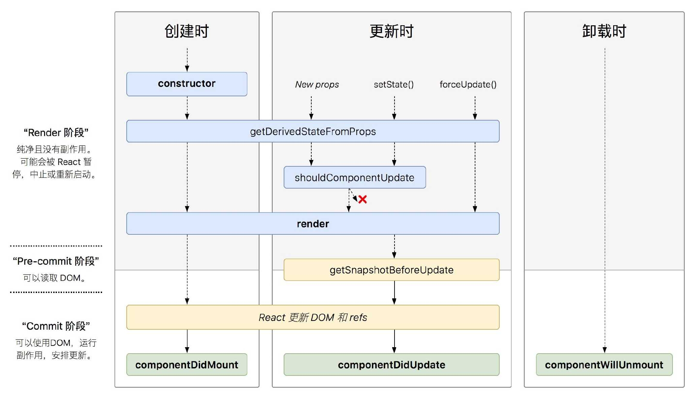

# React 學習筆記

## 簡介

* 純粹的 View 函式庫，沒有其他的功能，由 Facebook 出品
* 特性
    * 將 CSS, HTML 的內容全移至 JS 裡，讓 HTML 變得很單純
    * Immediate-mode GUI
    * JSX

開發 React 的時候，很容易會忍不住將 View 拆成一個個 Component，而個別的的 Component 也會有衝動繼續拆成一個個 Component。在React的世界中，我們要做的事情只要將畫面切割成各種元件，將元件獨立完成後再組裝。

* 拆成多個 Component 後……
    * Component 本身很單純，容易除錯
    * 各別的 Component 容易複用
    * 容易了解應用程式的結構 (理論上大概吧？但……)
* 也因為很容易重用……
    * 所以有一大堆現成的第三方 components 可以直接使用
        * material-ui

## 概念

### Retained-mode GUI v.s. Immediate-mode GUI

* Retained mode GUI
    * 一般的 GUI 都是 retained mode，畫面上的 GUI 也會保存資料和狀態
    * 在元件數量越多時，互動的成本就會越高
* Immediate-mode GUI 
    * 將資料和 GUI 獨立開來
    * 在元件數量越多寡，不影響互動的成本
    * 此做法意味著任何小變動都得重新 render 整個畫面，會有效能問題

React 會先將元件都 render 成 virtual DOM，它會自己找出有變動的部份，然後只重繪這些變動。既享有 immediate-mode 的好處，也不用擔心 UI 效能問題 (至少是減少對於效能的影響)

## JSX

* Facebook
* A JavaScript syntax extension that looks similar to XML
* 就是為了偷懶，以上。
* 一些小細節
    * 內建 tag 小寫，自定義 component 大寫
        ```jsx
        <div>
            <HelloWorld />
        </div>
        ```
    * Built-in keyword 會改名 (如：class  是 JS 的 keyword，所以改為 className)
        ```jsx
        <div className="haha"></div>
        ```
* JSX 不能直接上，Browser 看嘸！
    * 需要 tool 將 JSX 轉為普通的 JS
    * 聽到「轉為普通的 JS」，就會想到 Babel !!

## 生命周期

(React 舊的生命周期)


(React 新的生命周期)


React 16.3 新增的生命周期方法

* getDerivedStateFromProps()
* getSnapshotBeforeUpdate()

逐漸廢棄的生命週期方法：

* componentWillMount()
* componentWillReceiveProps()
* componentWillUpdate()

一般將生命週期分成三個階段：

* 創建階段（Mounting）
* 更新階段（Updating）
* 卸載階段（Unmounting）

特殊：

* 錯誤處理（Error Handling）

### 創建階段 Mounting

組件實例創建並插入 DOM 時，按順序調用以下方法：

* constructor()
* static getDerivedStateFromProps()
* componentWillMount()/UNSAFE_componentWillMount()
* render()
* componentDidMount()

#### constructor()

* 常用於初始化 state，給事件處理函數綁定 this
* ES6 子類的構造函數必須執行一次 super()。React 如果構造函數中要使用 this.props，必須先執行 super(props)

#### static getDerivedStateFromProps()

* 當創建時、接收新的 props 時、setState 時、forceUpdate 時會執行這個方法
* 父組件傳入新的 props 時，用來和當前的 state 對比，判斷是否需要更新 state。以前一般使用 componentWillReceiveProps 做這個操作

這個方法在建議盡量少用，只在必要的場景中使用，一般使用場景如下：

* 無條件的根據 props 更新 state
* 當 props 和 state 的不匹配情況更新 state

```jsx
class ExampleComponent extends React.Component {
  // Initialize state in constructor,
  // Or with a property initializer.
  state = {
    isScrollingDown: false,
    lastRow: null,
  };

  static getDerivedStateFromProps(props, state) {
    if (props.currentRow !== state.lastRow) {
      return {
        isScrollingDown: props.currentRow > state.lastRow,
        lastRow: props.currentRow,
      };
    }

    // Return null to indicate no change to state.
    return null;
  }
}
```

#### componentWillMount()/UNSAFE_componentWillMount()

* 這個要被淘汰了
* 如果有定義getDerivedStateFromProps 就會忽略這個函式

這個方法已經不推薦使用。因為在未來異步渲染機制下，該方法可能會多次調用。它所行使的功能也可以由 componentDidMount() 和 constructor() 代替：

* 之前有些人會把異步請求放在這個生命週期，其實大部分情況下都推薦把異步數據請求放在 componentDidMount() 中。
* 在服務端渲染時，通常使用 componentWillMount() 獲取必要的同步數據，但是可以使用 constructor() 代替它。

可以使用 setState，不會觸發 re-render

#### render()

每個類組件中，render() 唯一必須的方法。

render() 正如其名，作為渲染用，可以返回下面幾種類型：

* React 元素（React elements）
* 數組（Arrays）
* 片段（fragments）
* 插槽（Portals）
* 字符串或數字（String and numbers）
* 布爾值或 null（Booleans or null）

裡面不應該包含副作用，應該作為純函數。

#### componentDidMount()

組件完成裝載（已經插入 DOM 樹）時，觸發該方法。這個階段已經獲取到真實的 DOM。

一般用於下面的場景：

* 異步請求 ajax
* 添加事件綁定（注意在 componentWillUnmount 中取消，以免造成內存洩漏）

可以使用 setState，觸發re-render，影響性能。

### 更新階段 Updating

按順序調用以下方法：

* componentWillReceiveProps()/UNSAFE_componentWillReceiveProps()（being deprecated）
* static getDerivedStateFromProps()
* shouldComponentUpdate()
* componentWillUpdate()/UNSAFE_componentWillUpdate()（being deprecated）
* render()
* getSnapshotBeforeUpdate()
* componentDidUpdate()

#### componentWillReceiveProps()/UNSAFE_componentWillReceiveProps()（being deprecated）

這個方法在接收新的 props 時調用，需要注意的是，如果父組件導致組件重新渲染，即使 props 沒有更改，也會調用此方法。

一般用這個方法來判斷 props 的前後變化來更新 state，如下面的例子：

```jsx
class ExampleComponent extends React.Component {
  state = {
    isScrollingDown: false,
  };

  componentWillReceiveProps(nextProps) {
    if (this.props.currentRow !== nextProps.currentRow) {
      this.setState({
        isScrollingDown:
          nextProps.currentRow > this.props.currentRow,
      });
    }
  }
}
```

這個方法將被棄用，推薦使用 getDerivedStateFromProps 代替。

可以使用 setState

#### static getDerivedStateFromProps()

同 Mounting 時所述一致。

#### shouldComponentUpdate()

在接收新的 props 或新的 state 時，在渲染前會觸發該方法。

該方法通過返回 true 或者 false 來確定是否需要觸發新的渲染。返回 false， 則不會觸發後續的 UNSAFE_componentWillUpdate()、render() 和 componentDidUpdate()（但是 state 變化還是可能引起子組件重新渲染）。

所以通常通過這個方法對 props 和 state 做比較，從而避免一些不必要的渲染。

PureComponent 的原理就是對 props 和 state 進行淺對比（shallow comparison），來判斷是否觸發渲染。

#### componentWillUpdate()/UNSAFE_componentWillUpdate()

當接收到新的 props 或 state 時，在渲染前執行該方法。

在以後異步渲染時，可能會出現某些組件暫緩更新，導致 componentWillUpdate 和 componentDidUpdate 之間的時間變長，這個過程中可能發生一些變化，比如用戶行為導致 DOM 發生了新的變化，這時在 componentWillUpdate 獲取的信息可能就不可靠了。

不能使用 setState

#### render()

同 Mounting 時所述一致。

#### getSnapshotBeforeUpdate()

這個方法在 render() 之後，componentDidUpdate() 之前調用。

兩個參數 prevProps 表示更新前的 props，prevState 表示更新前的 state。

返回值稱為一個快照（snapshot），如果不需要 snapshot，則必須顯示的返回 null —— 因為返回值將作為 componentDidUpdate() 的第三個參數使用。所以這個函數必須要配合 componentDidUpdate() 一起使用。

這個函數的作用是在真實 DOM 更新（componentDidUpdate）前，獲取一些需要的信息（類似快照功能），然後作為參數傳給 componentDidUpdate。例如：在 getSnapShotBeforeUpdate 中獲取滾動位置，然後作為參數傳給 componentDidUpdate，就可以直接在渲染真實的 DOM 時就滾動到需要的位置。

```jsx
class ScrollingList extends React.Component {
  constructor(props) {
    super(props);
    this.listRef = React.createRef();
  }

  getSnapshotBeforeUpdate(prevProps, prevState) {
    // Are we adding new items to the list?
    // Capture the scroll position so we can adjust scroll later.
    if (prevProps.list.length < this.props.list.length) {
      const list = this.listRef.current;
      return list.scrollHeight - list.scrollTop;
    }
    return null;
  }

  componentDidUpdate(prevProps, prevState, snapshot) {
    // If we have a snapshot value, we've just added new items.
    // Adjust scroll so these new items don't push the old ones out of view.
    // (snapshot here is the value returned from getSnapshotBeforeUpdate)
    if (snapshot !== null) {
      const list = this.listRef.current;
      list.scrollTop = list.scrollHeight - snapshot;
    }
  }

  render() {
    return (
      <div ref={this.listRef}>{/* ...contents... */}</div>
    );
  }
}
```

#### componentDidUpdate()

這個方法是在更新完成之後調用，第三個參數 snapshot 就是 getSnapshotBeforeUpdate 的返回值。

正如前面所說，有 getSnapshotBeforeUpdate 時，必須要有 componentDidUpdate。所以這個方法的一個應用場景就是上面看到的例子，配合 getSnapshotBeforeUpdate 使用。

可以使用 setState，會觸發 re-render，所以要注意判斷，避免導致死循環。

### 卸載階段 Unmounting

按順序調用以下方法：

* componentWillUnmount()

#### componentWillUnmount

在組件卸載或者銷毀前調用。這個方法主要用來做一些清理工作，例如：

* 取消定時器
* 取消事件綁定
* 取消網絡請求

不能使用 setState

### 錯誤處理 Error Handling

按順序調用以下方法：

* componentDidCatch()

#### componentDidCatch

任何子組件在渲染期間，生命週期方法中或者構造函數 constructor 發生錯誤時調用。

錯誤邊界不會捕獲下面的錯誤：

* 事件處理 (Event handlers) （因為事件處理不發生在 React 渲染時，報錯不影響渲染）
* 異步代碼 (Asynchronous code) (e.g. setTimeout or requestAnimationFrame callbacks)
* 服務端渲染 (Server side rendering)
* 錯誤邊界本身(而不是子組件)拋出的錯誤

## 開發技巧

### 最好一個副作用一個 effect

在執行副作用（side effect）時，很多 React 開發者會試圖在單次 useEffect 調用中執行多個副作用。

```jsx
export default function App() {
  const [posts, setPosts] = React.useState([]);
  const [comments, setComments] = React.useState([]);

  React.useEffect(() => {
    // 獲取帖子數據
    fetch("https://jsonplaceholder.typicode.com/posts")
      .then((res) => res.json())
      .then((data) => setPosts(data));

    // 獲取評論數據
    fetch("https://jsonplaceholder.typicode.com/comments")
      .then((res) => res.json())
      .then((data) => setComments(data));
  }, []);

  return (
    <div>
      <PostsList posts={posts} />
      <CommentsList comments={comments} />
    </div>
  );
}
```

與其把所有副作用都擠在一個 effect hook 裡，不如通過多次調用把它們放在獨立的 hook 裡。這種做法允許我們把不同的操作分離到不同的 effect 中，更好地做到關注點分離。比起類組件中的生命週期函數，React hooks 的一個主要優勢就是更好地關注點分離。

類組件中每個生命週期函數只能調用一次，所以無法將副作用分離到多個函數裡。例如，只能把組件掛載後要執行的所有操作都包含在一個 `componentDidMount` 函數裡。

React hooks 的主要優勢就是能夠讓我們根據功能來組織代碼。我們不僅能夠將組件渲染之後要執行的操作分離到多個 effect，還可以移動 state 相關代碼的位置。

```jsx
export default function App() {
  // 獲取帖子數據
  const [posts, setPosts] = React.useState([]);
  React.useEffect(() => {
    fetch("https://jsonplaceholder.typicode.com/posts")
      .then((res) => res.json())
      .then((data) => setPosts(data));
  }, []);

  // 獲取評論數據
  const [comments, setComments] = React.useState([]);
  React.useEffect(() => {
    fetch("https://jsonplaceholder.typicode.com/comments")
      .then((res) => res.json())
      .then((data) => setComments(data));
  }, []);

  return (
    <div>
      <PostsList posts={posts} />
      <CommentsList comments={comments} />
    </div>
  );
}
```

這意味著我們可以把 state 和其相關的 effect 放在一起，使得代碼結構清晰、功能一目瞭然。

## 內部實作

### React 工作流

React 是聲明式 UI 庫，負責將 State 轉換為頁面結構（虛擬 DOM 結構）後，再轉換成真實 DOM 結構，交給瀏覽器渲染。

當 State 發生改變時，React 會先進行調和（Reconciliation）階段，調和階段結束後立刻進入提交（Commit）階段，提交階段結束後，新 State 對應的頁面才被展示出來。

React 的調和階段需要做兩件事。

1. **計算出目標 State 對應的虛擬 DOM 結構。**
2. **尋找「將虛擬 DOM 結構修改為目標虛擬 DOM 結構」的最優更新方案。**

 React 按照深度優先遍歷虛擬 DOM 樹的方式，在一個虛擬 DOM 上完成兩件事的計算後，再計算下一個虛擬 DOM。

第一件事主要是調用類組件的 render 方法或函數組件自身。

第二件事為 React 內部實現的 Diff 算法，Diff 算法會記錄虛擬 DOM 的更新方式（如：Update、Mount、Unmount），為提交階段做准備。

React 的提交階段也需要做兩件事。

1. **將調和階段記錄的更新方案應用到 DOM 中。**
2. **調用暴露給開發者的鉤子方法，如：componentDidUpdate、useLayoutEffect 等。**

 提交階段中這兩件事的執行時機與調和階段不同，在提交階段 React 會先執行 1，等 1 完成後再執行 2。

因此在子組件的 componentDidMount 方法中，可以執行  `document.querySelector('.parentClass')` ，拿到父組件渲染的 `.parentClass` DOM 節點，盡管這時候父組件的 componentDidMount 方法還沒有被執行。useLayoutEffect 的執行時機與 componentDidMount 相同。


## Next.js

* Image
    * [像前端专家一样设计 Image 组件](https://mp.weixin.qq.com/s/zuU3NLmrl2GwqxiSZApEMQ?utm_source=pocket_mylist)

## 參考文章

* [React 性能优化 ：包括原理、技巧、Demo、工具使用](https://mp.weixin.qq.com/s/jaWzs2GpPjN6Et6rapMUzA)
* [你可能不知道的五个关键的 React 知识点](https://mp.weixin.qq.com/s/Brp0TECsGpdBdv1686TPiQ)
* [重新认识 React 生命周期](https://blog.hhking.cn/2018/09/18/react-lifecycle-change/)