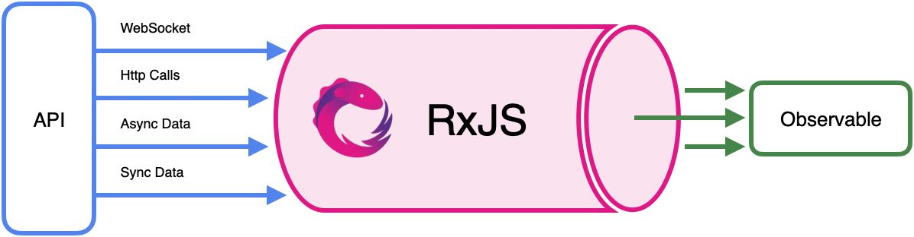

# RxJS 學習筆記

RxJS 是 ReactiveX 項目的 JavaScript 實現，而 ReactiveX 最早是 LINQ 的一個擴展，由微軟的架構師 Erik Meijer 領導的團隊開發。該項目目標是提供一致的編程接口，幫助開發者更方便的處理異步數據流。

好處：

* 統一不同數據源的能力：
    * RxJS 可以將 websocket、http 請求、甚至用戶操作、頁面點擊等轉換為統一的 Observable 對象。
* 統一不同類型數據的能力：
    * RxJS 將異步數據和同步數據統一為 Observable 對象。
* 豐富的數據加工能力：
    * RxJS 提供了豐富的 Operator 操作符，可以對 Observable 在訂閱前進行預先加工。



## RxJS 的一些用法

### 取值

```js
import { forkJoin, map, mergeMap, Observable } from "rxjs";
import { fromFetch } from "rxjs/fetch";

export function getMemoryFree(): Observable<number> {
  return fromFetch("/api/v1/memory/free").pipe(mergeMap((res) => res.json()));
}

function MemoryFree() {
  const [free, setFree] = useState<number>(0);
  useEffect(() => {
    (async () => {
      const result = await lastValueFrom(getMemoryFree());
      setFree(result);
    })();
  }, []);
  return <div>Free: {free} GB</div>;
}
```

### 整合多個值

```js
export function getMemoryLegacy(): Observable<{ free: number; usage: number }> {
  const legacyUsage = fromFetch("/api/v2/memory/usage").pipe(
    mergeMap((res) => res.json())
  );
  const legacyFree = fromFetch("/api/v2/memory/free").pipe(
    mergeMap((res) => res.json())
  );
  return forkJoin([legacyUsage, legacyFree], (usage, free) => ({
    free: free.data.free,
    usage: usage.data.usage,
  }));
}
```

### 選一個值

```js
export function getMemory(): Observable<{ free: number; usage: number }> {
  const current = fromFetch("/api/v3/memory").pipe(
    mergeMap((res) => res.json()),
    map((data) => data.data)
  );
  return race(getMemoryLegacy(), current);
}
```

## 參考文章

* [基於 RxJS 構建穩健前端應用（講稿）](https://zhuanlan.zhihu.com/p/451099107)