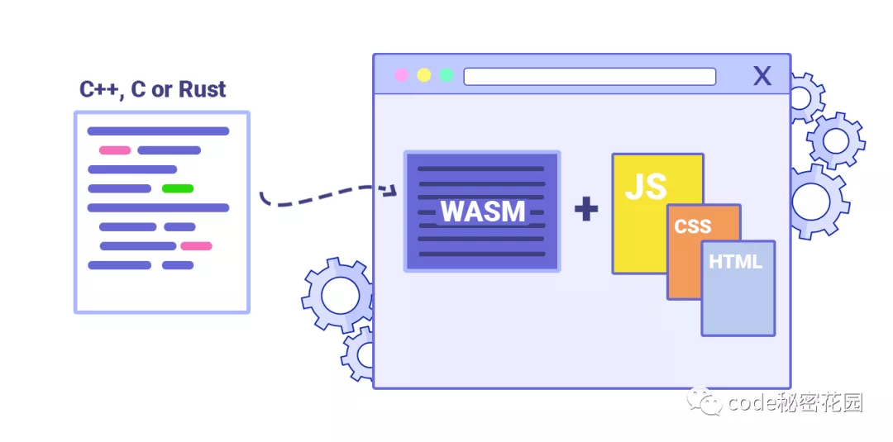

# WebAssembly 學習筆記

WebAssembly 是一種二進制指令格式，簡稱為 Wasm，它可以運行在適用於堆棧的虛擬機上。

WebAssembly 存在的意義就是成為編程語言的可移植編譯目標，讓在 Web 上部署客戶端和服務端應用成為可能。

Wasm 具有緊湊的二進制格式，可為我們提供近乎原生的網絡性能。隨著它變得越來越流行，許多語言都編寫了編譯成 Web 程序集的綁定工具。

## 參考文章

* [使用 Rust 編寫更快的 React 組件](https://mp.weixin.qq.com/s/Lr8H_9wzVS6EAdI30YS9rQ)
