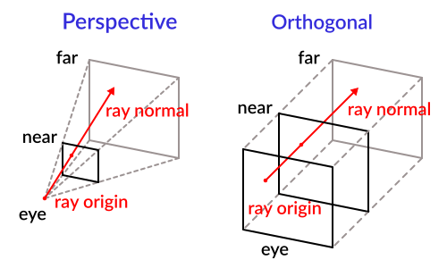
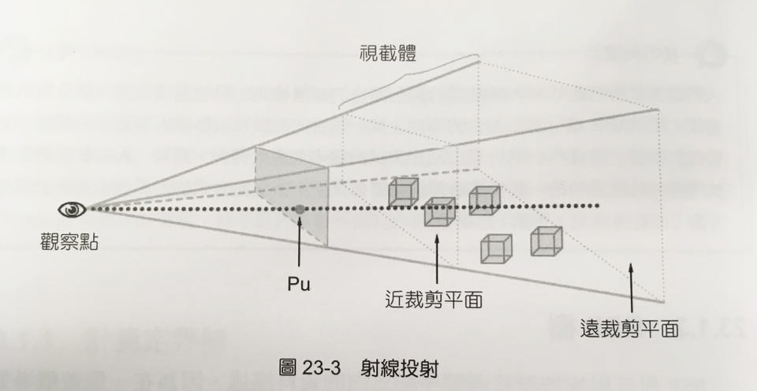
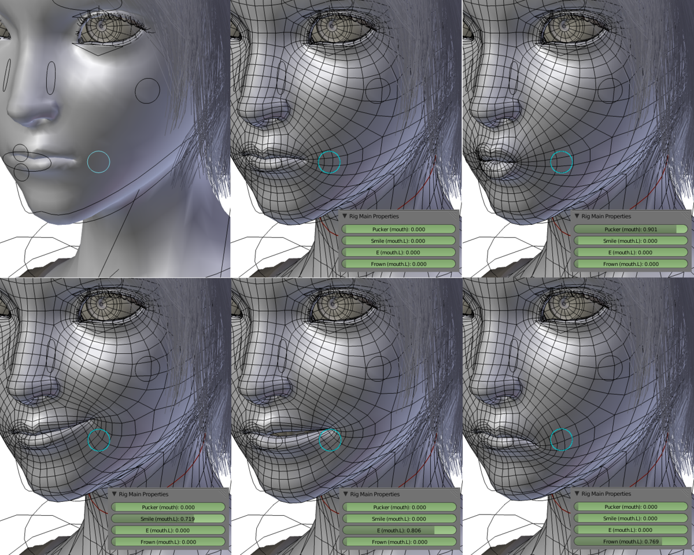

# three.js 學習筆記

* 官網：https://threejs.org/
* GitHub：https://github.com/mrdoob/three.js/

## 基本流程

使用場景放置物件，把物件增加到場景之後，需要為場景提供一個相機（觀察點），然後使用繪製器繪製，基本流程為：

* 建立場景
* 建立相機
* 建立模型、材質並放置到場景
* 建立繪製器
* 重新繪製

## 使用繪製器

Three.js 提供兩種繪製器：

* WebGLRenderer 繪製器
    * 使用 WebGLRenderingContext2D 實現 GPU 加速的 3D 和 2D 繪圖。
* CanvasRenderer 繪製器
    * 使用 CanvasRenderingContext2D 實現 2D 繪圖。
    * 在某些特定情況下，CanvasRenderer 繪製器也可以使用 2D 環境模擬出來 3D 效果，但並非所有 3D 功能都能模擬，特別是有關材質和光源的情況下是不能模擬的
    * 如果瀏覽器不支援 WebGLRenderingContext，而要實現的 3D 影像剛好又不需要材質和光源，此時就可以使用 CanvasRenderer 繪製器

```js
//如果支援 WebGLRenderingContext 就使用 WebGLRenderer 繪製器
if(window.WebGLRenderingContext){
    renderer = new THREE.WebGLRenderer();
} else {
    renderer = new THREE.CanvasRenderer();
}
```

## 使用場景

場景可以放置模型、光源和相機，然後繪製器根據這些進行繪製，相機在建立後自動增加到場景中，但模型和光源必須使用 add() 方法增加：

```js
//將曲面增加到場景中
scene.add(mesh);
 
//建立一個點光源增加到場景中
var light = new THREE.PointLight(0xff0000, 1, 100);
light.position.set(50, 50, 50);
scene.add(light);
```

任何物件再加入到場景中，都會加入到 Scene 的 children 屬性陣列，可用來檢查所有物件：

```js
//檢查場景中的所有物件
for(var i = 0, l = scene.children.length; i < l; i++){

}
```

## 使用相機

相機就是觀察點，有兩種類型，都繼承自 Camera 類別：

* 透視投影相機（PerspectiveCamera）
    * THREE.PerspectiveCamera(fov, aspect, ear, far);
    * PerspectiveCamera 參數都可以省略，因為都有預設值
* 正交投影相機（OrthographicCamera）
    * THREE.OrthographicCamera(left, right, top, bottom, near, far);
    * OrthographicCamera 只有後兩個參數可以省略



如果想要增加觀察矩陣，可使用 Camera 繼承的 lookAt() 方法：
Camera.lookAt(vector)

```js
//建立相機
camera = new THREE.PerspectiveCamera(55, 640/480, 1, 10000);
camera.position.z = 1000;

//改變相機的朝向，這裡設定倒置相機
camera.up.y = -1;

//看向右上方
camera.lookAt(new THREE.Vector3(320, 240, 0));
```

## 繪製為曲面線框

只需改變材質就可以非常方便繪製一個曲面線框：

```js
// 使用顏色建立一個材質
material = new THREE.MeshBasicMaterial({
    color: 0xff0000,  // 曲面線框的顏色
    wireframe: true, // 指定繪製為曲面線框
});
```

## 曲面建構–幾何形體

曲面就是 3D 空間中的物體，包含模型以及其上的材質，Three.js 是用 Mesh 類別來表示這個物體，Mesh 類別只有兩個屬性，表示幾何形體的 geometry 物件和材質 material 物件，Mesh 物件的這兩個屬性相互緊密連結：

```js
THREE.Mesh = function(geometry, material){

}
```

geometry 中 vertices 屬性決定頂點的清單，faces 屬性決定面的組成，faceVertexUv 屬性決定紋理座標，faces 屬性是一組 face 物件，每個 face 物件的 materialIndex 屬性用比對 material 物件。

## Object3D 和基本類型

Three.js 中 3D 物件都繼承於 Object3D，包含相機、幾何模型等，他定義了一些基本屬性和方法可被其他物體繼承：

```js
//最常用的三個屬性
Object3D.position  //座標，包含 x、y、z 屬性
Object3D.rotation  //旋轉，包含 x、y、z 屬性
Object3D.scale     //縮放，包含 x、y、z 屬性

//表示向量和座標，下面定義一個法向量
var normal = new THREE.Vector3(0, 1, 0);

//表示顏色
var color = new THREE.Color(0xff0000);
var color = new THREE.Color("rgb(255,0,0)");
 
var color = new THREE.Color();  //空建構元
color.r = 1.0;                  //r、g、b 屬性設定各分量，值都是 0~1 之間的數字
color.g = 0;
color.b = 0;
color.setSHL(h,s,l);    //使用 HSL 設定顏色
color.getHSL();         //使用 HSL 值，傳回值是一個包含 h、s、l 的 Object
```

表示一個三角形面，用頂點索引來建構三角形面：

```js
var face = new THREE.Face3(
    0, 1, 2, // 三角形頂點的索引

    [  // vertexNormals 這個面的法線（必須是三個頂點的法線組成的陣列，每個法線是一個 THREE.Vector3 類型）
        new THREE.Vector3(0, 1, 0),
        new THREE.Vector3(0, 1, 0),
        new THREE.Vector3(0, 1, 0)
    ],

    [  // vertexColors 這個面的顏色（必須是三個頂點的顏色組成的陣列，每個顏色是一個 THREE.Color 類型）
        new THREE.Color(0xff0000),
        new THREE.Color(0xff0000),
        new THREE.Color(0xff0000)
    ],
    0 // materialIndex 是這個面的材質索引
);
```

## 自訂幾何模型的建構

使用 Geometry 類別表示幾何模型，在幾何模型上包含頂點座標、頂點索引陣列（也就是面的組成）、紋理座標。vertices 屬性決定頂點的清單，faces 屬性決定面的組成，faceVertexUv 屬性決定紋理座標。

如果想使用頂點顏色作為紋理，就可以使用每個 face 的 VertexColors 屬性，該屬性是一個 THREE.Color 類型，指定面上每個頂點的顏色。

## 使用 BufferGeometry

若想使用原生 API 的 GPU 快取方式來撰寫程式，就可以使用 BufferGeometry，這個類別將頂點、索引、顏色或紋理座標、法線資料封裝在一起，可以充分利用 GPU 快取中，實現大幅的加速功能。

但也是它的缺陷，因為快取計算比較複雜，因此如果更改這些快取中的資料就會花費更多計算，因此這類別主要用在靜態物件。

## 資料更新

雖然 JavaScript Object 類型是一種參考類型，但不表示更改了屬性就一定會導致物件更新！

舉例來說，一個 Geometry 物件的頂點屬性 vertices 發生改變，並不會更新 Mesh，因為 Three.js 將 Mesh 的資訊快取為某種最佳化的結構，如果要讓 Mesh 物件更新，必須通知 Three.js 重新計算快取中的結構：

```js
//設定 Geometry 為動態，這樣才允許改變其中的頂點
geometry.dynamic = true;

//告訴 Three.js 需要更新頂點
geometry.verticesNeedUpdate = true;

//告訴 Three.js 需要重新計算法線
geometry.normalsNeedUpdate = true;
```

原書作者認為 verticesNeedUpdate 和 normalsNeedUpdate 兩個屬性是最有用的，然後應該僅僅標示那些確實需要計時計算的屬性，避免無謂的運算負擔，其他可以使用的標示更新的屬性：

* dynamic
    * 設定快取中的資料可以動態更新，該屬性預設設定為 true，如果不設定為該屬性為 true，Geometry 資料被上傳給 GPU 快取後就會被刪除
* verticesNeedUpdate
    * 設定 true 表示需要更新頂點
* elementsNeedUpdate
    * 設定 true 表示需要更新頂點索引
* uvsNeedUpdate
    * 設定 true 表示需要更新頂點紋理座標
* normalsNeedUpdate
    * 設定 true 表示需要更新頂點法線
* tangentsNeedUpdate
    * 設定 true 表示需要更新頂點切線
* colorsNeedUpdate
    * 設定 true 表示需要更新頂點顏色紋理
* lineDistancesNeedUpdate
    * 設定 true 表示需要更新線之間的距離陣列
* buffersNeedUpdate
    * 設定 true 表示需要更新快取的長度，因為陣列長度改變了

## 內建幾何模型

Three.js 提供了基本的幾何模型，這些幾何模型已經計算了法線，甚至紋理座標都已經提供：

* PlaneGeometry、PlaneBufferGeometry
    * 平面
* ShapeGeometry、ShapeBufferGeometry
    * 單面多邊形
* CircleGeometry、CircleBufferGeometry
    * 圓或圓弧
* RingGeometry、RingBufferGeometry
    * 二維環狀
* BoxGeometry、BoxBufferGeometry
    * 立方體
* SphereGeometry、SphereBufferGeometry
    * 球體
* ConeGeometry、ConeBufferGeometry
    * 角錐體
* CylinderGeometry、CylinderBufferGeometry
    * 圓柱體
* TetrahedronGeometry、TetrahedronBufferGeometry
    * 正 4 面體
* OctahedronGeometry、OctahedronBufferGeometry
    * 正 8 面體
* DodecahedronGeometry、DodecahedronBufferGeometry
    * 正 12 面體
* IcosahedronGeometry、IcosahedronBufferGeometry
    * 正 20 面體
* ExtrudeGeometry、ExtrudeBufferGeometry
    * 根據平面路徑擠壓出一個幾何體
* LatheGeometry、LatheBufferGeometry
    * 切割機床方式根據一個平面削成幾何體
* ParametricGeometry、ParametricBufferGeometry
    * 參數化幾何體
* PolyhedronGeometry、PolyhedronBufferGeometry
    * 根據頂點建立幾何形狀，但比 Geometry 有些增強
* TextGeometry、TextBufferGeometry
    * 文字體
    * 可使用 Helvetiker 字型或使用其他英文字體（需轉換 json 格式）
* TorusGeometry、TorusBufferGeometry
    * 環狀曲面體
* TorusKnotGeometry、TorusKnotBufferGeometry
    * 環狀結體
* TubeGeometry、TubeBufferGeometry
    * 管狀體
* EdgesGeometry
    * 邊緣體
* WireframeGeometry
    * 線框體

## 曲面建構–材質和紋理

Three.js 提供內建材質，就不需自己寫著色器，若想親自撰寫，可使用 MeshShaderMaterial。

創建材質時，除了顏色還有其他參數可以指定，例如光滑度和環境貼圖。每個材質的建構方法只有一個參數，該參數是一個 Object 類型，其屬性指定了材質的特性，這些屬性也對應材質對象的屬性。

Material 是所有其他類型的材質對象的基礎類別，該類別建構方法沒有參數，但定義了很多屬性，每個屬性都有預設值，供子類別繼承。

內建曲面材質

* Material
    * 所有其他類型的材質對象的基礎類別，是一種抽象類別，不能直接使用
* LineBasicMaterial
    * 繪製線段的基本材質
* LineDashMaterial
    * 線段繪製成虛線的材質
* MeshBasicMaterial
    * 基本曲面材質，是一種與光源無關的材質，在沒有光源的情況下，材質依然能夠顯示出來
* MeshDepthMaterial
    * 用來繪製深度，顏色會隨深度變化而變化，通常應該同時隨著時間改變透明度
* MeshFaceMaterial
    * 為曲面的每個面單獨指定材質，改用 Array 指定
* MeshLambertMaterial
    * 蘭伯特面材質
* MeshNormalMaterial
    * 基本材質，基於法線為曲面繪製顏色，通常用來測試
* MeshPhongMaterial
    * 馮氏反射面材質
* MeshStandardMaterial
    * 基本亮點反射面材質
* MeshPhysicalMaterial
    * 物理光學亮點反射面材質
* MeshToonMaterial
    * 卡通感的反射面材質
* PointsMaterial
    * 粒子系統預設使用的材質
* ShaderMaterial
    * 可以自己撰寫著色器實現光源和反射
* RawShaderMaterial
    * 類似 ShaderMaterial
* ShadowMaterial
    * 可以接收影子的材質，否則他會完全透明
* SpriteMaterial
    * 為 Sprite 提供材質

## 曲面材質

曲面材質決定應用於曲面的紋理和光源特性，以 MeshBasicMaterial 為例，其中包含以下屬性：

* color
    * 十六進位整數，如果設定了 color 屬性，整個材質將全部使用這個種顏色，預設值為 0xffffff，如果指定使用頂點顏色（VertexColor 屬性設定為 true），那麼設定將不會有作用
* map
    * 指定紋理物件，也就是一個 THREE.Texture 物件，預設值為 null
* wireframe
    * 如果設定為 true，那麼整個幾何形狀就顯示為線框（即只顯示邊，不顯示面），預設值為 false
* wireframeLinewidth
    * 當顯示為線框時線條的粗細，預設值為 1
* wireframeLinecap
    * 當顯示為線框時線條端點的形狀，也就是線蓋，合法值為 butt、round、square，預設值為 round
* wireframeLinejoin
    * 指定兩個線條如何結合，合法的值是 round、bevel、miter，分別表示尖角、圓角或斜角，預設值為 round
* shading
    * 定義著色類型，預設值為 THREE.SmoothShading
* vertexColors
    * 定義是否使用頂點顏色，預設值為 false（常數 THREE.NoColors）
* fog
    * 定義該材質的顏色是否會被全域的 fog 設定影響，預設值為 true
* lightMap
    * 定義光源影射，預設值為 null
* specularMap
    * 定義鏡面影射，預設值為 null
* envMap
    * 定義環境影射，預設值為 null
* skinning
    * 預設值為 false
* morphTargets
    * 定義是否使用頂點變形動畫，預設值為 false

## 建構線段

有兩種類型的線段材質，分別表示實現和虛線：

* LineBasicMaterial
    * 最基本的用於繪製線段的材質
* LineDashedMaterial
    * 是一種虛線類型的線段材質

## 粒子系統

粒子就是繪製一個一個的點，然後在著色器中使用內建變數 gl_PointSize 改變點的大小，成為一個方塊，然後賦以紋理。當多個粒子組合起來就形成一個粒子系統，粒子系統被視為一個整體的物件，我們仍然可以為每個粒子單獨著色，因為在繪製的過程中，Three.js 透過 attribute 參數 color 向著色器傳遞了每一個頂點的顏色。

在粒子系統第一次被繪製時，Three.js 會將其資料快取下來，之後無法增加或減少系統中的粒子，如果不希望看到某個粒子，可將它的顏色中的 alpha 值設定為 0，但無法刪除它，所以在建立粒子系統時，就將所有可能需要顯示的粒子考慮進來。

## Sprite 和 SpriteMaterial

Sprite 是一個 2D 的幾何像素，主要用於 CanvasRenderer 繪製器，但 WebGLRenderer 繪製器也可繪製，此時 Sprite 被繪製成一個矩形，SpriteMaterial 專門為 Sprite 提供材質。

不同於 Partical 在頂點著色器中改變大小，Sprite 繼承自 Object3D，透過 scale 來改變矩形大小，預設為 1x1。

## 光源

光源模型，從光源本身角度來看包含環境光、平行光、點光源，從物體比面材質角度看又包含漫反射和鏡面反射，光源應配合 MeshLambertMaterial 和 MeshPhongMaterial 使用。

Three.js 提供了常見的幾種光源，因此無需撰寫著色器就可直接使用這些光源類型為模型打光，內建光源類型：

* Light
    * 所有其他類型的光的基礎類別，這是一個抽象類別，不能直接使用
* AmbientLight
    * 環境光，沒有方向
* RectAreaLight
    * 區域光，是二維矩形光源，俗稱面燈，有些被實現為橢圓形區域、大部分為一個矩形區域，僅能用 WebGLDederredRender 繪製器，即延遲繪製器，所謂延遲繪製器就是將場景先繪製為材質，再將材質指定給模型
* DirectionalLight
    * 平行光，僅能用於 MeshLambertMaterial 和 MeshPhongMaterial 材質，預設在點 (0,1,1)，和相機預設方向一致
* HemisphereLight
    * 天頂光，又稱天光，一種模擬日光的模型，太陽會發射平行光線，地面會反射平行光線，進一步組成日光
* PointLight
    * 點光源，僅能用於 MeshLambertMaterial 和 MeshPhongMaterial 材質，預設為原點
* SpotLight
    * 聚光燈，僅能用於 MeshLambertMaterial 和 MeshPhongMaterial 材質＊如果場景沒有光，Three.js 預設會使用滿環境光，物體會呈現其表面的顏色。

## 陰影

要產生陰影有四個步驟：

1. 繪製器設定
    * 陰影需要大量運算，預設為不啟用陰影功能，所以首先繪製器必須啟用陰影功能。
    * renderer.shadowMapEnable = true;
2. 光源設定
    * 只有平行光和聚光燈才可以產生陰影，如果想讓某個光源可以產生陰影，必須設定該光源產生陰影。
    * light.castShadow = true;
3. 物體產生陰影設定
    * 只有物體擋著光才會產生陰影，如果想讓某個物體可以擋著光產生陰影。
    * mesh1.castShadow = true;
4. 物體接收陰影設定
    * 如果想讓某個物體表面產生陰影，必須設定物體接收陰影。
    * mesh2.receiveShadow = true;

## 繪製器設定屬性

* shadowMap.enabled
    * 是否允許使用陰影，預設值為 false
* shadowMap.autoUpdate
    * 是否自動更新陰影，預設值為 true
* shadowMap.type
    * 定義陰影類型，有三個值可選：
        * THREE.BasicShadowMap
            * 表示基本陰影，不進行過濾處理
        * THREE.PCFShadowMap
            * 表示使用 PCF（Percentage Closer Filtering）對陰影紋理進行多重採樣，使陰影邊緣平順
        * THREE.PCFSoftShadow
            * 表示結合使用 PCF 和雙線行過濾對陰影紋理進行最佳化。預設值為 THREE.PCFShadowMap

## 光源設定屬性

* castShadow
    * 是否讓該光源發出的光產生陰影，預設為 false
* onlyShadow
    * 是否光源發出的光僅僅用來產生陰影，而不會為目前環境貢獻光源效果，預設值為 false，如果僅僅用來產生陰影，那麼運算量較小
* shadow.camera.near
    * 陰影四棱錐透視投影的 near 參數值，預設值為 50
* shadow.camera.far
    * 陰影四棱錐透視投影的 far 參數值，預設值為 5000
* shadow.camera.fov
    * 陰影四棱錐透視投影的 fov 參數值，預設值為 50
* shadow.camera.visible
    * 是否顯示該四棱錐用於偵錯，預設為 false
* shadow.bias
    * 陰影影射的偏斜量，預設為 0
* shadow.mapSize.width
    * 陰影影射紋理的寬度，以像素為單位，預設值為 512
* shadow.mapSize.height
    * 陰影影射紋理的高度，以像素為單位，預設值為 512

## 協助工具

Three.js 提供一些純粹用於協助工具的曲面，這些曲面如果被增加到場景中，非常直觀，可以用於偵錯和提供協助。這些曲面也是有由幾何體和材質組成，因此可以像處理其他曲面一樣改變材質。

幾何體協助工具

* THREE.VertexNormalsHelper
    * 頂點的法線
* THREE.FaceNormalsHelper
    * 現面的法線
* THREE.BoxHelper
    * 能夠包圍幾何體的最小長方體，透過 THREE.LINE 繪製

光源協助工具

* THREE.DirectionalLightHelper
    * 平行光，呈現正方形，並由此發射一條直線表示光線
* THREE.RectAreaLightHelper
    * 區域光，光源呈現一個矩形面
* THREE.HemisphereLightHelper
    * 天頂光，光源呈現一個 8 面體
* THREE.PointLightHelper
    * 點光源，光源呈現一個 8 面體
* THREE.SpotLightHelper
    * 聚光燈，光源呈現一個凌錐體

相機（投影矩陣）協助工具

* THREE.CameraHelper
    * 根據投影設定一個 4 棱體，畫布上會呈現一個十字交換的線條

其他協助工具

* THREE.AxisHelper
    * 建立一個標示座標的三向座標軸，是一個 mesh，當應用各種矩陣的時候也應該同時應用這個 mesh
* THREE.ArrowHelper
    * 建立一個箭頭圖示，也常用於標記法線，是一個 mesh，當應用各種矩陣的時候也應該同時應用這個 mesh
* THREE.GridHelper
    * 建立地面網格，網格是一個正方形

效能監視器 Stats

Three.js 提供一個效能監視器來觀察 3D 繪製的效能，通常用來做：

每秒鐘能夠更新的影格數（Frames Per Second，簡稱 FPS）表示，影格數越高，畫面的感覺就會越好。
繪製一影格需要的毫秒數（MS）來表示，這個數字越小越好，與 FPS 是相反的表示，但描述的功能相同。

## 檢測碰撞與滑鼠拾取

互動操作以及遊戲中都要有關物體之間的碰撞檢測（Collision Detection），所謂碰撞檢測也就是檢測兩個物體是否有交疊。

3D 場景中的物體都是由位於表面的三角形組成，因此檢測兩個物體碰撞實際就是檢測兩個物體是否有三角形交疊，這是一個非常耗費計算的過程，目前的 CPU 運算能力幾乎是不可能完成的，且在中空的情況下，A 包住 B 時也不會檢測出碰撞，相比之下，2D 碰撞檢測要容易得多，不管採用像素判斷或物體面積與距離判斷都可行。

當時間間隔較大時，會出現兩個物體已經穿過而沒有檢測出碰撞的問題，這個問題沒有什麼好的解決辦法，減少檢測的時間間隔，或是減少一次移動的距離，使他始終在檢測的範圍內。

以目前的運算能力，碰撞檢測不可能使用太精確的檢測，對於 3D 碰撞檢測，還沒有幾乎完美的解決方案，目前只能根據需要再運算速度和精確性之間做平衡，目前採用的碰撞檢測方法有兩種：定界體方式和 BSP 樹方式。

### 使用定界體方式檢測碰撞

定界體方式就是採用一個「描述用」的簡單幾何模型包住 3D 物體物件整體（或是主要部份），之後根據描述用套件為體的距離、位置等資訊來計算是否發生碰撞，定界體是不需要繪製出來的，它是無形的，而且僅需要很少的頂點資料就可以描述這個套件圍體。

目前用於定界體的立體模型主要有三種：長方體、圓柱體、球體，通常都是長方體和球體，當然除了以上立體模型以外，其他形狀也可以做定界體，但是相比計算量和方便性來講這兩種形狀方便許多。

#### 球體定界體

假設有兩個物體 A 和 B，每個物體都使用一個球體定界體，他們的半徑分別是 ra 和 rb，那麼使用下面的演算法就可以簡單的檢測他們圓心間的距離是否小於 ra+rb，小於就表示碰撞了：

```js
if(pa.distanceTo(pd) < (ra+rb)){ // distanceTo 計算點 pa 和 pb 間的距離
    /*檢測碰撞*/
}
```

### 長方體定界體

如果物體與球形相差太遠，例如一個木板、一個管子或地面上停放的汽車，球形定界體可能不太適用，這時就可以使用長方體定界體，包圍和按照座標系的座標軸進行排列，也即長方體的所有邊都是平行於一個座標軸的，這被稱為按座標軸排列的定界框（Axis-Aligned Bounding Boxes，簡稱 AABB），這個定界框透過兩個點（左下角、右上角）就能確定，方法就是透過檢查所有頂點，找到 x、y、z 直最小和最大的即可。

假設有兩個物體 A 和 B，每個物體都使用一個長方體定界體，確定這個套件為體就是 Amax、Amin、Bmax、Bmin 這 4 個點：

```js
if(Amax.x < Bmax.x && Amax.x > Bmin.x && 
    Amax.y < Bmax.y && Amax.y > Bmin.y && 
    Amax.z < Bmax.z && Amax.z > Bmin.z ||
    Amin.x < Bmax.x && Amin.x > Bmin.x &&
    Amin.y < Bmax.y && Amin.y > Bmin.y &&
    Amin.z < Bmax.z && Amin.z > Bmin.z){
    
    /*檢測碰撞*/
}
```

也就是 Amax 和 Amin 任意一個點在 B 之內就可以認為是碰撞了！

AABB 檢驗物體的相交非常簡單，但是它的缺點就是當模型旋轉時無法隨之旋轉，而必須重新進行計算，還有一種定向包圍盒（Oriented Bounding Box，簡稱 OBB），不與座標垂直，而是隨著物體旋轉，OBB 本質上還是一個最接近物體的長方體，只不過該長方體可以根據物體進行任意旋轉，OBB 比包圍球和 AABB 更加逼近物體，但 Three.js 未提供該實現，這裡不再多作解釋。

### 計算定界體

Three.js 提供了長方體定界體和球體定界體兩種計算方式，每個物體，包含 BufferGeometry 和 Geometry 都可以定義 boundingBox 屬性和 boundingSphere 屬性，這兩個屬性分別用來指定長方體定界體和球體定界體：

```js
    geometry.boundingBox = {
        min: new THREE.Vector3(x,y,z),
        max: new THREE.Vector3(x,y,z)
    };
    geometry.boundingSphere = {
        radius: float,
        center: new THREE.Vector3(x,y,z)
    };
```

AABB 檢驗物體相交非常簡單，但缺點是當模型旋轉時無法隨之旋轉，而且當物體縮放或移動時也必須進行重新計算，不管是 AABB 定界框還是包圍球，Three.js 分別提供了計算方法：

```js
geometry.computeBoundingBox();
geometry.computeBoundingSphere();
```

一個是計算曲面用座標軸定向的邊界框，這會更新 Geometry.boundingBox 屬性；另一個是計算曲面的邊界球體，這會更新 Geometry.boundingShpere 屬性，兩者都並非所有情況下都需要檢測碰撞，所以預設情況下 Geometry.boundingBox 和 Geometry.boundingShpere 屬性 null，計算後才會填充這個屬性。

通常使用包圍球和 AABB 進行兩回合的碰撞檢測，用包圍球做第一回合的快速測試，用 AABB 進行第二回合的測試。第一回合的測試可以移除大多數不可見或不必剪裁的物體，這樣不必進行第二回合測是的機率就會大得多。同時，AABB 定界框測試所得的結果更精確，最後要繪製的物體會更少，這種混合式的定界框也適用於其他方面，如碰撞檢測、實體 / 力學等。

### BSP 樹

BSP 樹是用來控制檢測順序和方向的資料描述。因為在一個遊戲場景中可能存在很多物體，他們之間大多屬於較遠位置或相對無關的狀態，一個物體的碰撞運算沒必要檢查這些物體，同時節省重要的時間。

#### 使用射線投射方式檢測碰撞

射線投射（Ray-Casting）基本的概念就是場景中觀察點會射出光線（rays），光線自觀察點射出去，在場景中飛行，直到碰到幾何體，一旦每條光線跟場景幾何體的交錯確定了。射線和三角形的相交檢測是遊戲程式設計中的一個常見問題，最典型的應用就是拾取（Picking）。

#### 射線投射原理

在互動操作中，一個基本操作就是使用滑鼠來選擇 3D 物體，但滑鼠操作的是一個 2D 可視區域，因此滑鼠操作的基本概念就是透過 2D 螢幕上的滑鼠指標點來選擇 3D 物體，這個過程被稱為拾取（Picking），使用射線投射方式可以輕鬆地實現拾取操作。

射線投射方式就是假設從觀察點射出一條光線，穿過滑鼠指標在 Canvas 上的點指向 3D 空間，透過這條線與 3D 空間中的所有物體做比對，如果這條線與物體相交，那麼就證明該物體在滑鼠指標的位置，可以被選取。

射線（ray）從觀察點出來，經過滑鼠指標位置 P0，指向 3D 空間，如果射線與 3D 物體有焦點就可以認為物體被選取，但是射線會過物體繼續與後面的物體有交點，這時會進行深度測試，最前的物體被選取。



觀察點的位置一般是已知的，現在我們需要知道射線的方向，只要知道了射線的方向就可以計算出射線與物體是否有交點。

這個設限必須透過滑鼠指標的位置，滑鼠指標位置 P0 是2D 世界中的點，要進行 3D 空間運算就必須做一下轉換，將 P0 轉換成 3D 空間的點，一般來說可以這樣做：

* 3D 空間 x 座標 = (滑鼠指標在畫布上的 x 座標 / 畫布寬度)*2 - 1.0
* 3D 空間 y 座標 = -(滑鼠指標在畫布上的 y 座標 / 畫布高度)*2 + 1.0

假設螢幕上存在兩個點：螢幕中心頂上方一個點 A(0,1,z)，中心點 B(0,0,z)。這兩個點與觀察點（座標原點）形成兩個向量 AO 和 OB，這兩個向量的夾角是 fovy/2，就是求得這個點在 3D 空間的 z 座標：

    3D 空間 x 座標 = (滑鼠指標在畫布上的 x 座標 / 畫布寬度)*2 - 1.0 3D 空間 y 座標 = -(滑鼠指標在畫布上的 y 座標 / 畫布高度)*2 + 1.0

由這個等式，我們就可以求出 z 值，首先計算 AO 和 OB：

    AO = (0,1,z) - (0,0,0) = (0,1,z)
    OB = (0,0,0) - (0,0,z) = (0,0,-z)
    AO*OB = 1 - z*z
    |AO| = 1+ z*z
    |OB| = z*z

    由此推出：
    1 - z*z = (1 + z*z)*z*z*cos(fovy/2)

解這個二次方程式，可獲得（捨去其中一個不符合規範的負值解）：

    var cos = Math.cos(fovy/2 * Math.PI/180);
    z = Math.sqrt(Math.sqrt(1/cos + (1/cos + 1)*(1/cos + 1)/4 - (1/cos + 1)/2));

現在用變數 fovy 代入就可以求得 z 值。

既然已經獲得了滑鼠在 3D 空間的座標，那麼就可以進行計算，首先我們使用座標建構一個向量：

```js
var vector = new THREE.Vector3(mouse.x, mouse.y, mouse.z);
```

由於這個座標是經過投影轉換後的座標，因此應該逆轉換，Three.js 提供 Projector 類別表示 3D 空間的投影，使用該類別的 unprojectVector() 可以使用目前相機的投影逆轉換座標：

```js
var projector = new THREE.Projector();
projector.unprojectVector(vector, camera);
```

然後，這個座標減觀察點的座標就是射線的方向，最後將射線的方向歸一化：

```js
var dir = vewctor.sub(camera.position).normalize();
```

一旦計算出了這個向量就可以進行射線相交檢測了！

#### 使用 THREE.Raycaster

THREE.Raycaster 封裝了用於射線檢測的功能，我們只需使用即可。

物體碰撞也可使用射線檢測：從一個物體的位置為源點經過該物體的頂點發射一條射線，檢測這條射線是否與另一個物體相交，如果相交，就取得射線與相交點的距離，然後比較這個距離與向量的長度，如果小於向量長度就是兩個物體碰撞了。

Three.js 可以為物件註冊事件監聽，但是必須手動歪派事件，事件物件僅有兩個屬性：type 表示事件類型字串，target 表示事件發生的物件：

```js
//定義球體滑鼠點擊事件
sphereMesh.addEventListener('mousedown', function(evt){
console.log('you click sphere!');
})
```

然後手動委派事件：

```js
//對傳回值的 object 屬性進行檢測，如果是球體，那就證明與球體相交了
if(intersects[0].object === sphereMesh){
    sphereMesh.dispatchEvent({type: 'mousedown'});
}
```

### 使用外掛程式控制場景

Three.js 提供了一些外掛程式可以方便控制場景的投影設定，在畫布上使用滑鼠就可以控制場境變化：

* TrackballControls
    * 軌跡球控制，滑鼠控制相機移動和轉動
* FlyControls
    * 飛行控制，鍵盤和滑鼠控制相機移動和轉動
* RollControls
    * 翻滾控制，飛行控制的簡化版，控制相機 z 軸旋轉
* FirstPersonControls
    * 類似第一人稱視角的相機控制
* OrbitControls
    * 類似軌道種中的衛星，控制滑鼠和鍵盤在場景中遊走
* PathControls
    * 控制相機在預定義的軌道上移動和旋轉
* DeviceOrientationControls
    * 手機陀螺儀控制相機轉動

### 動畫、模型資料使用和載入

WebGL 是用來處理模型的，它不能建模，雖然也可以使用它建立簡單的立方體和球體等幾何體，但要想建立複雜的模型還需要專門的建模工具，例如 3ds Max、Swift 3D、SketchUp 來建立模型，在建模時會在其中繪製頂點、貼圖、建立投影視圖、打光，甚至動畫。

當模型建立之後，要將模型用在 WebGL，就至少需要頂點座標資料、紋理座標資料，甚至還需要法線資料，因此在儲存模型時必須選擇一個正確的檔案格式，才能從檔案中分析這些資訊。

#### 模型檔案格式及其使用

常用的 3D 模型檔案格式有靜態和動態兩種，區別是前者不儲存動畫資料（無論是骨骼動畫還是關鍵頁框動畫），後者可以包含動畫資料。靜態的 3D 模型檔案格式具代表性的就是 .3ds 和 .obj，動態的檔案格式則是 .max 和 .dae。

.3ds 是最通用的 3d 檔案格式，但它僅包含頂點資訊，因此除非不用紋理（單色作為紋理）或紋理座標非常簡單（簡單計算），否則這種格式對 WebGL 沒有太大意義。.max 是 3ds Max 的專用格式，一般用在建模軟體中，目前 WebGL 最常用的 3d 檔案格式是 .obj 和 .dae，載入原理就是分析各種檔案的結構，找到需要的資料，例如頂點座標什麼的，寫入到自己申請的頂點緩衝區裡面，然後送到顯示卡那邊去繪製。

Autodesk FBX、3D Exploration、Deep Exploration 等工具可以方便在各種 3D 檔案格式之間轉換。

#### COLLADA DAE 檔案格式及其使用

COLLADA 是由 Sony 公司提出的基於 XML 的開放的、免費的資料交換標準，現在由 Sony 和 Khronos Group 共同管理，2012 年 COLLADA 被制定為 ISO 標準（ISO/PAS 17506:2012），對應的 COLLADA 版本是 1.5.0。

請參照官網：https://collada.org/

正因 COLLADA 基於 XML 技術，所以這個標準具有十分優秀的移植性，不同平台的即時引擎只要支援這個標準，就可即時表現 3D 模型。COLLADA 預設採用 .dae 作為副檔名，因為實質上就是一個 XML 檔案，所以也可將 *.dae 的副檔名稱改為 *.xml。

.dae 檔案儲存的資訊及其豐富，包含在任意一個 3D 建模軟體中重現場景的幾乎所有資訊，當然也包含我們所需要的頂點資料、紋理座標資料、燈光位置資料、法線資料等，因此一般都推薦使用這個檔案格式。

但需注意檔案非常大，不利於網路傳輸，因此一些使用者不推薦直接使用 .dae 檔案，為了更好的應用該檔案，降低網路傳輸的資料量，在網路設定的時候記得要將 .dae 檔案設定為採用 HTTP 壓縮傳輸。很多時候並不需要 .dae 全部功能，可使用 Torque 3D 進行過濾，請參考：

http://www.garagegames.com/products/torque-3d

當使用 Maya 和 3ds Max 輸出的 .dae 檔案時可能會導致模型無法使用，此時應用 OpenCOLLADA 外掛程式來匯出，請參考：

https://www.khronos.org/collada/wiki/OpenCOLLADA

#### .obj 檔案格式及其使用

.obj 檔案是一種標準的 3D 模型檔案格式，最初是 Wavefront 公司為它的一套基於工作站的 3D 建模和動畫軟體 Advanced Visualizer 開發的一種檔案格式，目前通用性很強，幾乎所有主流建模軟體都支援這種格式。

obj 檔案時會匯出時會同時產生一個名為 .mtl 的檔案，就是 .obj 的材質和貼圖資訊，因為 .obj 檔案中儲存的有紋理資訊，因此可使用單獨的圖片作為紋理。

通常來說，要從 .obj 和 .dae 檔案中取得必要的資訊用於 WebGL，必須比對格式轉換，而 Three.js 已經提供了這兩種檔案格式的解析器，只需拿來使用即可，注意解析器預設使用 MeshLambertMaterial 材質，必須增加一個光源才看到到效果。

如果在建模時已經貼圖，那麼紋理座標已經存在模型中，此時在 WebGL 中重貼圖會導致不可預知的後果，所以建議使用建模時的紋理圖片，並且一個模型僅使用一張紋理圖片，才能確保在 WebGL 中重現。

## 3D 動畫類型及其實現

3D 模型的位置、大小、旋轉、材質發生變化，場景光源、投影發生變化都會在視覺上產生動畫，但這些都沒有改變 3D 模型的頂點，透過改變 3D 模型的頂點資料也可以產生動畫。

一般來說頂點變化沒有規律可循，這種動畫唯一的方法就是按照時間間隔載入不同的頂點後繪製，每一個時間點都是一個關鍵影格。

但是針對特定情況，在非常細分的領域內，人們歸納出一些特定的動畫規律，細分三種動畫類型：變形動畫、關節動畫和骨骼蒙皮動畫。

從動畫資料的角度來說，這三者也有關鍵影格，但僅給出動畫開始和結束兩個關鍵影格資料，中間其他影格的資料使用插值得到，因次這種動畫又被稱為補間動畫（補間就是補足中間）。由於這三種技術的不同，關鍵影格的資料是不一樣的。

### Morph 動畫

Morph 是一種動畫方式，它允許物體透過頂點自動發生變形，在建立頂點的時候，同時為頂點指定一個 MorphTargets 點（變形目標點），當你想變形的時候，實際是將頂點改到這個目標點後繪製。這種動畫方式一般>用於頂點變動較小的情況，例如面部表情以表現細膩的變化。



Three.js 提供對 Morph 動畫的支援，如果一個物體的 geometry 有 n 個頂點，那麼 MorphTargets 允許你再指定 n 個、2n 個、3n 個甚至更多個頂點（假設 p*n 個），同時 mesh 物件提供一個陣列 morphTargetInfluences，具有 p 個元素，每個元素設定值在 0~1 之間，繪製這個物體時，某個頂點 Vi 的位置其實變了，例如：一個立方體有 8 個頂點，使用 MorphTargets 又指定了 8 個頂點，立方體頂點(100, 100, 100)，而在 MorphTargets 中與之對應的頂點為 (200, 200, 200)，那當 morphTargetInfluences[0] 為 0.5 的時候，那麼不但會繪製頂點(100, 100, 100)，而且會繪製中間在變化的時候自動建立的頂點(150, 150, 150)，這樣就可以透過簡單調整 morphTargetsInfluences 陣列來使物體變形。

Morph 動畫不但可以實現頂點變化，還可以實現紋理顏色以及法線的變化（進一步引起材質效果變化），可使用以下 MorphTargets 的三種屬性：

1. 定義變形陣列：
    * {name: "tartgetName", vertices: [new THREE.Vector3(), ...]}
2. Vertices 屬性中元素的數量應該與模型頂點數一致才能實現變形
    * 定義變形點的顏色陣列：
    * {name: "colorName", colors: [new THREE.Color(), ...]}
        * color 必須比對面的數量（實線面的顏色），或比對頂點的數量（實現頂點的顏色）
3. 定義變形點的法線陣列：
    * {name: "NormalName", normals: [new THREE.Vector3(), ...]}
    * 並在更新 morphNormals 屬性之後要呼叫 computeMorphNormals() 方法更新

### 關節動畫

關節動畫也稱反向運動（Inverse kinematics，縮寫為 IK）動畫，反向運動經常和骨骼聯繫起來，因為反向運動中的每個物件就像是一塊骨骼，而連接處就像關節，這些物件透過骨骼和關節形成一個物件整體，當其中一個骨骼移動時，與該骨骼接在一起的其他骨骼也會移動。

關節動畫的模型不是一個整體的 Mesh，而是分成很多部分 Mesh，透過一個父子層次結構將這些分散的 Mesh 組織在一起，父 Mesh 帶動子 Mesh 的運動，各 Mesh 中的頂點座標定義在自己的座標系中，這樣各個 Mesh 是作為一個整體參與運動的。

動畫影格中設定各子 Mesh 相對於岐阜 Mesh 的轉換（主要是旋轉，當然也可包含移動和縮放），透過子到父，一級級的轉換和累加（當然從技術上，如果是矩陣操作是累乘）獲得該 Mesh 在整個動畫模型所在的座標空間中的轉換，進一步確定每個 Mesh 在世界座標系中的位置和方向，然後以 Mesh 為單位繪製即可。

關節動畫的問題是，個部分的 Mesh 中的頂點是固定在其 Mesh 座標系中的，這樣在兩個 Mesh 結合處就可能產生裂縫，因此關節動畫幾乎不再使用，取而代之是骨骼蒙皮動畫。

### 骨骼蒙皮動畫

骨骼蒙皮動畫（Skinned Mesh）動畫的出現決了關節動畫的裂縫問題，而且效果非常酷，基本原理概括為：在骨骼控制下，透過頂點混合動態計算蒙皮網格的頂點，而骨骼的運動相對於其父骨骼，並由動畫關鍵影格資料驅動，一個骨骼動畫通常包含骨骼層次結構資料、網格資料、網格蒙皮資料和骨骼的動畫資料。

.dae 檔案可以包含骨骼蒙皮動畫資料，所以可以透過解析 .dae 檔案來實現動畫。

### 以 JSON 格式儲存模型資訊

Three.js 自己定義了以 JSON 格式儲存模型資訊，雖非常有效率，但沒有業界普遍的支援，其相容性可能會有些折扣，但其特點是簡潔明了的格式資訊、檔案小利於傳輸，Three.js 目前提供 Maya、3ds Max、Blender 開發外掛程式用於模型儲存為 JSON 格式。

## 參考資料

* [3D 網站開發入門筆記＿Three.js 入門](http://test.domojyun.net/MEMO/3D/threejs.html)
