# UI / UX 學習筆記

## 配色黃金比例 60：30：10

60：30：10在網站視覺設計中是一個很常被使用的技巧。其實概念很簡單，就是在作品的顏色呈現上，要符合 60：30：10 的比例。

60% 主色相 + 30% 輔助色相 + 10% 強調色相。

* 主色相(Primary Color)
    * 佔了設計中絕大部分的顏色
    * 通常是用於背景，也因為使用面積龐大，建議使用耐看、中性的色調。
* 輔助色相(Secondary Color)
    * 佔了設計中大約 30% 的顏色，通常是品牌主色調，用於標題、重點元素等。
* 強調色相(Accent Color)
    * 和主、輔色有強烈的對比，主要用以吸引目光注意。用於按鈕、圖標、小標題，或是其他行動呼籲等元素。

例子：

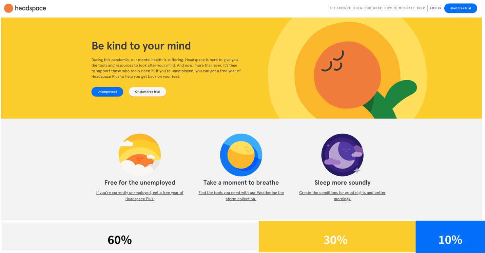

## 畫草圖的工具

* [Excalidraw](https://excalidraw.com/)

## 調色靈感

* [Happy Hhues](https://www.happyhues.co/palettes/17)
    * 調色板靈感網站
* [Glassmorphism](https://hype4.academy/tools/glassmorphism-generator)
    * 實現「磨砂玻璃」效果

## 資料視覺化之理論

已整理為文章：
https://marco79423.net/articles/%E7%AD%86%E8%A8%98-%E8%B3%87%E6%96%99%E8%A6%96%E8%A6%BA%E5%8C%96%E4%B9%8B%E7%90%86%E8%AB%96/

## Atomic Design

Style guide 是設計師和工程師之間的共同語言，但問題是 style guide 需要額外的時間作業，對工程師來說內容太過抽象，而且通常都是在產品完成功才出現，所以大部分的時間都還是未完成的狀態。

所以 Brad Frost 提出一種設計方法論，讓設計師不是在設計網頁，而是改為設計系統裡面的元件。從原來的一頁一頁設計，改為先設計零件，然後再由工程師組合起來。元件不像 style guide 這麼抽象，本身的設計可以即時調整，過程中也可以直接實際在網頁 DEMO，既可以減少開發成本，也可以讓每個頁面有更一致的邏輯。而且對設計師來說，這方式天然可以減少重覆定義類型的元素。

元件抽象到具體分為五種階段：

* Atoms 原子
    * 為網頁構成的基本元素，如 Label、Input 或 Button
    * 也可以是抽象的概念，像是字體、色調等。
* Molecules 分子
    * 由元素構成的簡單 UI 物件，像是搜尋部件
* Organisms 組織
    * 相對分子而言，較為複雜的構成物，由原子及分子所組成。像是 Header 或 Footer。
* Templates 模板：
    * 以頁面為基礎的架構，將以上元素進行排版
* Pages 頁面
    * 將實際內容（圖片、文章等）套件在特定模板


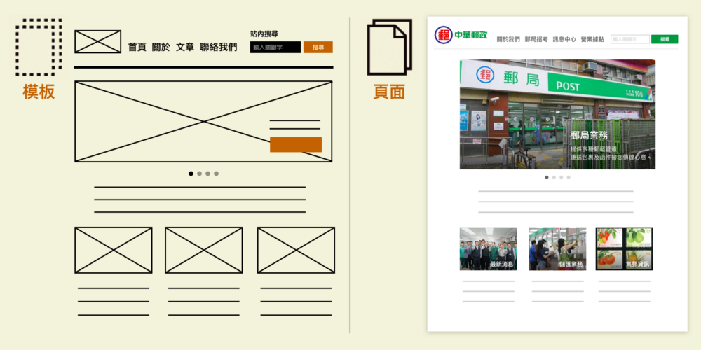

透過五種不同的階段組合，創建一個有層次、計畫性的介面系統。

## 設計的十個原則

產品設計師 Rams 總結過好的設計的十個原則：

* 原則是好的產品富有創意，必須是一個創新的東西；
* 好的產品是有用的；
* 好的產品是美的；
* 好的產品是容易使用的；
* 好的產品是很含蓄不招搖的；
* 好的產品是誠實的；
* 好的產品經久不衰，不會隨著時間而過時；
* 好的產品不會放過任何細節；
* 它是環保的，不浪費任何資源的；
* 儘可能少的設計，或者說少即是多。

透過五種不同的階段組合，創建一個有層次、計畫性的介面系統。

## 費茨法則

費茨在 1954 年提出了一個著名的人機互動模型——費茨法則。

> The smaller and more distant a target, the longer it will take to move to a resting position over the target.
> 目標越小、距離越遠，要達到目標定位點的時間就越長。

費茨法則可以用數學公式 Time = a + b log2 (D/W+1) 來表達，其中最重要的影響參數就是目標的距離（D）和目標的大小（W）。

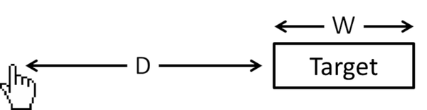

* 越大越容易點，越小越不容易點
    * 購買按鈕越大越好，廣告的關閉越小越好 (反向用費茨法則)
* 由於滑鼠滑到螢幕的邊緣就會被停住，這時候螢幕邊緣相當於一個「無限可選中區」 (邊緣無限大)
    * 常見的會放邊角，像是 Windows 的「開始」鍵

## 動畫的十二原則

迪士尼經過基礎工作練習的長時間累積，在 1981 年出版的 The Illusion of Life: Disney Animation 一書中發表了動畫的十二個原則 (12 Principles of Animation) 。這些原則描述了動畫能怎樣用於讓觀眾相信自己沉浸在現實世界中。

### 一、擠壓和拉伸 (Squash and stretch)

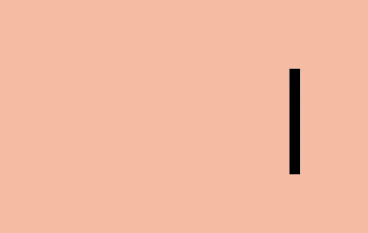

這是物體存在質量且運動時質量保持不變的概念。當一個球在彈跳時，碰擊到地面會變扁。

擠壓和伸縮效果可以為一個對象增加實物的感覺。甚至一些形狀上的小變化就可以創造出細微但搶眼的效果。

```html
<article class="principle one">
    <div class="shape"></div>
    <div class="surface"></div>
</article>
```

```css
.one .shape {
  animation: one 4s infinite ease-out;
}

.one .surface {
  background: #000;
  height: 10em;
  width: 1em;
  position: absolute;
  top: calc(50% - 4em);
  left: calc(50% + 10em);
}

@keyframes one {
  0%, 15% {
    opacity: 0;
  }
  15%, 25% {
    transform: none;
    animation-timing-function: cubic-bezier(1,-1.92,.95,.89);
    width: 4em;
    height: 4em;
    top: calc(50% - 2em);
    left: calc(50% - 2em);
    opacity: 1;
  }
  35%, 45% {
    transform: translateX(8em);
    height: 6em;
    width: 2em;
    top: calc(50% - 3em);
    animation-timing-function: linear;
    opacity: 1;
  }
  70%, 100% {
    transform: translateX(8em) translateY(5em);
    height: 6em;
    width: 2em;
    top: calc(50% - 3em);
    opacity: 0;
  }
}

body {
  margin: 0;
  background: #e9b59f;
  font-family: HelveticaNeue, Arial, Sans-serif;
  color: #fff;
}

.principle {
  width: 100%;
  height: 100vh;
  position: relative;
}

.shape {
  background: #2d97db;
  border: 1em solid #fff;
  width: 4em;
  height: 4em;
  position: absolute;
  top: calc(50% - 2em);
  left: calc(50% - 2em);
}
```

### 二、預備動作 (Anticipation)

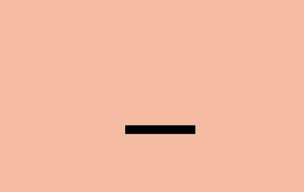

運動不傾向於突然發生。在現實生活中，無論是一個球在掉到桌子前就開始滾動，或是一個人屈膝准備起跳，運動通常有著某種事先的累積。

我們能用它去讓我們的過渡動畫顯得更逼真。預備動作可以是一個細微的反彈，幫人們理解什麼對象將在屏幕中發生變化並留下痕跡。

例如，懸停在一個元件上時可以在它變大前稍微縮小，在初始列表中添加額外的條目來介紹其它條目的移除方法。

```html
<article class="principle two">
    <div class="shape"></div>
    <div class="surface"></div>
  </article>
```

```css
.two .shape {
  animation: two 5s infinite ease-out;
  transform-origin: 50% 7em;
}

.two .surface {
  background: #000;
  width: 8em;
  height: 1em;
  position: absolute;
  top: calc(50% + 4em);
  left: calc(50% - 3em);
}

@keyframes two {
  0%, 15% {
    opacity: 0;
    transform: none;
  }
  15%, 25% {
    opacity: 1;
    transform: none;
    animation-timing-function: cubic-bezier(.5,.05,.91,.47);
  }
  28%, 38% {
    transform: translateX(-2em);
  }
  40%, 45% {
    transform: translateX(-4em);
  }
  50%, 52% {
    transform: translateX(-4em) rotateZ(-20deg);
  }
  70%, 75% {
    transform: translateX(-4em) rotateZ(-10deg);
  }
  78% {
    transform: translateX(-4em) rotateZ(-24deg);
    opacity: 1;
  }
  86%, 100% {
    transform: translateX(-6em) translateY(4em) rotateZ(-90deg);
    opacity: 0;
  }
}
.principle {
  width: 100%;
  height: 100vh;
  position: relative;
}

.shape {
  background: #2d97db;
  border: 1em solid #fff;
  width: 4em;
  height: 4em;
  position: absolute;
  top: calc(50% - 2em);
  left: calc(50% - 2em);
}
```

### 三、演出佈局 (Staging)


演出佈局是確保對像在場景中得以聚焦，讓場景中的其它對象和視覺在主動畫發生的地方讓位。這意味著要麼把主動畫放到突出的位置，要麼模糊其它元件來讓用戶專注於看他們需要看的東西。

* 一種方法是用 model 覆蓋在某些內容上。在現有頁面添加一個遮罩並把那些主要關注的內容前置展示。
* 另一種方法是用動作。當很多對象在運動，你很難知道哪些值得關注。如果其它所有的動作停止，只留一個在運動，即使動得很微弱，這都可以讓對象更容易被察覺。
* 還有一種方法是做一個晃動和閃爍的按鈕來簡單地建議用戶比如他們可能要保存文檔。屏幕保持靜態，所以再細微的動作也會突顯出來。

```html
<article class="principle three">
  <div class="shape a"></div>
  <div class="shape b"></div>
  <div class="shape c"></div>
</article>
```

```css
.three .shape.a {
  transform: translateX(-12em);
}

.three .shape.c {
  transform: translateX(12em);
}

.three .shape.b {
  animation: three 5s infinite ease-out;
  transform-origin: 0 6em;
}

.three .shape.a, .three .shape.c {
  animation: threeb 5s infinite linear;
}

@keyframes three {
  0%, 10% {
    transform: none;
    animation-timing-function: cubic-bezier(.57,-0.5,.43,1.53);
  }
  26%, 30% {
    transform: rotateZ(-40deg);
  }
  32.5% {
    transform: rotateZ(-38deg);
  }
  35% {
    transform: rotateZ(-42deg);
  }
  37.5% {
    transform: rotateZ(-38deg);
  }
  40% {
    transform: rotateZ(-40deg);
  }
  42.5% {
    transform: rotateZ(-38deg);
  }
  45% {
    transform: rotateZ(-42deg);
  }
  47.5% {
    transform: rotateZ(-38deg);
    animation-timing-function: cubic-bezier(.57,-0.5,.43,1.53);
  }
  58%, 100% {
    transform: none;
  }
}

@keyframes threeb {
  0%, 20% {
    filter: none;
  }
  40%, 50% {
    filter: blur(5px);
  }
  65%, 100% {
    filter: none;
  }
}

.principle {
  width: 100%;
  height: 100vh;
  position: relative;
}

.shape {
  background: #2d97db;
  border: 1em solid #fff;
  width: 4em;
  height: 4em;
  position: absolute;
  top: calc(50% - 2em);
  left: calc(50% - 2em);
}
```

### 四、連續運動和姿態對應 (Straight-Ahead Action and Pose-to-Pose)

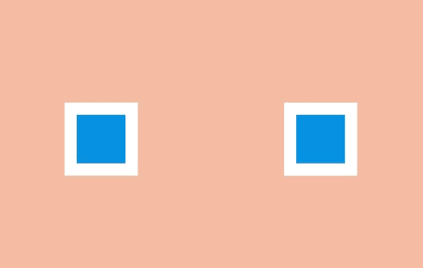

連續運動是繪制動畫的每一幀，姿態對應是通常由一個 assistant 在定義一系列關鍵幀後填充間隔。

大多數網頁動畫用的是姿態對應：關鍵幀之間的過渡可以通過瀏覽器在每個關鍵幀之間的插入盡可能多的幀使動畫流暢。

有一個例外是定時功能 step。通過這個功能，瀏覽器 step 可以把盡可能多的無序幀串清晰。你可以用這種方式繪制一系列圖片並讓瀏覽器按順序顯示出來，這開創了一種逐幀動畫的風格。

```html
<article class="principle four">
  <div class="shape a"></div>
  <div class="shape b"></div>
</article>
```

```css
.four .shape.a {
    left: calc(50% - 8em);
    animation: four 6s infinite cubic-bezier(.57,-0.5,.43,1.53);
}

.four .shape.b {
  left: calc(50% + 8em);
  animation: four 6s infinite steps(1);
}

@keyframes four {
  0%, 10% {
    transform: none;
  }
  26%, 30% {
    transform: rotateZ(-45deg) scale(1.25);
  }
  40% {
    transform: rotateZ(-45deg) translate(2em, -2em) scale(1.8);
  }
  50%, 75% {
    transform: rotateZ(-45deg) scale(1.1);
  }
  90%, 100% {
    transform: none;
  }
}

.principle {
  width: 100%;
  height: 100vh;
  position: relative;
}

.shape {
  background: #2d97db;
  border: 1em solid #fff;
  width: 4em;
  height: 4em;
  position: absolute;
  top: calc(50% - 2em);
  left: calc(50% - 2em);
}
```

### 五、跟隨和重疊動作 (Follow Through and Overlapping Action)

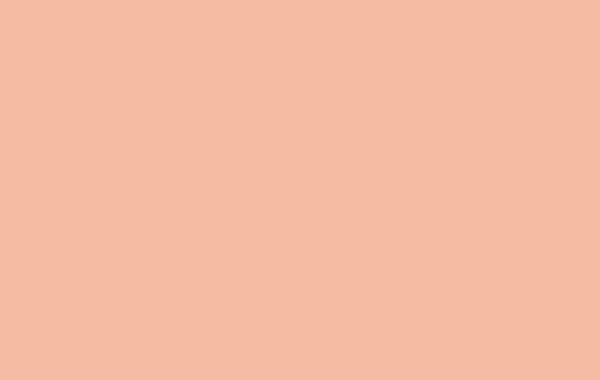

事情並不總在同一時間發生。當一輛車從急剎到停下，車子會向前傾、有煙從輪胎冒出來、車裡的司機繼續向前沖。

這些細節是跟隨和重疊動作的例子。它們在網頁中能被用作幫助強調什麼東西被停止，並不會被遺忘。例如一個條目可能在滑動時稍滑微遠了些，但它自己會糾正到正確位置。

要創造一個重疊動作的感覺，我們可以讓元件以稍微不同的速度移動到每處。這是一種在 iOS 系統的視窗 過渡中被運用得很好的方法。一些按鈕和元件以不同速率運動，整體效果會比全部東西以相同速率運動要更逼真，並留出時間讓訪客去適當理解變化。

在網頁方面，這可能意味著讓過渡或動畫的效果以不同速度來運行。

```html
<article class="principle five">
  <div class="shape-container">
    <div class="shape"></div>
  </div>
</article>
```

```css
.five .shape {
  animation: five 4s infinite cubic-bezier(.64,-0.36,.1,1);
  position: relative;
  left: auto;
  top: auto;
}

.five .shape-container {
  animation: five-container 4s infinite cubic-bezier(.64,-0.36,.1,2);
  position: absolute;
  left: calc(50% - 4em);
  top: calc(50% - 4em);
}

@keyframes five {
  0%, 15% {
    opacity: 0;
    transform: translateX(-12em);
  }
  15%, 25% {
    transform: translateX(-12em);
    opacity: 1;
  }
  85%, 90% {
    transform: translateX(12em);
    opacity: 1;
  }
  100% {
    transform: translateX(12em);
    opacity: 0;
  }
}

@keyframes five-container {
  0%, 35% {
    transform: none;
  }
  50%, 60% {
    transform: skewX(20deg);
  }
  90%, 100% {
    transform: none;
  }
}
.principle {
  width: 100%;
  height: 100vh;
  position: relative;
}

.shape {
  background: #2d97db;
  border: 1em solid #fff;
  width: 4em;
  height: 4em;
  position: absolute;
  top: calc(50% - 2em);
  left: calc(50% - 2em);
}
```

### 六、緩入緩出 (Slow In and Slow Out)

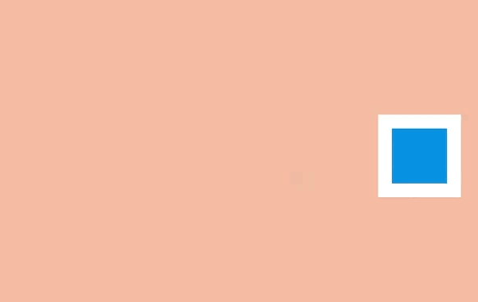

對象很少從靜止狀態一下子加速到最大速度，它們往往是逐步加速並在停止前變慢。沒有加速和減速，動畫感覺就像機器人。

在 CSS 方面，緩入緩出很容易被理解，在一個動畫過程中計時功能是一種描述變化速率的方式。

使用計時功能，動畫可以由慢加速 (ease-in)、由快減速 (ease-out)，或者用貝塞爾曲線做出更復雜的效果。

```html
<article class="principle six">
  <div class="shape a"></div>
</article>
```

```css
.six .shape {
animation: six 3s infinite cubic-bezier(0.5,0,0.5,1);
}

@keyframes six {
  0%, 5% {
    transform: translate(-12em);
  }
  45%, 55% {
    transform: translate(12em);
  }
  95%, 100% {
    transform: translate(-12em);
  }
}

.principle {
  width: 100%;
  height: 100vh;
  position: relative;
}

.shape {
  background: #2d97db;
  border: 1em solid #fff;
  width: 4em;
  height: 4em;
  position: absolute;
  top: calc(50% - 2em);
  left: calc(50% - 2em);
}
```

### 七、弧線運動 (Arc)


雖然對象是更逼真了，當它們遵循「緩入緩出」的時候它們很少沿直線運動——它們傾向於沿弧線運動。

我們有幾種 CSS 的方式來實現弧線運動。一種是結合多個動畫，比如在彈力球動畫裡，可以讓球上下移動的同時讓它右移，這時候球的顯示效果就是沿弧線運動

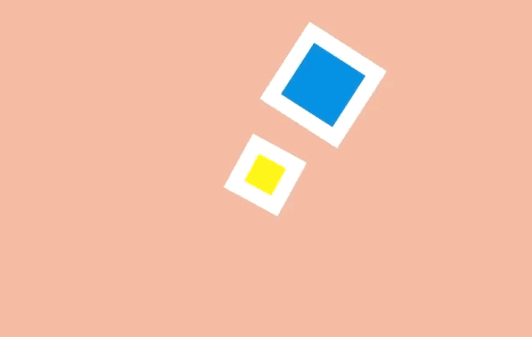

另外一種是旋轉元件，我們可以設置一個在對象之外的原點來作為它的旋轉中心。當我們旋轉這個對象，它看上去就是沿著弧線運動。

```html
<article class="principle sevenb">
  <div class="shape a"></div>
  <div class="shape b"></div>
</article>
```

```css
.sevenb .shape.a {
  animation: sevenb 3s infinite linear;
  top: calc(50% - 2em);
  left: calc(50% - 9em);
  transform-origin: 10em 50%;
}
.sevenb .shape.b {
  animation: sevenb 6s infinite linear reverse;
  background-color: yellow;
  width: 2em;
  height: 2em;
  left: calc(50% - 1em);
  top: calc(50% - 1em);
}

@keyframes sevenb {
  100% {
    transform: rotateZ(360deg);
  }
}

.principle {
  width: 100%;
  height: 100vh;
  position: relative;
}

.shape {
  background: #2d97db;
  border: 1em solid #fff;
  width: 4em;
  height: 4em;
  position: absolute;
  top: calc(50% - 2em);
  left: calc(50% - 2em);
}
```

### 八、次要動作 (Secondary Action)


雖然主動畫正在發生，次要動作可以增強它的效果。這就好比某人在走路的時候擺動手臂和傾斜腦袋，或者彈性球彈起的時候揚起一些灰塵。

在網頁方面，當主要焦點出現的時候就可以開始執行次要動作，比如拖拽一個條目到列表中間。

```html
<article class="principle eight">
  <div class="shape a"></div>
  <div class="shape b"></div>
  <div class="shape c"></div>
</article>
```

```css
.eight .shape.a {
  transform: translateX(-6em);
  animation: eight-shape-a 4s cubic-bezier(.57,-0.5,.43,1.53) infinite;
}
.eight .shape.b {
  top: calc(50% + 6em);
  opacity: 0;
  animation: eight-shape-b 4s linear infinite;
}
.eight .shape.c {
  transform: translateX(6em);
  animation: eight-shape-c 4s cubic-bezier(.57,-0.5,.43,1.53) infinite;
}

@keyframes eight-shape-a {
  0%, 50% {
    transform: translateX(-5.5em);
  }
  70%, 100% {
    transform: translateX(-10em);
  }
}

@keyframes eight-shape-b {
  0% {
    transform: none;
  }
  20%, 30% {
    transform: translateY(-1.5em);
    opacity: 1;
    animation-timing-function: cubic-bezier(.57,-0.5,.43,1.53);
  }
  32% {
    transform: translateY(-1.25em);
    opacity: 1;
  }
  34% {
    transform: translateY(-1.75em);
    opacity: 1;
  }
  36%, 38% {
    transform: translateY(-1.25em);
    opacity: 1;
  }
  42%, 60% {
    transform: translateY(-1.5em);
    opacity: 1;
  }
  75%, 100% {
    transform: translateY(-8em);
    opacity: 1;
  }
}

@keyframes eight-shape-c {
  0%, 50% {
    transform: translateX(5.5em);
  }
  70%, 100% {
    transform: translateX(10em);
  }
}

.principle {
  width: 100%;
  height: 100vh;
  position: relative;
}

.shape {
  background: #2d97db;
  border: 1em solid #fff;
  width: 4em;
  height: 4em;
  position: absolute;
  top: calc(50% - 2em);
  left: calc(50% - 2em);
}
```

### 九、時間節奏 (Timing)

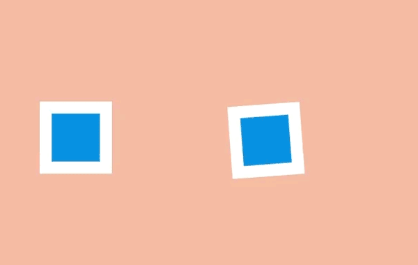

動畫的時間節奏是需要多久去完成，它可以被用來讓看起來很重的對象做很重的動畫，或者用在添加字符的動畫中。

這在網頁上可能只要簡單調整 animation-duration 或 transition-duration 值。

這很容易讓動畫消耗更多時間，但調整時間節奏可以幫動畫的內容和交互方式變得更出眾。

```html
<article class="principle nine">   
  <div class="shape a"></div>   
  <div class="shape b"></div> 
</article>
```

```css
.nine .shape.a {
  animation: nine 4s infinite cubic-bezier(.93,0,.67,1.21); 
  left: calc(50% - 12em);
  transform-origin: 100% 6em;
}
.nine .shape.b { 
  animation: nine 2s infinite cubic-bezier(1,-0.97,.23,1.84); 
  left: calc(50% + 2em);  
  transform-origin: 100% 100%;
}

@keyframes nine { 
  0%, 10% {  
    transform: translateX(0);  
  } 
  40%, 60% {  
    transform: rotateZ(90deg); 
  } 
  90%, 100% { 
    transform: translateX(0); 
  }
}
.principle { 
  width: 100%; 
  height: 100vh; 
  position: relative;
}

.shape { 
  background: #2d97db; 
  border: 1em solid #fff; 
  width: 4em; 
  height: 4em; 
  position: absolute; 
  top: calc(50% - 2em); 
  left: calc(50% - 2em);
}
```

### 十、誇張手法 (Exaggeration)

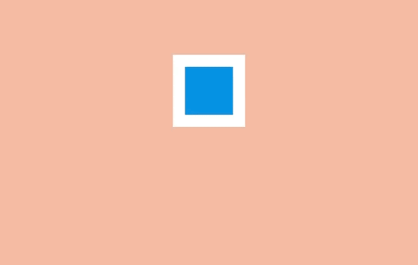

誇張手法在漫畫中是最常用來為某些動作刻畫吸引力和增加戲劇性的，比如一隻狼試圖把自己的喉嚨張得更開地去咬東西可能會表現出更恐怖或者幽默的效果。

在網頁中，對象可以通過上下滑動去強調和刻畫吸引力，比如在填充表單的時候生動部分會比收縮和變淡的部分更突出。

```html
<article class="principle ten">   
  <div class="shape"></div> 
</article>
```

```css
.ten .shape {
  animation: ten 4s infinite linear; 
  transform-origin: 50% 8em;  
  top: calc(50% - 6em);
}

@keyframes ten { 
  0%, 10% {  
    transform: none;  
    animation-timing-function: cubic-bezier(.87,-1.05,.66,1.31); 
  } 
  40% {  
    transform: rotateZ(-45deg) scale(2);  
    animation-timing-function: cubic-bezier(.16,.54,0,1.38); 
  } 
  70%, 100% {   
    transform: rotateZ(360deg) scale(1); 
  }
}

.principle { 
  width: 100%; 
  height: 100vh; 
  position: relative;
}

.shape { 
  background: #2d97db; 
  border: 1em solid #fff; 
  width: 4em; 
  height: 4em;  
  position: absolute; 
  top: calc(50% - 2em); 
  left: calc(50% - 2em);
}
```

### 十一、扎實的描繪 (Solid drawing)

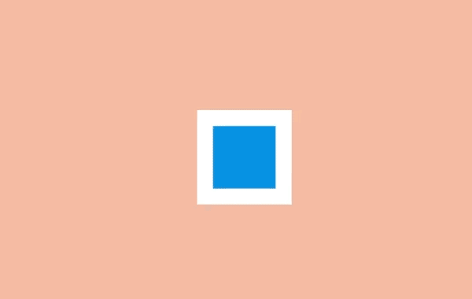

當動畫對象在三維中應該加倍注意確保它們遵循透視原則。因為人們習慣了生活在三維世界裡，如果對象表現得與實際不符，會讓它看起來很糟糕。

如今瀏覽器對三維變換的支持已經不錯，這意味著我們可以在場景裡旋轉和放置三維對象，瀏覽器能自動控制它們的轉換。

```html
<article class="principle eleven">   
  <div class="shape">   
    <div class="container">     
      <span class="front"></span>   
      <span class="back"></span>    
      <span class="left"></span>   
      <span class="right"></span>  
      <span class="top"></span>    
      <span class="bottom"></span>   
    </div> 
  </div> 
</article>
```

```css
.eleven .shape { 
  background: none; 
  border: none; 
  perspective: 400px; 
  perspective-origin: center;
}
.eleven .shape .container { 
  animation: eleven 4s infinite cubic-bezier(.6,-0.44,.37,1.44);  
  transform-style: preserve-3d;
}
.eleven .shape span {  
    display: block;  
    position: absolute; 
    opacity: 1; 
    width: 4em;  
    height: 4em; 
    border: 1em solid #fff;   
    background: #2d97db;
}
.eleven .shape span.front { 
  transform: translateZ(3em);
}
.eleven .shape span.back { 
  transform: translateZ(-3em);
}
.eleven .shape span.left { 
  transform: rotateY(-90deg) translateZ(-3em);
}
.eleven .shape span.right { 
  transform: rotateY(-90deg) translateZ(3em);
}
.eleven .shape span.top {
  transform: rotateX(-90deg) translateZ(-3em);
}
.eleven .shape span.bottom { 
  transform: rotateX(-90deg) translateZ(3em);
}

@keyframes eleven { 
  0% {  
    opacity: 0; 
  } 
  10%, 40% {  
    transform: none;   
    opacity: 1; 
  } 
  60%, 75% {  
    transform: rotateX(-20deg) rotateY(-45deg) translateY(4em);   
    animation-timing-function: cubic-bezier(1,-0.05,.43,-0.16);   
    opacity: 1; 
  } 
  100% { 
    transform: translateZ(-180em) translateX(20em); 
    opacity: 0;
  }
}

.principle { 
  width: 100%; 
  height: 100vh;
  position: relative;
}

.shape { 
  background: #2d97db; 
  border: 1em solid #fff; 
  width: 4em; 
  height: 4em; 
  position: absolute; 
  top: calc(50% - 2em); 
  left: calc(50% - 2em);
}
```

### 十二、吸引力 (Appeal)


吸引力是藝術作品的特質，讓我們與藝術家的想法連接起來。就像一個演員身上的魅力，是注重細節和動作相結合而打造吸引性的結果。

精心製作網頁上的動畫可以打造出吸引力，例如 Stripe 這樣的公司用了大量的動畫去增加它們結賬流程的可靠性。

```html
<article class="principle twelve">
  <div class="shape">
    <div class="container">
      <span class="item one"></span>
      <span class="item two"></span>
      <span class="item three"></span>
      <span class="item four"></span>
    </div>
  </div>
</article>
```

```css
.twelve .shape {
  background: none;
  border: none;
  perspective: 400px;
  perspective-origin: center;
}

.twelve .shape .container {
  animation: show-container 8s infinite cubic-bezier(.6,-0.44,.37,1.44);
  transform-style: preserve-3d;
  width: 4em;
  height: 4em;
  border: 1em solid #fff;
  background: #2d97db;
  position: relative;
}

.twelve .item {
  background-color: #1f7bb6;
  position: absolute;
}

.twelve .item.one {
  animation: show-text 8s 0.1s infinite ease-out;
  height: 6%;
  width: 30%;
  top: 15%;
  left: 25%;
}

.twelve .item.two {
  animation: show-text 8s 0.2s infinite ease-out;
  height: 6%;
  width: 20%;
  top: 30%;
  left: 25%;
}

.twelve .item.three {
  animation: show-text 8s 0.3s infinite ease-out;
  height: 6%;
  width: 50%;
  top: 45%;
  left: 25%;
}

.twelve .item.four {
  animation: show-button 8s infinite cubic-bezier(.64,-0.36,.1,1.43);
  height: 20%;
  width: 40%;
  top: 65%;
  left: 30%;
}

@keyframes show-container {
  0% {
    opacity: 0;
    transform: rotateX(-90deg);
  }
  10% {
    opacity: 1;
    transform: none;
    width: 4em;
    height: 4em;
  }
  15%, 90% {
    width: 12em;
    height: 12em;
    transform: translate(-4em, -4em);
    opacity: 1;
  }
  100% {
    opacity: 0;
    transform: rotateX(-90deg);
    width: 4em;
    height: 4em;
  }
}

@keyframes show-text {
  0%, 15% {
    transform: translateY(1em);
    opacity: 0;
  }
  20%, 85% {
    opacity: 1;
    transform: none;
  }
  88%, 100% {
    opacity: 0;
    transform: translateY(-1em);
    animation-timing-function: cubic-bezier(.64,-0.36,.1,1.43);
  }
}

@keyframes show-button {
  0%, 25% {
    transform: scale(0);
    opacity: 0;
  }
  35%, 80% {
    transform: none;
    opacity: 1;
  }
  90%, 100% {
    opacity: 0;
    transform: scale(0);
  }
}

.principle {
  width: 100%;
  height: 100vh;
  position: relative;
}

.shape {
  background: #2d97db;
  border: 1em solid #fff;
  width: 4em;
  height: 4em;
  position: absolute;
  top: calc(50% - 2em);
  left: calc(50% - 2em);
}
```

## Debounce （去抖動）

所謂 Debounce，是讓使用者在觸發相同事件（如卷軸）的情境下，停止觸發綁定事件的效果，直到使用者停止觸發相同事件。

以現實的例子來說，就是排隊搭公車的時候，司機在開門後，會待每一個乘客都上車後，最後才會關上門。

簡易實作：

```js
function debounce(func, delay=250) {
  let timer = null;
 
  return () => {
    let context = this;
    let args = arguments;
 
    clearTimeout(timer);
    timer = setTimeout(() => {
      func.apply(context, args);
    }, delay)
  }
}
```

簡單來說，就是在函數域加入一個計時器，如果事件一直觸發，便刷新計時器，直至計時器時限內沒有觸發該事件，便執行事件行為。

用例：

```js
function handleScroll() {
  console.log(window.scrollY)
}
window.addEventListener('scroll', debounce(handleScroll));
```

## Throttle (節閥)

Throttle 是另一種減緩事件觸發方法，它與Debounce的差異是，為使用者觸發相同事件時提供間隔，控制特定時間內事件觸發的次數。

以現實例子來說，就像日本庭院常見的那個盛水的竹子裝置（名為鹿威），流水一直下來，但竹子會等水盛滿（時間到），才會把水排出。


簡易實作：

```js
function throttle(func, timeout = 250) {
  let last;
  let timer;
 
  return function () {
    const context = this;
    const args = arguments;
    const now = +new Date();
 
    if (last && now < last + timeout) {
      clearTimeout(timer)
      timer = setTimeout(function () {
        last = now
        func.apply(context, args)
      }, timeout)
    } else {
      last = now
      func.apply(context, args)
    }
  }
}
```

Throttle實現方法是在函數域加入一個計時器並記錄最新一次執行的時間點，並把現在的時間點與記錄的時間點再比較，如果差距超過設定時限，便允許再次執行事件任務，並記下新的執行時間點。

用例：

```js
function handleScroll() {
  console.log(window.scrollY)
}
window.addEventListener('scroll', throttle(handleScroll, 500));  // 500ms才允許再次執行
```

## 控制錯覺（Illusion of Control）

通常人們會覺得算法不靠譜，更相信自己的判斷，這是一個很常見的現象，甚至有人還取了個名字叫「算法厭惡 (algorithm aversion)。計算機告訴我們應該選這個，但偏不選，非得自己說得算。

有點像是小孩和家長的關係，家長苦口婆心說根據多年經驗，你應該這麼辦，可是小孩有抗拒心理，說我為什麼要聽你的，非要自己做決定。未來算法越來越長大，算法做出的判斷會遠勝於人類，但如果人都有算法厭惡該怎麼辦？

芝加哥大學和賓夕法尼亞大學商學院的研究者想出一個辦法－－「允許人們在演算法給出結果的基礎之上，做一點小小的改動。」

在實驗中，受試者的任務是預測一些學生的標準化考試成績。受試者自己預測一個分數，再用演算法預測一個分數。然後研究者問受試者，你是選擇相信自己預測出來的分數，還是相信演算法預測出來的分數。

結果只有1/3的人選擇相信演算法，2/3的人都堅持了自己的預測，典型的演算法厭惡。

在第二組實驗中，研究者把這個問題作了個改動，現在允許受試者根據自己的想法，把演算法預測的結果調整一下，上下可以最多調整10%。結果就有高達3/4的人放棄了自己的預測，決定使用這個以演算法為主、自己微調的預測。

演算法的結果，我不喜歡；可是如果你給我對演算法結果的10%的控制權，我就喜歡了！

而且連10%都不用。在後面一個實驗里，只允許人把演算法預測的成績上下浮動2分，人們還是更願意使用演算法。如果滿分是100分，2分的浮動其實毫無意義，這點控制權純屬錯覺 —— 而就是這點“控制錯覺”，就足以讓人更願意接受演算法的結果。

比如有個銷售人員分享了他的一個經驗。他說，你給顧客打電話推銷，一旦發現對方有購買意向，你下一步要做的就是給他一點控制感，最好是讓他感覺是自己在“買”這個東西，而不是你在“賣”這個東西。

你可以問顧客一些誘導性的問題，給他說話的機會。這樣一來，大部分的話是顧客、而不是你說的。你讓他說出各種喜愛偏好，他感覺是你在根據他所喜歡的東西幫他定製一件東西。

這只是一個錯覺。不管他怎麼答，你最後推薦的可能還是這個型號的產品 —— 可是現在顧客體驗更好了。

現在買個什麼東西，商家往往提供個性化的定製。其實定製的結果大同小異，沒有本質的區別，比如買手機也就定製了一個外殼的顏色。這大概也是提供一種控制感。

## 參考資料

* [網頁動畫的十二原則](https://mp.weixin.qq.com/s/gLpTNnLWiQrS9h_Qfa9stg)
* [Debounce & Throttle — 那些前端開發應該要知道的小事(一)](https://medium.com/@alexian853/debounce-throttle-%E9%82%A3%E4%BA%9B%E5%89%8D%E7%AB%AF%E9%96%8B%E7%99%BC%E6%87%89%E8%A9%B2%E8%A6%81%E7%9F%A5%E9%81%93%E7%9A%84%E5%B0%8F%E4%BA%8B-%E4%B8%80-76a73a8cbc39)
* [配色黃金比例60：30：10的實際應用！](https://vocus.cc/article/5f3cc3b0fd89780001d6e4f7)
