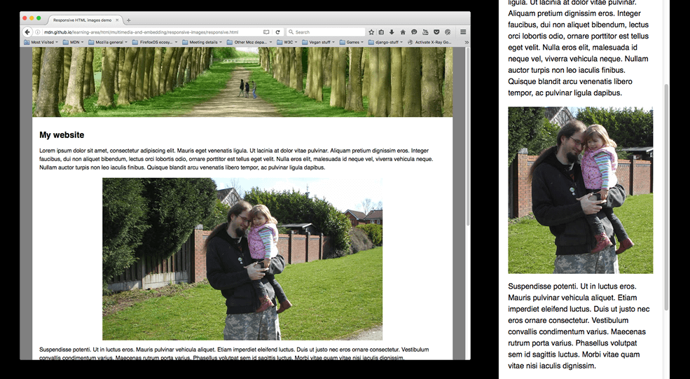
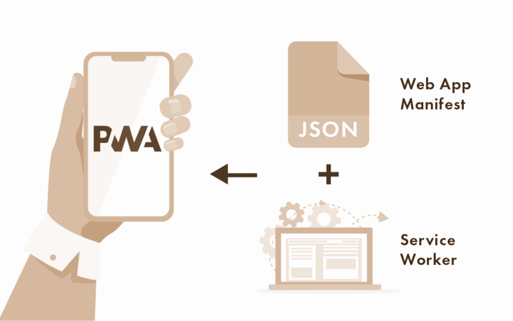
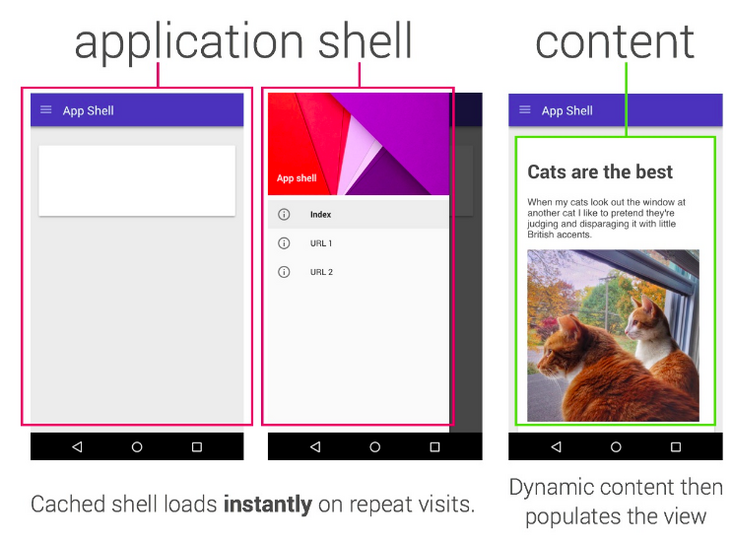

# 其他議題

## 圖片使用

在網頁中，圖片通常在所有資源大小中佔了最多比例，最簡單的優化方式就是縮小圖片，但事實上在各式各樣的設備中，不同的網路速度、圖片處理效能、螢幕特性等等也是必須考量的因素。

注意事項：

* 避免以圖片內嵌文字的方式顯示文字
* 優先考量 SVG：
    * SVG 是向量圖，無論放大多少都不會模糊
    * 相較於點陣圖，SVG 非常小
    * 傳輸時可以使用 Gzip、Brotli 等壓縮格式
    * 適合類型
        * 商標
        * 圖示
        * 圖表
        * 地圖
    * 適合轉換為 SVG 的點陣圖
        * 較小的圖片
        * 由幾何圖形組成的圖片
        * 不希望失真、模糊的圖片
    * 優化手段
        * SVG 檔本身也可以透過工具如 SVGO 降低檔案大小。
* 使用點陣圖
    * 優化圖片最直接的方式就是壓縮
        * 壓縮的方式主要分為兩種：
            * Lossy（有損） – 如 JPG，使用近似或是只取部分像素資料的方式來壓縮圖片大小，降低大小後不可逆。
            * Lossless（無損） – 如 PNG，以重建的方式壓縮大小，不影響圖片品質。
        * 注意事項
            * 移除圖片中可能存在額外資料如地點、相機資訊。
            * 盡可能讓圖片大小和實際顯示大小相符，瀏覽器在縮小大圖時需要耗費大量效能。
            * 使用自動化工具例如 Webpack 來進行圖片優化，整合開發流程。
            * 有損圖片壓縮工具能夠調整壓縮品質，可以盡可能壓縮，通常視覺上的差異不會太大。
    * 優先使用 Webp
        * 除了 IE 之外，常見的瀏覽器都支援 WebP 圖片格式，網頁使用基本上是首選：
        * 相較常見的 PNG、JPG， WebP 小很多
        * 支援動圖，GIF 轉 WebP（但還有更小的 WebM）
        * 支援透明（JPG 不支援）
* 響應式圖片（Responsive images）
    * 在 img 加上一些屬性讓瀏覽器依據使用者螢幕大小自動判斷最適合的圖片，保持使用者體驗的同時不浪費流量和效能
        * 範例
            ```html
            
            ```
            * srcset
                * 標示圖片名稱和圖片的實際大小。
            * sizes
                * 可以設定 Media query，告訴瀏覽器此圖的 CSS 寬度（實際 CSS 還是要自己設），瀏覽器會依據 sizes 和 DPR、DPI 來決定要讀取 srcset 中的哪一張圖片。
        * 注意可以使用各種單位、calc，但不能用 %。
        * 實際測試：https://web.dev/codelab-specifying-multiple-slot-widths/
* 使用動圖
    * 不建議直接在網頁中使用 GIF
        * 因為 GIF 太大，可用 FFmpeg 等工具把 GIF 轉成 MP4 或是 WebM（非常小，不需支援 IE 的首選）。
    * 做法
        * HTML 的 video 元素加上一些屬性後就能做到：自動開始、循環、無聲、避免全螢幕，和 GIF 沒兩樣，只差在不能直接使用 img 元素。
            ```html
            <video autoplay loop muted playsinline>
                <source src="my-animation.webm" type="video/webm">
                <source src="my-animation.mp4" type="video/mp4">
            </video>
            ```
            * 利用 source 和 type 讓不支援 WebM 的瀏覽器使用 MP4。
* 特殊技巧
    * Art Direction
        * 有些圖片不適合行動設備中使用，直接等比例縮小到手機寬度的話會讓圖片變得很醜，因此可以用到 Art direction 的技巧在不同螢幕寬度顯示不同的圖片。
            
        * 使用 picture + source 會回傳第一個 Media query 是 true 的圖片，否則 Fallback 到 img，如果在 source 用了 Media query 就不需要 sizes 了。
            ```html
            <picture>
            <source media="(max-width: 799px)" srcset="elva-480w-close-portrait.jpg">
            <source media="(min-width: 800px)" srcset="elva-800w.jpg">
            
            </picture>
            ```
        * 實際測試：https://web.dev/codelab-art-direction/

* 工具
    * CDN
        * 即時轉換、優化圖片並進行快取，搭配 CDN 能夠讓圖片傳輸速度更快，可用網址輸入圖片轉換的參數，例如利用以下網址把圖片轉為 300 x 200 的大小：
            * thumbor – 開源，可自架的 Server
            * Cloudinary – 功能更多、文件較齊全，但使用量大時需要付費
* 常見議題
    * 為什麼不用 JavaScript 來做響應式圖片？
        * 瀏覽器的 HTML parser 還沒解析完 JavaScript、CSS 就能開始下載圖片，這也是為什麼需要 srcset、sizes 等詳細大小資訊。
    * 需要多少張圖？
        * 通常會以 3 到 5 為準，以使用者體驗和效能來說是越多越好，但需要更多 Server 儲存空間和撰寫更多 HTML。
    * 怎麼決定圖片的 sizes？
        * 若能夠設定多種 sizes 區間能夠讓使用者體驗最好，更進一步還能根據網站使用者的螢幕寬度來決定，可參考 GA 搭配 https://screensiz.es/。
        * 若真的只想使用一張圖片，且圖片是使用相對寬度，也必須確保該圖片夠大，剛好涵蓋大部分的使用者螢幕寬度。

## DPR、DPI

* DPR
    * 代表螢幕中顯示一個 CSS pixel 所用的實際 Pixel 比例
    * 例如 iPhone X 螢幕的 DPR 是 3，瀏覽器顯示一個 CSS pixel 實際上是用了 3 * 3 = 9 個 Pixels。
* DPI
    * 代表每個每寸內的 Pixels 數量
    * 由於 iPhone X 的 DPI 較高，每個 Pixel 靠得很近，如果 CSS 設定 10px 就真的只顯示螢幕中的 10 個 Pixels 會讓元素小到幾乎看不到。

在此附上一個 Demo - [Blur Canvas](https://sh1zuku.csie.io/demo/blur-canvas/) ，當 Canvas 自身的寬度為 200，CSS 寬也設為 200px，在 DPR 為 2 的螢幕上顯示時每個色點會放大 2 * 2 = 4 倍，看起來就會糊糊的，若把 Canvas 的寬度設為 400，以同樣比例畫圖，再把 CSS 設為 200px，就能實際用上螢幕的所有 Pixels，顯示清晰的圖片。

## PWA

PWA 全稱為 Progressive Web App，中文譯為漸進式 Web APP。

PWA 是 Google 於 2016 年提出的概念，於 2017 年正式落地，於 2018 年迎來重大突破，全球頂級的瀏覽器廠商，Google、Microsoft、Apple 已經全數宣佈支持 PWA 技術。

一個 PWA 應用首先是一個網頁, 可以通過 Web 技術編寫出一個網頁應用. 隨後添加上 App Manifest 實現添加至主屏幕， 通過 Service Worker 來實現離線緩存和消息推送等功能。

* Web Application Manifest
    * 即通過一個清單文件向瀏覽器暴露 web 應用的元數據，包括名稱、icon 的 URL 等，以備瀏覽器使用，比如在添加至主屏或推送通知時暴露給操作系統，從而增強 web 應用與操作系統的集成能力
* Service Worker
    * 是一個可編程的 Web Worker，它就像一個位於瀏覽器與網絡之間的客戶端代理，可以攔截、處理、響應流經的 HTTP 請求；配合隨之引入 Cache Storage API，你可以自由管理 HTTP 請求文件粒度的緩存，這使得 Service Worker 可以從緩存中向 web 應用提供資源，即使是在離線的環境下。



特點：

* 優勢
    * 接近原生應用
    * 首先是一個網頁，可以通過 Web 技術
    * 可以將 app 放置在桌面上，全屏運行，與原生應用無異
    * 能夠在各種網路環境下使用，包括斷網的條件
    * 推送訊息的能力
    * 本質是一個網頁，沒有原生應用的各種啟動條件
* 缺點
    * 各大廠商未明確支持
    * 微信小程序競爭

### manifest.json

通過對 manifest.json 進行相應配置，可以實現以下功能：

* 基本功能
    * 自定義名稱
    * 自定義圖標
    * 設置啟動網址
    * 設置作用域
* 改善應用體驗
    * 添加啟動畫面
    * 設置顯示類型
    * 指定顯示方向
    * 設置主題色
* 應用安裝橫幅
    * 引導用戶添加應用
    * 引導用戶安裝原生應用

範例：

```json
{
  "name": "Progressive Web App",
  "short_name": "PWA",
  "description": "Progressive Web App.",
  "icons": [
    {
      "src": "/icon.png",
      "sizes": "288x288", // 这里需要格外注意图片的尺寸，如果图片有问题，调试页面Manifest里会给你提示
      "type": "image/png"
    }
  ],
  "start_url": "/",
  "display": "standalone",
  "theme_color": "#B12A34",
  "background_color": "#B12A34"
}
```

### App Shell 模型

App Shell 架構是構建 Progressive Web App 的一種方式，這種應用能可靠且即時地加載到您的用戶屏幕上，與本機應用相似。

App shell 是支持用戶界面所需的最小的 HTML、CSS 和 JavaScript，如果離線緩存，可確保在用戶重復訪問時提供即時、可靠的良好性能。這意味著並不是每次用戶訪問時都要從網絡加載 App Shell，只需要從網絡中加載必要的內容。

對於使用包含大量 JavaScript 的架構的單頁應用來說，App Shell 是一種常用方法。這種方法依賴漸進式緩存 Shell（使用 Service Worker 線程）讓應用運行，接下來，為使用 JavaScript 的每個頁面加載動態內容。App Shell 非常適合用於在沒有網絡的情況下將一些初始 HTML 快速加載到屏幕上。



### 應用

#### Squoosh

2018 Google Chrome 開發者峰會上，Google 發布了Squoosh，這是一個開源的圖片壓縮漸進式 Web 應用（PWA），它同時也是現代 Web 技術的一個實際展示，谷歌實驗室發布 Squoosh 的主要目標是演示高級 web 應用程序如何利用現代技術在 web 瀏覽器中提供高性能的體驗。

## 參考文章

* [小程序的鼻祖在国内就这么消亡了！](https://mp.weixin.qq.com/s/sU0cZg6EvmubC262Asdc3g)
* [[Day 29] Optimize Images - iT 邦幫忙::一起幫忙解決難題，拯救 IT 人的一天](https://ithelp.ithome.com.tw/articles/10252501)
