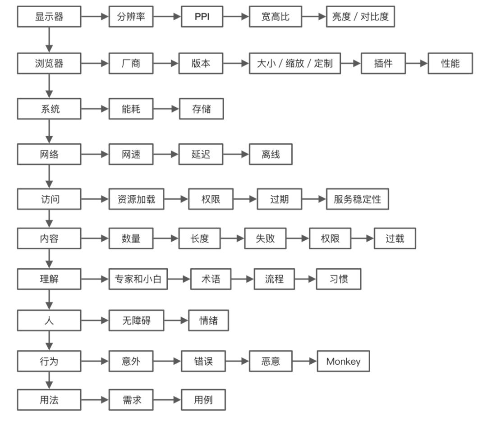

# 問題檢查清單

## 常見問題

* 需求
    * 功能實現問題
        1. 錯誤的實現：不符合PRD
        2. 不完整的實現：遺漏一些版本 / 應用場景下的不同實現
        3. 流程缺失，如權限校驗、授權、灰度等
    * UI 和交互問題
        1. 一致性問題：不符合設計稿 / 不符合設計規范
        2. UI適配性問題
* 開發
    * 邏輯問題
        1. 判斷條件有誤 / 忽略了必要條件
        2. 循環 / 遞歸的退出條件
        3. 顯隱邏輯和跳轉邏輯控制
        4. 缺少校驗或錯判參數類型 / 空值 / 邊界條件
        5. 缺少對默認值 / 缺省狀態的校驗 / 判斷 / 處理
        6. 接囗調用邏輯和組合關系
        7. 忽略一些組件之間的聯動關系
    * 全局副作用
        1. 變更公共代碼，對其他部分產生影響
        2. 變更配置文件 / 全局變量
        3. 代碼的衝突和污染
        4. 基礎庫版本升級
    * 容錯問題
        1. 錯誤輸入 / 特殊字符 / 數據類型的容錯
        2. 接囗返回值的不確定性
        3. 接囗請求失敗的容錯
        4. 缺少error boundary，避免導致白屏
        5. 錯誤要上報
    * 表單校驗問題
        * 前端校驗條件不全
    * 編譯 & 依賴問題
        1. JS 編譯漏掉對一些語法的處理
        2. 本地和發布構建有差異
        3. 本地和線上依賴版本有差異
    * 兼容性問題
        1. Polyfill不全
        2. CSS 兼容性問題
    * 文案問題
        1. 文案錯誤 / 不准確 / 折行
        2. 國際化不完整
    * “靈異”問題
        * 難以解釋，工程腐化的結果
* 數據
    * 請求失敗
        1. 缺少或錯誤的入參
        2. 參數結構不符合接囗文檔
        3. 請求失敗缺少catch
        4. 請求失敗信息不全 / 不友好
    * 字段問題
        1. 返回的不確定：缺字段 / 類型不統一 / 空值 / 默認值
        2. 接囗各種場景考慮不全
        3. 用戶數據差異
    * 接囗變更
        * 未及時同步變更和接囗版本變化
    * 狀態不全
        * 加載態、空狀態、錯誤提示等UI反饋不完整
* 系統問題
    * 瀏覽器問題
        1. GET / POST請求參數超出限制
        2. Cookie / LocalStorage超出限制
        3. 不符合同源策略
        4. 觸發瀏覽器Bug的一些寫法
    * 資源加載問題
        * CDN 服務異常
    * 請求失敗 / 響應慢
        * Web 服務異常
    * 性能
        * 顯示性能
            * 加載慢 / 渲染慢
        * 能耗
            * 內存洩漏 / 重循環缺少優化 / CPU佔用過高
        * 交互性能
            * 卡頓 / 閃爍 / 假死
        * 接囗性能
            1. 接囗延時 / 超時
            2. 接囗的重復調用 / 接囗的冗餘調用
* 安全缺陷
    * 三方庫/開源庫
        * NPM 包被惡意篡改、掛馬屢有發生
    * 敏感信息風險
    * Web 安全風險
        * XSS/CSRF/SSRF/SQL 注入等

## UI 相關

* 白屏
    * 白屏時間需小於1秒（小於200ms最佳）
    * 處理方案
        * 白屏監控
        * 資源加載失敗重試
        * Service Worker 的資源 fallback 機制
        * 模塊都包裝了 error boundary
        * 兼容性探測和提示
        * 白屏提示信息
* 佈局錯亂
* 極端內容 (缺失 / 超長 / 連續字符 / 未轉義 )
* 一致性問題
* 慢 (網絡慢 / 響應慢 / 渲染慢 / 執行慢)

## 程式碼審查

* 通用
    * import 的套件是否符合要求
    * 變數名是否可理解
    * 用 const / let 宣告變數
    * 是否對函式的參數、組件的屬性進行必要的檢查
    * 避免 hardcode 值，用常數替代
    * 複雜的判斷條件需要先賦值再判斷
    * 是否進行必要的數據類型轉換
    * 是否引入不需要的狀態
    * 鏈式調用要檢查成員屬性是否存在 (可用 ?.)
    * 優化嵌套循環和多層判斷
    * 注解程式碼如果不清除應加上說明
    * 檢查是否存在未引用的方法
    * try{...} catch(err){}catch 要有處理
    * 異步請求處理「三態」：加載、空狀態、錯誤處理
    * 避免引入多餘的全局狀態
    * API 錯誤碼有對應的具體文案
    * 函式參數不大於5個
    * 單個檔案小於400行
    * 是否遺漏國際化處理
    * 消除 ESLint 報錯
    * 清除 console.log
* React
    * 禁止寫內聯樣式
    * 禁止直接操作 DOM
    * 使用的是否是標准組件
    * Form 提交是否對處理中進行處理
    * Form提交成功無論是關閉浮層還是跳轉，都需要顯示成功訊息
    * 用 useRef 替代全局變量
    * 組件內有循環要用 useMemo
    * 組件屬性值是函式要用 useCallback
    * 綁定數據的組件是否有加載和空的狀態
* CSS
    * class 命名是否容易重名
    * 禁用 float 和 absolute 佈局
    * 禁止固定寬/高，如需用 min-width``min-height 替代
    * 禁止直接修改通用樣式，採取覆寫的方式
    * 禁止直接修改標簽樣式，同上
    * 業務代碼禁止在全局定義CSS變量
* UI
    * 用 UI Lint 自測
    * 支持放大 / 縮小兩級
* Git
    * 分支用法是否規范
    * 提交信息是否清晰
* 素材
    * 是否使用無版權的圖片或 icon

## 效能優化

* 壓縮圖片大小
* 使用正確的圖片格式照片使用JPG格式其他的使用PNG格式可使用一些分析和優化圖像的工具進一步壓縮圖片。
* 壓縮合併 css/js (如：將多個檔案合為一，並刪掉空白，可能還附帶擾亂的功能)

* 整理 CSS刪除無用的 CSS
* 去掉不必要的字體
* 使用 CDN
* 使用 GZIP
* 在 HTTP Header 設定合適的 Expire Time

## 參考文章

* [防禦性設計和開發](https://mp.weixin.qq.com/s/G4pME9xFHdWnFckgytnofQ)
