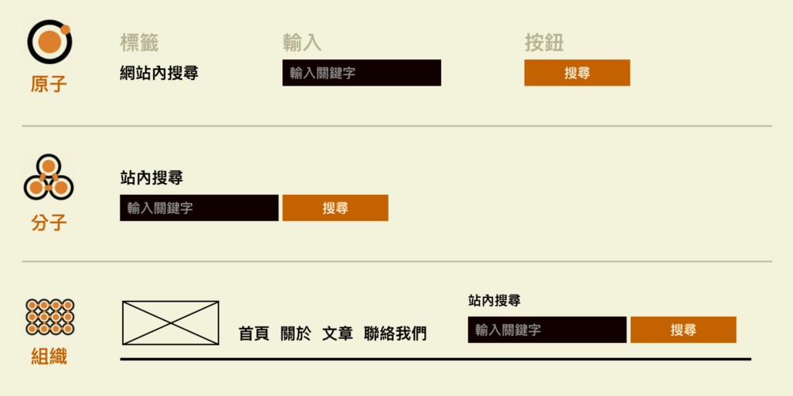
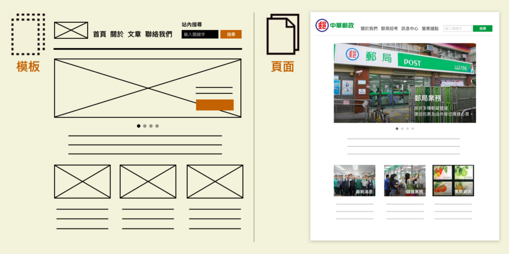

# 設計相關學習筆記

## 資料視覺化之理論

已整理為文章：
https://marco79423.net/articles/%E7%AD%86%E8%A8%98-%E8%B3%87%E6%96%99%E8%A6%96%E8%A6%BA%E5%8C%96%E4%B9%8B%E7%90%86%E8%AB%96/

## Atomic Design

Style guide 是設計師和工程師之間的共同語言，但問題是 style guide 需要額外的時間作業，對工程師來說內容太過抽象，而且通常都是在產品完成功才出現，所以大部分的時間都還是未完成的狀態。

所以 Brad Frost 提出一種設計方法論，讓設計師不是在設計網頁，而是改為設計系統裡面的元件。從原來的一頁一頁設計，改為先設計零件，然後再由工程師組合起來。元件不像 style guide 這麼抽象，本身的設計可以即時調整，過程中也可以直接實際在網頁 DEMO，既可以減少開發成本，也可以讓每個頁面有更一致的邏輯。而且對設計師來說，這方式天然可以減少重覆定義類型的元素。

元件抽象到具體分為五種階段：

* Atoms 原子
    * 為網頁構成的基本元素，如 Label、Input 或 Button
    * 也可以是抽象的概念，像是字體、色調等。
* Molecules 分子
    * 由元素構成的簡單 UI 物件，像是搜尋部件
* Organisms 組織
    * 相對分子而言，較為複雜的構成物，由原子及分子所組成。像是 Header 或 Footer。
* Templates 模板：
    * 以頁面為基礎的架構，將以上元素進行排版
* Pages 頁面
    * 將實際內容（圖片、文章等）套件在特定模板

透過五種不同的階段組合，創建一個有層次、計畫性的介面系統。

## 設計的十個原則

產品設計師 Rams 總結過好的設計的十個原則：

* 原則是好的產品富有創意，必須是一個創新的東西；
* 好的產品是有用的；
* 好的產品是美的；
* 好的產品是容易使用的；
* 好的產品是很含蓄不招搖的；
* 好的產品是誠實的；
* 好的產品經久不衰，不會隨著時間而過時；
* 好的產品不會放過任何細節；
* 它是環保的，不浪費任何資源的；
* 儘可能少的設計，或者說少即是多。

透過五種不同的階段組合，創建一個有層次、計畫性的介面系統。
