# MySQL 學習筆記

## 資料庫基礎

### 相關概念

* DB：資料庫，保存有組織的資料的容器
* DBMS：資料庫管理系統，用於管理資料庫的資料
* SQL：結構化查詢語言，用於和 DBMS 通訊的語言

### 關聯式資料庫管理系統 (Relational Database Management System, RDBMS)

目前常見的 RDBMS 有：

* MySQL
* SQLite
* PostgreSQL
* Oracle Database
* Microsoft SQL

關聯式資料庫的特色：

* 資料存放在一個或多個資料表當中。資料都是透過資料表中行列的二元關係呈現。
* 資料表需預先設定架構 (schema)
* 資料表之間的關係也需要預先定義好，使資料之間有明確的關聯
* 可以透過 SQL 語言進行資料操作

### 資料庫的三範式

資料庫正常化是有效地組織資料庫中的數據的過程。

歸一化處理的兩個原因：

* 消除冗餘數據，例如，存儲了一個以上的相同的數據在同一個表。
* 確保數據的相關性意義。

這兩者都是值得追求的目標，因為它們減少的空間的資料庫消耗的量，並確保數據在邏輯上存儲。規範化由一係列指導方針，幫助指導您創建一個良好的資料庫結構。

* 第一範式(1NF)
    * 1NF 是對屬性的原子性約束，要求字段具有原子性，不可再分解；(只要是關系型資料庫都滿足1NF)
* 第二範式(2NF)
    * 2NF是在滿足第一範式的前提下，非主鍵字段不能出現部分依賴主鍵
    * 解決：消除復合主鍵就可避免出現部分以來，可增加單列關鍵字。
* 第三範式 (3NF)
    * 3NF是在滿足第二範式的前提下，非主鍵字段不能出現傳遞依賴，比如某個字段a依賴於主鍵，而一些字段依賴字段a，這就是傳遞依賴。
    * 解決：將一個實體信息的數據放在一個表內實現。

### 事務

* 交易是單一工作單元。如果交易成功，便會確定交易期間所修改的所有資料，且會成為資料庫中永久的內容。如果交易發現錯誤，必須取消或回復，便會清除所有的資料修改。通俗易懂的說就是一組原子性的 SQL 查詢
* Mysql 中事務的支持在存儲引擎層，MyISAM 存儲引擎不支持事務，而 InnoDB 支持，這是 Mysql 5.5.5 以後默認引擎由 MyISAM 換成 InnoDB 的最根本原因。

#### 事務(Transaction) 的 ACID 屬性

* 原子性（Atomicity）
    * 作為邏輯工作單元，一個事務裡的所有操作的執行，要麼全部成功，要麼全部失敗（會撤會事務之前的狀態）。
* 一致性（Consistency）
    * 事務完成前後，資料都必須永遠符合 schema 的規範，保持資料與資料庫的一致性
* 隔離性（Isolation）
    * 多个事務同时操作相同資料庫的同一个数據时，一个事務的執行不受另外一个事務的干擾
        * 這通常使用鎖來實現。一個事務處理後的結果，影響了其他事務，那麼其他事務會撤回。事務的 100% 隔離，需要犧牲速度。
* 持久性（Durability）
    * 一旦事務提交，則其所做的修改就會永久保存到資料庫中，即使系統故障，修改的數據也不會丟失。

#### 事務的隔離級別

高併發可能的問題：

* 髒讀 (Dirty Read)
    * 如果一個事務還沒有提交，但是卻讀得到已經更新的結果，這個情形叫做 Dirty Read。 (一個事務讀取到另外一個事務未提交的結果) 。
    * 例子
        * Transaction A 在交易中連續讀取了兩次 Alice 的 balance，但是第一次讀的時候是 1000，但是在交易還沒完成前，另外一個 Transaction B 正好也在執行中，並且更改了 Alice 的 balance 變成 700，但是這個交易還沒有 commit 時，Transaction A 再次讀取 Alice 的 balance，數值卻讀取出尚未 commit 的數據
        700，這個現象就稱為 Dirty Read
            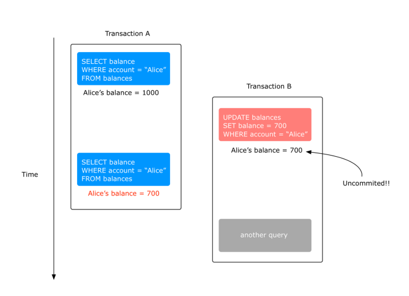
* 不可重複讀 (Non-repeatable reads)
    * 如果你在同一個事務裡面連續使用相同的 Query 讀取了多次資料，但是相同的 Query 卻回傳了不同的結果，這個現象稱為 Non-repeatable reads。
    * 一個事務讀到別人已經提交的結果，未提交也算，所以髒讀也是一種 Non-repeatable reads
    * 例子
        * Transaction A 第一次取得 Alice 的 balance 時是 1000，當它還在執行時，Transaction B 修改了 Alice 的balance 成 700 並且成功提交。此時 Transaction A 再次讀取相同的數值時，卻變成 700，這就是 Non-repeatable reads。
            
* 幻讀 (Phantom reads)
    * 當在同一個事務連續兩次讀取時，讀取出來的筆數跟上次不同，這個情況稱為 Phantom reads。
    * 一个事務讀取數據时，另外一个事務進行更新，导致第一个事務讀取到了没有更新的數據
    * 是指當事務不是獨立執行時發生的一種現象，比如第一個事務對一個表中的數據進行了修改，這種修改涉及到表中的全部數據行。同時，第二個事務也修改這個表中的數據，這種修改是向表中插入一行新數據就會發生，操作第一個事務的用戶發現表中還有沒有修改的數據行，就好像發生了幻覺一樣。
    * 不可重復讀重點在於update和delete，而幻讀的重點在於insert。
    * 例子：
        * 第一次讀取了帳戶裡面餘額介於 900–1000 這個範圍的帳戶，結果總共有兩筆：Alice 跟 Bob。在 Transaction A 還沒結束的同時，Transaction B 更新了 Alice’s
        balance 為 700，這時如果 Transaction A 再次查詢相同條件時，筆數從原本的 2 筆變成 1 筆，這個情況就是 Phantom reads。
            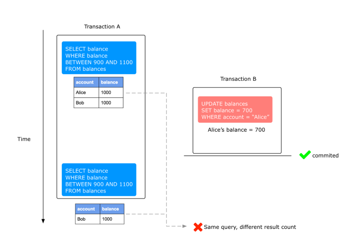
    * 心得：一個事務讀到別人還沒 commit 的結果 (但後來又讀到 commit 的結果，所以 gg)

為了儘可能的高並發，事務的隔離性被分為四個級別：

* 未提交讀（READ UNCOMMITTED）
    * 允許髒讀，一個事務還未提交，它的變更就能被別的事務看到。反過來說就是一個事務可能讀取到其他會話中未提交事務修改的數據
    * 例：事務 A 可以讀到事務 B 修改的但還未提交的數據，會導致髒讀（可能事務 B 在提交後失敗了，事務 A 讀到的數據是髒的）。
    * 會出現髒讀、不可重複讀、幻讀
* 提交讀（READ COMMITTED）
    * 一個事務提交後，它的變更才能被其他事務看到，也就是只能讀取到已經提交的數據。
    * 大多資料庫系統如 Oracle 的默認級別，但 Mysql 不是。
    * 可以避免髒讀，但還是會有不可重複讀和幻讀的問題
* 可重複讀（REPEATABLE READ）
    * 未提交的事務的變更不能被其他事務看到，同時一次事務過程中多次讀取同樣記錄的結果是一致的。
    * 可以避免髒讀、不可重複讀和一部分幻讀
    * 如果使用鎖機制來實現這兩種隔離級別，在可重復讀中，該sql第一次讀取到數據後，就將這些數據加鎖，其它事務無法修改這些數據，就可以實現可重復讀了。但這種方法卻無法鎖住insert的數據，所以當事務 A 先前讀取了數據，或者修改了全部數據，事務B還是可以insert數據提交，這時事務A就會發現莫名其妙多了一條之前沒有的數據，這就是幻讀，不能通過行鎖來避免。
    * Mysql 的默認級別，InnoDB 通過 MVVC 解決了幻讀的問題
* 可串行化（SERIALIZABLE）
    * 當兩個事務間存在讀寫衝突時，資料庫通過加鎖強制事務串行執行，是最高隔離的隔離級別。
    * 讀用讀鎖，寫用寫鎖，讀鎖和寫鎖互斥，這麼做可以有效的避免幻讀、不可重復讀、髒讀等問題，但會極大的降低數據庫的並發能力。
    * 可以避免髒讀、不可重複讀和幻讀
        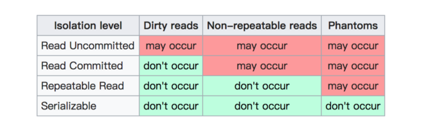

## MySQL 基礎

### 語法規範

* 不區分大小寫，但建議關鍵字大寫、table 名、column 名小寫。
* 最要用分號結尾，根據需要，可以縮排或換行
* 註解
    * 註解部分文字用 # 內容
    * 單行註解用 -- 內容
    * 多行註解用 `/*` 內容 `*/`

### MySQL 特殊語法

* 查看當前所有資料庫
    ```sql
    SHOW DATABASES;
    ```
* 查看指定資料庫的所有 table
    ```sql
    SHOW TABLES FROM database_name;
    ```
* 查看當前庫的
    ```sql
    SHOW TABLES;
    ```
* 使用指定的資料庫
    ```sql
    USE database_name;
    ```
* 查看 table 結構
    ```sql
    DESC table_name;
    ```
* 查看 MySQL 的版本
    ```sql
    SELECT version();
    ```
* 查看 MySQL 的存儲引擎
    ```sql
    SHOW engines;
    ```
* 更換存儲引擎
    ```sql
    ALTER TABLE 表格名稱 engine = myisam;
    ```

### 基本 SQL 語法

#### 數據定義語言 (DDL, Data Define Language）

* 資料庫管理
    * 創建資料庫
        ```sql
        CREATE DATABASE database_name;
        ```
    * 刪除資料庫
        ```sql
        DROP DATABASE database_name;
        ```

* 資料表管理
    * 創建 table
        * 語法
            ```sql
            CREATE TABLE table_name (
                column_name1 data_type,
                column_name2 data_type,
                column_name3 data_type,
                ···
            );
            ```
        * 例子
             ```sql
            CREATE TABLE IF NOT EXISTS stuinfo(
                stuId INT,
                stuName VARCHAR(20),
                gender CHAR,
                bornDate DATETIME
            );
            DESC studentinfo;
            ```

        * 限制條件
            * NOT NULL 非空值限制
                * 在預設的情況下，一個欄位是允許接受空值的，NOT NULL 用來限制該欄位不能接受空值。
                * 例子
                     ```sql
                    CREATE TABLE customer (
                        C_Id INT NOT NULL,
                        Name VARCHAR(50) NOT NULL,
                        Address VARCHAR(255),
                        Phone VARCHAR(20)
                    );
                    ```
            * UNIQUE 唯一限制
            * PRIMARY KEY 主鍵限制
            * FOREIGN KEY 外鍵限制
            * CHECK 檢查限制
            * DEFAULT 預設值限制
    * 修改 table
        * 增加欄位
            * 語法
                ```sql
                ALTER TABLE table_name ADD column_name datatype;
                ```
            * 例子
                 ```sql
                ALTER TABLE customers ADD Discount VARCHAR(10);
                ```
        * 修改 table 名
            * 例子
                 ```sql
                ALTER TABLE stuinfo RENAME [TO] studentinfo;
                ```
        * 修改欄位名稱
            * 例子
                 ```sql
                ALTER TABLE customers CHANGE COLUMN sex gender CHAR;
                ```
        * 修改欄位型別
            * 語法
                ```sql
                ALTER TABLE table_name ALTER COLUMN column_name datatype;
                ```
            * 例子
                ```sql
                ALTER TABLE customers ALTER COLUMN Discount DECIMAL(18, 2);
                ```
        * 刪除欄位
            * 例子
                 ```sql
                ALTER TABLE studentinfo DROP COLUMN email;
                ```
    * 刪除 table
        ```sql
        DROP TABLE [IF EXISTS] studentinfo;
        ```

#### 數據操作語言 (DML, Data Manipulate Language)

* 插入
    * INSERT INTO 是用來新增資料至某資料表 (table)。
    * 語法
        * 例子
            ```sql
            INSERT INTO table_name (column1, column2, column3...)
            VALUES (value1, value2, value3...);
            ```
        * 簡寫
            ```sql
            INSERT INTO table_name
            VALUES (value1, value2, value3...);
            ```
            * 使用簡寫的語法每個欄位的值都必需要依序輸入。
* 修改
    * 如果我們要修改資料表中的資料我們就會需要用到 UPDATE。
    * 語法
        * 修改單表
            ``````sql
            UPDATE 表名 set 字段=新值,字段=新值
            【WHERE 条件】
            ```
        * 修改多表
            ``````sql
            UPDATE 表1 别名1, 表2 别名2
            SET 字段=新值，字段=新值
            WHERE 连接条件
            AND 筛选条件
            ```

* 刪除
    * DELETE FROM 是用來刪除資料表中的資料。
    * 語法
        * 刪除單表
            ``````sql
            DELETE FROM 表名 【WHERE 筛选条件】
            ```

        * 刪除多表
            ``````sql
            DELETE FROM 表1 别名1，表2 别名2
            WHERE 连接条件
            AND 筛选条件;
            ```

        * 一次刪除所有資料
            * 方法 1
                ``````sql
                DELETE FROM table_name;
                ```
            * 方法 2
                ``````sql
                DELETE * FROM table_name;
                ```

            * 方法 3
                ``````sql
                TRUNCATE TABLE "表格名";
                ```

                1. truncate不能加where条件，而delete可以加where条件
                2. truncate的效率高一丢丢
                3. truncate 删除带自增长的列的表后，如果再插入數據，數據从1开始
                    * delete 删除带自增长列的表后，如果再插入數據，數據从上一次的断点处开始
                4. truncate删除不能回滚，delete删除可以回滚

#### 數據查詢語言 (DQL, Data Query Language)

##### SELECT

SELECT 很可能是最常用到的 SQL 語句，它是用來從資料庫取得資料，這個動作我們通常稱之為查詢 (query)，資料庫依 SELECT 查詢的要求會返回一個結果資料表 (result table)，我們通常稱之為資料集 (result-set)。

用法：

* 基礎查詢
    * 語法
        ``````sql
        SELECT table_column1, table_column2, table_column3...
        FROM table_name;
        ```

    * 注意事項
        * 盡量避免使用 `SELECT *`，因為一次取得整張資料表會比較耗費系統資源，記住一個原則，取得需要的資料就好，不多拿也不少拿
        * 查詢完的結果是一個虛擬的表格，不是真實存在
        * 查詢的內容可以是欄位、表達式、常數、函數等
* 條件查詢
    * 根據條件過濾結果，取出符合條件的數據
    * 語法
        ```sql
        SELECT table_column1, table_column2...
        FROM table_name
        WHERE column_name operator value;
        ```

* 排序查詢
    * 將取得的資料集依某欄位排序
    * 語法
        ``````sql
        SELECT table_column1, table_column2...
        FROM table_name
        ORDER BY column_name1 ASC|DESC, column_name2 ASC|DESC..
        ```
    * 排序分別可以由小至大 (ascending; 預設)，或由大至小 (descending)。
* 分組查詢
    * GROUP BY 敘述句搭配聚合函數 (aggregation function) 使用，是用來將查詢結果中特定欄位值相同的資料分為若干個群組，而每一個群組都會傳回一個資料列。若沒有使用 GROUP
        BY，聚合函數針對一個 SELECT 查詢，只會返回一個彙總值。
        ```sql
        SELECT column_name(s), aggregate_function(column_name)
        FROM table_name
        WHERE column_name operator value
        GROUP BY column_name1, column_name2...;
        ```

    * 範例
        ```sql
        SELECT customer, SUM(price) FROM orders
        GROUP BY customer;
        ```
    * HAVING
        * HAVING 子句是用來取代 WHERE 搭配聚合函數 (aggregate function) 進行條件查詢，因為 WHERE 不能與聚合函數一起使用。
        * 聚合函數指的也就是 AVG()、COUNT()、MAX()、MIN()、SUM() 等這些內建函數。
        * 語法
            ```sql
            SELECT column_name(s), aggregate_function(column_name)
            FROM table_name
            WHERE column_name operator value
            GROUP BY column_name1, column_name2...
            HAVING aggregate_function(column_name) operator value;
            ```
        * 範例
            ```sql
            SELECT customer, SUM(price) FROM orders
            GROUP BY customer
            HAVING SUM(price)<1000;
            ```
            * 只會留下總 price 小於 1000 的結果
* 多表連接查詢
    * SQL JOIN (連接) 是利用不同資料表之間欄位的關連性來結合多資料表之檢索。
        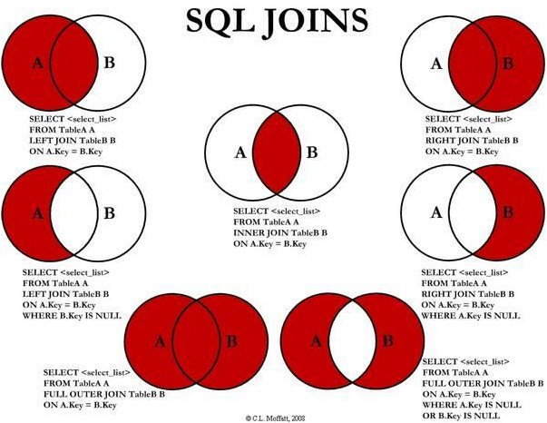
    * 類型
        * INNER JOIN 內部連接
            * INNER JOIN (內部連接) 為等值連接，必需指定等值連接的條件，而查詢結果只會返回符合連接條件的資料。
            * 語法
                * 寫法 1
                    ```sql
                    SELECT table_column1, table_column2...
                    FROM table_name1
                    INNER JOIN table_name2
                    ON table_name1.column_name=table_name2.column_name;
                    ```

                * 寫法 2
                    ```sql
                    SELECT table_column1, table_column2...
                    FROM table_name1
                    INNER JOIN table_name2
                    USING (column_name);
                    ```

        * LEFT (OUTER) JOIN 左外部連接
            * LEFT JOIN 可以用來建立左外部連接，查詢的 SQL 敘述句 LEFT JOIN 左側資料表 (table_name1) 的所有記錄都會加入到查詢結果中，即使右側資料表 (
                table_name2) 中的連接欄位沒有符合的值也一樣。
            * 語法
                ```sql
                SELECT table_column1, table_column2...
                FROM table_name1
                LEFT OUTER JOIN table_name2
                ON table_name1.column_name=table_name2.column_name;
                ```

                * OUTER 可省略，變成 `LEFT JOIN`
        * RIGHT (OUTER) JOIN 左外部連接
            * 相對於 LEFT JOIN，RIGHT JOIN 可以用來建立右外部連接，查詢的 SQL 敘述句 RIGHT JOIN 右側資料表 (table_name2)
                的所有記錄都會加入到查詢結果中，即使左側資料表 (table_name2) 中的連接欄位沒有符合的值也一樣。
            * 語法
            * 語法
                ```sql
                SELECT table_column1, table_column2...
                FROM table_name1
                RIGHT OUTER JOIN table_name2
                ON table_name1.column_name=table_name2.column_name;
                ```
                * OUTER 可省略，變成 `RIGHT JOIN`
                * 看起來 sqlite 不支援 `RIGHT JOIN`

        * FULL (OUTER) JOIN 全部外部連接
            * `FULL JOIN` 即為 `LEFT JOIN` 與 `RIGHT JOIN` 的聯集，它會返回左右資料表中所有的紀錄，不論是否符合連接條件。
            * 語法
                ```sql
                SELECT table_column1, table_column2...
                FROM table_name1
                FULL JOIN table_name2
                ON table_name1.column_name=table_name2.column_name;
                ```
        * CROSS JOIN 交叉連接
            * 交叉連接為兩個資料表間的笛卡兒乘積 (Cartesian product)，兩個資料表在結合時，不指定任何條件，即將兩個資料表中所有的可能排列組合出來，以下例而言 CROSS JOIN
                出來的結果資料列數為 3×5=15 筆，因此，當有 WHERE、ON、USING 條件時不建議使用。
            * 語法
                * 寫法 1
                    ```sql
                    SELECT table_column1, table_column2...
                    FROM table_name1
                    CROSS JOIN table_name2;
                    ```
                * 寫法 2
                    ```sql
                    SELECT table_column1, table_column2...
                    FROM table_name1, table_name2;
                    ```

                * 寫法 3
                    ```sql
                    SELECT table_column1, table_column2...
                    FROM table_name1
                    JOIN table_name2;
                    ```

        * NATURAL JOIN 自然連接
            * 自然連接有 NATURAL JOIN、NATURAL LEFT JOIN、NATURAL RIGHT JOIN，兩個表格在進行 JOIN 時，加上 NATURAL
                這個關鍵字之後，兩資料表之間同名的欄位會被自動結合在一起。
            * 語法
                ```sql
                SELECT table_column1, table_column2...
                FROM table_name1
                NATURAL JOIN table_name2;
                ```

    * 用法
        * 自連接
            ```sql
            SELECT e.id,
                    e.name,
                    f.name AS manager
            FROM employees e
                        JOIN employees f ON e.manager_id = f.id;
            ```

* 子查詢
    * 一條查詢語句中又嵌套了另一條完整的 SELECT 語句，其中被嵌套的 SELECT 語句，称为子查询或内查询；在外面的查询语句，称为主查询或外查询
    * 語法
        ```sql
        SELECT ...
        FROM ...
        WHERE 查詢條件  <- 這兩個地方都可以用子查詢
        HAVING 分組條件 <-
        ```

        * 子查詢根據查詢結果的筆數不同可以分為兩類：
            * 單行子查詢
                * 子查詢不可以指定超過一個欄位的回傳值，也不可回傳超過一筆紀錄 (或為空)
                * 一般搭配单行操作符使用：> < = <> >= <=
                * 例子：
                    ```sql
                    SELECT Name, GNP
                    FROM country
                    WHERE GNP = (SELECT MAX(GNP) FROM country)
                    ```

                    * 子查詢都放在小括號內
                    * 此例中子查詢不可以指定超過一個欄位的回傳值，也不可回傳超過一筆紀錄
            * 多行子查詢
                * 結果有多筆，一般搭配 ANY, ALL, IN, NOT IN使用 (ANY, ALL 往往可以用其他查詢代替)
                * 例子
                    ```sql
                    SELECT Name
                    FROM country
                    WHERE Code IN (SELECT CountryCode FROM city WHERE Population > 9999)
                    ```
                    * 只用 `IN` 可以回傳多筆資料，用 `NOT IN` 也成
* 分頁查詢 (使用 LIMIT)
    * TOP (SQL Server), LIMIT (MySQL), ROWNUM (Oracle) 這些語法其實都是同樣的功能，都是用來限制您的 SQL
        查詢語句最多只影響幾筆資料，而不同的語法則只因不同的資料庫實作時採用不同的名稱。
    * 語法
        ```sql
        SELECT table_column1, table_column2...
        FROM table_name LIMIT 【起始的条目索引，】条目数;
        ```
        * 起始条目索引从0开始
        * limit子句放在查询语句的最后
    * 常用公式
        ```sql
        SELECT * FROM table LIMIT （要顯示的頁數-1）* 每頁條目數, 每頁條目數
        ```

* 聯合查詢 UNION
    * UNION 運算子用來將兩個(以上) SQL 查詢的結果合併起來，而由 UNION 查詢中各別 SQL 語句所產生的欄位需要是相同的資料型別及順序。
    * UNION 查詢只會返回不同值的資料列，有如 `SELECT DISTINCT`。
    * UNION 就是像是 OR (聯集)，如果紀錄存在於第一個查詢結果集或第二個查詢結果集中，就會被取出。
    * UNION 與 JOIN 不同的地方在於，JOIN 是作橫向結合 (合併多個資料表的各欄位)；而 UNION 則是作垂直結合 (合併多個資料表中的紀錄)。
    * 要求
        1. 多条查询语句的查询的列数必须是一致的
        2. 多条查询语句的查询的列的类型几乎相同
    * 語法
        * UNION
            ```sql
            SELECT column_name(s) FROM table_name1
            UNION
            SELECT column_name(s) FROM table_name2;
            ```

        * UNION ALL
            ```sql
            SELECT column_name(s) FROM table_name1
            UNION ALL
            SELECT column_name(s) FROM table_name2;
            ```
            * UNION 會去掉重覆的，UNION ALL 則不會
* 分支查詢
    * CASE
        * CASE 類似於程式語言裡的 if/then/else 語句，用來作邏輯判斷。
        * 語法
            * 類似 switch 的用法
                ```sql
                CASE expression
                    WHEN value THEN result
                    [WHEN···]
                    [ELSE result]
                END;
                ```

                * 如果是放在 begin end 中需要加上 case，如果放在 select 后面不需要
                * 例子
                    ```sql
                    SELECT Name,
                        CASE Answer
                            WHEN 1 THEN '喜歡'
                            WHEN 2 THEN '不喜歡'
                            WHEN 3 THEN '還OK'
                        END
                    FROM questionnaire;
                    ```

            * 類似 if/else 的用法
                ```sql
                CASE
                    WHEN condition THEN result
                    [WHEN···]
                    [ELSE result]
                END;
                ```

                * 如果是放在 begin end 中需要加上 case，如果放在 select 后面不需要
                * 例子
                    ```sql
                    SELECT Name,
                        CASE
                            WHEN Answer=1 THEN '喜歡'
                            WHEN Answer=2 THEN '不喜歡'
                            WHEN Answer=3 THEN '還OK'
                        END
                    FROM questionnaire;
                    ```

##### 函式

字串函數 (SQL String Functions)：

* concat 拼接
* substr 截取子串
* upper 转换成大写
* lower 转换成小写
* trim 去前后指定的空格和字符
* ltrim 去左边空格
* rtrim 去右边空格
* replace 替换
* lpad 左填充
* rpad 右填充
* instr 返回子串第一次出现的索引
* length 获取字节个数

數值函數 (SQL Mathematical Functions)：

* round 四舍五入
* rand 随机数
* floor 向下取整
* ceil 向上取整
* mod 取余
* truncate 截断

聚合函數 (SQL Aggregate Functions) (會合併欄位)：

* sum 求和
* max 最大值
* min 最小值
* avg 平均值
* count 计数
    * `COUNT(expr)` ，返回 SELECT 語句檢索的行中 expr 的值不為NULL的數量。結果是一個BIGINT值。如果查詢結果沒有命中任何記錄，則返回0
    * 執行效果上：
        * `count(*)`
            * 包含所有列，相當於行數，**會包含值為NULL**
            * `COUNT(*)` 是SQL92定義的標準統計行數的語法，因為他是標準語法，所以MySQL資料庫對他進行過很多優化。
                * 使用 MyISAM 的狀況
                    * MyISAM 不支持事務，MyISAM中的鎖是表級鎖，同一張表上面的操作需要串行進行，所以 MyISAM
                        做了一個簡單的優化，那就是它可以把表的總行數單獨記錄下來，如果從一張表中使用 `COUNT(*)`
                        進行查詢的時候，可以直接返回這個記錄下來的數值就可以了，當然前提是不能有where條件。
                * 使用 InnoDB 的狀況
                    * 而InnoDB支持事務，並且支持行級鎖，所以可能表的行數可能會被併發修改，那麼緩存記錄下來的總行數就不準確了。但是 InnoDB 還是針對 `COUNT(*)` 語句做了些優化的。從MySQL 8.0.13開始，針對InnoDB的SELECT COUNT(*) FROM tbl_name語句，確實在掃表的過程中做了一些優化。前提是查詢語句中不包含WHERE或GROUP BY等條件。
            * `COUNT(*)` 的目的只是為了統計總行數，根本不關心自己查到的具體值，所以如果能夠在掃表的過程中，選擇一個成本較低的索引進行的話，那就可以大大節省時間。
                * 我們知道，InnoDB中索引分為聚簇索引（主鍵索引）和非聚簇索引（非主鍵索引），聚簇索引的葉子節點中保存的是整行記錄，而非聚簇索引的葉子節點中保存的是該行記錄的主鍵的值。
                * 所以，相比之下，非聚簇索引要比聚簇索引小很多，所以MySQL會優先選擇最小的非聚簇索引來掃表。所以，當我們建表的時候，除了主鍵索引以外，創建一個非主鍵索引還是有必要的。
        * `count(1)`
            * 包含所有列，相當於行數，**會包含值為NULL**
            * 在 InnoDB 中 `COUNT(*)` 和 `COUNT(1)` 實現上沒有區別，而且效率一樣，因為COUNT(*)
                是SQL92定義的標準統計行數的語法，並且效率高，所以請直接使用COUNT(*)查詢表的行數。
                * MySQL官方文檔："InnoDB handles SELECT COUNT(*) and SELECT COUNT(1) operations in the same way.
                    There is no performance difference."
        * `count(列名)`
            * 只包括列名那一列，在統計結果的時候，**會忽略列值為 NULL**
            * 他的查詢就比較簡單粗暴了，就是進行全表掃瞄，然後判斷指定字段的值是不是為NULL，不為NULL則累加。
            * 相比COUNT(*)，COUNT(字段)多了一個步驟就是判斷所查詢的字段是否為NULL，所以他的性能要比COUNT(*)慢。

時間相關：

* now 当前系统日期+时间
* curdate 当前系统日期
* curtime 当前系统时间
* str_to_date 将字符转换成日期
* date_format 将日期转换成字符

其他：

* version 版本
* database 当前库
* user 当前连接用户

#### 資料控制語言 (DCL)

* 新增使用者
    * MySQL
        ```sql
        CREATE USER 'username'@'hostname' IDENTIFIED BY '密碼';
        ```
        * `hostname` 表示允許這個帳號由什麼地方連線登入 (localhost 表示只允許從本地端登入；% 是萬用字元，表示允許從任何地方登入。)
        * 建立新帳號後，這帳號預設沒有權限可以對資料庫做任何事，接著你必須授與資料庫使用權限給這帳號
* 刪除使用者
    * MySQL
        ```sql
        DROP USER 'username'@'hostname';
        ```

* 授與資料庫使用權限
    * 建立一個新帳號後，你要授與資料庫使用權限給這位使用者，這帳號才能開始連線進去資料庫操作。
    * MySQL
        ```sql
        GRANT type_of_permission ON database_name.table_name TO 'username'@'hostname';
        ```

        * 例子：
            * 授與 mike 所有資料庫和所有資料表的所有操作權限：

                ```sql
                GRANT ALL PRIVILEGES ON *.* TO 'mike'@'%';

                -- 要記得下這個指令讓權限開始生效
                FLUSH PRIVILEGES;
                ```

            * 同時授與多個權限

                ```sql
                GRANT SELECT,INSERT ON customers.* TO 'mike'@'%';
                ```

        * 常見的權限類型
            * ALL PRIVILEGES - 所有的權限
            * CREATE - 可以建立資料表或資料庫的權限
            * DROP - 可以刪除資料表或資料庫的權限
            * DELETE - 可以在資料表中刪除資料的權限
            * INSERT - 可以新增資料到資料表的權限
            * SELECT - 可以查詢資料表的權限
            * UPDATE - 可以更新資料表中的資料的權限
            * GRANT OPTION - 可以授權使用權限給其他使用者的權限
* 撤銷資料庫使用權限
    * MySQL
        ```sql
        REVOKE type_of_permission ON database_name.table_name FROM 'username'@'hostname';
        ```

        * 例子
            ```sql
            REVOKE ALL PRIVILEGES FROM 'mike'@'%';

            -- 要記得下這個指令讓權限開始生效
            FLUSH PRIVILEGES;
            ```

#### SQL 學習資源

* Select Star SQL
    * <https://selectstarsql.com> (待看)

#### 事務控制語言 (TCL, Transaction Control Language)

事務控制語言(如：commit、rollback)


* 查詢 MySQL 當前的隔離級別
    ```sql
    SELECT @@global.tx_isolation,@@tx_isolation;
    ```

* 設定 MYSQL 的隔離級別
    ```
    set [ global | session ] transaction isolation level [Read uncommitted | Read committed | Repeatable | Serializable];
    ```
    * 例子
        ```sql
        set session transaction isolation level Serializable;
        ```

* 兩種類型的事務
    * 隐式事務
        * 没有明显的开启和结束事務的标志
        * 比如insert、update、delete语句本身就是一个事務
    * 显式事務
        * 具有明显的开启和结束事務的标志 1、开启事務 取消自动提交事務的功能 2、编写事務的一组逻辑操作单元（多条sql语句） insert update delete 3、提交事務或回滚事務
* 事務的自動提交
    * Mysql 默認採用自動提交（AUTOCOMMIT)模式，也就是說，如果不顯示地開始一個事務，則每個查詢都被當做一個事務執行提交操作。
        * 查看 mysql 是否打開自動提交
            ```sql
            show variables like 'AUTOCOMMIT'; -- ON 代表啟用，OFF 代表禁用
            ```
        * 打開或關閉自動提交
            ```sql
            SET AUTOCOMMIT = 0; -- 0 關閉、1 開啟
            ```
              * 關閉後所有 DML 語句都會在同一個事務中，直到 COMMIT 或 ROLLBACK 為止。

    * 可以通過 `START TRANSACTION` 或 `BEGIN` 開啟一個事務，開啟的事務會自動執行 `SET AUTOCOMMIT = 0;`，並在事務後變回 `SET AUTOCOMMIT = 1;`

* 語法
    * START TRANSACTION | BEGIN： 顯式地開啟一個事務；
    * COMMIT：也可以使用 COMMIT WORK，不過二者是等價的。COMMIT 會提交事務，並使已對資料庫進行的所有修改成為永久性的；
    * ROLLBACK：也可以使用 ROLLBACK WORK，不過二者是等價的。回滾會結束用戶的事務，並撤銷正在進行的所有未提交的修改；
    * SAVEPOINT identifier：SAVEPOINT 允許在事務中創建一個保存點，一個事務中可以有多個 SAVEPOINT；
    * RELEASE SAVEPOINT identifier：刪除一個事務的保存點，當沒有指定的保存點時，執行該語句會拋出一個異常；
    * ROLLBACK TO identifier：把事務回滾到標記點；
    * SET TRANSACTION：用來設置事務的隔離級別。
* 事務的 ACID 透過 redo/undo log 實現原子性、持久性和一致性，透過鎖或 MVCC 機制來完成隔離性
    * redo log (重做日誌) / undo log (撤銷日誌)
        * redo log
            * 重做日誌用來實現事務的原子性和持久性，由以下兩部分組成：
                * 重做日誌緩衝區（redo log buffer）
                    * 內存中，易丟失。
                * 重做日誌文件（redo log file）
                    * 磁盤中，持久的。
                    * redo log file 是順序寫入的，在資料庫運行時不需要進行讀取，只會在資料庫啟動的時候讀取來進行數據的恢復工作。
                    * redo log file 是物理日誌，所謂的物理日誌是指日誌中的內容都是直接操作物理頁的命令。重做時是對某個物理頁進行相應的操作。
            * 流程
                * 第一步：先將原始數據從磁盤中讀入內存中來，修改數據的內存拷貝。
                * 第二步：生成一條重做日誌並寫入redo log buffer，記錄的是數據被修改後的值。
                * 第三步：在「必要的時候」，採用追加寫的方式將 redo log buffer 中的內容刷新到 redo log file。
                    * 事務提交時（最常見的情景，在 commit 之前）
                    * 當 log buffer 中有一半的內存空間被使用時
                    * log checkpoint 時
                    * 實例 shutdown 時
                    * binlog切換時
                    * 後台線程
                * 第四步：定期將內存中修改的數據刷新到磁盤中。
            * 事務提交時將 redo log buffer 寫入 redo log file，為了保證數據一定能正確同步到磁盤（不僅僅只寫到文件緩衝區中）文件中，InndoDB 默認情況下調用了 fsync 進行寫操作。
            * InnoDB 提供了參數 innodb_flush_log_at_trx_commit 來配置 redo log 刷新到磁盤的策略，有以下三個值：
                * 0
                    * 事務提交不會觸發 redo 寫操作，而是留給後台線程每秒一次的刷盤操作，因此實例 crash 將最多丟失一秒鐘內的事務。
                    * 性能最好，可靠性最差
                * 1
                    * 每次事務提交都要做一次 fsync，這是最安全的配置，即使宕機也不會丟失事務
                    * 性能最差，可靠性最好
                    * 當 innodb_flush_log_at_trx_commit 設置為 0 或者 2 時喪失了事務的 ACID 特性，通常在日常環境時將其設置為 1，而在系統高峰時將其設置為 2 以應對大負載。
                * 2
                    * 則在事務提交時只做 write 操作，只保證寫到系統的緩衝區，因此實例crash不會丟失事務，但宕機則可能丟失事務
        * undo log (撤銷日誌)
            * 用來保證事務的一致性。
            * undo log 用來實現事務的一致性，InndoDB 可以通過 redo log 對頁進行重做操作。但是有時候事務需要進行回滾，這時就需要 undo log。
            * undo log 還可可以用來協助 InnoDB 引擎實現 MVCC 機制。
            * undo log 是邏輯日誌，恢復時並不是對物理頁直接進行恢復，而是邏輯地將資料庫恢復到原來的樣子。
            * undo log 的產生也會伴隨著 redo log 的產生。
            * 流程
            * 在 InnoDB 中 undo log 分為 insert undo log 和 update undo log
                * insert undo log
                    * insert 操作產生的日誌。根據隔離性，insert 插入的記錄只對本事務可見，所以事務提交後可以刪除因 insert 產生的日誌。
                * update undo log
                    * delete 和 update 操作產生的日誌。根據前面的 MVCC 機制可以知道此部分記錄還有可能要被其他事務所使用，所以即使事務提交也不能刪除相應的日誌。在事務提交時會被保存到 undo
                      log 鏈表，在 purge 線程中做最後的刪除。
        * 例子
            * 假設有A，B兩個數據，原值分別為 1, 2；現將A更新為10，B 更新為 20
                1. 事務開始
                2. 記錄 A = 1 到 undo log
                3. 更新 A = 10
                4. 記錄 A = 10 到 redo log
                5. 記錄 B = 2 到 undo log
                6. 更新 B = 20
                7. 記錄 B = 20 到 redo log
                8. redo log 信息寫入磁盤
                9. 提交事務
    * 事務的 MVCC 機制
        * Mysql 的事務型存儲引擎（InnoDB）使用 MVCC（Multi-Version Concurrency Control，多版本並發控制）代替行級鎖來提高並發讀寫的性能。InnoDB 的 MVCC
          原理比較簡單，它通過在在每行記錄後面保存三個隱藏列（事務 id，行的創建的版本號、行的過期版本號）來實現的，
        * InnoDB 在 REPEATABLE READ 隔離級別下 MVCC 的簡化工作原理：
            * INSERT: InnoDB 為新插入的每一行保存當前系統版本號作為行版本號。
            * UPDATE: InnoDB 為插入一行新記錄，保存當前系統版本號作為行版本號，同時保存當前系統版本號到原來的行作為行刪除標識。
            * DELETE: InnoDB 為刪除的每一行保存當前系統版本號作為行刪除標識。
            * SELECT: InnoDB 會根據以下兩個條件檢查每行記錄：
                * InnoDB只查找版本早於當前事務版本的數據行（也就是，行的系統版本號小於或等於事務的系統版本號），這樣可以確保事務讀取的行，要麼是在事務開始前已經存在的，要麼是事務自身插入或者修改過的。
                * 行的刪除版本要麼未定義，要麼大於當前事務版本號。這可以確保事務讀取到的行，在事務開始之前未被刪除。

### 重要功能

#### 變量

在 MySQL 中，變量可分為兩大類，即系統變量和自定義變量，這是一種粗略的分法。但是根據實際應用又被細化為四種類型，即局部變量、用戶變量、會話變量和全局變量。

##### 系統變量

* 全局變量
    * 作用域：针对于所有会话（连接）有效，但不能跨重启
        * 當服務啟動時，它將所有全局變量初始化為默認值。
    * 語法
        * 查看所有全局变量

            ```sql
            SHOW GLOBAL VARIABLES;
            ```

        * 查看满足条件的部分系统变量

            ```sql
            SHOW GLOBAL VARIABLES LIKE '%char%';
            ```

        * 查看指定的系统变量的值

            ```sql
            SELECT @@global.autocommit;
            ```

        * 为某个系统变量赋值

            ```sql
            SET @@global.autocommit=0; 
            SET GLOBAL autocommit=0; -- global不能省略
            ```

* 會話變量
    * 作用域：针对于当前会话（连接）有效
        * 服務器會為每個連接的客戶端維護一個會話變量。
    * 語法
        * 查看所有会话变量

            ```sql
            SHOW SESSION VARIABLES;
            ```

        * 查看满足条件的部分会话变量

            ```sql
            SHOW SESSION VARIABLES LIKE '%char%';
            ```

        * 查看指定的会话变量的值

            ```sql
            SELECT @@autocommit;
            SELECT @@session.tx_isolation;
            ```

        * 为某个会话变量赋值

            ```sql
            SET @@session.tx_isolation='read-uncommitted';
            SET SESSION tx_isolation='read-committed';
            ```

##### 自定义变量

* 用戶變量
    * 用戶變量是基於會話變量實現的，可以暫存，用戶變量與連接有關，也就是說一個客戶端定義的變量不能被其他客戶端使用看到。當客戶端退出時，鏈接會自動釋放。
    * 声明并初始化：

        ```sql
        SET @变量名=值;
        SET @变量名:=值;
        SELECT @变量名:=值;
        ```

    * 赋值：
        * 方式一：一般用于赋简单的值

            ```sql
            SET 变量名=值;
            SET 变量名:=值;
            SELECT 变量名:=值;
            ```

        * 方式二：一般用于赋表中的字段值

            ```sql
            SELECT 字段名或表达式 INTO 变量 FROM 表;
            ```

    * 使用：

        ```sql
        select @变量名;
        ```

* 局部变量
    * MySQL 中的局部變量與 Java 很類似 ，Java 中的局部變量是 Java 所在的方法或者代碼塊，而 MySQL 中的局部變量作用域是所在的存儲過程。MySQL 局部變量使用 declare 來聲明。
    * 声明：
        ```sql
        declare 变量名 类型 【default 值】;
        ```

    * 赋值：
        * 方式一：一般用于赋简单的值
            ```sql
            SET 变量名=值;
            SET 变量名:=值;
            SELECT 变量名:=值;
            ```

        * 方式二：一般用于赋表 中的字段值
            ```sql
            SELECT 字段名或表达式 INTO 变量 FROM 表;
            ```

    * 使用：
        ```sql
        select 变量名
        ```

#### 索引 Index

所有的 MySQL 類型都可以進行索引，對相關列使用索引是提高 SELECT 查詢性能的最佳途徑。MyISAM 和 InnoDB 都是使用 B+TREE 作為索引，MySQL 5 不支持函數索引，但是支持前綴索引。

* 索引是資料庫的搜索引擎使用，以加快數據檢索特定的查找表。簡單地說，索引是一個指向表中的數據。資料庫中的索引非常類似於在一本書的索引。
    * 例如，如果你想引用一本書的所有頁麵以討論某個話題，首先參考索引，其中列出了所有的主題字母順序，然後被轉介到一個或多個特定的頁碼。
* 索引有助於加快 SELECT 和 WHERE 子句查詢，但它會降低數據寫入速度，使用 UPDATE 和 INSERT 語句。索引可創建或刪除，但對數據不會有影響。
* 索引是唯一的，類似於 UNIQUE 約束，索引防止在列的列或組合在其上有一個索引重複條目。
* 對於使用 InnoDB 存儲引擎的表來說，記錄會按照一定的順序保存。如果有明確的主鍵定義，那麼會按照主鍵的順序進行保存；如果沒有主鍵，但是有唯一索引，那麼就按照唯一索引的順序進行保存。如果既沒有主鍵又沒有唯一索引，那麼表中會自動生成一個內部列，按照這個列的順序進行保存。一般來說，使用主鍵的順序是最快的。

##### 索引生效條件

* 最左前缀原则
    * 最左優先，以最左邊的為起點任何連續的索引都能匹配上。同時遇到范圍查詢(>、<、between、like)就會停止匹配
    * `index (a, b, c)`
        * `a=1 AND c=1`，a 生效，c 不生效
        * `b=1 AND c=1`，都不生效
        * `a=1 AND b > 5 AND c=3`, a 和 b 生效，c 不生效。
* 模糊查詢時，使用 `%` 匹配時：`s%` 會使用索引，`%s` 不會使用索引
* 條件中有 `OR` ，索引不會生效

##### 類型

* INDEX 普通索引
    * 數據可以重復，沒有任何限制
* UNIQUE 唯一索引
    * 不可以出現相同的值，數據必須唯一，但可以有空值
    * 如果是組合索引，那表組合必須唯一
* PRIMARY KEY 主鍵索引
    * 特殊的唯一索引，一個表只能有一個主鍵，不允許空值
* fulltext index 全文索引
    * 全文索引，只有 char，varchar，text 列才能創建全文索引，主要用於查找文本中的關鍵字，並不是直接與索引中的值進行比較。更像是一個搜索引擎，配合 match against 操作使用，而不是一般的where語句加like
    * 並沒有什麼用，因為只有 MyISAM 支援，而且只支援英文，並且效率讓人不敢恭維，但是可以用 coreseek 和 xunsearch 等第三方應用來完成這個需求

##### 語法

* 建立
    * 單列索引
        * 語法
            ```sql
            CREATE INDEX index_name
            ON table_name (column_name);
            ```

    * 唯一索引
        * 唯一索引不僅用於性能，而且要求數據的完整性。唯一索引不允許有任何重複值插入到表中
        * 語法
            ```sql
            CREATE UNIQUE INDEX index_name
            ON table_name (column_name);
            ```

    * 組合索引
        * 組合索引在表上的兩個或多個列的索引。
        * 是否要創建一個單列索引或複合索引，考慮到列，您可以使用非常頻繁的查詢的 WHERE 子句作為過濾條件。
        * 應該有隻有一個使用列，單列指數應的選擇。如果有頻繁使用WHERE子句作為過濾器中的兩個或多個列，組合索引將是最好的選擇。
        * 語法
            ```sql
            CREATE INDEX index_name
            ON table_name (column1, column2);
            ```

    * 隱式索引
        * 隱式索引是自動由資料庫服務器創建對象時創建的索引。索引是主鍵約束和唯一性約束自動創建。
* 刪除
    * 索引可以使用 SQL DROP 命令刪除。 應當謹慎刪除索引時導致的性能可能會減慢或改善。
    * 語法
        ```sql
        DROP INDEX index_name ON table_name;
        ```

##### 使用建議

* 索引不應該用於對包含大量 NULL 值的列。
* 主鍵索引欄位最好是數字型態，千萬不要用其他的型態，以免傷了效能
* 經常與其他表進行 `JOIN` 的表，在 `JOIN` 欄位上應該建立索引
* 經常出現在 `WHERE` 子句中的欄位，特別是大表的欄位，應該建立索引
* 索引的欄位必須是經常作為查詢條件的欄位 (`WHERE` 內，而非 `SELECT` 內)
* 索引應該建在小欄位上，對於大的文字欄位甚至超長欄位，不要建索引
* 有頻繁的，大批量更新或插入操作的表，不要建立太多的索引
* 少量數據不用加索引
* 很少使用的字段，不需要加索引
* 不要過度索引。不是索引越多越好，每個額外的索引都要佔用額外的磁碟空間，並降低寫操作的效能。
* 利用最左前綴，在創建一個 n 列的索引時，實際上是創建了 MySQL 可利用的 n 個索引。多列索引可以起到幾個索引的作用，利用索引最左邊的列來匹配行，這樣的列稱為最左前綴。
* 考慮在列上進行的比較型別。索引可用於 `<`、`<=`、`=`、`>=`、`>` 和 `BETWEEN` 運算。在模式具有一個直接量字首時，索引也用於 `LIKE` 運算。
* 於值唯一不重複的列要新增唯一索引，可以更快速的通過該索引來確定某條記錄。唯一索引是最有效的。
* 複合索引的建立需要進行仔細分析；儘量考慮用 單欄位索引代替：過多的複合索引，在有單欄位索引的情況下，一般都是沒有存在價值的；相反，還會降低資料增加刪除時的效能，特別是對頻繁更新的表來說，負面影響更大。
* 正確選擇複合索引中的主列欄位，一般是選擇性較好的欄位
* 複合索引的幾個欄位是否經常同時以 `AND` 方式出現在 `WHERE` 子句中？單欄位查詢是否極少甚至沒有？如果是，則可以建立複合索引；否則考慮單欄位索引；
* 如果複合索引中包含的欄位經常單獨出現在 `WHERE` 子句中，則分解為多個單欄位索引
* 如果複合索引所包含的欄位超過 3 個，那麼仔細考慮其必要性，考慮減少複合的欄位
* 如果既有單欄位索引，又有這幾個欄位上的複合索引，一般可以刪除複合索引
* 如果索引多個欄位，第一個欄位要是經常作為查詢條件的。如果只有第二個欄位作為查詢條件，這個索引不會起到作用
* 不要對索引欄位進行運算，要想法辦做變換
    ```sql
    SELECT ID FROM T WHERE NUM/2=100  -- bad
    SELECT ID FROM T WHERE NUM = 100*2  -- good
    ```
* 時常刪除無用的索引，避免對執行計劃造成負面影響
* 一般情況下，左連接給左表加索引。右連接給右表加索引。
* 索引不能使用不等於（!= <>）或is null (is not null)，否則自身以及右側所有全部失效(針對大多數情況)。復合索引中如果有>，則自身和右側索引全部失效。
* 盡量不要使用類型轉換（顯示、隱式），否則索引失效
    ```sql
    select * from teacher where tname = 123 ; -- 隱含的型態轉換
    ```
* 盡量不要使用or，否則索引失效
    * or很猛，會讓自身索引和左右兩側的索引都失效

##### B+Tree

MySQL 為什麼選擇了B+Tree作為它索引的資料結構呢。

* 和平衡二叉樹相比，B+Tree 的深度更低，節點儲存關鍵字更多，磁碟 IO 次數更少，查詢計算效率更好。
* B+Tree 的全域性掃描能力更強，若是想根據索引資料對資料表進行全域性掃描，B-Tree會將整棵樹進行掃描，然後逐層遍歷。而 B+Tree 呢，只需要遍歷葉子節點即可，因為葉子節點之間存在順序引用的關係。
* B+Tree 的磁碟 IO 讀寫能力更強，因為 B+Tree 的每個分支節點上只儲存了關鍵字，這樣每次磁碟IO在讀寫的時候，一頁 16K 資料量可以儲存更多的關鍵字了，每個節點上儲存的關鍵字也比 B-Tree 更多。這樣 B+Tree 的一次磁碟IO載入的資料比 B-Tree 多很多了。
* B+Tree 資料結構中有天然的排序能力，比其他資料結構排序能力更強而且排序時，是通過分支節點來進行的，若是需要將分支節點載入到記憶體中排序，一次載入的資料更多。
* B+Tree 的查詢效果更穩定，因為所有的查詢都是需要掃描到葉子節點才將資料返回的。效果只是穩定而不一定是最優，若是直接查詢B-Tree的根節點資料，那麼B-Tree只需要一次磁碟IO就可以直接將資料返回，反而是效果最優。

* 參考文章： [MySQL的索引為什麼用B+Tree？InnoDB的資料儲存檔案和MyISAM的有何不同？](https://iter01.com/584005.html)

#### 視圖 View

* 簡介
    * 視圖的英文名稱是 view，它是一種虛擬存在的表。視圖對於用戶來說是透明的，它並不在資料庫中實際存在，視圖是使用資料庫行和列動態組成的表。
    * 是一種處擬存在的 Table，本身不包含數據，數據來自定義 View 時所使用的 Table (base table)。
    * 使用方式和 table 幾乎完全相同，而且不占用物理空間 (僅保持使用的 sql 邏輯)
* 好處
    * 使用視圖可以簡化操作：使用視圖我們不用關注表結構的定義，我們可以把經常使用的數據集合定義成視圖，這樣能夠簡化操作。
    * 安全性：用戶對視圖不可以隨意的更改和刪除，可以保證數據的安全性。
    * 數據獨立性：一旦視圖的結構 確定了， 可以屏蔽表結構變化對用戶的影響， 資料庫表增加列對視圖沒有影響；具有一定的獨立性。
* 指令
    * 建立 View
        ```sql
        CREATE [OR REPLACE] [ALGORITHM = {UNDEFINED | MERGE | TEMPTABLE}]
            VIEW view_name [(column_list)]
            AS select_statement
        [WITH [CASCADED | LOCAL] CHECK OPTION]
        ```

        * OR REPLACE：表示替換已有視圖
        * ALGORITHM
            * 選擇在處理定義視圖的select語句中使用的方法
                * UNDEFINED：MySQL將自動選擇所要使用的算法
                * MERGE：將視圖的語句與視圖定義合併起來，使得視圖定義的某一部分取代語句的對應部分
                * TEMPTABLE：將視圖的結果存入臨時表，然後使用臨時表執行語句
        * [WITH [CASCADED | LOCAL] CHECK OPTION]：表示視圖在更新時保證在視圖的權限範圍之內，其中
          cascade是默認值，表示更新視圖的時候，要滿足視圖和表的相關條件；local表示更新視圖的時候，要滿足該視圖定義的一個條件即可
    * 查詢資料 ★
        ```sql
        SELECT * FROM my_v4;
        SELECT * FROM my_v1 WHERE last_name='Partners';
        ```

    * 新增資料
        ```sql
        INSERT INTO my_v4(last_name, department_id) VALUES ('虚竹',90);
        ```

    * 修改資料
        ```sql
        UPDATE my_v4 SET last_name ='梦姑' WHERE last_name='虚竹';
        ```

    * 删除資料
        ```sql
        DELETE FROM my_v4;
        ```

    * 更新 View
        * 修改視圖是指修改資料庫中已存在的表的定義，當基表的某些字段發生改變時，可以通過修改視圖來保持視圖和基本表之間一致
        * 因為視圖本身沒有數據，因此對視圖進行的dml操作最終都體現在基表中
            ```sql
            -- 方式一：
            CREATE OR REPLACE VIEW test_v7ASSELECT last_name FROM employeesWHERE employee_id>100;

            -- 方式二:
            ALTER VIEW test_v7ASSELECT employee_id FROM employees;SELECT * FROM test_v7;
            ```

        * 有下列內容之一，視圖不能做DML操作
            * select子句中包含distinct
            * select子句中包含組函數
            * select語句中包含group by子句
            * select語句中包含order by子句
            * select語句中包含union 、union all等集合運算符
            * where子句中包含相關子查詢
            * from子句中包含多個表
            * 如果視圖中有計算列，則不能更新
            * 如果基表中有某個具有非空約束的列未出現在視圖定義中，則不能做insert操作
    * 刪除 View
        * 刪除視圖是指刪除資料庫中已存在的視圖，刪除視圖時，只能刪除視圖的定義，不會刪除數據，也就是說不動基表：
            ```sql
            DROP VIEW test_v1,test_v2,test_v3;
            ```

    * 查看 View
        ```sql
        DESC test_v7;SHOW CREATE VIEW test_v7;
        ```

#### 存儲過程 procedure

* 簡介
    * 「存儲過程是在資料庫系統中完成一組特定功能的 SQL 語句集」，它存儲在資料庫系統中，一次編譯後永久有效。
    * 把 SQL Query 的邏輯寫在 DB 裡面，要使用時直接 call procedure 的名稱就好，視情況丟參數進去
    * 我們常用的操作數據庫語言SQL語句在執行的時候需要要先編譯，然後執行，而存儲過程（Stored Procedure）是一組為了完成特定功能的SQL語句集，經編譯後存儲在數據庫中，用戶通過指定存儲過程的名字並給定參數（如果該存儲過程帶有參數）來調用執行它。
* 優點
    * 使用存儲過程具有可封裝性，能夠隱藏復雜的 SQL 邏輯
    * 可以接收參數，並返回結果
    * 能減少網絡流量
        * 針對同一個數據庫對象的操作（如查詢、修改），當在客戶計算機上調用該存儲過程時，網絡中傳送的只是該調用語句，從而大大增加了網絡流量並降低了網絡負載。一般用於批量執行語句
    * 提高 SQL 語句的重用性，減少開發壓力
    * 存儲過程能實現較快的執行速度。
        * 如果某一操作包含大量的Transaction-SQL代碼或分別被多次執行，那麼存儲過程要比批處理的執行速度快很多。因為存儲過程是預編譯的。在首次運行一個存儲過程時查詢，優化器對其進行分析優化，並且給出最終被存儲在系統表中的執行計劃。而批處理的Transaction-SQL語句在每次運行時都要進行編譯和優化，速度相對要慢一些。
    * 存儲過程可被作為一種安全機制來充分利用。
        * 系統管理員通過執行某一存儲過程的權限進行限制，能夠實現對相應的數據的訪問權限的限制，避免了非授權用戶對數據的訪問，保證了數據的安全。
* 缺點
    * 存儲過程編寫復雜。
    * 存儲過程對資料庫的依賴性比較強，可移植性比較差。
* 分類
    1. 无返回无参
    2. 仅仅带 in 类型，无返回有参
    3. 仅仅带out类型，有返回无参
    4. 既带in又带out，有返回有参
    5. 带inout，有返回有参注意：in、out、inout都可以在一个存储过程中带多个
* 指令
    * 创建存储过程
        * 語法
            ```sql
            create procedure 存储过程名(in|out|inout 参数名  参数类型,...) # 類似函式定義
            begin
                存储过程体
            end
            ```

        * 注意
            1. 需要设置新的结束标记
                * delimiter 新的结束标记
                * 示例：delimiter $

                ```sql
                CREATE PROCEDURE 存储过程名(IN|OUT|INOUT 参数名  参数类型,...)
                BEGIN
                    sql语句1;
                    sql语句2;
                END $
                ```

            2. 存储过程体中可以有多条sql语句，如果仅仅一条sql语句，则可以省略begin end
            3. 参数前面的符号的意思
                * in: 该参数只能作为输入 （该参数不能做返回值）
                * out：该参数只能作为输出（该参数只能做返回值）
                * inout：既能做输入又能做输出
    * 调用存储过程
        * 語法
            ```sql
            call 存储过程名(实参列表)
            ```

#### 函数 Function

* 创建函数
    * 語法
        ```sql
        CREATE FUNCTION 函数名(参数名 参数类型,...) RETURNS 返回类型
        BEGIN
        函数体
        END
        ```

* 調用函數

    ```sql
    SELECT 函数名（实参列表）
    ```

* 函数和存储过程的区别

关键字 调用语法 返回值 应用场景 函数 FUNCTION SELECT 函数() 只能是一个 一般用于查询结果为一个值并返回时，当有返回值而且仅仅一个 存储过程 PROCEDURE CALL 存储过程() 可以有0个或多个 一般用于更新

#### 流程控制结构

* 循环
    * 语法：
        ```sql
        【标签：】WHILE 循环条件  DO
            循环体
        END WHILE 【标签】;
        ```

    * 特点：
        * 只能放在 BEGIN END 里面
        * 如果要搭配 leave 跳转语句，需要使用标签，否则可以不用标签
        * leave 类似于 java 中的 break 语句，跳出所在循环

## MySQL 進階

### charset

* utf8mb4 和 utf8 比較
    * utf8 (utf8mb3)
        * A UTF-8 encoding of the Unicode character set using one to three bytes per character.
        * MySQL 的 utf-8 不是真正的 utf-8
    * utf8mb4
        * A UTF-8 encoding of the Unicode character set using one to four bytes per character.
        * mb4即 most bytes 4，使用4個字節來表示完整的UTF-8。而MySQL中的utf8是utfmb3，只有三個字節，節省空間但不能表達全部的UTF-8，只能支持“基本多文種平面”（Basic
          Multilingual Plane，BMP）。
        * 推薦使用 utf8mb4。
* utf8mb4_unicode_ci 和 utf8mb4_general_ci 比較
    * general_ci 更快，而 unicode_ci 更準確
    * in German and some other languages ß is equal to ss. 這種情況 unicode_ci 能準確判斷。
        * utf8mb4_general_ci P=p Q=q R=r=Ř=ř S=s=ß=Ś=ś=Ş=ş=Š=š sh ss sz
        * utf8mb4_unicode_ci P=p Q=q R=r=Ř=ř S=s=Ś=ś=Ş=ş=Š=š sh ss=ß sz
        * 使用utf8mb4_bin可以將上面的字符區分開來。
    * 貌似general_ci 也快不了多少，所以更推薦unicode_ci。
* 大小寫敏感
    * utf8mb4_bin： 將字串用二進位的方式存，區分大小寫
    * utf8mb4_general_cs： 區分大小寫
    * utf8mb4_unicode_ci： 是基於標準的Unicode來排序和比較，能夠在各種語言之間精確排序
    * utf8mb4_general_ci：是一個遺留的 校對規則，不支持擴展，它僅能夠在字符之間進行逐個比較。utf8_general_ci校對規則進行的比較速度很快，但是與使用
      utf8mb4_unicode_ci的校對規則相比，比較正確性較差。不區分大小寫
    * 但貌似不存在utf8_unicode_cs ，可能是算法決定的吧？

### 型別的選擇

#### CHAR 和 VARCHAR 的選擇

char 為固定長度，如果不足指定長度就會用空格填補 (所以查詢的時候要刪除尾隨空格)

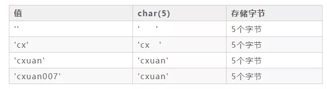

這裡注意一點：如果 MySQL 使用了非嚴格模式的話，上面表格最後一行是可以存儲的。如果 MySQL 使用了 嚴格模式 的話，那麼表格上面最後一行存儲會報錯。

varchar 為可變長度

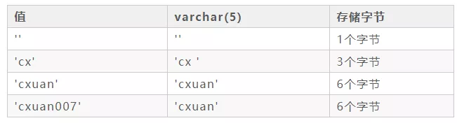

varchar 默認會在最後增加一個字串長度，佔用 1 個字節（如果列聲明的長度超過255，則使用兩個字節）。

所以固定長用 char，如身份證號，不固定長就用 varchar。

在 MySQL 中，不同的存儲引擎對 CHAR 和 VARCHAR 的使用原則也有不同：

* MyISAM：建議使用固定長度的數據列替代可變長度的數據列，也就是 CHAR；
* MEMORY：使用固定長度進行處理、CHAR 和 VARCHAR 都會被當作 CHAR 處理；
* InnoDB：建議使用 VARCHAR 類型。

#### TEXT 與 BLOB 的選擇

一般在保存較少的文本的時候，我們會選擇 CHAR 和 VARCHAR，在保存大數據量的文本時，我們往往選擇 TEXT 和 BLOB；TEXT 和 BLOB 的主要差別是 BLOB 能夠保存二進制數據；而 TEXT 只能保存字符數據。

TEXT 往下細分有：

* TEXT
* MEDIUMTEXT
* LONGTEXT

BLOB 往下細分有

* BLOB
* MEDIUMBLOB
* LONGBLOB

TEXT 和 BLOB 在刪除數據後會存在一些性能上的問題，為了提高性能，建議使用 OPTIMIZE TABLE 功能對表進行碎片整理。

優化使用 BLOB 和 TEXT 的方式：

* 非必要的時候不要檢索 BLOB 和 TEXT 索引
* 把 BLOB 或 TEXT 列分離到單獨的表中
* 可以另外新增欄位存文本的 hash 值，就能根據 hash 值快速找到對應的那筆資料。

#### 浮點數和定點數的選擇

浮點數指的就是含有小數的值，浮點數插入到指定列中超過指定精度後，浮點數會四捨五入，MySQL 中的浮點數指的就是 float 和 double，定點數指的是 decimal，定點數能夠更加精確的保存和顯示數據。

#### 日期類型選擇

在 MySQL 中，用來表示日期類型的有 「DATE、TIME、DATETIME、TIMESTAMP」

TIMESTAMP 和時區相關，更能反映當前時間，如果記錄的日期需要讓不同時區的人使用，最好使用 TIMESTAMP。

* DATE 用於表示年月日，如果實際應用值需要保存年月日的話就可以使用 DATE。
* TIME 用於表示時分秒，如果實際應用值需要保存時分秒的話就可以使用 TIME。
* YEAR 用於表示年份，YEAR 有 2 位（最好使用4位）和 4 位格式的年。默認是4位。

### 存儲引擎

MySQL 默認支持多種存儲引擎，來適用不同資料庫應用，用戶可以根據需要選擇合適的存儲引擎，下面是 MySQL 支持的存儲引擎：

* MyISAM
    * 如果應用程序通常以檢索為主，只有少量的插入、更新和刪除操作，並且對事物的完整性、並發程度不是很高的話，通常建議選擇 MyISAM 存儲引擎。  
    * 在 5.1 版本前的默認存儲引擎
    * MyISAM 並發性比較差，使用的場景比較少，主要特點是
        * 不支持事務， 沒有 ACID 特性，這一設計是為了性能和效率考慮的。
        * 不支持外鍵操作，如果強行增加外鍵，MySQL 不會報錯，只不過外鍵不起作用。
        * 默認的鎖粒度是表級鎖，所以並發性能比較差，加鎖比較快，鎖沖突比較少，不太容易發生死鎖的情況
    * MyISAM 會在磁盤上存儲三個文件，文件名和表名相同，擴展名分別是：.frm(存儲表定義)、.MYD(MYData,存儲數據)、MYI(MyIndex,存儲索引)。這裡需要特別注意的是 MyISAM 只緩存索引文件，並不緩存數據文件。
    * MyISAM 支持的索引類型有 全局索引(Full-Text)、B-Tree 索引、R-Tree 索引
        * Full-Text 索引：它的出現是為瞭解決針對文本的模糊查詢效率較低的問題。
        * B-Tree 索引：所有的索引節點都按照平衡樹的數據結構來存儲，所有的索引數據節點都在葉節點
        * R-Tree索引：它的存儲方式和 B-Tree 索引有一些區別，主要設計用於存儲空間和多維數據的字段做索引,目前的 MySQL 版本僅支持 geometry 類型的字段作索引，相對於 BTREE，RTREE 的優勢在於范圍查找。
    * 資料庫所在主機如果宕機，MyISAM 的數據文件容易損壞，而且難以恢復。
    * 增刪改查性能方面：SELECT 性能較高，適用於查詢較多的情況
* InnoDB (MySQL 5.1 後的默認存儲引擎)
    * 支持事務操作，具有事務 ACID 隔離特性，默認的隔離級別是可重復讀(repetable-read)、通過 MVCC（並發版本控制）來實現的。能夠解決髒讀和不可重復讀的問題。
    * 如果使用到外鍵、需要並發程度較高，數據一致性要求較高，那麼通常選擇 InnoDB 引擎，一般互聯網大廠對並發和數據完整性要求較高，所以一般都使用 InnoDB 存儲引擎。
    * 支持外鍵操作。
    * InnoDB中不保存表的總行數，select count() from table 時，InnoDB 需要掃描整個表計算有多少行，但MyISAM只需簡單讀出保存好的總行數即可。
    * InnoDB 默認的鎖粒度行級鎖，並發性能比較好，會發生死鎖的情況。
        * 某些情況下還是鎖整表，如 update table set a=1 where user like ‘%lee%’
    * Myisam 創建表生成三個文件：.frm 數據表結構 、 .myd 數據文件 、 .myi 索引文件，Innodb只生成一個 .frm文件，數據存放在ibdata1.log
        * InnoDB 的表數據與索引數據是存儲在一起的，都位於 B+ 數的葉子節點上，而 MyISAM 的表數據和索引數據是分開的。
    * InnoDB 有安全的日誌文件，這個日誌文件用於恢復因資料庫崩潰或其他情況導致的數據丟失問題，保證數據的一致性。
    * InnoDB 和 MyISAM 支持的索引類型相同，但具體實現因為文件結構的不同有很大差異。
    * 增刪改查性能方面，如果執行大量的增刪改操作，推薦使用 InnoDB 存儲引擎，它在刪除操作時是對行刪除，不會重建表。
        * 清空整個表時，InnoDB是一行一行的刪除，效率非常慢。MyISAM 則會重建表。MyISAM 使用delete語句刪除後並不會立刻清理磁盤空間，需要定時清理
* BDB
* MEMORY
    * MEMORY 存儲引擎將所有數據保存在內存中，在需要快速定位下能夠提供及其迅速的訪問。MEMORY 通常用於更新不太頻繁的小表，用於快速訪問取得結果。
    * MEMORY 存儲引擎使用存在內存中的內容來創建表。每個 MEMORY 表實際只對應一個磁盤文件，格式是 .frm。MEMORY 類型的表訪問速度很快，因為其數據是存放在內存中。默認使用 HASH 索引。
* MERGE
    * MERGE 的內部是使用 MyISAM 表，MERGE 表的優點在於可以突破對單個 MyISAM 表大小的限制，並且通過將不同的表分佈在多個磁盤上， 可以有效地改善 MERGE 表的訪問效率
    * MERGE 存儲引擎是一組 MyISAM 表的組合，MERGE 表本身沒有數據，對 MERGE 類型的表進行查詢、更新、刪除的操作，實際上是對內部的 MyISAM 表進行的。MERGE 表在磁盤上保留兩個文件，一個是 .frm 文件存儲表定義、一個是 .MRG 文件存儲 MERGE 表的組成等。
* EXAMPLE
* NDB Cluster
* ARCHIVE
* CSV
* BLACKHOLE
* FEDERATED

如果創建表不指定存儲引擎，會使用默認的存儲引擎。

可以透過下列指令查看當前資料庫支援的存儲引擎

```sql
SHOW ENGINES
```

或是指定透過 `SHOW CREATE TABLE` 的方式查看指定 Table 是用什麼存儲引擎。

#### InnoDB 引擎

InnoDB 引擎的表檔案，一共有兩個：

* .frm 這類檔案是表的定義檔案。
* .ibd 這類檔案是資料和索引儲存檔案。表資料和索引聚集儲存，通過索引能直接查詢到資料。

首先InnoDB的索引分為聚簇索引和非聚簇索引，聚簇索引即儲存關鍵字又儲存資料，在B+Tree的每個分支節點上儲存關鍵字，葉子節點上儲存資料。

“聚簇”的意思是資料行被按照一定順序一個個緊密地排列在一起儲存。一個表只能有一個聚簇索引，因為在一個表中資料的存放方式只有一種，一般是主鍵作為聚簇索引，如果沒有主鍵，InnoDB會預設生成一個隱藏的列作為主鍵。

如下圖所示：

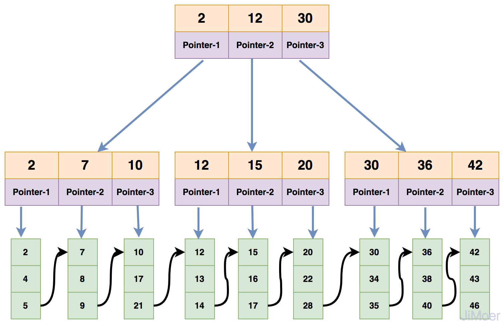

非聚簇索引，又稱為二級索引，雖然也是在B+Tree的每個分支節點上儲存關鍵字，但是葉子節點不是儲存的資料，而是儲存的主鍵值。通過二級索引去查詢資料會先查詢到資料對應的主鍵，然後再根據主鍵查詢到具體的資料行。

如下圖所示：

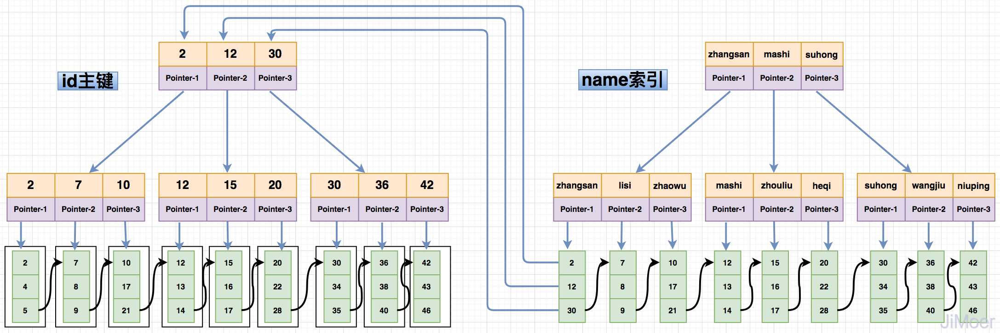

由於非聚簇索引的設計結構，導致了，非聚簇索引在查詢的時候要進行兩次索引檢索，這樣設計的好處，可以保證了一旦發生資料遷移的時候，只需要更新主鍵索引即可，非聚簇索引並不用動，而且也規避了像MyISAM的索引那樣儲存實體地址，在資料遷移的時候的需要重新維護所有索引的問題。

#### MyIASM 引擎

MyIASM 引擎的表檔案，一共有三個：

* .frm 這類檔案是表的定義檔案。
* .MYD 這類檔案是表資料檔案，表中的所有資料都儲存在此檔案中。
* .MYI 這類檔案是表的索引檔案，MyISAM儲存引擎的索引資料單獨儲存。

MyISAM 儲存引擎在儲存索引的時候，是將索引資料單獨儲存，並且索引的 B+Tree 最終指向的是資料存在的實體地址，而不是具體的資料。然後再根據實體地址去資料檔案（*.MYD）中找到具體的資料。

如下圖所示：

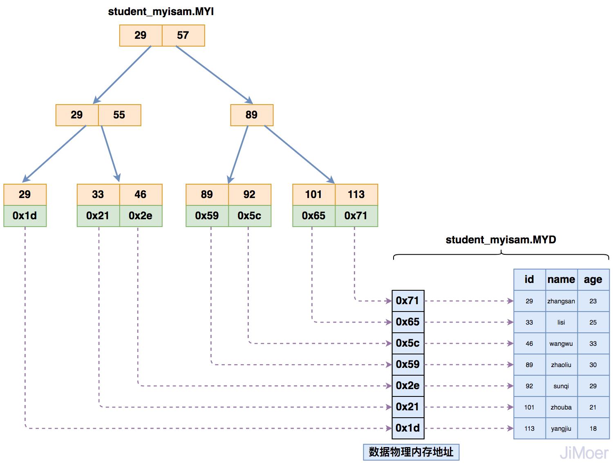

那麼當存在多個索引時，多個索引都指向相同的實體地址。

如下圖所示：

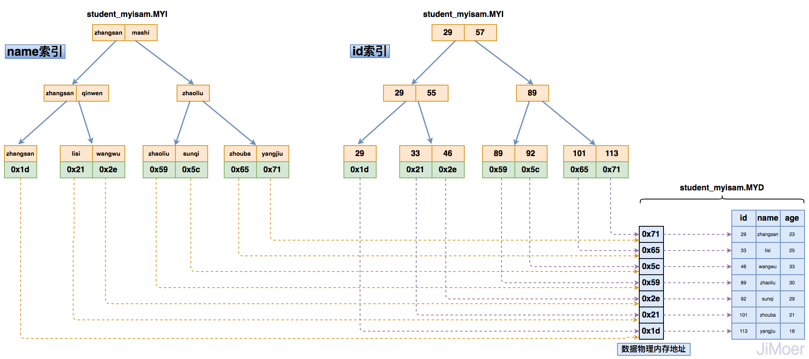

通過這個結構，我們可以看出來，MyISAM的儲存引擎的索引都是同級別的，主鍵和非主鍵索引結構和查詢方式完全一樣。

### 效能改善

#### 使用 Explain

各欄位解釋：

* id ：編號
* select_type ：查詢類型
* table ：表
* type ：類型
* possible_keys ：預測用到的索引
* key ：實際使用的索引
* key_len ：實際使用索引的長度
* ref ：表之間的引用
* rows ：通過索引查詢到的數據量
* Extra ：額外的信息

##### id 編號

id 值不同，id 值越大越優先查詢，id 值相同，從上往下順序執行

##### select_type

* simple
    * 表示簡單 select (不使用union或子查詢)
        ```sql
        SELECT * FROM `teacher`;
        ```
* primary
    * 包含子查詢的主查詢 (最外層)
    * 在 UNION  中的第二個和隨後的SELECT被標記為UNION。如果UNION被FROM子句中的子查詢包含，那麼它的第一個SELECT會被標記為 DERIVED。
* subquery
    * 子查詢中的第一個 select
* derived
    * 衍生查詢(用到了臨時表)
    * 在 from 子查詢中，只有一張表；
    * 在 from 子查詢中，如果 table1 union table2，則 table1 就是derived表；
* union
    * 在 from 子查詢中，union 之後的表稱之為 union表
* dependent
    * union union中的第二個或後面的select語句，取決於外面的查詢
* union result
    * 哪些表之間使用了 union 查詢
* dependent subquery
    * 子查詢中的第一個select，取決於外面的查詢

##### table 表

顯示這一行的資料是關於哪張表的

##### type 索引類型

這是重要的列，顯示了使用那一種類型

要對type進行優化的前提是，你得創建索引

建議至少要達到 range 級別

從最好到最差的連線型別為：

* system
    * 該表只有一行（相當於系統表），system 是 const 型別的特例
    * 衍生表只有一條數據的主查詢(偶爾可以達到)
* const
    * 僅僅能查到一條數據的 SQL，僅針對主鍵(Primary key)或唯一索引(Unique index) 類型有效
    * const 查詢速度非常快， 因為它僅僅讀取一次即可
        ```sql
        SELECT tid FROM test01 WHERE tid =1 ;
        ```
* eq_ref
    * 唯一性索引，對於每個索引鍵的查詢，返回匹配唯一行數據（有且只有1個，不能多 、不能0），並且查詢結果和數據條數必須一致
    * 主鍵索引(Primary)和唯一索引(Unique not null) 才會使用，效能僅次於system及const。
        ```sql
        -- 多表關聯查詢，單行匹配
        SELECT * FROM ref_table,other_table
        WHERE ref_table.key_column=other_table.column;

        -- 多表關聯查詢，聯合索引，多行匹配
        SELECT * FROM ref_table,other_table
        WHERE ref_table.key_column_part1=other_table.column
        AND ref_table.key_column_part2=1;
        ```
* ref
    * 查詢使用了非唯一鍵或主鍵。
    * 非唯一性索引，對於每個索引鍵的查詢，返回匹配的所有行（可以0，可以1，可以多）
    * 通常最好到 ref
        ```sql
        -- 根據索引（非主鍵，非唯一索引），匹配到多行
        SELECT * FROM ref_table WHERE key_column=expr;

        -- 多表關聯查詢，單個索引，多行匹配
        SELECT * FROM ref_table,other_table
        WHERE ref_table.key_column=other_table.column;

        -- 多表關聯查詢，聯合索引，多行匹配
        SELECT * FROM ref_table,other_table
        WHERE ref_table.key_column_part1=other_table.column
        AND ref_table.key_column_part2=1;
        ```
* fulltext
    * 全文索引
* ref_or_null
    * 該型別類似於ref，但是MySQL會額外搜尋哪些行包含了NULL。這種型別常見於解析子查詢
        ```sql
        SELECT * FROM ref_table
        WHERE key_column=expr OR key_column IS NULL;
        ```
* index_merge
    * 此型別表示使用了索引合並優化，表示一個查詢裡面用到了多個索引
* unique_subquery
    * 該型別和eq_ref類似，但是使用了IN查詢，且子查詢是主鍵或者唯一索引。
        ```sql
        value IN (SELECT primary_key FROM single_table WHERE some_expr)
        ```
* index_subquery
    * 和unique_subquery類似，只是子查詢使用的是非唯一索引
        ```sql
        value IN (SELECT key_column FROM single_table WHERE some_expr)
        ```
* range
    * 用索引返回一個範圍的結果，where 後面是一個範圍查詢(between, >, <, >=, in)
    * in 有時候會失效，從而轉為無索引時候的 ALL
    * 一般來說至少要達到 range
        ```sql
        SELECT * FROM tbl_name
        WHERE key_column BETWEEN 10 and 20;

        SELECT * FROM tbl_name
        WHERE key_column IN (10,20,30);
        ```
* index
    * 全索引掃描，和ALL類似，只不過index是全盤掃描了索引的資料。當查詢僅使用索引中的一部分列時，可使用此型別。
    * 有兩種場景會觸發：
        * 如果索引是查詢的覆蓋索引，並且索引查詢的資料就可以滿足查詢中所需的所有資料，則只掃描索引樹。此時，explain的Extra 列的結果是Using index。index通常比ALL快，因為索引的大小通常小於表資料。
        * 按索引的順序來查詢資料行，執行了全表掃描。此時，explain的Extra列的結果不會出現Uses index。
* ALL
    * 掃描了全表才能確定結果，查詢全部源表中的數據(暴力掃描全表)
    * 效能最差。

##### possible_keys

顯示可能使用到的索引，或是 Where 中最適合的欄位，是一種預測，不准。

##### key

* 實際使用到的索引。
* 如果為 primary 的話，表示使用了主鍵
* 如果 possible_key/key 是 NULL，則說明沒用索引

##### key_len

索引的長度，用於判斷復合索引是否被完全使用(a,b,c)。

* 如果鍵是 NULL，長度就是 NULL
* 在不損失精確性的情況下，長度越短越好
* 如果索引字段可以為 NULL，則 MySql 底層會使用1個字節用於標識

key_len 計算公式： https://www.cnblogs.com/gomysql/p/4004244.html

##### ref

指明當前表所參照的字段

##### rows

* 這個數表示 MySQL 估算會掃描的行數，數值越小越好。
* 這個值是預估計，在 innodb 上是不準確的。

##### filtered

* 表示符合查詢條件的資料百分比，最大100。用rows × filtered可獲得和下一張表連線的行數。例如rows = 1000，filtered = 50%，則和下一張表連線的行數是500。
* 在 MySQL 5.7 之前，想要顯示此欄位需使用 explain extended 命令；MySQL.5.7及更高版本，explain 預設就會展示 filtered

##### Extra

* Extra為MySQL用來解析額外的查詢訊息
* 可能的欄位
    * Distinct
        * 當MySQL找到相關連的資料時，就不再搜尋。
    * Not exists
        * MySQL優化 LEFT JOIN，一旦找到符合的LEFT JOIN資料後，就不再搜尋。
    * Range checked for each Record(index map:#)
        * 無法找到理想的索引。此為最慢的使用索引。
    * Using filesort (需要優化)
        * 進行了一次“額外”的排序。
            * 對於單索引，如果排序和查找是同一個字段，則不會出現using filesort
            * 如果排序和查找不是同一個字段，則會出現using filesort
            * 因此where哪些字段，就order by哪些些字段。
        * 常見於 order by 語句中。
            ```sql
            select * from test02 where a1 ='' order by a1 ;
            
            -- 查詢了a1字段，卻利用 a2 字段進行排序，此時 myql 底層會進行一次查詢，進行“額外”的排序。
            select * from test02 where a1 ='' order by a2 ; 

            -- 復合索引的情況 index idx (a1, a2, a3) 最佳左前綴
            select * from test02 where a1='' order by a3 ; --using filesort
            select * from test02 where a2='' order by a3 ; --using filesort
            select * from test02 where a1='' order by a2 ;
            ```
    * Using index
        * using index稱之為「索引覆蓋」
        * 當出現了using index，就表示不用讀取源表，而只利用索引獲取數據，不需要回源表查詢。
    * Using temporary (需要優化)
        * 這是由於當前 SQL 用到了臨時表。一般出現在 group by 中。
            ```sql
            select a1 from test02 where a1 in ('1','2','3') group by a1 ;
            select a1 from test02 where a1 in ('1','2','3') group by a2 ; --using temporary
            ```
        * 當你查詢哪個字段，就按照那個字段分組，否則就會出現using temporary
    * Using where
        * 表示需要【回表查詢】，表示既在索引中進行了查詢，又回到了源表進行了查詢。
            ```sql
            create index a1_index on test02(a1);
            select a1,a3 from test02 where a1="" and a3="" ; -- a1 有 index 而 a3 沒有
            ```
    * Impossible where
        * 當where子句永遠為False的時候，會出現impossible where
            ```sql
            select a1 from test02 where a1="a" and a1="b";
            ```
    * System
        * system 資料表，此為 const 連接類型的特殊情況。
    * Const
        * 資料表中的一個記錄的最大值能夠符合這個查詢。
        * 因為只有一行，這個值就是常數，因為 MySQL 會先讀這個值然後把它當做常數。
    * Using join buffer
        * 表示Mysql引擎使用了“連接緩存”，即 MySQL 底層動了你的SQL

#### Query 技巧

* IN 包含值不應過多
    * MySQL 對於 IN 做了相應的優化，會將 IN 中的常量全部存儲在一個數組裡面，而且這個數組是排好序的。但是如果數值較多，產生的消耗也是比較大的。
    * 對於連續的數值，能用 between 就不要用 in 了；再或者使用連接來替換。
* SELECT 語句務必指明字段名稱
    * SELECT * 會增加很多不必要的消耗（cpu、io、內存、網絡帶寬）
    * 增加了使用覆蓋索引的可能性
    * 當表結構發生改變時，前段也需要更新
* 當只需要一條數據的時候，使用limit 1
    * 這是為了使 EXPLAIN 中 type 列達到 const 類型
* 如果排序字段沒有用到索引，就盡量少排序
* 如果限制條件中其他字段沒有索引，盡量少用or
    * or 兩邊的字段中，如果有一個不是索引字段，而其他條件也不是索引字段，會造成該查詢不走索引的情況。很多時候使用 union all 或者是 union (必要的時候)的方式來代替“or”會得到更好的效果
* 盡量用 union all 代替 union
    * union和union all的差異主要是前者需要將結果集合並後再進行唯一性過濾操作，這就會涉及到排序，增加大量的CPU運算，加大資源消耗及延遲。
    * 當然，使用 union all 的前提條件是兩個結果集沒有重復數據。
* 不使用 ORDER BY RAND()
    ```sql
    select id from `table_name` 
    order by rand() limit 1000;
    
    -- 可優化為
    select id from `table_name` t1 join 
    (select rand() * (select max(id) from `table_name`) as nid) t2 on t1.id > t2.nid limit 1000;
    ```
* 區分in和exists， not in和not exists
    ```sql
    -- IN 會先執行子查詢，所以適合於外表大而內表(B)小的情況
    select * from A where id in (select id from B)

    -- exists 會先查外表(A)，所以適合外表小而內表大的情況
    select * from A where exists (select * from B where B.id=.Aid)
    ```
* 使用合理的分頁方式以提高分頁的效率
    ```sql
    -- 數據量越大越慢
    select id, name from table_name limit 866613, 20

    -- 可以改為取前一頁的最大行數的id，然後根據這個最大的id來限制下一頁的起點
    select id, name from table_name where id > 866612 limit 20
    ```
* 避免在 where 子句中對字段進行 null 值判斷
    * 對於 null 的判斷會導致引擎放棄使用索引而進行全表掃描。
* 不建議使用%前綴模糊查詢
    * 例如LIKE "%name" 或者LIKE "%name%"，這種查詢會導致索引失效而進行全表掃描。但是可以使用LIKE "name%"。
    * 可以用全文索引
        ```sql
        -- 原來
        select id, fnum, fdst from table_name where user_name like '%zhangsan%'

        ALTER TABLE `table_name` ADD FULLTEXT INDEX `idx_user_name` (`user_name`);

        -- 使用有索引 (語法有差異)
        select id, fnum, fdst from table_name 
        where match(user_name) against('zhangsan' in boolean mode);
        ```
* 避免在where子句中對字段進行表達式操作
    ```sql
    -- 這樣無所用索引
    select user_id,user_project from table_name where age*2=36;
    
    -- 可改為
    select user_id,user_project from table_name where age=36/2;
    ```
* 避免隱式類型轉換
    * where 子句中出現 column 字段的類型和傳入的參數類型不一致的時候發生的類型轉換，建議先確定where中的參數類型
* 對於聯合索引來說，要遵守最左前綴法則
    * 舉列來說索引含有字段id,name,school，可以直接用id字段，也可以id,name這樣的順序，但是name，school都無法使用這個索引。所以在創建聯合索引的時候一定要注意索引字段順序，常用的查詢字段放在最前面
* 必要時可以使用force index來強制查詢走某個索引
    * 有的時候MySQL優化器採取它認為合適的索引來檢索sql語句，但是可能它改採用的索引並不是我們想要的。這時就可以採用force index來強制優化器使用我們制定的索引。
* 注意范圍查詢語句
    * 對於聯合索引來說，如果存在范圍查詢，比如between,>,<等條件時，會造成後面的索引字段失效。
* 關於JOIN優化
    * LEFT JOIN A表為驅動表
    * INNER JOIN MySQL會自動找出那個數據少的表作用驅動表
    * RIGHT JOIN B表為驅動表
* 盡量使用inner join，避免left join
    * 參與聯合查詢的表至少為2張表，一般都存在大小之分。如果連接方式是inner join，在沒有其他過濾條件的情況下MySQL會自動選擇小表作為驅動表，但是left join在驅動表的選擇上遵循的是左邊驅動右邊的原則，即left join左邊的表名為驅動表。

### 備份和還原

完全備份 差異備份 增量備份

Xtrabackup

### 內部實作

#### 架構

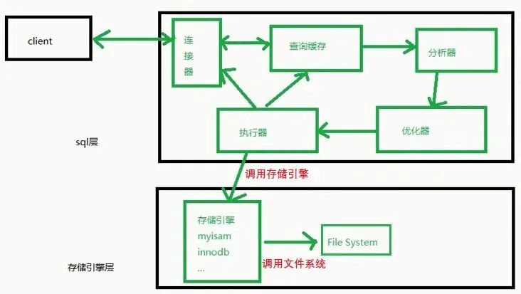

可以將 Mysql 分為：

* sql層
* 存儲引擎層

#### InnoDB 緩衝池(buffer pool)

* 用途
    * 緩存表數據與索引數據，把磁盤上的數據加載到緩衝池，避免每次訪問都進行磁盤IO，起到加速訪問的作用。
    * 對於讀請求，緩衝池能夠減少磁盤IO，提升性能
* 做法
    * InnoDB以變種LRU算法管理緩衝池，並能夠解決“預讀失效”與“緩衝池污染”的問題
        * 詳情參考：[https://juejin.im/post/5d11a79ee51d4555e372a624](https://juejin.im/post/5d11a79ee51d4555e372a624)

#### 寫緩沖(change buffer)

* 用途
    * 降低寫操作的磁盤IO，提升資料庫性能。
* 做法
    * 如果在緩衝池內
        * 直接修改緩衝池中的頁，一次內存操作；
        * 寫入redo log，一次磁盤順序寫操作
    * 如果不在緩衝池內
        * 未用 change buffer 優化
            * 先把需要為40的索引頁，從磁盤加載到緩衝池，一次磁盤隨機讀操作；
            * 修改緩衝池中的頁，一次內存操作；
            * 寫入redo log，一次磁盤順序寫操作；
        * 使用 change buffer 優化 (只能用在普通索引)
            * 在寫緩衝中記錄這個操作，一次內存操作；
            * 寫入redo log，一次磁盤順序寫操作
* 要點
    * 雖然叫 change buffer，但實際上它是可以持久化的數據，也會被寫到硬碟上
    * change buffer 用的是 buffer pool 里的内存，因此不能无限增大。change buffer 的大小，可以通过参数 `innodb_change_buffer_max_size` 来动态设置。这个参数设置为
      50 的时候，表示 change buffer 的大小最多只能占用 buffer pool 的 50%。
* 限制
    * 唯一索引和非唯一索引在查詢上效能幾乎是沒有差別的，主要考慮是對更新效能的影響，關鍵就是 change buffer
    * 不適合的場景
        * 資料庫都是唯一索引；
        * 或者，寫入一個數據後，會立刻讀取它；
    * 適合的場景 (如 log)
        * 資料庫大部分是非唯一索引；
        * 業務是寫多讀少，或者不是寫後立刻讀取；

#### SQL 的解析順序

MySQL架構總覽：

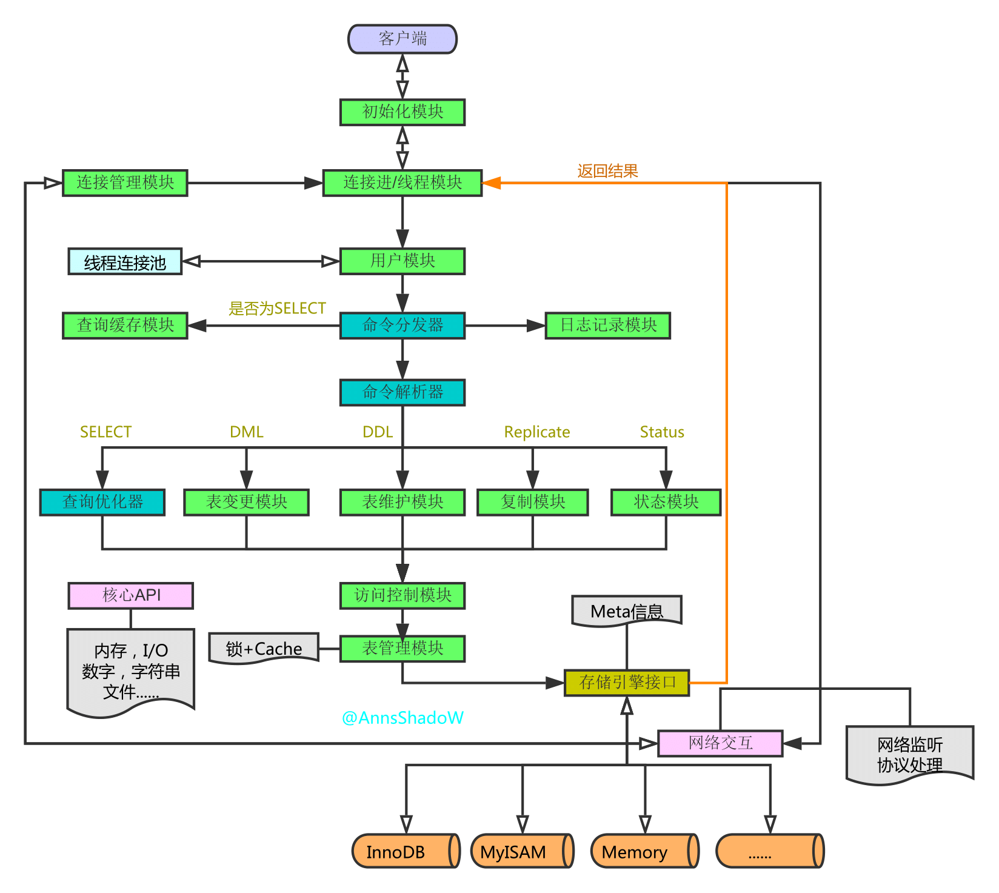

Query 查詢的流程：

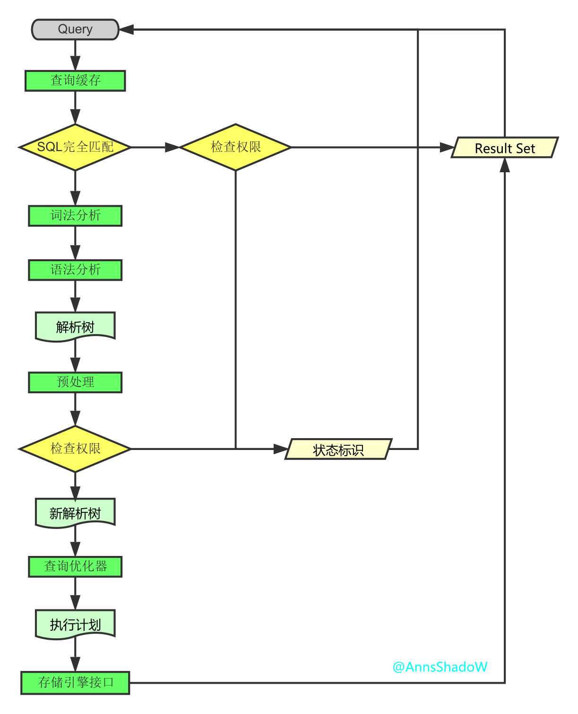

1. 連接
    1. 客戶端發起一條 Query 請求，監聽客戶端的「連接管理模塊」接收請求
    2. 將請求轉發到「連接進/線程模塊」
    3. 調用「用戶模塊」來進行授權檢查
    4. 通過檢查後，「連接進/線程模塊」從「線程連接池’」取出空閒的被緩存的連接線程和客戶端請求對接，如果失敗則創建一個新的連接請求
2. 處理
    1. 先查詢緩存，檢查 Query 語句是否完全匹配，接著再檢查是否具有權限，都成功則直接取數據返回
    2. 上一步有失敗則轉交給「命令解析器」，經過詞法分析，語法分析後生成解析樹
    3. 接下來是預處理階段，處理解析器無法解決的語義，檢查權限等，生成新的解析樹
    4. 再轉交給對應的模塊處理
    5. 如果是SELECT查詢還會經由「查詢優化器」做大量的優化，生成執行計劃
    6. 模塊收到請求後，通過「訪問控制模塊」檢查所連接的用戶是否有訪問目標表和目標字段的權限
    7. 有則調用「表管理模塊」，先是查看 table cache 中是否存在，有則直接對應的表和獲取鎖，否則重新打開表文件
    8. 根據表的meta數據，獲取表的存儲引擎類型等信息，通過接口調用對應的存儲引擎處理
    9. 上述過程中產生數據變化的時候，若打開日誌功能，則會記錄到相應二進制日誌文件中
3. 結果
　　1. Query 請求完成後，將結果集返回給「連接進/線程模塊」
　　2. 返回的也可以是相應的狀態標識，如成功或失敗等
　　3. 「連接進/線程模塊」進行後續的清理工作，並繼續等待請求或斷開與客戶端的連接

SQL 解析的順序：

例子：

    SELECT DISTINCT
        < select_list >
    FROM
        < left_table > < join_type >
    JOIN < right_table > ON < join_condition >
    WHERE
        < where_condition >
    GROUP BY
        < group_by_list >
    HAVING
        < having_condition >
    ORDER BY
        < order_by_condition >
    LIMIT < limit_number >

SQL 處理的順序：

    FROM <left_table>  # 當涉及多個表的時候，左邊表的輸出會作為右邊表的輸入
    ON <join_condition> # 基於虛擬表進行過濾，過濾出所有滿足條件的列，生成新的虛擬表 V1 表
    <join_type> JOIN <right_table>
    
    WHERE <where_condition>  # 對生成的臨時表進行過濾，滿足 WHERE 子句的列被插入到表中，生成 V2 表
    
    GROUP BY <group_by_list>  # 將生成的表按照GROUP BY中的列進行分組，生成 V3 表
    HAVING <having_condition>  # 對表中不同的組進行過濾，只作用於分組後的數據，生成 V4 表

    SELECT   # 對 SELECT 子句中的元素進行處理，生成 V5 表
    DISTINCT <select_list> # 如果指定了 DISTINCT，則會創建一張內存臨時表（如果內存放不下，就存放硬盤）。這張臨時表的表結構和上一步產生的虛擬表是一樣的，不同的是對進行 DISTINCT 操作的列增加了一個唯一索引，以此來除重復數據。
    
    ORDER BY <order_by_condition>  # 根據 ORDER BY 對結果進行排序，生成 V6 表
    LIMIT <limit_number>  # 從上一步得到的VT6虛擬表中選出從指定位置開始的指定行數據


簡化 Query 處理的順序：

* FROM / JOIN 和 ON
* WHERE
* GROUP BY
* HAVING
* SELECT
* ORDER BY
* LIMIT

但資料庫不真的用這個順序處理，因為它做了很多優化。

## 推薦的學習參考書

* MySQL技術內幕︰InnoDB存儲引擎
* MySQL運維內參
* 高性能MySQL

## 參考文章

* [這波MySQL操作，穩穩帶你進階頂端](https://mp.weixin.qq.com/s/EXbMgT0T3cXZ0u-4lvMDbQ)
* [MySQL](https://github.com/yorkmass/interview/blob/master/MySQL.md)
* [MySQL的索引為什麼用B+Tree？InnoDB的資料儲存檔案和MyISAM的有何不同？](https://iter01.com/584005.html)
* [項目中常用的 19 條 SQL 優化寶典](https://mp.weixin.qq.com/s/xKjhtgBlDydOm2623AImOA)
* [步步深入：MySQL架構總覽->查詢執行流程->SQL解析順序](https://www.cnblogs.com/annsshadow/p/5037667.html)
* [18000 字的 SQL 优化大全，收藏直接起飞！](https://mp.weixin.qq.com/s?__biz=MzA5ODM5MDU3MA==&mid=2650881675&idx=2&sn=967dae1a639fddd2b5f855e185f4ecdb)
* [是否該用 MongoDB？選擇資料庫前你該了解的事](https://tw.alphacamp.co/blog/mysql-and-mongodb-comparison)
* [全网最全 | MySQL EXPLAIN 完全解读](https://www.itmuch.com/mysql/explain/)
