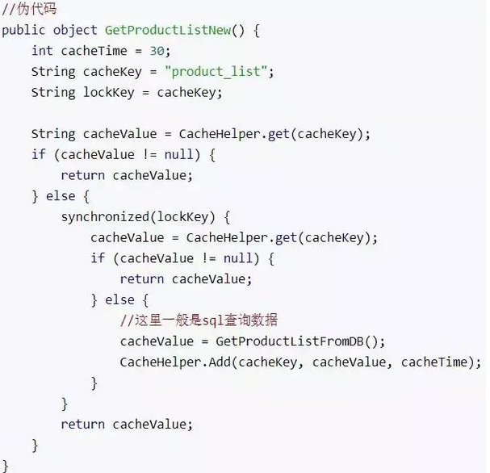

# Redis 學習筆記

## 持久化

提供了兩種持久化方案：

* RDB 方式（默認）
    * RDB方式是通過快照（snapshotting）完成的，當符合一定條件時會自動將內存中的數據進行快照並持久化到硬盤。
    * 觸發快照的時機
        * 符合自定義配置的快照規則 redis.conf
        * 執行 save 或者 bgsave 命令
        * 執行 flushall 命令
        * 第一次執行主從復制操作
    * Redis 在進行快照過程中不會修改 RDB 文件，只有快照結束後才會將舊的快照文件替換為新的，也就是說任何時候RDB文件都是完成的，不存在中間狀態，保證了數據的完整性
    * 可以通過定時備份 RDB 文件來實現 Redis 數據庫的備份，RDB 文件是經過壓縮的二進制文件 ,佔用空間會小於內存中的數據，更加利於傳輸
    * 使用 RDB 方式進行持久化，如果異常宕機或者重啟，就會丟失最後一次快照之後的所有數據修改。
        * 需要根據具體的應用場景，通過組合設置自動快照條件的方式來將可能發生的數據損失控制在能夠接受范圍。
    * RDB 方式最大化了 Redis 性能，父進程在保存快照生成 RDB 文件時唯一要做的就是fork出一個子進程，然後這個子進程就會處理接下來的所有文件保存工作，父進程無需執行任何磁盤 I/O 操作。
        * 但如果數據集比較大的時候，fork 可能比較耗時，造成服務器在一段時間內會停止處理客戶端請求。
* AOF 方式（append only file）
    * 開啟 AOF 持久化後，每執行一條會更改 Redis 中的數據的命令， Redis 就會將該命令寫入硬盤中的 AOF 文件，這一過程顯然會降低 Redis 的性能，但大部分情況下這個影響是能夠接受的，另外使用較快的硬盤可以提高 AOF 的性能。

選擇方案

* 內存數據庫，數據不能丟：RDB（redis database）+ AOF
* 緩存服務器：RDB
* 不建議只使用 AOF (性能差)
* 恢復時：有 AOF 就先選擇 AOF 恢復，沒有的話選擇 RDB 文件恢復

## Stream

* [Redis 究竟适不适合当队列来用？](https://mp.weixin.qq.com/s/3nsvFj3_JcCCezZ2ou6fTQ)

## 相關議題

### 緩存冷啟動

緩存冷啟動就是緩存中沒有數據，由於緩存冷啟動一點數據都沒有，如果直接就對外提供服務了，那麼並發量上來資料庫就被打爆了。

系統第一次上線啟動，或者系統在 redis 故障的情況下重新啟動，這時在高並發的場景下就會出現所有的流量都會打到原始數據庫上，導致資料庫崩潰。

因此可以通過緩存預熱的方案，提前給 redis 灌入部分數據後再提供服務。

可能問題：

* 數據量太大的話，無法將所有數據放入 redis 中：耗費時間過長或 redis 根本無法容納下所有的數據
    * 需要根據具體訪問情況，找出合適的熱數據

### 緩存雪崩

由於原有緩存失效，新緩存未到期間(例如：我們設置緩存時採用了相同的過期時間，在同一時刻出現大面積的緩存過期)，所有原本應該訪問緩存的請求都去查詢數據庫了，而對資料庫造成巨大壓力，嚴重的會造成資料庫當機。從而形成一系列連鎖反應，造成整個系統崩潰。

可能解決方案：

* 併發量不多的時候，使用最多的解決方案是加鎖排隊
    * 單純只是為了減輕資料庫壓力，並沒有提高系統吞吐量。假設在高併發下，緩存重建期間 key 是鎖著的，這時過來 1000 個請求 999 個都在阻塞，可能會導致用戶等待超時，這是個治標不治本的方法。因此在真正的高併發場景下很少使用！
        
* 將過期時間比緩存標記的時間延長1倍，例：標記緩存時間30分鐘，數據緩存設置為60分鐘。 這樣當緩存標記 key 過期後，實際緩存還能把舊數據返回給調用端，直到另外的線程在後台更新完成後，才會返回新緩存。

### 緩存穿透

緩存穿透是指用戶查詢數據，在數據庫沒有，自然在緩存中也不會有。這樣就導致用戶查詢的時候，在緩存中找不到，每次都要去數據庫再查詢一遍，然後返回空（相當於進行了兩次無用的查詢）。這樣請求就繞過緩存直接查資料庫，這也是經常提的緩存命中率問題。

緩存穿透解決方案：

* 採用 [布隆過濾器 (Bloom filter)](https://marco79423.net/articles/bloom-filter)，將所有可能存在的數據哈希到一個足夠大的 bitmap 中，一定不存在的數據會被這個過濾器攔截掉，從而避免了對底層存儲系統的查詢壓力。
* 如果一個查詢返回的數據為空（不管是數據不存在，還是系統故障），我們仍然把這個空結果進行緩存，但它的過期時間會很短，最長不超過五分鐘。通過這個直接設置的默認值存放到緩存，這樣第二次到緩存中獲取就有值了，而不會繼續訪問資料庫。

### 緩存更新策略

除了緩存服務器自帶的緩存失效策略之外（Redis默認的有6中策略可供選擇），我們還可以根據具體的業務需求進行自定義的緩存淘汰，常見的策略有兩種：

* 定時去清理過期的緩存；
* 當有用戶請求過來時，再判斷這個請求所用到的緩存是否過期，過期的話就去底層系統得到新數據並更新緩存。

## 實用工具

* [Redis Memory Analyzer](https://github.com/gamenet/redis-memory-analyzer)
* [Another Redis Desktop Manager](https://github.com/qishibo/AnotherRedisDesktopManager)

## 參考文章

* [Redis 主從復制，愛了](https://mp.weixin.qq.com/s/x1KNcAOMow4MWrDUYS3tVg)
* [Redis相關](https://github.com/yorkmass/interview/blob/master/Redis%E7%9B%B8%E5%85%B3.md)