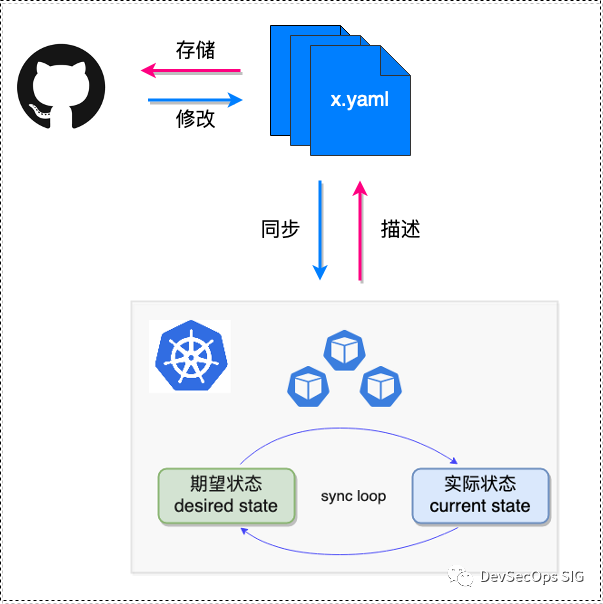

# CI/CD 學習筆記

* 理論
    * 在比較小且快速的循環中，持續驗證系統開發結果，儘早確認結果，期望開發產出能符合原始需求，或依據產出進行快速修正。 簡單來說就是儘量減少手動人力，將一些日常工作交給自動化工具。例如：環境建置、單元測試、日誌紀錄、產品部署。
        * 持續性整合(CI)
            * 針對軟體系統每個變動，能持續且自動地進行驗證，可能包含：
                * 建置 (build)
                * 測試 (test)
                * 程式碼分析 (source code analysis)
                * 其他相關工作 (自動部署)
            * 好處
                * 降低風險。
                * 減少人工手動的繁複程序。
                * 可隨時產生一版可部署的版本。
                * 增加系統透明度。
                * 建立團隊信心。
        * 整合自動化發佈或部署 (Continuous Delivery / Continuous Deployment)
            * 驗證完成後，進一步可以整合自動化發佈或部署 (Continuous Delivery / Continuous Deployment) 。透過此流程可以確保軟體品質，不會因為一個錯誤變動而產生錯誤結果或崩潰(Crash)。
* 實務
    * 每次都要花超過 90 秒處理的事就自動化

## GitOps

GitOps 的兩個核心點：

* 以聲明式系統為基座（典型如 Kubernetes）
* 以 Git（GitHub/GitLab等）為單一可信源

### ArgoCD

## 參考文章

* [利用 Tekton + ArgoCD 打造雲原生 GitSecOps | IDCF](https://mp.weixin.qq.com/s/8-6LFNzgmoOCMYhDhaF2fw)