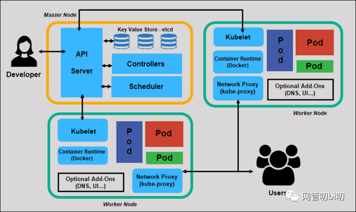
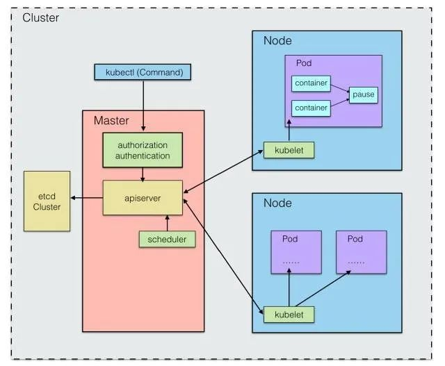
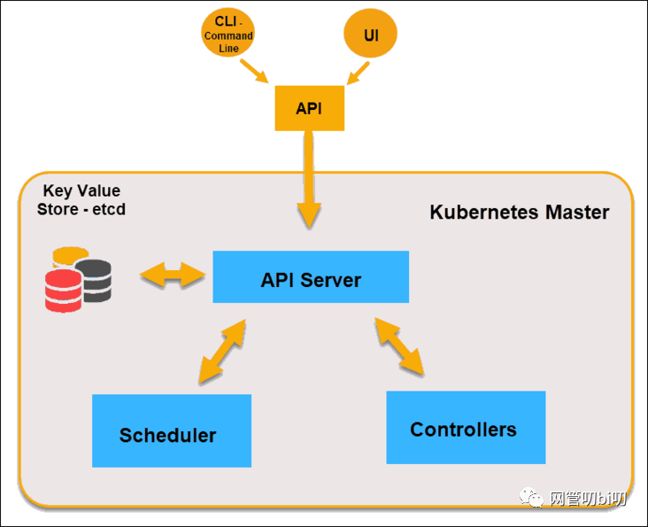
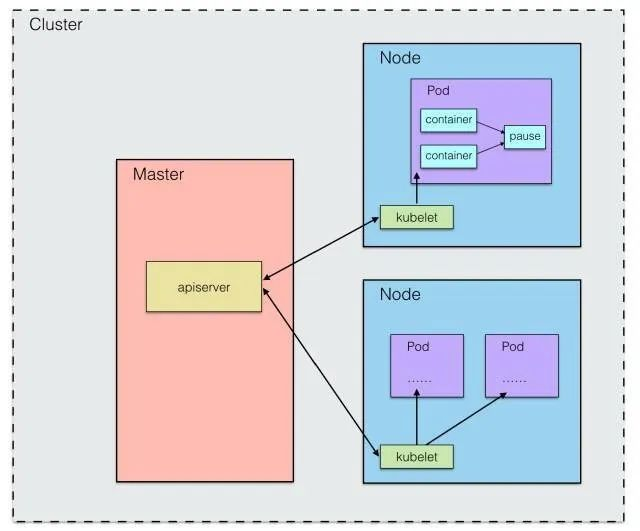
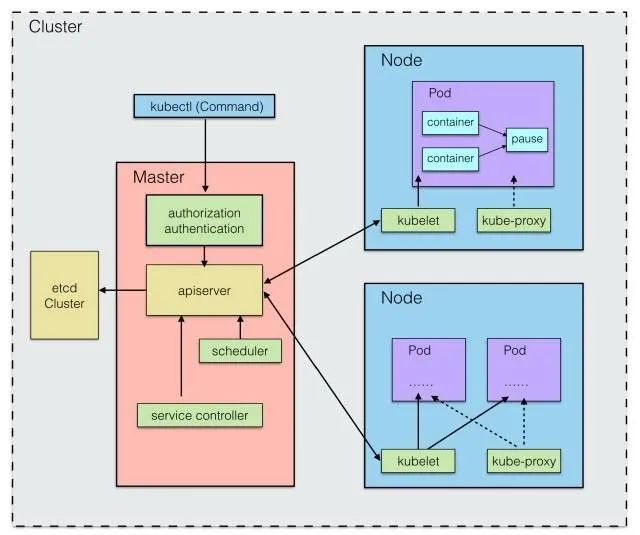
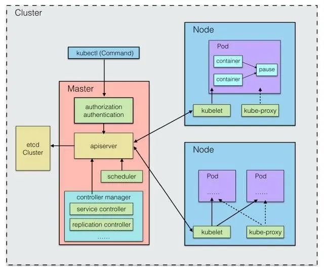
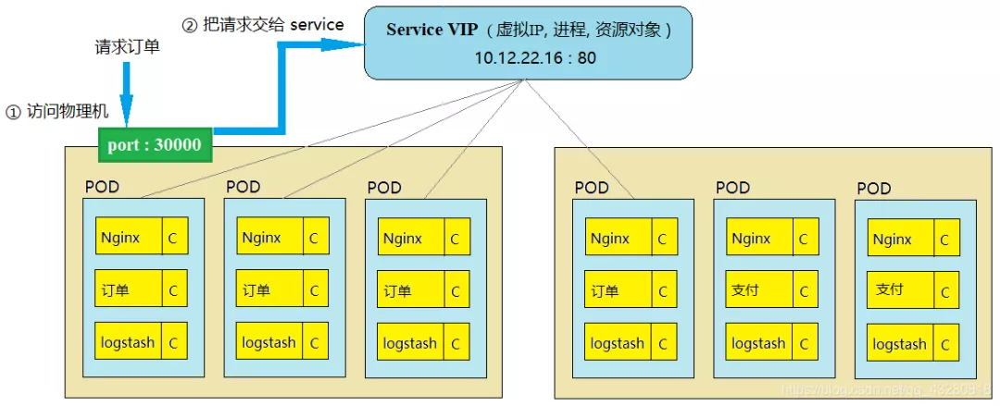
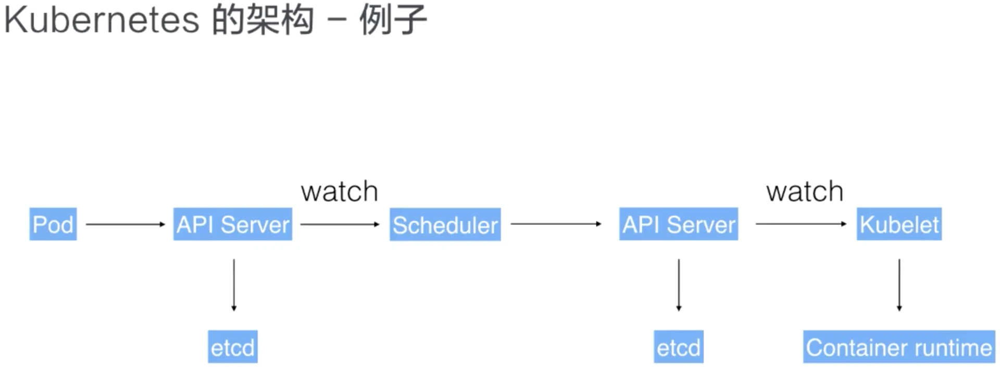
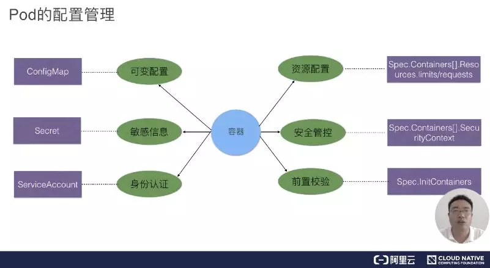
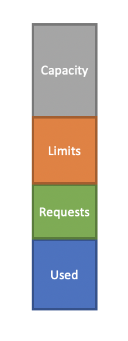

# Kubernetes 學習筆記

## 概念

Kubernetes 是一套結合了容器編排和集群調度管理的大規模分佈式系統解決方案。，它源自 Google 內部大規模集群管理系統 Borg，自 2015 年開源後得到開源社群的全力支援，IBM、惠普、微軟、RedHat等業界巨頭紛紛加入，成為後來的 CNCF 組織（Cloud Native Computing Foundation，雲原生計算基金會）首個畢業的項目。

K8s 具備完善的集群管理能力，包括多層次的安全防護和准入機制、多租戶應用支撐能力、透明的服務注冊和服務發現機制、內建負載均衡器、故障發現和自我修復能力、服務滾動升級和線上擴容、可擴展的資源自動調度機制、多粒度的資源配額管理能力。還提供完善的管理工具，涵蓋開發、部署測試、運維監控等各個環節。

Kubernetes 這個單詞來自於希臘語，含義是舵手或領航員。K8S 是它的縮寫，用 8 字替代了 ubernete 這8個字符。

## 架構

K8s 採用Master / Work Node（最初稱為 Minion，後改名 Node） 的結構，Master Node（主節點）控制整個集群，Work Node（從節點）為集群提供計算能力。使用者可以通過命令行或者 Web 控制台頁面的方式來操作集群。

K8S 集群分為兩個部分：

* Master 節點（主節點）
    * API 服務器 (Kubernetes API Server) [kube-apiserver]
    * 調度器 (Kubernetes Scheduler) [kube-scheduler]
    * 控制器管理器 (Kubernetes Controller Manager) [kube-controller-manager]
    * etcd
    * DNS
* 一群 Node 節點（計算節點）
    * kubelet
    * 代理 kube-proxy
    * Container Runtime

一看就明白：Master 節點主要還是負責管理和控制；Node 節點是工作負載節點，裡面是具體的容器。

下圖可以清楚地表示出 K8s 的整體架構



簡易概述就是當 Master 節點啟動時，會運行一個 Kube-apiserver 程式，它提供了叢集管理的 API 介面，是叢集中各個功能模組之間進行資料互動和通訊的中心樞紐，同時也提供了一個完善的叢集安全機制。

而每個 Node 節點都會運行一個 kubelet 程式，負責向 Master 匯報本節點的運行狀態，如Node 節點註冊、終止、定期健康報告等等，並接收來自 Master 的命令並建立相應的 Pod。

而 Master 其實是透過 由Kube-scheduler 將 Pod 調度到指定的 Node 上，整個調度過程通過執行一系列複雜的演算法，最終為每個Pod計算出一個最優的目標 Node，由Kube-scheduler 處理程序自動完成。

最常見的是循環調度（RR），但用戶也可以直接透過節點的標籤（Label）與Pod的節點選擇器屬性進行匹配來將 Pod 調度到指定的 Node 上。

而這些諸如節點和 Pod 的資訊，如每個Pod的資源使用情況、健康狀態和基本資訊，則統一在記錄在 etcd 上。該元件可以內建在Kubernetes中，也可以外部建構供Kubernetes使用。考慮到各個元件的相對獨立性和整體的可維護性，這些儲存的資料的增刪改查都是統一由Kube-apiserver來呼叫的，並且apiserver還提供了REST支援，不僅為各個內部元件提供服務但也向叢集外的使用者公開服務。



### Master 節點 (主節點)

Master 節點是運作的指揮中心，K8s 集群的大腦，負責向外開放集群的 API，調度和管理整個集群，可以看成一個特化的 Node 負責管理所有其他 Node。

集群至少要有一個 Master節點，如果在生產環境中要達到高可用，還需要配置 Master 集群。



Master 主要包含 API Server、Scheduler、Controllers 三個組成部分， 以及用作存儲的 etcd，它用來儲存整個集群的狀態。

包含四個組件：

* API Server (kube-apiserver)
    * 整個系統的對外接口，供客戶端和其它組件調用，相當於「營業廳」
    * kubernetes 最重要的核心元件之一，提供資源操作的唯一入口（其他模塊通過API Server查詢或修改資源對象，只有API Server才能直接操作etcd），並提供認證、授權、訪問控制、API 注冊和發現等機制。
* kube-scheduler
    * 負責對集群內部的資源進行調度，相當於「調度室」，能按照預定的調度策略將 Pod 調度到相應的 Node 上  
* kube-controller-manager
    * 負責管理控制器，相當於「大總管」
    * 通過 API Server 查詢要控制的資源對象的預期狀態，它檢查其管控的對象的當前狀態，確保它們始終處於預期的工作狀態，它們的工作包括比如故障檢測、自動擴充、減少、滾動更新等。
* etcd
    * 由 CoreOS 開發，是一個高可用、強一致性的鍵值存儲，為 Kubernetes 集群提供儲存服務，類似於 zookeeper。它會存儲集群的整個配置和狀態。
    * 主節點通過查詢 etcd 以檢查節點，容器的現狀。

#### API 服務器 (Kubernetes API Server) [kube-apiserver]

* 整個系統的對外接口，供客戶端和其它組件調用，例如從 Command Line 下 kubectl 指令就會把指令送到這裏。
* 負責 Node 之間的溝通橋樑，由於每個 Node 彼此不能直接溝通，所以必須透過 API Server 轉介
* 負責 Kubernetes 中的請求的身份認證與授權
* 提供 Kubernetes REST API
* 無狀態，所有必要數據都存在 etcd，所以可以運行多個 API 服務器，不需要處理協調問題

#### 調度器 (Kubernetes Scheduler) [kube-scheduler]

* 負責對集群內部的資源進行調度，監視那些新創建的未指定運行節點的 Pod，並選擇節點讓 Pod 在上面運行。
* 調度決策考慮的因素包括單個 Pod 和 Pod 集合的資源需求、硬件/軟件/策略約束、親和性和反親和性規範、數據位置、工作負載間的干擾和最後時限。
* 如果是只有一個節點的集群，Master 也會同時作為 Work Node。

#### 控制器管理器 (Kubernetes Controller Manager) [kube-controller-manager]

所有資源物件的自動化控制中心，可以將其了解為資源物件的「大總管」。負責管理 controller 組件，簡單來說 controller 就是 Kubernetes 裡一個個負責監視 Cluster 狀態的 Process，例如：Node Controller、Replication Controller 等。

* 各種管理器的集合，包含副本控制器、Pod 控制器、服務控制器和端點控制器等
* 所有這些控制器通過 API 監控集群狀態

> **註：**  邏輯上講，每個[控制器](https://kubernetes.io/docs/admin/kube-controller-manager/)都是一個單獨的進程，但是為了降低複雜性，它們都被編譯到同一個可執行文件，並在一個進程中運行

* 這些控制器(controller) 包括:
    * 節點控制器（Node Controller）:
        * 負責在節點出現故障時進行通知和響應。
    * 副本控制器（Replication Controller）:
        * 負責為系統中的每個副本控制器對象維護正確數量的 Pod。
    * 端點控制器（Endpoints Controller）:
        * 填充端點(Endpoints)對象(即加入 Service 與 Pod)。
    * 服務帳戶和令牌控制器（Service Account & Token Controllers）:
        * 為新的命名空間創建默認帳戶和 API 訪問令牌.

> **註：**  controller-manager 的監視與嘗試更新也都需要透過訪問 kube-apiserver 達成

#### etcd

Master 上通常還需要部署 etcd 服務，因為 Kubernetes 裡的所有資源物件都被儲存在 etcd 中

* K8s 使用它來存整個集群狀態，用來存放 Kubernetes Cluster 的資料作為備份，當 Master 因為某些原因而故障時，我們可以透過 etcd 幫我們還原 Kubernetes 的狀態
* etcd 是兼具一致性和高可用性的鍵值數據庫，分布式的，可以作為保存 Kubernetes 所有集群數據的後台數據庫。
* `etcd` 存在的目的不是備份資料。 所以必須自行建立備份計畫並備份 `etcd` 資料。
    * 在生產的 Kubernetes 叢集中，Kubernetes 的官方指引是採用三到五個 `etcd` 資料庫複寫執行個體來提供高可用性。(至少應該要有三個，但最好有 5 個、 7 個或其他任何奇數個數的節點)

#### DNS

* 從 K8s 1.3 開始， DNS 服務便成為標準 K8s 集群的一部分
* 被調度成一個普通的 Pod
* 除 Headless 服務外，每個服務都會接收 DNS 名稱

### Node 節點（計算節點）

較早的版本稱為 Minion，是 Kubernetes 運作的最小硬體單位，一個 Worker Node（簡稱 Node）對應到一台機器，可以是實體機如你的筆電、或是虛擬機如 AWS 上的一台 EC2 或 GCP 上的一台 Computer Engine。

Node 可以在執行期間動態增加到 cluster 中。在預設情況下 kubelet 會向 Master 自動註冊，這也是 k8s 推薦的 Node 管理方式。

一旦 Node 被納為 cluster 管理範圍，kubelet 就會定時向 Master 匯報本身的情報，例如 OS 或 Docker 版本、機器的 CPU 和記憶體情況，以及目前有哪些 Pod 在執行等。如果超過指定時間不上報，Master 就會判斷為「失聯」，Node 狀態被標記為不可用 (Not Ready)

Node 啟動後會做一系列的自檢工作：

* 磁碟空間是否不足 DiskPressure
* 記憶體空間是否不足 MemoryPressure
* 網路是否正常 NetworkUnavailable
* PID 資源是否充足 PIDPressure
* …

每個 Node 中都有三個組件：

* kubelet
    * K8s 集群的每個工作節點上都會運行一個 kubelet 程序，維護容器的生命週期，它接收並執行Master 節點發來的指令，管理節點上的 Pod 及 Pod 中的容器。同時也負責Volume（CVI）和網絡（CNI）的管理。
* kube-proxy
    * 主要負責為Pod對象提供代理。
* Container Runtime

其他：

* Fluentd
    * 主要負責日誌收集、存儲與查詢

#### kubelet

Node 上的 k8s 代表，為該 Node 的管理員，負責管理該 Node 上的所有 Pods 的狀態並負責與 Master 溝通，包括創建、修改、監控、刪除等。

每個 kubelet 程序會在 API Server 上注冊節點自身的信息，定期向 Master 節點匯報自身節點的資源使用情況，並通過cAdvisor 監控節點和容器的資源。

通過運行 kubelet，節點將自身的 CPU，RAM 和存儲等計算機資源變成集群的一部分，相當於是放進了集群統一的資源管理池中，交由 Master 統一調配。

* Kubelet 是在叢集中每個節點上執行的代理程式，且其監視來自 API 伺服器的工作要求。 其可確保要求的工作單位正在執行且狀況良好。
* 負責監控與主組件的通信並管理運行中的 Pod
    * kubelet 會監視節點，並確保定每個節點的排程容器都如預期執行。 Kubelet 只管理由 Kubernetes 建立的容器。 當目前的節點無法執行工作時，其不負責重新排程工作在其他節點上執行。

#### 代理 Kube-proxy

該 Node 的傳訊員，負責更新 Node 的 iptables，讓 Kubernetes 中不在該 Node 的其他物件可以得知該 Node 上所有 Pods 的最新狀態

* 在節點上進行低水平的網路維謢
* 用於呈現本地 k8s 服務
* 可以執行 TCP/UDP 轉發，通過環境變或 dns 尋找集群 IP

#### Container Runtime

該 Node 真正負責容器執行的程式，以 Docker 容器為例其對應的 Container Runtime 就是 Docker Engine

容器運行時負責與容器實現進行通信，完成像容器鏡像庫中拉取鏡像，然後啟動和停止容器等操作， 引入容器運行時另外一個原因是讓 K8s 的架構與具體的某一個容器實現解耦，不光是 Docker 能運行在 K8s 之上，同樣也讓 K8s 的發展按自己的節奏進行。

想要運行在 k8s 生態裡的容器，只要實現 CRI （Container Runtime Interface） 即可，Container Runtime 會負責調用CRI 裡定義的方法完成容器管理，不單獨執行 docker run 之類的操作。這個也是 K8s 發現 Docker 制約了它的發展在 1.5 後引入的。

## 資源

在 Kubernetes 中，Pod 是最基本的運行單元。它與 Docker 容器略有不同，因為 Pod 中可能包含一個或多個容器，這些容器內部共享網路資源，可以通過 localhost 相互訪問。

實現網路共享的方式是每個Pod啟動，內部都會啟動一個 pause 容器（Google 的 image）。它使用默認的網路模式，其他容器的網路設定為它完成網路共享。



由於在分佈式叢集中，服務往往由多個 Pod 提供以分擔訪問壓力，而這些 Pod 可能分佈在多個 Node 上，這就涉及到跨主機通訊。所以 Kubernetes 引入了 Service 的概念，將多個相同的 Pod 包裝成一個完整的服務，對外提供服務。至於獲取這些相同的 Pod，每個 Pod 在啟動時都會設定 labels 為 attribute。

在服務中，我們傳遞選擇器 Selector，選擇與整體服務具有相同Name標籤屬性的Pod，將服務資訊通過Apiserver儲存到etcd中，由 Service Controller 完成。同時在每個節點上啟動一個kube-proxy處理程序，負責從服務地址到Pod地址的代理和負載平衡。



Kubernetes 使用 Replication Controller 管理每個Pod設定一個預期的副本數。當實際副本數量不符合預期時，動態調整數量以達到預期值。

上面的 Service Controller 和 Replication Controller 都是由 Kube-controller-manager 管理。作為一個守護處理程序，每個Controller都是一個控制回路，通過apiserver監控叢集的共享狀態，並嘗試將實際狀態中不符合預期的變化。關於Controller，管理器還包括Node Controller、ResourceQuota Controller、Namespace Controller 等。



### Pod

Pod 是 Kubernetes 運作的最小單位。應用程序運行在容器裡，而容器又被分裝在 Pod 裡。一個 Pod 裡可以有多個容器，也可以有多個容器。沒有統一的標准，是單個還是多個，看要運行的應用程序的性質。不過一個 Pod 裡只有一個主容器，剩下的都是輔助主容器工作的。

比如做服務網格 Istio 的 Envoy 網關，就是放在Pod的輔助容器運行來實現流量控制的。 這就是 K8s 的容器設計模式裡最常用的一種模式：sidecar。

顧名思義，sidecar 指的就是我們可以在一個Pod中，啟動一個輔助容器，來完成一些獨立於主進程（主容器）之外的工作。

pod 有獨立的 ip 地址，也有自己的 hostname，利用 namespace 進行資源隔離，相當於一個獨立沙箱環境。pod 內部封裝的是容器，可以封裝一個，或者多個容器（通常是一組相關的容器）

雖然 Pod 裡面可以有一個或是多個 Container，但一般情況一個 Pod 最好只有一個 Container

默認情況下，Pod 只能通過 Kubernetes 集群中的內部 IP 地址訪問。除非將 Pod 暴露為 Kubernetes Service。

K8s 為每個 Pod 都分配一個唯一的 IP 地址，稱之為 Pod IP ，而同一個 Pod 裡的多個容器則是共享相同資源及網路 (共用 Pod IP 位址)，彼此是透過 localhost 的 port 進行溝通。

* 為什麼要設計全新的 Pod 概念？
    * 在一組容器作為一個單元的情況下，我們難以簡單地對「整體」進行判斷及有效地行動。舉例來說，一個容器死了，此時算是整體死亡嗎？是 N/M 死亡率嗎？引用業務無關並且不易死亡的 Pause 容器作為 Pod 的根容器，以它的狀態代表整個容器組的狀態，就簡單、巧妙地解決了這個難題。
    * Pod 裡的多個業務容器共用 Pause 容器的 IP，共用掛接的 Volume，這樣既簡化了密切連結的業務容器之間的通訊問題，也極佳地解決了它們之間的檔案共用問題。

* Pod 有兩種類型
    * 普通的 Pod
        * 啟動就會被存在 etcd，然後被 master 排程到某個實際的 Node 上進行綁定，隨後該 Pod 被對應的 Node 上的 kubelet 處理程序產生實體成一組相關的 Docker 容器並啟動
    * 靜態的 Pod
        * 沒有被存在 etcd 裡，而是被儲存某個實際的 Node 上，並且只在此 Node 上啟動、執行

#### Pod 狀態

##### Evicted

因為節點資源不足被驅逐，但是這些實例並沒有被自動清理。

k8s 中產生 Evicted 狀態實例主要是因為節點資源不足實例主動被驅逐導致的，kubelet eviction_manager 模塊會定期檢查節點內存使用率、inode 使用率、磁盤使用率、pid 等資源，根據 kubelet 的配置當使用率達到一定閾值後會先回收可以回收的資源，若回收後資源使用率依然超過閾值則進行驅逐實例操作。

Evicted 狀態的 Pod 在底層關聯的容器其實已經被銷毀了，對用戶的服務也不會產生什麼影響，也就是說只有一個 Pod 空殼在 k8s 中保存著，但需要人為手動清理。

```shell
kubectl get pod | grep -i Evicted
cloud-1023955-84421-49604-5-deploy-c-7748f8fd8-hjqsh        0/1     Evicted   0          73d
cloud-1023955-84421-49604-5-deploy-c-7748f8fd8-mzd8x        0/1     Evicted   0          81d
cloud-1237162-276467-199844-2-deploy-7bdc7c98b6-26r2r       0/1     Evicted   0          18d
```

### DaemonSet Pod

* 每個節點部署一個，通用用於監視節點並確保能夠運行

### Replication Controller / Replica Set

* 因為和 K8s 程式中的模組同名，而且名字無法精確表達本意，所以在 1.2 版中，升級為新的概念 Replica Set，官方的解釋為下一代的 RC
* 區別是 Replica Set 支援集合為基本的 Label Selector 而 RC 只支援以等式為基礎的 Label Selector
* 定義了一個期望的場景，即宣告某種 Pod 的備份數量在任意時刻都符合某個預期值。

### Deployment

* Deployment 指揮 Kubernetes 如何創建和更新應用程序的實例。創建 Deployment 後，Kubernetes master 將應用程序實例調度到集群中的各個節點上。
* 創建應用程序實例後，Kubernetes Deployment 控制器會持續監視這些實例。 如果託管實例的節點關閉或被刪除，則 Deployment 控制器會將該實例替換為群集中另一個節點上的實例。 這提供了一種自我修復機制來解決機器故障維護問題。

```yaml
# apiVersion, kind, metadata 3個欄位是必備的
apiVersion: apps/v1
kind: Deployment
metadata:
  name: nginx-deployment-spec # deployment name
  labels:
    app: nginx

spec:
  strategy:
    # 用來指定當 new pod 要取代 old pod 時要如何進行
    # RollingUpdate: 會根據 maxUnavailable & maxSurge 的設定，確保有足夠的 pod 可以提供服務
    # 才會慢慢的將 old pod 換成 new pod (default)
    # Recreate: 會先移除所有的 old pod 後，才會開始產生 new pod
    type: RollingUpdate
    rollingUpdate:
      # 指定當 update 進行中時，可以失效(無法提供服務)的 pod 佔整體 pod 數量的比例(也可以是整數值)為多少
      # (default = 25%)
      maxUnavailable: 25%
      # 指定當 update 進行中時，pod 可以超過 desired status 定義數量的比例(也可以是整數值)
      # (default = 25%)
      maxSurge: 25%

  # 指定要建立多少 pod 副本(default = 1)
  # 實際情況少於此數字，則會增加 pod，反之則會殺掉 pod
  replicas: 3

  # 指定最長等待多少時間後，佈署依舊無法順利完成時，回報 "failed progressing" 的時間(秒)
  # (default = 600)
  progressDeadlineSeconds: 600
  
  # 設定若是沒有任何 pod crashing 的情況發生，被認為是可用狀態的最小秒數 (default = 0)
  minReadySeconds: 0
  
  # 設定 revision history 保留的數量
  # 建議可以根據 Deployment 更新的頻率來決定這個值要設定多少
  # 設定 0 將會無法進行 rollback
  # (default = 10)
  revisionHistoryLimit: 10

  # 用來指定要用來監控並進行管理的 pod label 設定
  # 必須要與下面的 pod label(.spec.template.metadata.labels) 相符合
  # 在 apps/v1 版本中，".spec.selector" 一旦設定後就無法變更了
  selector:
    matchLabels:
      app: nginx

  # .spec.template 其實就是 pod 的定義
  # 也是 .spec 中唯一必須要設定的欄位
  template:
    # pod metadata
    metadata:
      # 設定給 pod 的 label 資訊
      labels:
        app: nginx

    spec:
      # restart policy  在 Delpoyment 中只能設定為 Always
      restartPolicy: Always
      
      # 可看出這個 pod 只運行了一個 nginx container
      containers:
      - name: nginx
        image: nginx:1.7.9
        ports:
          - containerPort: 80

        # 定義資源
        # 針對的是 container，所以 Pod 的資源會是 container 的總合
        resources:
          # 定義基本資源 (k8s 會給予基本資源的保證)
          requests:
              cpu: "800m"     # 1000m = 1 cpu = 1 核心意思
              memory: "512Mi" # 可以透過 G, M, K, Gi, Mi, Ki 作為後綴表達單位
         
          # 定義資源上限 (k8s 會確保 container 運作時不超過資源上限)
          # 如果沒有定義 Limit 則 Container 可用資源是無上限的，實際依據 node 資源為上限
          limits:
              cpu: "1.5"
              memory: "1024Mi"
```

> **註：**  設定 deployment 時，必須注意不可以佈署帶有相同 label selector 的 Deployment, ReplicaSet 或是 ReplicationController

### StatefulSet

Kubernetess 為狀態感知的 Pod 提供的主要解決方案是 StatefulSet

基本上 StatefulSet 中在 pod 的管理上都是與 Deployment 相同，基於相同的 container spec 來進行；而其中的差別在於 StatefulSet controller 會為每一個 pod 產生一個固定的識別資訊，不會因為 pod reschedule 後有變動。

* 特性
    * 管理的每個Pod都有唯一的文檔/網絡標識，並且按照數字規律生成，而不是像 Deployment 中那樣名稱和 IP 都是隨機的（比如名字為redis，那麼pod名就是redis-0, redis-1 ...）
    * 中ReplicaSet的啟停順序是嚴格受控的，操作第N個pod一定要等前N-1個執行完才可以
    * StatefulSet中的Pod採用穩定的持久化儲存，並且對應的PV不會隨著Pod的刪除而被銷毀

* 什麼時候需要使用 StatefulSet?
    * 需要穩定 & 唯一的網路識別 (pod reschedule 後的 pod name & hostname 都不會變動)
    * 需要穩定的 persistent storage (pod reschedule 後還是能存取到相同的資料，基本上用 PVC 就可以解決)
    * 佈署 & scale out 的時後，每個 pod 的產生都是有其順序且逐一慢慢完成的
    * 進行更新操作時，也是與上面的需求相同
* 撰寫規則
    1. Application & Persistent Volume Claim
    2. [Headless Service](https://kubernetes.io/docs/concepts/services-networking/service/#headless-services)
    3. `.spec.selector` 所定義的內容(**matchLabels**)必須與 `.spec.template.metadata.labels` 相同

另外需要說明的是，StatefulSet必須要配合Headless Service使用，它會在Headless Service提供的DNS映射上再加一層，最終形成精確到每個pod的域名映射，格式如下：

    $(podname).$(headless service name)

有了這個映射，就可以在配置集群時使用域名替代IP，實現有狀態應用集群的管理

### Service

Service 就是 Kubernetes 中用來定義「一群 Pod 要如何被連線及存取」的元件。

* service 和 pod 都是一個進程，都是虛擬的，因此實際上 service 也不能對外網提供服務
* service 和 pod 之間可以直接進行通信，它們的通信屬於局域網通信
* 負載策略：把請求交給 service 後，service 使用 iptables，ipvs 來實現數據包的分發

而要對外網提供服務，首先需要和之前一樣 在物理機上也綁定一個端口 來接受訪問請求，然後把請求轉發給 service，service 再把數據包分發給相應的 POD。



* pod ip
    * 即為 pod 的 IP
* node ip
    * 物理機的 IP
* cluster IP
    * 虛擬 IP，是由 kubernetes 抽象出的 service 對象，這個 service 對象就是一個 VIP (virtual IP, VIP) 的資源對象

假設 pod 宕機或發布新版本了，service 是透過 kube-proxy 發現 pod 的變化，每個 NODE 裡都運行著 kube-proxy 這個服務，它會監控所有的 pod，一旦發現 pod 服務變化，就會把新的 ip 地址更新到 service。

> **註：**  因為 endpoints 會存儲在 etcd 裡，所以 kube-proxy 實際上是更新 etcd 裡的映射關系。

* targetPort
    * 指定我們 Pod 上允許外部資源存取 Port Number
* port
    * 指定我們 Pod 上的 targetPort 要 mapping 到 Service 中 ClusterIP 中的哪個 port
* nodePort
    * 指定我們 Pod 上的 targetPort 要 mapping 到 Node 上的哪個 port
    * 容器的端口（最終的流量端口）

targetPort 是pod 上的端口，從 port 和 nodePort 上來的流量，經過 kube-proxy 流入到後端 pod 的 targetPort 上，最後進入容器。

port 和 nodePort 都是 service 的端口，前者暴露給集群內客戶訪問服務，後者暴露給集群外客戶訪問服務。從這兩個端口到來的數據都需要經過反向代理 kube-proxy 流入後端 pod 的targetPod，從而到達pod上的容器內

```yaml
apiVersion: v1
kind: Service
metadata:
  labels:
    name: app1
  name: app1
  namespace: default
spec:
  type: NodePort
  ports:
    - targetPort: 8080   # targetPort 是 pod 上的端口
      port: 8080         # 提供給集群內部客戶訪問 service 的入口 (即 clusterIP:port)
      nodePort: 30062    # 提供給集群外部客戶訪問 service 的入口（也可以用LoadBalancer）
  selector:
    name: app1
```

#### Headless Service

簡單的說，Headless Service就是沒有指定Cluster IP的Service，相應的，在k8s的dns映射裡，Headless Service的解析結果不是一個Cluster IP，而是它所關聯的所有 Pod 的 IP 列表

```yaml
apiVersion: v1
kind: Service
metadata:
  name: redis-service
  labels:
    app: redis
spec:
  ports:
  - name: redis-port
    port: 6379
  clusterIP: None
  selector:
    app: redis
    appCluster: redis-cluster
```

### Persistent Volume (Claim)

k8s 中提出了兩個概念(resource object)，分別是 Persistent Volume(PV) & Persistent Volume Claim(PVC)，透過這兩個概念將連結 storage 的過程抽象化，讓使用者不需要了解 storage 在底層是如何運作的，只要了解如何使用即可，大幅降低使用者操作 storage 的困難度。

* Persistent Volume(PV) 由 storage 管理者負責產生，在 k8s 中就是一種可用的 storage resource，同樣也是一種 volume plugin，但有自己獨立的 lifecycle，且包含的就是實際與 storage 連結的實作細節。
* Persistent Volume Claim(PVC) 則是來自使用者的 storage request，就跟 pod 一樣都是要消耗特定的資源，PVC 消耗 PV 資源(pod 消耗 node 資源)，PVC 指定特定 size or access mode 的 PV(pod 可以指定 CPU, memory … etc)。
    * Persistent Volume 並不關心誰來用他，對於 K8S 的管理者來說，就只是在 K8S Cluster 建立一個 Persistent Volume，像是裝上一顆硬碟的概念。目前 Container 真正的掛載使用需要透過 Persistent Volume Claim 機制的幫忙。
* 若是 PVC 數量不多且需求單純，手動產生 PV 可能還可以接受，但若是 PVC 的數量眾多且需求多變，那可能就需要 StorageClass 的協助了

目前產生 PV 的方法有 static 和 dynamic 兩種

* static
    * static 很單純，就是 cluster administrator 預先建立幾個 PV，接著使用者在後續新增 PVC 的時候，可以相互 match 並開始使用 storage
* dynamic
    * dynamic 不一樣的地方在於，是當 k8s 中現存的 PV 沒有符合使用者的 PVC 需求時，會嘗試自動產生符合需求條件的 PV，而這樣的自動化行為，則必須仰賴 StorageClass 來達成。
    * 動態提供的會被自動刪除 (待確認

#### PersistentVolumeClaim

PersistentVolumeClaim 可以透過我們設定好的 Storage Class 的模板，創建出我們所需要的資源。

```yaml
apiVersion: v1
metadata:
  name: myclaim  # 該 PersistentVolumeClaim 物件的名稱
spec:
  accessModes:
    - ReadWriteOnce
  resources:
    requests:
      storage: 8Gi
  storageClassName: standard   # 指定我們選擇想使用哪個 Storage Class 作為模板
```

* spec.accessModes
    * ReadWriteOnce (RWO)
        * 該 PersistentVolumeClaim 產生出來的 Volume 同時只可以掛載在同一個 Node 上提供讀寫功能。
    * ReadOnlyMany (ROX)
        * 該 PersistentVolumeClaim 產生出來的 Volume 同時可以在多個 Node 上提供讀取功能
        * 一個 node 可以 write，多個 node 是 read only
    * ReadWriteMany (RWX)
        * 該 PersistentVolumeClaim 產生出來的 Volume 同時可以在多個 Node 上提供讀寫功能
        * 多個 node 都可以 read write

    然而需要注意的是，不是每種 Volume Plugin 都提供這些功能。以 AWS EBS 為例，AWS EBS 只支援 ReadWriteOnce，只允許該 Volume 同時間只能供一個 Node 讀寫。

將動態產生的 Volume 掛載在特定的 Pod 中

```yaml
apiVersion: v1
kind: Pod
metadata:
  name: apiserver
  labels:
    app: apiserver
    tier: backend
spec:
  containers:
  - name: my-pod
    image: zxcvbnius/docker-demo
    ports:
    - containerPort: 3000
    volumeMounts:
    - name: my-pvc
      mountPath: "/tmp"   # 希望在 Container 中掛載的路徑
  volumes:
  - name: my-pvc
    persistentVolumeClaim:
      claimName: myclaim
```

### Storage Class

類似於程式語言中 類別(Class) 的概念，透過 Kubernetes 提供的 Storage Class 元件，我們可以依據需求，根據 Volumes 的提供者(provisioner)、類型(type)、所在地(Region)，以及回收政策(reclaimPolicy)去定義不同的 Storage Class,以 ebs-standard-storage-class.yaml 為例，

```yaml
kind: StorageClass
apiVersion: storage.k8s.io/v1
metadata:
  name: standard                     # 定義 Storage Class 的名稱
provisioner: kubernetes.io/aws-ebs  
parameters:
  type: gp2
  zone: us-west-2
reclaimPolicy: Delete  # 在綁定 Pod 消失後的行為
```

* reclaimPolicy
    * Delete
        * 代表當綁定的 Pod 消失後，該 Volume 相對應的資源(ex. EBS)也會自動移除
    * Retain
        * 與直接在 Pod 定義檔中指定 Volume 相同，則是只即便 Pod 消失後，Volume 相對應的物件資源並不會跟著消失
        * 需要手動回收存儲卷
    * Recycled (這個方法被廢棄)
        * 只刪除內容 (rm -rf /volume/*)

#### PersistentVolume

```yaml
apiVersion: v1
kind: PersistentVolume
metadata:
  name: pv0003
spec:
  capacity:   # 這個 PV 有多少容量可用
    storage: 5Gi
  volumeMode: Filesystem
  accessModes:
    - ReadWriteOnce
  persistentVolumeReclaimPolicy: Recycle
  storageClassName: slow  # PV 可以擁有 class 的屬性，若 PV 設定了 class，那就只能讓帶有相同 class request 的 PVC 連結；反之亦然。
  mountOptions:
    - hard
    - nfsvers=4.1
  nfs:
    path: /tmp
    server: 172.17.0.2
```

* Persistent Volume (簡稱 pv) 是一個讓 Pod 可以保留儲存資料的元件，提供給 Container 將 Volume 中的資料永久地儲存下來，不會因為 Pod 被銷毀而不見。
* 在 K8S 架構中 Persistent Volume 算是底層的元件，目前已經有很多不同的實作，這些實作稱為 Provisioner，可以參考官方提供的 [Storage Provisioner 列表](https://kubernetes.io/docs/concepts/storage/storage-classes/)
* 嚴格說起來，Persistent Volume 並不關心誰來用他，對於 K8S 的管理者來說，就只是在 K8S Cluster 建立一個 Persistent Volume，像是裝上一顆硬碟的概念。目前 Container 真正的掛載使用需要透過 Persistent Volume Claim 機制的幫忙。

四種常用的 Volume 類型：

* emptyDir
    * 每當我們建立一個新的 [Pod](https://kubernetes.io/docs/concepts/workloads/pods/pod/) 物件時，Kubernetes 就會在這個 Pod 裏建立一個 [emptyDir](https://kubernetes.io/docs/concepts/storage/volumes/#emptydir)，`該 Pod 中所有的 container 都可以讀寫 emptyDir 中的資料`。
    * 當 Pod 從 Node 中被移除時，emptyDir 也會隨之消失
        * 但如果只是 container 損壞，而 Pod 繼續停留，稍後仍可以訪問他
    * 還有一個選擇是使用 RAM，將介質指定為 Memory，好處是快很多，但重新啟動節點會丟失內容
    * emptyDir 有以下幾個用途：
        * **暫時性儲存空間**例如某些應用程式運行時需要一些臨時而無需永久保存的資料夾
        * **共用儲存空間**正如上述提到，同一個 Pod 中所有的 containers 都可以讀寫 emptyDir，也可以將 emptyDir 當作是這些 containers 的共用目錄

    ```yaml
    apiVersion: v1
    kind: Pod
    metadata:
      name: test-pd
    spec:
      containers:
      - image: k8s.gcr.io/test-webserver
        name: test-container
        volumeMounts:
        - mountPath: /cache
          name: cache-volume
      volumes:
      - name: cache-volume
        emptyDir: {}
    ```

* hostPath
    * 在 [Pod](https://kubernetes.io/docs/concepts/workloads/pods/pod/) 物件上，掛載 [Node](https://kubernetes.io/docs/concepts/architecture/nodes/) 的資料夾或檔案。
    * **hostPath 的生命週期與 Node 相同，當 Pod 因某些原因而須重啟時，檔案仍保存在 Node 的檔案系統(file system)底下，直到該 Node 物件被 Kubernetes Cluster 移除，資料才會消失**。
        * 兩種情況下 Pod 可以依賴其他的 Pod
            * 在單節點集群中，所有 Pod 一定共享相同的節點
            * DaemonSet Pod 總和與匹配選擇器的其他 Pod 共熟節點
                * DaemonSet Pod，充當其他 Pod 的聚合代理，實現這種操作的另一種方式是 Pod 只需將其數據寫入綁定到主機目錄的掛載存儲卷， DaemonSet Pod 可以直接讀取該存儲卷并對進行操作

        ```yaml
        apiVersion: v1
        kind: Pod
        metadata:
          name: apiserver
        spec:
          containers:
          - name: apiserver
            image: zxcvbnius/docker-demo
            volumeMounts:
            - mountPath: /tmp
              name: tmp-volume
            imagePullPolicy: Always
          volumes:
          - name: tmp-volume
            hostPath:
              path: /tmp
              type: Directory
        ```

* Cloud Storage
    * 此外，Kubernetes 也支援 [AWS EBS](https://aws.amazon.com/tw/ebs/)、[Google Disk](https://cloud.google.com/persistent-disk/?hl=zh-tw) 與 [Microsoft Azure Disk](https://azure.microsoft.com/en-us/services/storage/unmanaged-disks/) 等雲端硬碟類型的 Volumes。
* NFS (Network FileSystem)
    * 此外，Kubernetes Volumes 也支援 NFS，以 [nfs-example.yaml](https://github.com/zxcvbnius/k8s-30-day-sharing/blob/master/Day20/demo-volumes/nfs-example.yaml?raw=true) 為例，

        ```yaml
        apiVersion: v1
        kind: Pod
        metadata:
          name: apiserver
        spec:
          containers:
          - name: apiserver
            image: zxcvbnius/docker-demo
            ports:
              - name: api-port
                containerPort: 3000
            volumeMounts:
              - name: nfs-volumes
                mountPath: /tmp
          volumes:
          - name: nfs-volumes
            nfs:
             server: {YOUR_NFS_SERVER_URL}
             path: /

        ```

### Job / CronJob

Kubernetes 中的 Job 可以創建並且保證一定數量 Pod 的成功停止，當 Job 持有的一個 Pod 對象成功完成任務之後，Job 就會記錄這一次 Pod 的成功運行；當一定數量的Pod 的任務執行結束之後，當前的 Job 就會將它自己的狀態標記成結束。

```yaml
apiVersion: batch/v1
kind: Job
metadata:
  name: pi
spec:
  completions: 10  # 代表需要等待 10 個 Pod 的成功執行
  parallelism: 5   # 代表最多有多少個並發執行的任務
  template:
    spec:
      containers:
      - name: pi
        image: perl
        command: ["perl",  "-Mbignum=bpi", "-wle", "print bpi(2000)"]
      restartPolicy: Never
  backoffLimit: 4
```

```yaml
apiVersion: batch/v1beta1
kind: CronJob
metadata:
  name: pi
spec:
  schedule: "*/1 * * * *"
  jobTemplate:
    spec:
      completions: 2
      parallelism: 1
      template:
        spec:
          containers:
          - name: pi
            image: perl
            command: ["perl",  "-Mbignum=bpi", "-wle", "print bpi(2000)"]
          restartPolicy: OnFailure
```

Job 作為 Kubernetes 中用於處理任務的資源，與其他的資源沒有太多的區別，它也使用 Kubernetes 中常見的控制器模式，監聽 Informer 中的事件並運行 syncHandler 同步任務

而 CronJob 由於其功能的特殊性，每隔 10s 會從 apiserver 中取出資源並進行檢查是否應該觸發調度創建新的資源，需要注意的是 CronJob 並不能保證在准確的目標時間執行，執行會有一定程度的滯後。

## 內部

### k8s 的升級策略

設計資料庫表時：

* 方法1，每個表都增加一個很長的備註欄位，之後擴充的資料以某種格式放入備註欄位，因為結構沒有變化，所以改動範圍小，但是不美觀
* 方法2，直接修改資料庫表，增加一個或多個列，改動大，但看起來美觀

k8s 的方法是先方法 1 再方法 2，新特性先放 annotations，然後再直接放 spec 裡。 

### 網路

為了簡化通訊，Kubernetes 會預期您以符合下列條件的方式設定網路功能：

* Pod 彼此之間不用網路位址轉譯 (NAT) 即可跨節點通訊。
* 節點不使用 NAT 即可與所有 Pod 通訊，反之亦然。
* 節點上的代理程式可與所有節點和 Pod 通訊。

以一个例子再去看一下 Kubernetes 架构中的这些组件，是如何互相进行 interaction 的。



用户可以通过 UI 或者 CLI 提交一个 Pod 给 Kubernetes 进行部署，这个 Pod 请求首先会通过 CLI 或者 UI 提交给 Kubernetes API Server，下一步 API Server 会把这个信息写入到它的存储系统 etcd，之后 Scheduler 会通过 API Server 的 watch 或者叫做 notification 机制得到这个信息：有一个 Pod 需要被调度。

这个时候 Scheduler 会根据它的内存状态进行一次调度决策，在完成这次调度之后，它会向 API Server report 说：“OK！这个 Pod 需要被调度到某一个节点上。”

这个时候 API Server 接收到这次操作之后，会把这次的结果再次写到 etcd 中，然后 API Server 会通知相应的节点进行这次 Pod 真正的执行启动。相应节点的 kubelet 会得到这个通知，kubelet 就会去调 Container runtime 来真正去启动配置这个容器和这个容器的运行环境，去调度 Storage Plugin 来去配置存储，network Plugin 去配置网络。

这个例子我们可以看到：这些组件之间是如何相互沟通相互通信，协调来完成一次 Pod 的调度执行操作的。

### DNS

在k8s中，有4種DNS策略，分別是 ClusterFirstWithHostNet 、ClusterFirst 、Default 、和 None，這些策略可以通過 dnsPolicy 這個欄位來定義

如果在初始化 Pod、Deployment 或者 RC 等資源時沒有定義，則會默認使用 ClusterFirst 策略

* ClusterFirstWithHostNet
    * 當一個 Pod 以 HOST 模式（和宿主機共享網路，hostNetwork: true）啟動時，這個 POD 中的所有容器都會使用宿主機的 /etc/resolv.conf 組態進行 DNS 查詢，但是如果在 Pod 中仍然還想繼續使用 k8s 叢集 的 DNS 服務時，就需要將 dnsPolicy 設定為 ClusterFirstWithHostNet。
* ClusterFirst
    * 使用這種方式表示 Pod 內的 DNS 優先會使用 k8s 叢集內的 DNS 服務，也就是會使用 kubedns 或者 coredns 進行域名解析。如果解析不成功，才會使用宿主機的 DNS 組態進行解析。
* Default
    * 這種方式，會讓 kubelet 來決定 Pod 內的 DNS 使用哪種 DNS 策略。kubelet 的默認方式，其實就是使用宿主機的 /etc/resolv.conf 來進行解析。
        * 你可以通過設定 kubelet 的啟動參數， --resolv-conf=/etc/resolv.conf 來決定該 DNS 服務使用的解析檔案的地址
    * 當我們部署叢集 DNS 服務的時候，一般就需要將 dnsPolicy 設定成 Default，而並非使用預設值 ClusterFirst，否則該 DNS 服務的上游解析地址會變成它自身的 Service 的 ClusterIP（我解析我自己），導致域名無法解析
* None
    * 這種方式顧名思義，不會使用叢集和宿主機的 DNS 策略。而是和 dnsConfig 配合一起使用，來自訂 DNS 組態，否則在提交修改時報錯。

DNS 服務：

* kubeDNS
    * kubeDNS由3個部分組成。
        * kubedns
            * 依賴 client-go 中的 informer 機制監視 k8s 中的 Service 和 Endpoint 的變化，並將這些結構維護進記憶體來服務內部 DNS 解析請求。
        * dnsmasq
            * 區分 Domain 是叢集內部還是外部，給外部域名提供上游解析，內部域名發往 10053 連接埠，並將解析結果快取，提高解析效率。
        * sidecar
            * 對 kubedns 和 dnsmasq 進行健康檢查和收集監控指標。
    * 特性
        * 優點
            * 依賴 dnsmasq ，性能有保障
        * 缺點
            * 因為 dnsmasq-nanny 重啟 dnsmasq 的方式，先殺後起，方式比較粗暴，有可能導致這段時間內大量的 DNS 請求失敗。
            * dnsmasq-nanny 檢測檔案的方式，可能會導致以下問題：
                * dnsmasq-nanny 每次遍歷目錄下的所有檔案，然後用 ioutil.ReadFile 讀取檔案內容。如果目錄下檔案數量過多，可能出現在遍歷的同時檔案也在被修改，遍歷的速度跟不上修改的速度。 這樣可能導致遍歷完了，某個組態檔案才更新完。那麼此時，你讀取的一部分檔案資料並不是和當前目錄下檔案資料完全一致，本次會重啟 dnsmasq。進而，下次檢測，還認為有檔案變化，到時候，又重啟一次 dnsmasq。這種方式不優雅，但問題不大。
                * 檔案的檢測，直接使用 ioutil.ReadFile 讀取檔案內容，也存在問題。如果檔案變化，和檔案讀取同時發生，很可能你讀取完，檔案的更新都沒完成，那麼你讀取的並非一個完整的檔案，而是壞的檔案，這種檔案，dnsmasq-nanny 無法做解析，不過官方程式碼中有資料校驗，解析失敗也問題不大，大不了下個週期的時候，再取到完整資料，再解析一次。
* CoreDNS
    * CoreDNS 是一個高速並且十分靈活的DNS服務。CoreDNS 允許你通過編寫外掛的形式去自行處理DNS資料。
    * CoreDNS 使用Caddy作為底層的 Web Server，Caddy 是一個輕量、易用的Web Server，它支援 HTTP、HTTPS、HTTP/2、GRPC 等多種連接方式。所有 coreDNS 可以通過四種方式對外直接提供 DNS 服務，分別是 UDP、gRPC、HTTPS 和 TLS
    * CoreDNS 的大多數功能都是由外掛來實現的，外掛和服務本身都使用了 Caddy 提供的一些功能，所以項目本身也不是特別的複雜。
    * 特性
        * 優點
            * 非常靈活的組態，可以根據不同的需求給不同的域名組態不同的外掛
            * k8s 1.9 版本後的默認的 dns 解析
        * 缺點
            * 快取的效率不如 dnsmasq，對叢集內部域名解析的速度不如 kube-dns （10% 左右）

性能對比

在 CoreDNS 的官網中已有詳細的性能測試報告，地址

* 對於內部域名解析 KubeDNS 要優於 CoreDNS 大約 10%，可能是因為 dnsmasq 對於快取的最佳化會比 CoreDNS 要好
* 對於外部域名 CoreDNS 要比 KubeDNS 好 3 倍。但這個值大家看看就好，因為 kube-dns 不會快取 Negative cache。但即使 kubeDNS 使用了 Negative cache，表現仍然也差不多
* CoreDNS 的記憶體佔用情況會優於 KubeDNS

## 管理

### kubectl

[使用kubectl管理k8s集群（二十九）](https://www.cnblogs.com/codelove/p/11198933.html)

[kubectl 主要命令](https://www.notion.so/0cc57d00abd04a2bbbf45871f374854a)

[kubectl 主要命令](https://www.notion.so/68cee10ee2c34179bd3adaac7298ed73)

* 查看版本
    * kubectl version
* 查看 k8s cluster 的 detail
    * kubectl cluster-info
* 查看 kubectl 配置
    * kubectl config view
* 使用 kubectl expose 命令將 Pod 暴露給公網
    * kubectl expose deployment hello-node --type=LoadBalancer --port=8080
    * The --type=LoadBalancer flag indicates that you want to expose your Service outside of the cluster.
* 改變 scale
    * kubectl scale

* **kubectl get** - 列出資源
* **kubectl describe** - 顯示有關資源的詳細信息
* **kubectl logs** - 打印 pod 和其中容器的日誌
* **kubectl exec** - 在 pod 中的容器上執行命令

```yaml
kubectl logs deploy/dev-hb-xunya-moapi -n dev-hb --since-time='2020-03-09T02:00:00Z'
```

```bash
> kubectl config get-contexts
> kubectl config use-context docker-for-desktop # 切換到 docker-for-desktop
```

[https://www.infoq.cn/article/KNMAVdo3jXs3qPKqTZBw](https://www.infoq.cn/article/KNMAVdo3jXs3qPKqTZBw)

### Helm

#### Helm 用途

* 查詢與使用熱門的 [Kubernetes Chart](https://github.com/kubernetes/charts) 軟體套件。
* 以 Kuberntes Chart 來分享自己的應用程式。
* 可利用 Chart 來重複建立應用程式。
* 智能地管理 Kubernetes manifest 檔案。
* 管理釋出的 Helm 版本。

#### Helm 概念

* Chart
    * 主要定義要被執行的應用程式中，所需要的工具、資源、服務等資訊，有點類似 Homebrew 的 Formula 或是 APT 的 dpkg 檔案。
* Release
    * 一個被執行於 Kubernetes 的 Chart 實例。Chart 能夠在一個叢集中擁有多個 Release，例如 MySQL Chart，可以在叢集建立基於該 Chart 的兩個資料庫實例，其中每個 Release 都會有獨立的名稱。
* Repository
    * 主要用來存放 Chart 的倉庫，如 [KubeApps](https://kubeapps.com/)。

## 待整理筆記

### 安全挑戰

* 節點挑戰
    * 攻擊者控制了主機
    * 攻擊者替換了 Kubelet
    * 攻擊者控制了運行主組件的節點 (API 服務器、調度器和控制管理器)
    * 攻擊者獲得了對節點的物理訪問
    * 攻擊者耗盡了與 Kubernetes 集群無關的資源
    * 通過䛌試和故障排除工具的安裝或更改配置導致自身損壞
* 網路挑戰
* 鏡像挑戰
    * Kubernetes 不知道鏡像在做什麼
    * Kubernetes 必須為指定功能提供敏感資源的訪問
    * 難以保障鏡像準備和輸送管道 (包括鏡像存儲庫)
    * 開發和部署新鏡像的速度與仔細審查的變化衝突
    * 包含 OS 的基礎鏡像很容易變得過時和脆弱
    * 基本鏡像通常不在讀者的控制之下，可能更容易注入惡意代碼
* 配置和部署挑戰
    * Kubernetes 遠程管理
        * 有權限的員工在隨便一家咖啡廳都有可能執行一個  kubectl 命令
    * 具有遠程管理訪問的攻擊者可以獲得對集群的完全控制
    * 配置和部署通常比代碼更難測試
    * 遠程或辦公室外的顧員面臨長期的暴露風險，這使攻擊者能夠訪問具有管理權限的筆記本或電話
* Pod 和容器挑戰
    * 相容的 Pod 容器共享本地主機網路
    * 同一個 Pod 的容器通常在主機文件系統上共享同一個掛載存儲卷
    * 壞容器很容易危害 Pod 內的其他容器
    * 壞容器更容更攻軗擊節點
    * 與主組件搭配的附加組件可能是實驗性的並且不安全
* 組織、文化和過程挑戰
    * 控制 Kubernetes 操作的開發人員可能缺乏安全經驗
    * 可能認為開發速度更重要
    * 連續部署可能會使某些安全問題在到達生產環境之前很難被檢測到
    * 較小的組織可能不具備管理 Kubernetes 集群安全的知識和專長

### 服務帳戶

* 普通用戶
    * 供連接到集群的人員使用，是全局的，可以訪問集群中的多個命名空間
* 服務帳戶
    * 被限制為一個命名空間，確保命名空間被隔離，因為每當 API 服務器從 Pod 接收到請求時，其憑証將僅應用於其自身的命名空間
    * K8s 代表 Pod 管理服務帳戶，每當實例化一個 Pod 時，就會分配一個服務帳戶，每個命名空間都有一個稱為 default 的默認服務帳戶，創建 Pod 時，除非指定不同的服務帳戶，否則將自動分配默認服務帳戶。
    * API 服務器有一個專用的組件，稱為服務帳戶准入控制器，負責在創建 Pod 時檢查是否有自定義服務帳號，如果沒有的話，就會分配默認服務帳戶

### 使用 alpine 查看 Kubernetes 的 cluster 狀況

```bash
kubectl run -i --tty alpine --image=alpine --restart=Never --rm -- sh
```

```bash
kubectl run -i --tty ubuntu --image=ubuntu --restart=Never --rm -- bash
```

### 設定檔

* apiVersion
    * 透過 API 的不同版本支持相同資源的不同版本
* kind
    * 處理的資源類型
    * 必要的
* metadata
    * name
        * 命名空間裡唯一標識
    * label
        * 可應用多個標簽
    * namespace
        * 所屬的命名空間
    * annotations
        * 可供查詢的注解列表
* spec
    * 啟動的所需的所有信息

### 進入 pod 裡面的 shell

```bash
kubectl exec --stdin --tty shell-demo -- /bin/bash
```

### 探針

* 活性探測器確保容器是活性的
    * 用戶的進程可能不會崩潰，而是陷入無限循環或死鎖，使用活性探針可以確定什麼時容器被 認為是活性的
* 就緒探針管理依賴
    * 容器可能正在運行，但它取決於目前無法使用的其他服務。這種情況下，其他服務或外部不應該發送請求，但也沒必要重新啟動它。
    * 當就緒探針失敗時，容器的 Pod 將從其注冊的任何服務端點被移除，這確保請求不會將無法處理它們的服務淹沒。

### 配置策略



* 可變配置就用 ConfigMap；
    * Config 主要用於管理一些可變配置訊息，如應用的配置文件和環境變數、命令行參數等
    * 好處是可以將配置和鏡像進行解耦，也保證了容器的可移植性
    * 注意要點
        * ConfigMap 文件的大小。雖然說 ConfigMap 文件沒有大小限制，但是在 ETCD 裡面，數據的寫入是有大小限制的，現在是限制在 1MB 以內；
        * pod 引入 ConfigMap 的時候，必須是相同的 Namespace 中的 ConfigMap
        * pod 引用的 ConfigMap。假如這個 ConfigMap 不存在，那麼這個 pod 是無法創建成功的，其實這也表示在創建 pod 前，必須先把要引用的 ConfigMap 創建好
        * 使用 envFrom 的方式。把 ConfigMap 裡面所有的信息導入成環境變量時，如果 ConfigMap 裡有些 key 是無效的，比如 key 的名字裡面帶有數字，那麼這個環境變量其實是不會注入容器的，它會被忽略。但是這個 pod 本身是可以創建的
        * 只有通過 K8s api 創建的 pod 才能使用 ConfigMap，比如說通過用命令行 kubectl 來創建的 pod，肯定是可以使用 ConfigMap 的，但其他方式創建的 pod，比如說 kubelet 通過 manifest 創建的 static pod，它是不能使用 ConfigMap 的
* 敏感信息是用 Secret；
    * Secret 是一個主要用來存儲密碼 token 等一些敏感信息的資源對象。其中敏感信息是採用 base-64 編碼保存起來的
    * 主要是被 pod 來使用，一般是通過 volume 形式掛載到容器裡指定的目錄，然後容器裡的業務進程再到目錄下讀取 Secret 來進行使用。另外在需要訪問私有鏡像倉庫時，也是通過引用 Secret 來實現。
    * 常用有四種類型
        * 第一種是 Opaque，它是普通的 Secret 文件；
        * 第二種是 service-account-token，是用於 service-account 身份認證用的 Secret；
        * 第三種是 dockerconfigjson，這是拉取私有倉庫鏡像的用的一種 Secret；
        * 第四種是 bootstrap.token，是用於節點接入集群校驗用的 Secret。
    * 注意要點
        * 第一個是 Secret 的文件大小限制。這個跟 ConfigMap 一樣，也是 1MB；
        * 第二個是 Secret 採用了 base-64 編碼，但是它跟明文也沒有太大區別。所以說，如果有一些機密信息要用 Secret 來存儲的話，還是要很慎重考慮。也就是說誰會來訪問你這個集群，誰會來用你這個 Secret，還是要慎重考慮，因為它如果能夠訪問這個集群，就能拿到這個 Secret。
            * 如果是對 Secret 敏感信息要求很高，對加密這塊有很強的需求，推薦可以使用 Kubernetes 和開源的 vault做一個解決方案，來解決敏感信息的加密和權限管理。
        * 第三個就是 Secret 讀取的最佳實踐，建議不要用 list/watch，如果用 list/watch 操作的話，會把 namespace 下的所有 Secret 全部拉取下來，這樣其實暴露了更多的信息。推薦使用 GET 的方法，這樣只獲取你自己需要的那個 Secret。
* 身份認證是用 ServiceAccount 這幾個獨立的資源來實現的；
* 資源配置是用 Resources；
    * 根據 CPU 對容器內存資源的需求，我們對 pod 的服務質量進行一個分類，分別是 Guaranteed、Burstable 和 BestEffort。
        * Guaranteed ：pod 裡面每個容器都必須有內存和 CPU 的 request 以及 limit 的一個聲明，且 request 和 limit 必須是一樣的，這就是 Guaranteed；
        * Burstable：Burstable 至少有一個容器存在內存和 CPU 的一個 request；
        * BestEffort：只要不是 Guaranteed 和 Burstable，那就是 BestEffort。
    * 那麼這個服務質量是什麼樣的呢？資源配置好後，當這個節點上 pod 容器運行，比如說節點上 memory 配額資源不足，kubelet會把一些低優先級的，或者說服務質量要求不高的（如：BestEffort、Burstable）pod 驅逐掉。它們是按照先去除 BestEffort，再去除 Burstable 的一個順序來驅逐 pod 的。
* 安全管控是用 SecurityContext；
    * SecurityContext 主要是用於限制容器的一個行為，它能保證系統和其他容器的安全。這一塊的能力不是 Kubernetes 或者容器 runtime 本身的能力，而是 Kubernetes 和 runtime 通過用戶的配置，最後下傳到內核裡，再通過內核的機制讓 SecurityContext 來生效。
    * 主要分為三個級別
        * 第一個是容器級別，僅對容器生效；
        * 第二個是 pod 級別，對 pod 裡所有容器生效；
        * 第三個是集群級別，就是 PSP，對集群內所有 pod 生效。
* 前置校驗是用 InitContainers 這幾個在 spec 裡面加的字段，來實現的這些配置管理。
    * 主要為普通 container 服務，比如說它可以為普通 container 啟動之前做一個初始化，或者為它準備一些配置文件， 配置文件可能是一些變化的東西。再比如做一些前置條件的校驗，如網絡是否聯通。
    * InitContainer 首先會比普通 container 先啟動，並且直到所有的 InitContainer 執行成功後，普通 container 才會被啟動；
    * InitContainer 之間是按定義的次序去啟動執行的，執行成功一個之後再執行第二個，而普通的 container 是並發啟動的；
    * InitContainer 執行成功後就結束退出，而普通容器可能會一直在執行。它可能是一個 longtime 的，或者說失敗了會重啟，這個也是 InitContainer 和普通 container 不同的地方。

### 不是所有 cpu 和 memory 都能拿來用

The available resources in each node are divided in the following way:

1. Resources reserved for the underlying VM (e.g. operating system, system daemons like sshd, udev)
2. Resources need to run Kubernetes (e.g. [kubelet](https://kubernetes.io/docs/reference/command-line-tools-reference/kubelet/), [container runtime](https://kubernetes.io/docs/setup/production-environment/container-runtimes/), [kube-proxy](https://kubernetes.io/docs/reference/command-line-tools-reference/kube-proxy/))
3. Resources for other Kubernetes-related add-ons (e.g. [monitoring agents](https://github.com/Stackdriver), [node problem detector](https://github.com/kubernetes/node-problem-detector), [CNI plugins](https://docs.projectcalico.org/getting-started/kubernetes/managed-public-cloud/gke))
4. Resources available for my applications
5. Capacity determined by the eviction threshold to prevent system OOMs

GKE

First, GKE reserves 100 MiB of memory on each node for the eviction threshold.

For CPU, GKE reserves:

* 6% of the first core
* 1% of the next core (up to 2 cores)
* 0.5% of the next 2 cores (up to 4 cores)
* 0.25% of any cores above 4 cores

For memory, GKE reserves:

* 255 MiB of memory for machines with less than 1 GB of memory
* 25% of the first 4GB of memory
* 20% of the next 4GB of memory (up to 8GB)
* 10% of the next 8GB of memory (up to 16GB)
* 6% of the next 112GB of memory (up to 128GB)
* 2% of any memory above 128GB

Using the general-purpose n1-standard-1 VM type (1 vCPU, 3.75GB memory), we are then left with:

* Allocatable CPU = 1vCPU - (0.06 * 1vCPU) = 0.94 vCPU
* Allocatable memory = 3.75GB - (100MiB - 0.25 * 3.75GB) =2.71GB

#### 資源管理

k8s 提供兩個基本參數管理資源

* **Requests**: lower bound on resource usage per workload
    * 但應用程式可能實際使用少於這個資源
* **Limits**: upper bound on resource usage per workload
    * 如果超過，k8s 就會限制使用，或是幹掉



##### Quality of Service (QoS)

Node 上會運行很多 Pod，當運行一段時間後，發現 Node 上的資源緊張了，這時 K8s 就會根據 QoS 類別來選擇 Kill 掉一部分Pod，那些會先被 Kill 掉？

當然就是優先級最低的，也就是BestEffort，若BestEffort被Kill完了，還是緊張，接下來就是Kill中等優先級的，即Burstable，依次類推。

QoS 的種類：

* Guranteed
    * 每個容器的CPU，RAM資源都設置了相同值的 requests 和 limits 屬性。
    * 也就是：
        * cpu.limits = cpu.requests
        * memory.limits = memory.requests
    * 這類 Pod 的運行優先級最高，但凡這樣配置了 cpu 和內存的 limits 和 requests，它會自動被歸為此類。
* Burstable
    * 每個容器至少定義了CPU 和 RAM 的 requests 屬性，那麼這類容器就會被自動歸為burstable，而此類就屬於中等優先級。
    * 特殊例子：
        * 初始
            * PodA: 啟動時設置了memory.request=512M , memory.limits=1G
            * PodB: 設置為: memory.requests=1G, memory.limits=2G
        * 過程
            * PodA: 運行了一段時間後，佔用了500M了，它可能還有繼續申請內存。
            * PodB: 它則佔用了512M內存了，但它可能也還需要申請內存。
        * 假設現在Node資源緊張了，會先kill誰？
            * 會優先 kill PodA，因為它啟動時，說自己需要512M內存就夠了，但你現在這麼積極的申請內存，都快把你需求的內存吃完了，只能說明你太激進了，因此會先kill。　　　　而PodB，啟動時需要1G，但目前才用了1半，說明它比較溫和，因此不會先kill它。
* BestEffort
    * 如果容器沒有設置 requests 或 limits 就會被歸為此類，而此類別是最低優先級。

#### 設計模式

精通 kubernetes mastering kubernetes /gig sayfan p.9

* 边車模式
    * 邊車模式除主應用容器之外，還在 pod 中共同定位另一個容器。應用容器並不知道邊軍容器，只是單純執行自己的任務。中央日志代理就是一個很好的例子，主容器只將日誌記錄到 stdout，但邊車容器會將所有日志發送到一個中央日志服務，這此日誌將在此處聚合整個系統的日志。使用邊車容相較於將中央日志添加到主應用容器有巨大的優勢，應用真再受到中央日誌的負擔，如果要升級或更改中央日誌記錄策略或切換到新的提供商，只需更新並部署邊車容器，應用容器並沒有任何改變，因此不會於意外情況而遭到破壞。
* 外交官模式
* 适配器模式
* 多节点模式

### 參考文章

* [[Kubernetes] Deployment Overview](https://godleon.github.io/blog/Kubernetes/k8s-Deployment-Overview/)
* [通俗理解 Kubernetes 中的服務，搞懂後真香](https://blog.csdn.net/qq_43280818/article/details/107164860)
* [K8s中大量Pod是Evicted狀態，這是咋回事？](https://mp.weixin.qq.com/s/hUNZkt4XDgJaubsYQyKG3w)
* [K8s 长什么样？一文道清它的整体架构](https://mp.weixin.qq.com/s/9oEw81fBZxiMacxdR5Sobw)
* [KubeDNS 和 CoreDNS](https://zhuanlan.zhihu.com/p/80141656)
