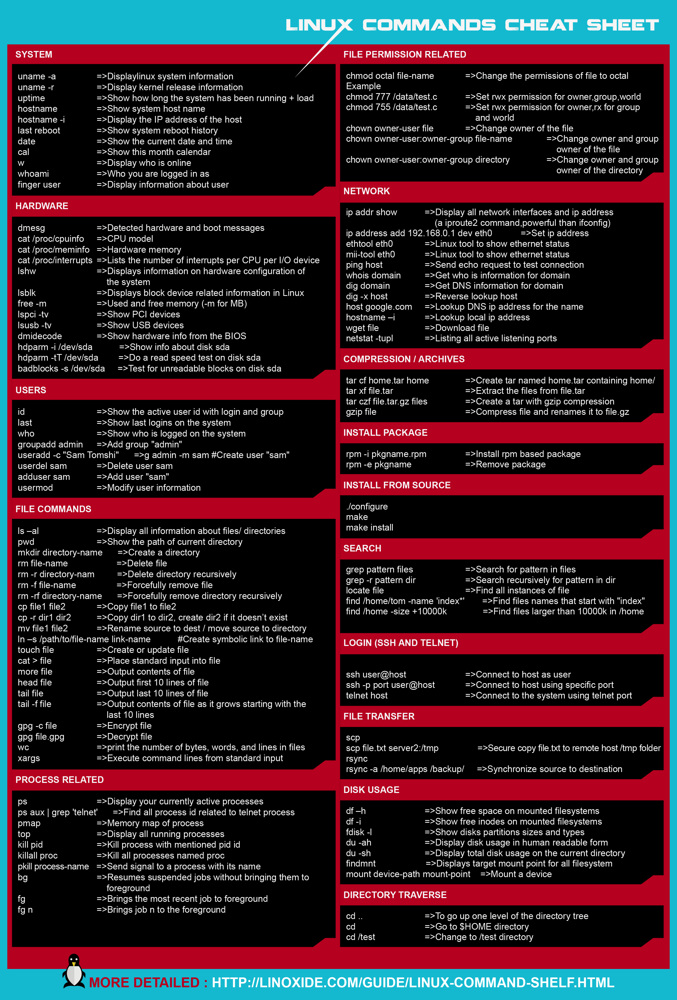

# Linux/Unix 學習筆記

## Linux 源碼

* [你管这破玩意叫操作系统源码 | 第一回 最开始的两行代码](https://mp.weixin.qq.com/s/LIsqRX51W7d_yw-HN-s2DA?utm_source=pocket_mylist)

## 中斷

* [認認真真的聊聊中斷](https://mp.weixin.qq.com/s/bTfeI5p4eO5j6I9edeV73g)
* [認認真真的聊聊"軟"中斷](https://mp.weixin.qq.com/s/g9rGKRQofAlWjdq8lDTTkQ?utm_source=pocket_mylist)

## 計算機的時間來源

推薦參考文章： https://mp.weixin.qq.com/s/A9fgd2xnp1YfHZ1iTMyXvw?utm_source=pocket_mylist

## 變成 root

已整理為文章： https://marco79423.net/articles/unix-%E8%AE%8A%E6%88%90-root/

## 行程 Process

已整理為文章： https://marco79423.net/articles/unix-%E8%A1%8C%E7%A8%8Bprocess/

## 禁止某使用者登入

已整理為文章： https://marco79423.net/articles/unix-%E7%A6%81%E6%AD%A2%E6%9F%90%E4%BD%BF%E7%94%A8%E8%80%85%E7%99%BB%E5%85%A5/

## Shadow Password

已整理為文章： https://marco79423.net/articles/unix-shadow-password/

## FreeBSD - Port 和 Package

已整理為文章： https://marco79423.net/articles/unix-ports-%E5%92%8C-package/

## 常見指令

### Cheat sheet

### find

已整理為文章： https://marco79423.net/articles/unix-%E5%B8%B8%E7%94%A8%E6%8C%87%E4%BB%A4-find/

### less

已整理為文章： https://marco79423.net/articles/unix-%E5%B8%B8%E7%94%A8%E6%8C%87%E4%BB%A4-less/

### wc

已整理為文章： https://marco79423.net/articles/unix-%E5%B8%B8%E7%94%A8%E6%8C%87%E4%BB%A4-wc/

### sort

已整理為文章： https://marco79423.net/articles/unix-%E5%B8%B8%E7%94%A8%E6%8C%87%E4%BB%A4-sort/

### grep

已整理為文章： https://marco79423.net/articles/unix-%E5%B8%B8%E7%94%A8%E6%8C%87%E4%BB%A4-grep/

### cut

已整理為文章： https://marco79423.net/articles/unix-%E5%B8%B8%E7%94%A8%E6%8C%87%E4%BB%A4-cut/
