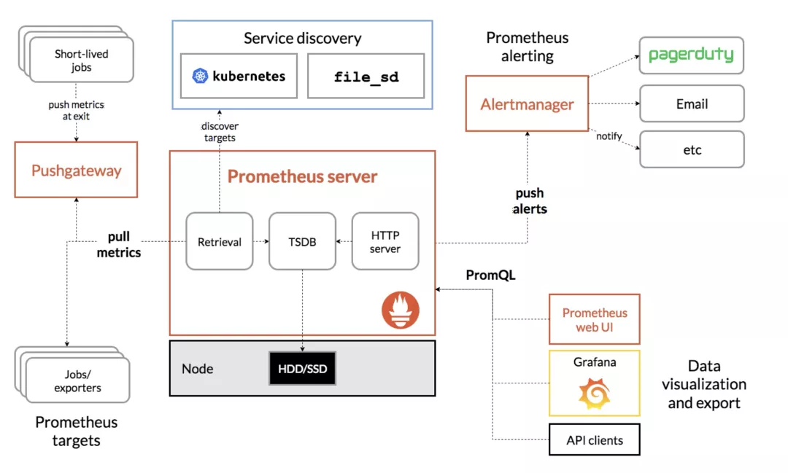
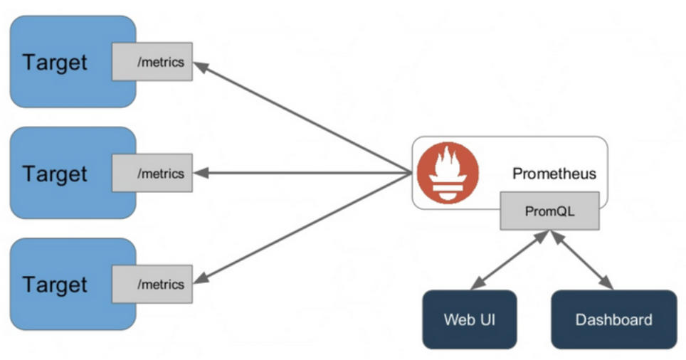
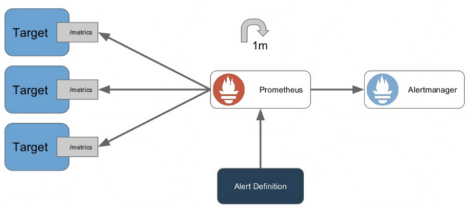
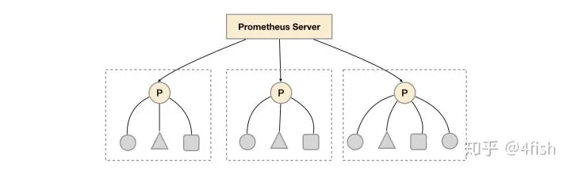

# Prometheus 學習筆記

## 簡介

* 原作者是 Matt T. Proud，從 Google 的集群管理器 Borg 和它的監控系統 Borgmon 中獲取靈感，開發了開源的監控系統 Prometheus，和 Google 的很多項目一樣，使用的編程語言是 Go
* 為了統一雲計算接口和相關標准，2015 年 7 月，隸屬於 Linux 基金會的 雲原生計算基金會（CNCF，Cloud Native Computing Foundation） 應運而生。第一個加入 CNCF 的項目是 Google 的 Kubernetes，而 Prometheus 是第二個加入的（2016 年）

* 關於他們為什麼需要新開發一個監控系統的文章 Prometheus: Monitoring at SoundCloud，在這篇文章中，他們介紹到，他們需要的監控系統必須滿足下面四個特性：
    * 多維度數據模型
    * 方便的部署和維護
    * 靈活的數據採集
    * 強大的查詢語言

多維度數據模型和強大的查詢語言這兩個特性，正是時序數據庫所要求的，所以 Prometheus 不僅僅是一個監控系統，同時也是一個時序數據庫。

> **註：**  
>
> 時序數據庫（Time Series Database, TSDB）
>
> 很多流行的監控系統都在使用時序數據庫來保存數據，這是因為時序數據庫的特點和監控系統不謀而合。
>
> * 增：需要頻繁的進行寫操作，而且是按時間排序順序寫入
> * 刪：不需要隨機刪除，一般情況下會直接刪除一個時間區塊的所有數據
> * 改：不需要對寫入的數據進行更新
> * 查：需要支持高並發的讀操作，讀操作是按時間順序升序或降序讀，數據量非常大，緩存不起作用
>
> DB-Engines 上有一個關於時序數據庫的排名，下面是排名靠前的幾個（2018年10月）：
>
> * InfluxDB：https://influxdata.com/
> * Kdb+：http://kx.com/
> * Graphite：http://graphiteapp.org/
> * RRDtool：http://oss.oetiker.ch/rrdtool/
> * OpenTSDB：http://opentsdb.net/
> * Prometheus：https://prometheus.io/
> * Druid：http://druid.io/

此外，Prometheus 數據採集方式也非常靈活。要採集目標的監控數據，首先需要在目標處安裝數據採集組件，這被稱之為 Exporter，它會在目標處收集監控數據，並暴露出一個 HTTP 接口供 Prometheus 查詢，Prometheus 通過 Pull 的方式來採集數據，這和傳統的 Push 模式不同。

不過 Prometheus 也提供了一種方式來支持 Push 模式，你可以將你的數據推送到 Push Gateway，Prometheus 通過 Pull 的方式從 Push Gateway 獲取數據。目前的 Exporter 已經可以採集絕大多數的第三方數據，比如 Docker、HAProxy、StatsD、JMX 等等，官網有一份 Exporter 的列表。

## 架構圖



Prometheus 生態系統包含了幾個關鍵的組件：Prometheus server、Pushgateway、Alertmanager、Web UI 等，但是大多數組件都不是必需的，其中最核心的組件當然是 Prometheus server，它負責收集和存儲指標數據，支持表達式查詢，和告警的生成。

* Prometheus Server
    * 收集與儲存時間序列資料，並提供 PromQL 查詢語言支援。
* Client Library
    * 客戶端函式庫，提供語言開發來開發產生 Metrics 並曝露 Prometheus Server。當 Prometheus Server 來 Pull 時，直接返回即時狀態的 Metrics。
* Pushgateway
    * 主要用於臨時性 Job 推送。這類 Job 存在期間較短，有可能 Prometheus 來 Pull 時就消失，因此透過一個閘道來推送。適合用於服務層面的 Metrics。
* Exporter
    * 用來曝露已有第三方服務的 Metrics 給 Prometheus Server，即以 Client Library 開發的 HTTP server。一個簡單範例 OpenStack Exporter，或是參考官方 Exporters and integrations。
* AlertManager
    * 接收來至 Prometheus Server 的 Alert event，並依據定義的 Notification 組態發送警報。
    * ex: E-mail、Pagerduty、OpenGenie 與 Webhook 等等。

## 運作機制

Exporter 負責把想要傳送給 Prometheus 的資料暴露出來。

Prometheus Server 拉取(Pull) Exporter 資料，然後透過 PromQL 語法進行查詢，再將資料給 Web UI or Dashboard。



Prometheus Server 觸發 Alert Definition 定義的事件，並發送給 AelertManager。AlertManager 會依據設定發送警報給 E-mail、Slack 等等。



## 資料模型

Prometheus 儲存的資料為時間序列，主要以 Metrics name 以及一系列的唯一標籤(key-value)組成，不同標籤表示不同時間序列。

格式： `<metric name>{<label name>=<label value>,…}`

範例： `http_requests_total{method="POST",endpoint="/api/tracks"}`

模型資訊如下：

* Metrics Name
    * 該名稱通常用來表示 Metric 功能，例如 http_requests_total，即表示 HTTP 請求的總數。
    * 而 Metrics Name 是以 ASCII 字元、數字、英文、底線與冒號組成，並且要滿足 `[a-zA-Z_:][a-zA-Z0-9_:]`
* 標籤
    * 用來識別同一個時間序列不同維度。如 http_request_total{method=”Get”} 表示所有 HTTP 的 Get Request 數量，因此當 method=”Post” 時又是另一個新的 Metric。
    * 標籤也需要滿足[a-zA-Z_:][a-zA-Z0-9_:]* 正規表示法。
* 樣本
    * 實際的時間序列，每個序列包含一個 float64 值與一個毫秒的時間戳。

按類型來分，可以分成四種主要的模型：

* Counter (只增不減計數器)
    * 可被累加的 Metric，用於計數，代表一種樣本數據單調遞增的指標，值會一直增加，不會減少 (但可以重設為 0)
    * 比如一個 HTTP Get 錯誤的出現次數、任務完成數、錯誤發生次數等。
    * 一般在定義 Counter 類型指標名稱時推薦使用 `_total` 為後綴。
    * 範例
        * 通過 rate 取得 HTTP 請求量的增長率
            ```promql
            rate(http_requests_total[5m])
            ```
        * 查询当前系统中，访问量前10的HTTP地址：
            ```promql
            topk(10, http_requests_total)
            ```
* Gauge (可增可減儀表盤)
    * Gauge 代表一種數據可以任意變化的指標，可增可減，側重於反應系統的當前狀態
    * 通常用來統計如服務的 CPU 使用值，溫度變化、內存使用變化等
* Histogram (直方圖)
    * Histogram 主要使用在表示一段時間範圍內的資料採樣
    * 常用於跟蹤事件發生的規模，例如請求耗時或響應大小等
    * 它特別之處是可以對記錄的內容進行分組，提供 count 和 sum 的功能。
* Summary (摘要)
    * 類似 Histogram，用來表示一端時間範圍內的資料採樣總結。
    * 與 Histogram 不同之處是，它提供了一個 quantiles 的功能，可以按百分比劃分跟蹤的結果。
    * 例如：quantile 取值 0.95，表示取采樣值裡面的 95% 數據。

### 常見指標

* Process
    * process_cpu_seconds_total (Counter)
        * 用戶和系統 CPU 總耗時，單位是秒
    * process_open_fds (Gauge)
        * 打開的的 file descriptors 的數量。
    * process_max_fds (Gauge)
        * file descriptors 數量的最大限額
    * process_virtual_memory_bytes (Gauge)
        * 虛擬內存大小（單位：字節）
    * process_virtual_memory_max_bytes (Gauge)
        * 虛擬內存大小的最大限額（單位：字節）
    * process_resident_memory_bytes (Gauge)
        * 預留內存大小，單位：字節
    * process_start_time_seconds (Gauge)
        * 進程自 unix 紀元以來的開始時間（秒）

* Golang 相關
    * go_goroutines (Gauge)
        * 目前存在的 goroutines 的數量
    * go_threads (Gauge)
        * 創建的操作系統線程數
    * go_info (Gauge)
        * GO 環境的信息
    * go_gc_duration_seconds (S)
        * 垃圾收集週期的暫停時間匯總

    * go_memstats_alloc_bytes (Gauge)
        * 已分配且仍在使用的字節數
    * go_memstats_alloc_bytes_total (Counter)
        * 分配的字節總數，包括已經被釋放的字節
    * go_memstats_sys_bytes (Gauge)
        * 從系統獲得的字節數
    * go_memstats_lookups_total (Counter)
        * 指針查找的總次數
    * go_memstats_mallocs_total (Counter)
        * 已分配內存的總數
    * go_memstats_frees_total (Counter)
        * 已釋放內存釋放統計
    * go_memstats_heap_alloc_bytes (Gauge)
        * 已分配且仍在使用的 heap 字節數。
    * go_memstats_heap_sys_bytes (Gauge)
        * 從系統獲得的 heap 數量
    * go_memstats_heap_idle_bytes (Gauge)
        * 未使用的 heap 字節數
    * go_memstats_heap_inuse_bytes (Gauge)
        * 正在使用的 heap 字節數
    * go_memstats_heap_released_bytes (Gauge)
        * 釋放給 OS 的 heap 字節數
    * go_memstats_heap_objects (Gauge)
        * 已分配對象的數量
    * go_memstats_stack_inuse_bytes (Gauge)
        * stack allocator 使用的字節數
    * go_memstats_stack_sys_bytes (Gauge)
        * stack allocator 從系統獲取的字節數
    * go_memstats_mspan_inuse_bytes (Gauge)
        * 內存跨度結構所使用的字節數。
    * go_memstats_mspan_sys_bytes (Gauge)
        * 內存跨度結構從系統獲取的字節數
    * go_memstats_mcache_inuse_bytes (Gauge)
        * 內存緩存結構使用的字節數。
    * go_memstats_mcache_sys_bytes (Gauge)
        * 內存緩存結構從系統獲取的字節數
    * go_memstats_buck_hash_sys_bytes (Gauge)
        * profile bucket 哈希表使用的字節數
    * go_memstats_gc_sys_bytes (Gauge)
        * 用於垃圾收集系統元數據的字節數
    * go_memstats_other_sys_bytes (Gauge)
        * 用於其他系統分配的字節數
    * go_memstats_next_gc_bytes (Gauge)
        * 下一次進行垃圾收集時的 heap 字節數
    * go_memstats_last_gc_time_seconds (Gauge)
        * 自 1970 年以來最後一次收集垃圾時間，精確到秒數
    * go_memstats_gc_cpu_fraction (Gauge)
        * 自程序啟動以來，GC 使用的該程序可用 CPU 時間，精確到分鐘

## Job 與 Instance

Prometheus 中會將任意獨立資料來源(Target)稱為 Instance。而包含多個相同 Instance 的集合稱為 Job。

* Instance: 被抓取目標 URL 的 `<host>:<port>` 部分。
* Job: 一個同類型的 Instances 集合。

## PromQL

Prometheus 提供一種特殊表達式來查詢監控數據，這個表達式被稱為 PromQL（Prometheus Query Language）。通過 PromQL 不僅可以在 Graph 頁面查詢數據，而且還可以通過 Prometheus 提供的 HTTP API 來查詢。

PromQL 查詢結果主要有 3 種類型：

* 瞬時數據 (Instant vector)
    * 包含一組時序，每個時序只有一個點，例如：http_requests_total
* 區間數據 (Range vector)
    * 包含一組時序，每個時序有多個點，例如：http_requests_total[5m]
* 純量數據 (Scalar)
    * 純量只有一個數字，沒有時序，例如：count(http_requests_total)

樣本(Sample) 由以三三個部分組成：

* 指標(metric)
    * 名稱和描述當前樣本特徵的 labelsets
* 時間戳(timestamp)：
    * 一个精确到毫秒的時間戳;
* 樣本值(value)
    * 一个float64的浮点型数据表示当前样本的值。

    <--------------- metric ---------------------><-timestamp -><-value->
    http_request_total{status="200", method="GET"}@1434417560938 => 94355
    http_request_total{status="200", method="GET"}@1434417561287 => 94334

條件判斷：

* `=` 等於
* `!=` 不等於
* `=~` 等於 (支援 regex)
* `!~` 不等於 (支援 regex)

時間區間：

* ms - 毫秒
* s - 秒
* m - 分
* h - 時
* d - 天 (24 小時)
* w - 週 (7 天)
* y - 年 (365 天)

修飾子：

* offset 指定時間 offsest
* @ 直接指定時間 (用 unix timestamp，可以用 start, end 函式)

聚合：

* sum (總和)
* min (最小值))
* max (最大值)
* avg (平均值)
* group (all values in the resulting vector are 1)
* stddev (標準差)
* stdvar (標準方差)
* count (計數)
* count_values (同值的計數)
* bottomk (最小的 k 個數)
* topk (最大的 k 個數)
* quantile (分位數)

其中只有count_values, quantile, topk, bottomk 支援參數。

* `without` 從計算結果移除列舉的標簽。
* `by` 只保留列出的標簽。

```promql
sum(http_requests_total) without (instance)
```

等價於

```promql
sum(http_requests_total) by (code,handler,job,method)
```

### 語法

直接輸入指標名稱

```promql
up # 表示 Prometheus 能否抓取 target 的指標，用於 target 的健康檢查  
```

等價於

```promql
{__name__="up"}
```

指定某個 label 來查詢 (Instant vector selectors)。

```promql
up{job="prometheus"} 
```

查出一段時間內的所有數據 (注意它返回的數據類型是 Range vector，沒辦法在 Graph 上顯示成曲線圖，通常會和 rate() 或 irate() 函數一起使用)

```promql
http_requests_total[5m]
```

```promql
# 計算的是每秒的平均值，適用於變化很慢的 counter  
# per-second average rate of increase, for slow-moving counters  
rate(http_requests_total[5m])  
   
# 計算的是每秒瞬時增加速率，適用於變化很快的 counter  
# per-second instant rate of increase, for volatile and fast-moving counters  
irate(http_requests_total[5m])  
```

## HTTP API

我們不僅僅可以在 Prometheus 的 Graph 頁面查詢 PromQL，Prometheus 還提供了一種 HTTP API 的方式，可以更靈活的將 PromQL 整合到其他系統中使用。

* GET /api/v1/query
* GET /api/v1/query_range
* GET /api/v1/series
* GET /api/v1/label/<label_name>/values
* GET /api/v1/targets
* GET /api/v1/rules
* GET /api/v1/alerts
* GET /api/v1/targets/metadata
* GET /api/v1/alertmanagers
* GET /api/v1/status/config
* GET /api/v1/status/flags

## 設定檔

```yaml
#  全局配置，比如 scrape_interval 表示 Prometheus 多久抓取一次數據，evaluation_interval 表示多久檢測一次告警規則
global:  
  scrape_interval:     15s  # 間隔多久拉取一次資料 (預設 1 分鐘)  
  scrape_timeout: 10s       # 抓取的 Timeout 時間 (預設 10 秒)

  evaluation_interval: 15s  # 表示多久檢測一次告警規則 (預設 1 分鐘)
   
# 定義 Prometheus 要抓取的目標
scrape_configs:  
  # The job name is added as a label `job=<job_name>` to any timeseries scraped from this config.  
  - job_name: 'prometheus'  
   
    scrape_interval: 5s     # 複寫抓取的頻率
    metrics_path: /metrics  # 抓取 metric 的路由
    scheme: 'http'          # 請求的 protocol
   
    static_configs:  
    - targets: ['localhost:9090']  

# Alertmanager configuration  
alerting:  
  alertmanagers:  
  - static_configs:  
    - targets:  
      # - alertmanager:9093  
   
# Load rules once and periodically evaluate them according to the global 'evaluation_interval'.  
rule_files:  
  # - "first_rules.yml"  
  # - "second_rules.yml"  
```

Prometheus 默認的配置文件分為四個部分：

* global
    * Prometheus 的全局配置，比如 scrape_interval 表示 Prometheus 多久抓取一次數據，evaluation_interval 表示多久檢測一次告警規則
* scrape_config
    * 這裡定義了 Prometheus 要抓取的目標
* rule_files
    * 告警規則
* alerting
    * 關於 Alertmanager 的配置

## 告警和通知

Prometheus 的告警功能被分成兩部分：一個是告警規則的配置和檢測，並將告警發送給 Alertmanager，另一個是 Alertmanager，它負責管理這些告警，去除重復數據，分組，並路由到對應的接收方式，發出報警。常見的接收方式有：Email、PagerDuty、HipChat、Slack、OpsGenie、WebHook 等。

我們在上面介紹 Prometheus 的配置文件時瞭解到，它的默認配置文件 prometheus.yml 有四大塊：global、alerting、rule_files、scrape_config，其中 rule_files 塊就是告警規則的配置項，alerting 塊用於配置 Alertmanager

```yaml
rule_files:  
  - "alert.rules"  
```

alert.rules

```yaml
groups:  
- name: example  
  rules:  
   
  # Alert for any instance that is unreachable for >5 minutes.  
  - alert: InstanceDown  
    expr: up == 0  
    for: 5m  
    labels:  
      severity: page  
    annotations:  
      summary: "Instance {{ $labels.instance }} down"  
      description: "{{ $labels.instance }} of job {{ $labels.job }} has been down for more than 5 minutes."  
   
  # Alert for any instance that has a median request latency >1s.  
  - alert: APIHighRequestLatency  
    expr: api_http_request_latencies_second{quantile="0.5"} > 1  
    for: 10m  
    annotations:  
      summary: "High request latency on {{ $labels.instance }}"  
      description: "{{ $labels.instance }} has a median request latency above 1s (current value: {{ $value }}s)"
```

配置好後，需要重啟下 Prometheus server，然後訪問 http://localhost:9090/rules 可以看到剛剛配置的規則：

使用 Alertmanager 發送告警通知

雖然 Prometheus 的 /alerts 頁面可以看到所有的告警，但是還差最後一步：觸發告警時自動發送通知。這是由 Alertmanager 來完成的

## 實際應用

在開發環境，往往只需要部署一個 Prometheus 實例便可以滿足數十萬指標的收集。但在生產環境中，應用和服務實例數量眾多，只部署一個 Prometheus 實例通常是不夠的，比較好的做法是部署多個Prometheus實例，每個實例通過分區只拉取一部分指標。然後再使用聯邦集群（federation），即把 Prometheuse Server 按照樹狀結構進行分層，根節點方向的 Prometheus 將查詢葉子節點的 Prometheus 實例，再將指標聚合返回。



不過顯然易見的是，使用聯邦集群依然不能解決問題，首先單點問題依然存在，根節點掛了的話查詢將會變得不可用，如果配置多個父節點的話又會造成數據冗餘和抓取時機導致數據不一致等問題，而且葉子節點目標數量太多時，更加會容易使父節點壓力增大以至打滿宕機，除此之外規則配置管理也是個大麻煩。

還好社區出現了一個 Prometheus 的集群解決方案：Thanos，它提供了全局查詢視圖，可以從多台Prometheus查詢和聚合數據，因為所有這些數據均可以從單個端點獲取。

* Querier 收到一個請求時，它會向相關的 Sidecar 發送請求，並從他們的 Prometheus 服務器獲取時間序列數據。
* 它將這些響應的數據聚合在一起，並對它們執行 PromQL 查詢。它可以聚合不相交的數據也可以針對 Prometheus 的高可用組進行數據去

再來說到存儲，Prometheus 查詢的高可用可以通過水平擴展+統一查詢視圖的方式解決，那麼存儲的高可用要怎麼解決呢？在 Prometheus 的設計中，數據是以本地存儲的方式進行持久化的，雖然本地持久化方便，但也會帶來一些麻煩，比如節點掛了或者 Prometheus 被調度到其他節點上，就會意味著原節點上的監控數據在查詢接口中丟失，本地存儲導致了 Prometheus 無法彈性擴展，為此 Prometheus 提供了 Remote Read 和 Remote Write 功能，支持把 Prometheus 的時間序列遠程寫入到遠端存儲中，查詢時可以從遠端存儲中讀取數據。重。

再來說到存儲，Prometheus 查詢的高可用可以通過水平擴展+統一查詢視圖的方式解決，那麼存儲的高可用要怎麼解決呢？在 Prometheus 的設計中，數據是以本地存儲的方式進行持久化的，雖然本地持久化方便，但也會帶來一些麻煩，比如節點掛了或者 Prometheus 被調度到其他節點上，就會意味著原節點上的監控數據在查詢接口中丟失，本地存儲導致了 Prometheus 無法彈性擴展，為此 Prometheus 提供了 Remote Read 和 Remote Write 功能，支持把 Prometheus 的時間序列遠程寫入到遠端存儲中，查詢時可以從遠端存儲中讀取數據。

其中一個例子中就是M3DB，M3DB是一個分佈式的時間序列數據庫，它提供了Prometheus的遠程讀寫接口，當一個時間序列寫入到M3DB集群後會按照分片（Shard）和復制（Replication Factor）參數把數據復制到集群的其他節點上，實現存儲高可用。除了M3DB外，Prometheus目前還支持InfluxDB、OpenTSDB等作為遠程寫的端點。

## Pushgateway

假如有一種情況是一些任務節點還沒來得及被拉取就運行完退出了，這時候監控數據就會丟失，為了應對這種情況，Prometheus 提供了一個工具：Pushgateway，用來接收來自服務的主動上報。

它適用於那些短暫存活的批量任務來將指標推送並暫存到自身上，借著再由Prometheus 來拉取自身，以防止指標還沒來得及被 Prometheus 拉取便退出。

除此以外 Pushgateway 也適用於在 Prometheus 與應用節點運行在異構網絡或被防火牆隔絕時，無法主動拉取節點的問題，在這種情況下應用節點可以通過使用Pushgateway的域名將指標推送到Pushgateway實例上，Prometheus就可以拉取同網絡下的 Pushgateway 節點了。

Pushgateway可以替代拉模型來作為指標的收集方案，但在這種模式下會帶來許多負面影響：

Pushgateway 被設計為一個監控指標的緩存，這意味著它不會主動過期服務上報的指標，這種情況在服務一直運行的時候不會有問題，但當服務被重新調度或銷毀時，Pushgateway 依然會保留著之前節點上報的指標。而且，假如多個 Pushgateway 運行在 LB 下，會造成一個監控指標有可能出現在多個 Pushgateway 的實例上，造成數據重復多份，需要在代理層加入一致性哈希路由來解決。

在拉模式下，Prometheus可以更容易的查看監控目標實例的健康狀態，並且可以快速定位故障，但在推模式下，由於不會對客戶端進行主動探測，因此對目標實例的健康狀態也變得一無所知。

## Exporter

### cAdvisor

    It is container advisor.

* It provides resource usage, performance characteristics & related information about the containers running on the cloud.
* It is an open-source tool & runs as a daemon process in the background collecting, processing & aggregating useful DevOps information.
    * native support for Docker
    * enables us to track historical resource usage with histograms & stuff

開源的單節點Agent，負責監控容器資源使用情況與性能，採集機器上所有Container的Memory、網絡使用情況、文件系統和CPU等數據。

cAdvisor雖然好用，但有些缺點：

* 僅能監控基礎資源利用情況，無法分析應用的實際性能
* 不具備長期存儲和趨勢分析能力。

### Kube-state-metrics

輪詢Kubernetes API，並將Kubernetes的結構化信息轉換為metrics。

## 參考資料

* [號稱下一代監控系統，來看看它有多強！](https://mp.weixin.qq.com/s/hrZfFmbyn_4ZzJOpK_-0ZQ)
* [Prometheus 介紹與基礎入門 (上)](https://www.inwinstack.com/zh/blog-tw/blog_other-tw/2156/)
