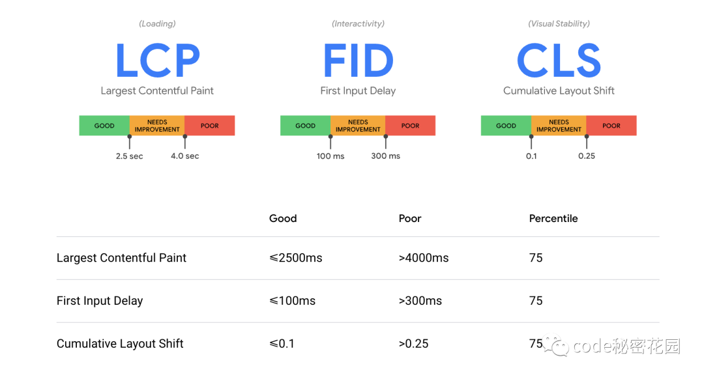

# SEO 學習筆記

## 什麼是搜尋引擎優化 (SEO)？

SEO 是一種透過自然排序（無付費）的方式增加網頁能見度的行銷規律。SEO包含技術與創意，用以提高網頁排名、流量，以及增加網頁在搜尋引擎的曝光度。SEO有很多方式，可以從網頁上的文字，或著其它網站連結到你的網頁，有時SEO只是運用簡單的方法，確保搜尋引擎可以了解你的網站架構。


SEO 並不僅僅是建構搜尋引擎友善的網頁，SEO 可以讓網頁更容易被人們使用，並且帶給人們更多的資訊，這些是與SEO原則密切相關的。

## 為什麼需要 SEO？

根據美國雲端計算公司 Akamai 的研究：

> 當網站沒有在三秒內顯示完畢，40% 的消費者會選擇直接跳離網站；在網站速度與營收的關係研究上，數據也表示，只要網站速度每提升 100 毫秒，營收就能增加 1%。

## 流量來源

網頁流量的主要來源來自於各大商業搜尋引擎，Google、Bing、Yahoo!，雖然社群媒體或其他方式一樣能夠讓人訪問你的網頁，但搜尋引擎仍然是大多數網路用戶搜尋瀏覽的主要方式，不管你的網頁是提供內容、服務、產品、資訊、或其他任何東西。

搜尋引擎獨特的地方在於它們提供“針對性”的流量 – 人們會搜尋你所提供的訊息，而搜尋引擎是通往這目標的道路，若搜尋引擎無法找到你的網頁，或無法把你的網頁文章加入到他們的資料庫，你就喪失了吸引流量到你網站的最好機會。

搜尋查詢 – 瀏覽者輸入到搜尋框的文字 – 是非常有價值的關鍵字，經驗證明搜尋引擎的流量可以成就（或破壞）一家公司的成敗，對網站來說，“針對性”的流量所提供的宣傳、收入和曝光是沒有其他的行銷方式可以比擬，並且比起其它類型的行銷與宣傳，SEO 的投資報酬率來的有效率多了。


## 各大搜尋引擎

### Google

#### Google 三種動物演算法

* [Google熊貓演算法](https://www.newscan.com.tw/all-seo/google-panda.htm)
    * 「熊貓演算法」更新的目的是獎勵高質量的網站，並減少Google有機搜尋引擎結果中低質量網站的存在，它最初也被稱為“農夫”。 據Google聲稱，「熊貓演算法」在首次推出幾個月內的英語搜尋結果高達12％，2011年至2015年，我們已經追蹤了「熊貓演算法」28次更新紀錄。
* [Google企鵝演算法](https://www.newscan.com.tw/all-seo/google-penguin.htm)
    * 緊隨「熊貓演算法」之後，Google的「企鵝演算法」是一項新的努力，主要是在獎勵高質量的網站，並減少搜尋引擎結果頁面（SERP）涉及操縱連結和關鍵字填充存在的網站。
* [Google蜂鳥演算法](https://www.newscan.com.tw/all-seo/google-hummingbird.htm)
    * 與之前發布的「熊貓演算法」和「企鵝演算法」更新不同，後者最初是作為Google現有算法的附件發佈的，目前「蜂鳥演算法」已徹底轉變成為核心算法引用， 雖然核心算法中許多先前組件還是保持著，但「蜂鳥演算法」表明Google開始深入了解搜尋者「查詢資料的意圖為何?」，並將其與相關結果進行匹配。

### 網站核心指標 (Core web  vitals)

Google 在官方部落格中針對使用者體驗推出了新的 3 項 Core web vitals (暫譯網站核心指標)。



* 最大內容渲染 (LCP, Largest Contentful Paint） - 速度指標
* 首次輸入延遲 (FID, First Input Delay）- 互動性
* 累計版面配置轉移 (CLS, Cumulative Layout Shift）- 穩定性

Google 更指出若 75% 以上的使用者在網站中的瀏覽體驗都能夠通過以上 3 種指標，就能夠大幅的提升使用者的搜尋體驗，甚至能夠讓原本因等待而離開的使用者減少 24%！

#### 最大內容渲染 (LCP, Largest Contentful Paint）

> 速度

在 LCP 之前有另外一個指標 First Contentful Paint (FCP)，FCP 針對網站中的第一個元素的載入，但如果只針對第一元素，對使用者來說仍然是看不到重要的內容的，因此 Google 針對這樣的情形另外制定了一個全新的指標 – LCP。

LCP 是計算網頁可視區 (viewport) 中最大元件的載入時間，也就是頁面的主要內容被使用者看到的時間，是速度的指標。

LCP 是其中最重要的指標，為了良好的用戶體驗，這個時間應該盡量控制在 2.5S 之內。

與 FCP 不同的是，LCP 更加注重頁面中最大元素的載入速度。而 Google 是怎麼判定最大元素呢？當頁面在載入的過程中，Google 會去抓取頁面可視範圍中最大的元素，並會隨時針對可視範圍中的內容改變，直到頁面完全載入後，才會將頁面中最大的元素訂為 LCP。

所以 LCP 在過程中是為改變的。


LCP 會偵測的項目：

* `` 元素
* `<svg>` 元素
* `<video>` 元素
* 透過 url() 的 CSS 功能載入背景圖片的元素
* 包含文字的區塊級元素 (block-level elements) 或行內元素 (inline elements)

通常 LCP 可以針對以下 4 大點來進行優化：

* 減少伺服器回應時間
    * 針對主機進行優化
    * 使用較近的 CDN 主機
    * 使用網頁快取（Cache）
    * 讓第三方的資源提早載入
* 盡量避免 Blocking Time
    * 降低 JavaScript blocking time
    * 降低 CSS blocking time
* 加快資源載入的時間
    * 圖片大小優化
    * 預先載入重要資源
    * 將文字檔案進行壓縮
    * 根據使用者的網路狀態提供不同的內容
    * 使用 service worker
* 避免使用客戶端渲染(CSR)
    * 若必須使用 CSR ，建議優化 JavaScript ，避免渲染時使用太多資源
    * 盡量在伺服器端完成頁面渲染，讓用戶端取得已渲染好的內容

#### 首次輸入延遲 (FID, First Input Delay）

> 可開始互動的時間

有些網站雖然已經有內容顯示，但不管使用者怎麼與頁面互動都沒有任何回饋，所以 Google 針對這樣的情形制定了另一個指標 – First Input Delay (FID)

什麼是 FID：

首次輸入 (First Input) 與頁面上的響應元件 (responsive elements) 息息相關。這些響應元件可能是連結、按鈕或是跳出式元素 (pop-ups)。

輸入延遲 (Input Delay) 通常發生於瀏覽器的主執行序過度繁忙，而導致頁面內容無法正確地與使用者進行互動。舉例來說，可能瀏覽器正在載入一支相當肥大的 JavaScript 檔案，導致其他元素不能被載入而延遲可互動的時間。

常見延遲的問題有：

* 點選連結或按鈕載入內容延遲
* 文字對話框無法立即輸入文字
* 打開下拉式選單畫面延遲
* 無法勾選對話方塊

優化的方式：

* 減少JavaScript運作的時間
* 降低網站的 request 數並降低檔案大小
* 減少主執行序的工作
* 降低第三方程式碼的影響

#### 累計版面配置轉移 (CLS, Cumulative Layout Shift）

> 頁面穩定性

你是不是也有過這樣的經驗呢？當你正在使用一個頁面時，突然跳出一個按鈕或廣告，導致點擊到非目標按鈕或功能。Google 對於此情形建立了一個頁面穩定性的指標 – CLS。

可預期的版面配置轉移 (Expected layout shifts)：

當你在 web.dev 的網站中，點選內容回饋的收合功能，這時候頁面因為收合而導致的版面配置轉移是可以預期的。因此， Google不會將此判定為是頁面的不穩定性。


不可預期的版面配置轉移(Un-expected layout shifts)：

不可預期的版面配置轉移通常是因為網頁內的元素載入順序不同而造成的。在 Google 提供的範例裡，由於 Click Me! 的按鈕是在文字方塊載入後才載入的，導致使用者在閱讀到一半時出現內容位移的情形，這種對於使用者來說不可預期的版面配置轉移就會影響 CLS 指標的分數。


產生的原因有五個：

1. 沒有圖框包圍的圖像
2. 沒有尺寸的廣告或嵌入式iframe
3. 動態注入的內容
    * 舉例來說，在 WordPress 你可以連結 YouTube的影片或者 Tweet，而在 WordPress 上會顯示影片或Tweet 視為個嵌入式項目
4. 加載網頁字體導致 FOIT 或 FOUT
    * FOIT 是指網頁加載時當字型加載太慢，字跑不出，當加載完成後跳出的字型會閃一下
    * FOUT 是指非預期樣式的文字閃爍出現，同樣發生在字型加載太慢時瀏覽器先套用了其他字型當作替代，而在加載完成後跳回原先所設定的文字發生一閃的狀況。)
5. 在更新 DOM 之前等待網路回應

優化的方式：

* 給予會比較慢載入的元素一個預設的寬度與高度
* 透過 CSS 語法，為網頁中的元素提供預留的空位，避免載入後導致頁面中的內容移動
* 透過 `<preload>` 的方式，將會導致頁面內容移動的元素提前載入 (字體、圖片等)

#### 測試 Core Web Vitals 的方式


#### 其他優化指標

* 行動版頁面
    * Google已經宣布會將行動版的使用者體驗作為參考項目之一，網站的排名也會將是否符合行動裝置使用作為一個參考指標。
* 網站瀏覽安全性
    * 當網站含有釣魚內容或可能導致網站使用者中毒的狀況，Google 會將其從搜尋結果上移除。可以透過 Google Search Console 中的「安全性問題」來確認。
* HTTPS/SSL 設定
    * 網站中的傳輸過程需要經由 SSL 進行加密，避免訊息被中途攔截導致資訊外洩。
* 避免蓋版廣告
    * 蓋板式廣告很容易對使用者造成使用上的不便。如果網頁上出現這些類型的跳出式蓋版廣告，那可能就要進行修改了。

### CSR

SEO 背後的流程是 crawling → indexing → ranking 三個階段，而另一件重要的事是「沒有渲染的內容是不會被加入到 indexing 的」。

在 google search engine 團隊不斷的努力，CSR 網站實際上是可以參與 SEO 的，並不像是第一次跟伺服器拿到 HTML 後，發現裡面只有一個 `<div>` 後，就不理這個網站了。

googlebot 有所謂 second wave of indexing 技術，如果一個網站有需要被渲染的需求，亦即像是等待 JavaScript 把內容渲染出來，而 googlebot 遇到這種情況會先丟到 render queue 裡面，等待有資源處理渲染任務後才會回來做這件事。


但 googlebot 每天都要處理數量非常龐大的網站，它必須要有些機制判斷有些內容實際上不必參與 SEO，也就是 render budget 的評估機制。

render budget 包括像是等待渲染的時間太久、很少人去的網站等因素，則會造成 googlebot 評估一個網站「不用等到全部的內容渲染完畢後才 indexing」，因此這種情況下只有部分內容會進入到 indexing 跟 ranking 的階段。所以如果比較重要的內容是在 JavaScript 渲染階段才會出現在畫面上，googlebot 有機會不將這些重要的內容納入 indexing 中，最終將會不利於 SEO。

綜合上述，CSR 實際上雖然可以參與 SEO，但是不利於內容變動快速的網站，因為 CSR 沒辦法讓 googlebot 快速地拿到需要的內容。這時候 SSR 跟 SSG 就能夠發揮效用，googlebot 不必經過 second wave of indexing 就可以迅速地跟伺服器拿到資料，因此有利於內容變動快速的網站做 SEO。

如果說伺服器可以承受負擔，而且 SSG 跟 SSR 對於 SEO 從內容上來看都比較好，但 SEO 有很多項指標，而如果全面使用 SSR，把所有資料都在伺服器端處理，其實也不一定有利於 SEO，而且頁面中的有些內容其實不必參與 SEO。因此 SSR 只需把「對使用者有價值的資料」渲染完畢，把剩下的部分交由 CSR 處理就行了，這樣使用者可以更快地看到內容，有利於「First Contentful Paint」的評分。

### Bing

Bing 前身是 MSN Live Search，服務的對象比互聯網世界小得多。所以 Bing 是從原來一個小引擎逐步發展。

已知的事實是：

* Bing 搜尋引擎爬行得比 Google 搜尋引擎慢。
    * Google 2010 推出 Cafferine 令爬行的速度快了幾倍。是 Caffeine 打下的基礎而令 Panda 和 Penguin 變得可行。所以你會發現 Bing 搜尋排名的變動較 Google 慢很多，看起來就像 Bing 偏向舊網站。

* 由於爬行慢所以 Bing 搜尋引擎會經簡單初步判斷放棄檢索沒有潛質的網站，將運算能力留給其他更有潛質的網站。
    * 所以就算你提交網站地圖 sitemap 不一定有幫助。並且不是網站内每一網頁的內容都會被檢索。
    * 例如你網站有 1,000 網頁，Bing 可能只檢索其中 100頁。Google 也是，但由於跑得快，所以可是檢索得網站和網站內更多網頁。

* 對新網站來說最有效的方法避免被 Bing 放棄就是有一個來自權威網站的反向連結。例如將網站提交 dmoz.org。
    * Bing 乎要更加看重權威網站入站連結。Google 已經排除了完全符合關鍵字的域名名稱的排名影響，即得說www.cosmetics.com 關鍵字 “cosmetics” 可不一定排名靠前。
    * Bing 以前專利提到使用的域名和關鍵字相關將提振排名，似乎 Bing 仍然這樣做。

* 如果網域名稱配對關鍵字，Bing 搜尋排名給予很高的分數
    * 這從 Bing 有一份專利文件 “Determining relevance of documents to a query based on identifier distance” 中引證得到。
    * 相對 Google 就不會給了太多優勢，從 2012 年的一份專利文件 Google Exact Match Domain 更新中引證得到。

* Bing 對社交媒體訊號給予的權重比 Google 要大得多。
    * Bing 據說已經可以索引 Facebook 內的帖子和 Twitter 的帖子，而 Google 只能索引 Twitter 的帖子。
    * 而在 Google 輸入相同關鍵字搜尋時是找不同這個 Facebook 粉絲頁，要更新搜尋關鍵字為 “網上生意推廣” 才在搜尋結果第一頁第七位找到，但顯示的是 53 個讚，二星期前的更新。

* 本地搜尋引擎優化 Local SEO 最重要的一點就是告訴搜尋引擎你的生意的所在地區，當搜尋引擎認為提供區域化搜尋結果(例如醫務所，餐廳，店舖等等)對搜尋用戶更有價值時就會對配對地區的搜尋結果提高排名。
    * 在 Bing 搜尋引擎是通過 Bing Places for Business 登記註冊你的店鋪。

* 對 Google 優化有經驗的人大都知道 Google 好多年前已經不再理會 meta keyword 關鍵字, 理由是 meta 關鍵字太容易作假。Bing 搜尋引擎幾年前亦公開說 meta 關鍵字不會影響 Bing 的搜尋排名結果。
    * 但從實驗中發現加入 meta 關鍵字有助於通知 Bing 該網頁內容與某關鍵字相關。
    * 原因可能是 Google 和 Bing 對關鍵字出現頻率有不同的看法。Google 搜尋引擎優化中關鍵字出現太多有反效果，但 Google 的理想關鍵字出現頻率對 Bing 來說可能又太少，不足以引起相關性索性，meta 關鍵字正好加強相關性提示而又不引起 Google 反感。

* 同 meta 關鍵字理由類似，Bing 建議每一網頁只有一個 HTML H1 標題。
    * Bing 會分析 H1 標題找出關鍵字進行索引。多過一個的 H1 標題對 Bing 會是擾亂訊號。從這點來說 Bing 搜尋引擎是比 Google 搜尋引擎笨。

* Bing 要求 meta description 描述必需存在，而 Google 沒有這個要求。
    * 就算你已經定義 meta 描述，對 Google 來說亦只作它的參考，如果 Google 發現網頁中某片段內容更切合當前用戶輸入的搜尋關鍵字，Google 會自動抓取該段文字顯示在搜尋結果中。從這點來說 Google 又比 Bing 聰明。

* Bing 搜尋引擎似乎很看重分類 Category 的 meta 描述，當分類和搜尋關鍵字配匹時，分類在 Bing 比 Google 更容易取得較分類中網頁更高的排名。

* Google 和 Bing 對區域性處理有很大不同。當以 Google 搜尋時，Google 會自動將搜尋用戶所在國家的搜尋 Top Level Domain TLD （例如： 當搜尋者在香港輸入 google.com，會被轉址到 google.com.hk，如搜尋者在台灣，會被轉址到 google.com.tw）, 排名結果會較受區域性影響。Bing 沒有 TLD 轉址，排名結果會較少受區域性影響。

## 學習指南

* [《Google 搜尋中心 - 繁體中文》](https://developers.google.com/search?hl=zh_tw&card=seo)
* [《Google搜尋引擎最佳化初學者指南》](http://static.googleusercontent.com/media/www.google.com/en/us/intl/zh-tw/webmasters/docs/search-engine-optimization-starter-guide-zh-tw.pdf)
* [《Google 搜尋引擎最佳化 (SEO) 速記指南》](https://storage.googleapis.com/support-kms-prod/SNP_DE441AD549FEE9AE5B638F82579D99472297_3027140_zh-TW_v1)

## 七個成功的SEO步驟

1. 必須讓搜尋引擎可以簡單地抓取你的網站內容。
    * 就算你的網站內容非常優質，如果各大搜尋引擎無法分析並檢索你的內容，最後也將石沉大海之中

2. 讓搜尋者可以得到他們想要或是超出他們預期的內容。
    * 每個搜尋資料的人都想要快速的達到目的，如果你可以一次性的滿足搜尋者的需求，他將不會再去找尋其它網站，也代表你的網頁就是最後的決定，這對SEO是非常有助益的

3. 適當優化你的文章內容關鍵字以便吸引搜尋者與搜尋引擎。
    * 搜尋引擎是依照搜尋大的意圖來做排序的判斷，如果你可以很好的掌握，標題與文章內容，並獲取大多數人的青睞，相同的也會貼近搜尋引擎的喜好，排名提升也不是難事

4. 出色的用戶體驗，包含網頁速度和使用者體驗。
    * 可以參考自己的瀏覽網站經驗，大部分人都不喜歡在很慢的網頁上瀏覽或是看著編排的亂糟糟的網頁不知如何下手，所以好好安排你的網站並且留意多人瀏覽時是否會造成網頁延遲

5. 分享有價值的內容來獲得外部連結、引用來擴展你的網站。
    * 想讓網站排名上升最好的方式沒有之一，就是讓你的網頁更有價值，並且讓人願意分享並且收錄你的網頁，當你的網頁被越多人分享與轉錄，你的排名也會越來越好

6. 用心思在文章標題、連結、描述上，可以在排名上得到好的點擊率。
    * 如果你想到有創意並且不禁會讓人多看一眼的文案或是標題，一定要放上去你的網站，這會讓你的網站在搜尋到達頁上眼中一亮並且帶動點擊率也會上升不少

7. 使用結構化標記與複合資料在搜尋結果頁面(SERPs)上脫穎而出。
    * 使用Snippet/schema markup 告訴搜尋引擎你的網站架構分布，讓你的網站內容更容易讓搜尋引擎使用

## robots.txt

參考： [Google 如何解讀 robots.txt 規格](https://developers.google.com/search/docs/advanced/robots/robots_txt?hl=zh-tw)

基本會用的幾個參數分別如下：

* User-agent
    * 定義下述規則對哪些搜尋引擎生效，即是對象。
* Disallow
    * 指定哪些目錄或檔案類型不想被檢索，需指名路徑，否則將會被忽略。
* Allow
    * 指定哪些目錄或檔案類型可能被檢索，需指名路徑，否則將會被忽略。
* Sitemap
    * 指定網站內的 sitemap 檔案放置位置，需使用絕對路徑。

基本用法：

允許所有搜尋引擎檢索所有內容(通常建議使用)

```plain
User-agent: *
Disallow:
```

拒絕所有搜尋引擎檢索所有內容：

```plain
User-agent: *
Disallow: /
```

拒絕所有搜尋引擎檢索/members/底下所有內容：

```plain
User-agent: *
Disallow: /members/
```

拒絕Google搜圖的爬蟲檢索/images/底下所有內容：

```plain
User-agent: Googlebot-image
Disallow:/images/
```

拒絕所有搜尋引擎檢索網站內png為副檔名的圖檔。

```plain
User-agent: *
Disallow: *.png$
```

拒絕Bing搜尋引擎檢索網站內/wp-admin目錄底下所有內容及網站內開頭為test的所有檔名。

```plain
User-agent: bingbot
Disallow: /wp-admin/
Disallow: ^test*
```

## 關鍵字研究 Keyword research

「關鍵字」（keyword），是搜尋引擎的根本基礎，也是想做好搜尋引擎行銷（SEO＋SEM）的通用邏輯。

想要依靠 Search 這個渠道來獲得流量跟收益，就必須搞懂自己「要經營哪些關鍵字」——業界稱之為「關鍵字研究」（keyword research）。

我們需要知道消費者會搜尋哪些關鍵字、以及品牌需要哪些關鍵字。而怎麼找到這些字呢？這就是關鍵字研究要做的功課。

四個步驟：

1. 找到大量關鍵字
2. 判斷關鍵字搜尋量
3. 進行關鍵字篩選跟分類
4. 選擇適合的關鍵字

注意事項：

* 相似關鍵字要一起整理
    * 在關鍵字研究的過程中，很多字詞你會覺得：欸這個太像了吧？根本是同個意思啊？那應該不用特地整理吧。但對於 Google 來說，那兩個字很有可能是不一樣的，因此建議都先整理起來，如果真的重複了之後再排除掉即可。
* 先求有再求好
    在過程中，「先求有、再求好」的心態非常重要。畢竟篩掉無關的關鍵字不會花太多時間，但錯失好機會就太可惜了。每個關鍵字都是商機跟機會，值得我們好好把握。

## Google Analytics (GA)

### 新舊版差異


* 舊版 GA3
    * 專注在工作階段，計算單位有使用者、工作階段、瀏覽量等指標。
    * 測量單位以網頁瀏覽（Pageview）為主，互動追蹤單位：
        * 每頁工作階段數：在一個工作階段之內，瀏覽了幾頁。
        * 跳出率：進到該頁面，沒有觸發其他互動或是事件就離開的比例。
        * 網站停留時間：停留在該頁面的時間。
    * 事件層級：共分為三個層級：事件類別、事件動作、事件標籤。
* 新版 GA4
    * 專注在使用者、行為（事件）為主，停留時間長短的概念被大大弱化。
    * 測量單位以網頁瀏覽（Pageview）＋ 畫面瀏覽（Screen Name）為主，互動追蹤單位：
        * 互動工作階段：停留超過 10 秒、曾發生轉換事件或包含 2 次以上畫面或網頁瀏覽。
        * 每位使用者互動工作階段數（互動工作階段 / 使用者）
        * 參與度：互動工作階段的百分比（互動工作階段 / 工作階段）。
    * 預設標配事件追蹤：
        * 網頁瀏覽：pageview。
        * 檔案下載：file_download。
        * 網頁滾動深度：scroll。
        * 出站點擊：click。
        * 影片參與：video_start、video_progress、video_complete。
        * 站內搜尋：view_search_results
    * 事件層級：替換為固定的事件結構，僅剩二個層級：事件名稱、事件參數。

## Urchin Tracking Module (UTM)

Urchin Tracking Module (UTM) 是指一段可以自行定義編碼並加在網址後面的參數。

行銷人員將設定好的參數加入特定網址後方，就可以透過 Google Analytics（GA）追蹤該埋設UTM 網址的使用者數量，同時也可以分析這批使用者在網站或網頁中的行為，常見的UTM運用狀況如下：

* 同時使用 FB、IG 等社群媒體推廣網站或網頁連結，想分析從各管道來的粉絲情況
與不同的KOL、明星或品牌線上合作，使用不一樣的URL UTM可了解哪位名人或廠商的效果最佳
* 大量發布EDM、Email、Line@或簡訊通知客戶，可藉由不同Link UTM得知哪種管道的開封率最高
* 有為網站或文章建立大量反向連結，可透過UTM 管理了解使用者從哪個平台連回來的
可以查看線下實體廣告，例如捷運燈箱、廣發文宣等印在上面的QRcode成效

可以得到的資訊：

* 得知使用者從哪裡來
    * 不論是資訊內容或商品，想要拓展網站與品牌知名度，必定會用各種管道進行推廣、行銷。當訪客從四面八方湧入，UTM可以幫忙分類這些造訪者從何而來，有了初步標籤，後續的使用者面貌與行為觀察才能更順利。
* 分析使用者樣貌
    * 不同管道的使用者年齡層、職業、生活習慣等都是研究造訪者或潛在客戶樣貌的重要指標，另外從停留時間、跳出率等行為可以看出內容有沒有符合該使用者的需求、是不是能引起興趣，甚至找出癥結點並加以優化。
* 進行不同行銷風格測試
    * 當你手上有不同版本的行銷文案、圖片、影音、標題及代言人時，利用埋設不同參數的UTM連結就能進行交叉測試，不用親自訪問或辛苦懇求填寫問卷，直接可以從GA後台數字快速掌握受眾喜好。
* 拓展新行銷管道時試水溫
    * 利用上述的原理，當品牌或廠商想要開發不同路線的管道時，就可以利用UTM探探成果，例如：吸引到多少人、能不能停留並消化內容、有沒有進一步轉化等，這些都是評估是否繼續投入資源到該管道的依據。
* 掌握廣告費用分配比例、節省預算
    * 避開傳統廣告灑大錢、把所有人當目標進行的大規模曝光手法，UTM可以幫助業者更精準的鎖定粉絲與潛在消費者，透過流量來源的比例分配廣告預算，集中火力投往最有價值的管道，創造CP值最高的曝光成效，不僅規劃上更有目標，也可以省下大額無效的廣告花費。

可使用參數：

| 參數名稱 	| 定義 	| 必要性 	| 在utm中的長相 	|
|---	|---	|---	|---	|
| Website URL 	| 要埋UTM的網站或網頁的完整網址 	| 高 	| https://85010.tw/blog/hsinchu-divorce-lawyer/ 	|
| Campaign Source 	| 使用哪個社群媒介 	| 高 	| utm_source=instagram 	|
| Campaign Medium 	| 使用什麼行銷方式 	| 高 	| utm_medium=post 	|
| Campaign Name 	| 常態發文或特殊活動等廣告名稱 	| 高 	| utm_campaign=1111 	|
| Campaign Term 	| 用來辨認Google付費廣告的關鍵字詞 	| 低 	| utm_term=lawyer 	|
| Campaign Content 	| 用在「同樣網址埋設在不同內容」時分類用 	| 低 	| utm_content=button1 	|

注意事項：

* 盡量維持大小寫一致
    * 即便是同樣的參數，只要大小寫有別，GA就會判定成不同的東西，例如對GA來說，IG和ig就會分開呈現，這會影響到後續的數據追蹤的方便度，建議要長期追蹤大量網址成效的大家，盡量統一參數的寫法。
* 盡量使用英文字母
    * 中文字通常在網址呈現上都會變成又臭又長的亂碼，如果參數過於類似，那不僅看的人很累，出錯率也會提高。
* 盡量不要使用除了「+」、「_」之外的特殊符號
    * 部分符號在UTM當中有特殊用法，例如接在連結中間的「?」和「&」，添加這些符號可能會讓格式出現錯亂；此外，全形或半形空格也會造成錯誤，目前已知可以使用的符號有「+」與「_」，除了這兩者之外，其他的建議避免。
* 使用簡易好懂的參數並記錄下來
    * 如果貼文、活動或合作的代言人很多，有越來越多的連結與UTM，為了方便管理這些參數，同時也讓同仁們更好理解參數代表的含意，建議使用簡單且有代表性的名稱，並把這些UTM參數細項通通整理成表格留存，將來不管要對照還是查找都比較方便。
* 參數命名不要使用公司或個人重要帳號密碼
    * 因為連結點開後，使用者可以在網址欄看見完整的UTM參數，因此建議命名時不要使用太過私人及重要的資訊，以防資料外洩。

## 技巧

* 限制網頁只有 125 KB
    * Bing 搜尋引擎檢索網頁只限前 125K 左右。所以你應該確保重要內容出現在前面。
        * Bing 官方建議說「如果網頁包含大量的程式碼，搜尋引擎可能無法完全取得該頁面的內容。沒有直接關聯的程式碼會將網頁資源中的內容往下推，使搜尋引擎編目程式更難達到。原則上限為 125 KB，以確保編目程式能夠在網頁資源中快取所有內容和連結。這基本上表示如果網頁大小過大，搜尋引擎可能無法獲取所有內容，或者可能無法完全快取。」
            * 改善方法：請確定網頁原始碼未在網頁頂端包含大量的 CSS 或程式碼。請考慮將程式碼與樣式移到個別的檔案中。
    * 這個原則亦適用於 Google 搜尋引擎。
    * 進階： 14 KB 法則
        * 因為 TCP 慢啟動演算法，4KB 網頁的載入速度比 15KB 要快得多——可能快 612 毫秒——而 15KB 和 16KB 網頁之間的載入速度差異微乎其微。大多數 Web 伺服器的 TCP 慢啟動演算法都是從傳送 10 個 TCP 封包開始的。TCP 封包最大長度為 1500 位元組。這個最大值不是由 TCP 規範設定的，它來自於乙太網路標準。每個 TCP 封包的標頭佔了 40 個位元組，其中 16 個位元組用於 IP，另外 24 個位元組用於 TCP。這樣每個 TCP 封包還剩下 1460 個位元組。10 x 1460 = 14600 位元組，或大約 14KB！因此，如果你能把網站的網頁——或網頁的關鍵部分——壓縮到 14KB，就可以為訪問者節省大量的時間——他們和網站伺服器之間的往返時間。
            * 這 14KB 可以是壓縮資料——所以實際上可以對應大約 50KB 的未壓縮資料——這已經非常慷慨了。要知道，阿波羅 11 的制導電腦只有 72KB 記憶體。
            * 假設你已經盡力將所有內容控制在 14KB 以內，但仍然做不到——但 14KB 法則仍然很有用。你可以用傳送給訪問者的前 14KB 資料來渲染一些有用的東西——例如一些關鍵的 CSS、JS 和解釋如何使用你的應用程式的前幾段文字。需要注意的是，14KB 法則包含了 HTTP 標頭——這些是未壓縮的（即使是 HTTP/2 的第一個響應），也包含圖片，所以你應該只載入在頁面上方的內容，並保持它們最小，或者使用預留位置，讓訪問者知道他們在等待一些更好的內容。
            * 14KB 法則更像是一種經驗之談，而不是計算的基本法則。
                * 一些伺服器已經將 TCP 慢啟動初始窗口從 10 個封包增加到 30 個；
                * 有時伺服器知道它可以從更大數量的封包開始傳輸，因為它使用 TLS 握手來建立一個更大的窗口；
                * 伺服器可以快取路由可管理的封包數量，並在下一次連接時傳送更多的封包；
                * 還有其他需要注意的地方——這裡有一篇文章更深入地探討關於為什麼 14KB 法則並不總是這麼回事。

* 如果要讓網站顯示於搜尋引擎的的顯示中文的搜尋結果，那就要讓搜尋引擎很清楚這個網站的語言就是中文如果網站的編碼用 Big5，那麼毫無疑問，網站的主要語言就是中文但如果用 UTF-8 編碼的中文網站，而且 url 本身也看不出地區(如非 .tw)，怎麼辦？可以在 html 指定語言 `<html lang="zh-tw">` 並不是說不寫，搜尋引擎就搜尋不出來，只是說搜尋引擎會比較懷疑你網站的資料是否一定是繁體中文，相對的搜尋引擎給你的評分自然會比較低。

## 黑暗招式

### 在各大網站洗連結

Mobile01 等類似的討論區或論壇，常常有明顯洗文章或洗留言的貼文，內容大多是和「運彩賺錢」、「玩遊戲賺錢」有關，點進附帶的網址會是線上娛樂城或博弈相關的網站。

這類看似低劣的垃圾留言和垃圾連結大部分的人應該都不會輕易去點擊。從「打廣告」的層面來說效益應該不高，但其實大家點不點擊不太重要，重要的是「反向連結」。這些網站到處洗連結，最大的目的根本不是希望有人去點，他們更在意的是「建立反向連結」。

反向連結（backlinks）是搜尋引擎優化（SEO）中非常關鍵的一環。SEO所要做的是針對某一關鍵字操作各種優化手段，企圖讓自家的網站出現在該關鍵字的搜尋結果頁前幾名；而在各種優化方法之中，「建立反向連結」（Link Building）是相當常見且有效的手法。

越多優質的反向連結，對網站關鍵字排名越有利，Google官方亦曾證實反向連結是影響排名的第一大因素。國外知名的SEO權威曾針對1000多萬個網頁做分析，發現排名第1的網站，其反向連結的數量平均是是第2到第10名的3.8倍，足見反向連結的重要性。

這就是為什麼博弈或娛樂城網站四處洗帶連結的留言的原因，只不過，他們並不在意「優質」這點。

「洗留言」其實是一種建立反向連結的「暗黑手法」博弈或娛樂城所採用的「到各大論壇洗連結、強行『自製』反向連結」，是Google官方明文列為「黑帽」（Black Hat）的手段。所謂「黑帽」，指的是利用一些投機的方式，企圖干擾或欺騙搜尋引擎及演算法，以求快速提升關鍵字排名，而具體哪些方式會被Google判定為黑帽，都已寫在官方指南中。

一般來說，若Google偵測到使用黑帽手段，會祭出「拉低排名」、「取消收錄」等相對的懲罰，為什麼這些博弈及娛樂城還敢這麼做呢？

事實上，「賭博」、「成人」、「娛樂城」、「高利貸」等產業具爭議性，相關的關鍵字是沒辦法購買付費關鍵字廣告的；如果想透過「撰寫高品質內容自然吸引連結」、「優質投稿」等白帽（White Hat，相對於黑帽的正當操作）手法來優化排名、爭取流量，可說是困難重重。常理來說，由於文章內所引用的內容也代表著自身的形象和信譽，幾乎很難有高權重的網站會想在自家文中置入博弈娛樂連結。

因此，這類網站才會選擇使用暗黑手法來衝排名。而且由於Google目前對繁中市場的掌握度還不高、不像英語市場如此嚴格地蕩劣質連結，比起黑帽手段在短時間內所獲得的效益，「被Google懲罰」的機率及風險實在太低了。

到各大論壇洗連結很容易上手、 被Google抓的機會又很低，對於有心要經營SEO的網站主，似乎非常有吸引力。但別忘了，洗連結終究還是被官方明確點名的違規手法。娛樂城網站之所以「大膽」使用黑帽手段，是因為其產業的特殊性，讓洗連結的報酬率遠高於風險才值得一博。

倘若是一般店家、非爭議性的行業就不是如此。雖然Google現在對繁中市場的掌握度不高，但永遠沒辦法知道官方什麼時候會開始掃蕩，假如投機取巧、圖一時的排名衝刺，某天「殞落」所帶來的傷害也相對更大。

你能承受自家網站某天突然被Google懲罰，拉掉排名、流量暴跌，甚至被取消收錄永遠無法被搜尋到嗎？長遠來說，還是循規蹈矩使用「創造優質內容」、「建立反向連結」等正當的SEO操作才是更好的選擇。

## 實用工具

* [Facebook 分享偵錯工具](https://developers.facebook.com/tools/debug/)
* [關鍵字機會分析工具 Keyword Explorer](https://moz.com/explorer/lists/keywords)
* [網站速度檢測 Google Pagespeed](https://developers.google.com/speed/pagespeed/insights/?hl=zh-TW)
* [網站速度分析工具 WebPagetest](https://www.webpagetest.org/)
* [網站應用工具審查 Lighthouse Web App](https://chrome.google.com/webstore/detail/lighthouse/blipmdconlkpinefehnmjammfjpmpbjk?hl=zh-tw)
* [行動裝置相容性測試Google](https://search.google.com/test/mobile-friendly?utm_source=mft&utm_medium=redirect&utm_campaign=mft-redirect)
* [網站優化工具 Google Search Console](https://www.google.com/webmasters/tools/home?hl=zh-TW)
* [網站分析統計工具(1) Google Analytics](https://analytics.google.com/analytics/web/)
* [網站分析統計工具(2) Clicky](https://clicky.com/)
* [反向連結抓取工具(1) Open Site Explorer](https://moz.com/researchtools/ose/)
* [反向連結抓取工具(2) Majestic](https://zh.majestic.com/)
* [品牌知名度檢測工具(需註冊登入) Fresh Web Explorer](https://moz.com/researchtools/fwe/)

## 其他議題

### Google Medic Update 做了那些改變? YMYL是什麼?

他所代表的意思很簡單，就是“Your Money or Your Life.”，中文來就就是，生活與財產相關的網頁，將來GOOGLE對於YMYL相關的內容將更為重視。

哪些是YMYL的網頁呢?

雖然GOOGLE有提到Money字眼，但是他說的內容涵蓋並不單單只是金錢，據GOOGLE所描述的，任何可以影響人們健康、快樂、安全或是財務的網站頁面都是屬於YMYL範圍內。

例如：

1. 如果你的網站或是在網頁中有提到股票相關提示，它就是YMYL的範圍。
2. 如果正在部落格中發表關於育兒的經驗或是給其他媽媽們一些建議，它就是YMYL的範圍。
3. 如果你的網站中有關於判斷疾病症狀的內容，它也是YMYL的範圍。

### SERP 功能

SERP 為 Search Engine Results Page 縮寫，中文直譯為「搜尋引擎結果頁」，意思就是在GOOGLE 搜尋你的關鍵字之後，在瀏覽器上所呈現的搜尋結果的網頁，但是目前所呈現的內容跟幾年之前傳統排序的搜尋結果，來說內容已經差距非常大，以下就是目前最普通的SERP特徵：
 
1. 片段摘錄 為已經搜尋出來的結果增加視覺層次。(例如：為產品評分與商家評論幾顆星)
2. 付費結果 商家購買競價的關鍵字廣告將呈現於搜尋結果網頁。(例如：AdWords 關鍵字廣告與 Google 商家廣告)
3. 通用結果 除了自然˙搜尋以外的一般通用搜尋結果都是。(例如：圖片搜尋結果、最新搜尋結果、精選片段)
4. 知識圖表 由數據圖表或是資訊框的方式呈現。(例如：氣象面板、名人介紹面板、知識面板)

在2001年以前，Google 都是採用自然搜尋方式呈現「搜尋引擎結果頁」，但是2001之後開始加入其它非自然搜尋結果，直到現在已經是非常多樣化。

## 參考文章

* [SEO教學 - SEO初學者指南](https://www.newscan.com.tw/all-seo/seo-guide.htm)
* [Bing SEO, Yahoo SEO, Google SEO 優化分別和比較](https://blog.welldevelop.com/bing-seo%E5%92%8Cgoogle-seo%E5%84%AA%E5%8C%96%E7%9A%84%E5%88%86%E5%88%A5%E6%AF%94%E8%BC%83/)
* [Google網站核心指標Core web vitals(LCP、FID、CLS)是什麼？5大SEO UX重點優化項目](https://awoo.ai/zh-hant/blog/core-web-vitals-guide/)
* [UTM是什麼？UTM怎追蹤？3分鐘快速看懂GA流量](https://welly.tw/digital-marketing/how-to-use-utm)
* [為什麼你開發的網頁不應該大於 14KB？](https://mp.weixin.qq.com/s/xY7jxCWQWnl869GZN-hmqA)
* [SEO暗黑揭秘：明明「運彩賺錢」「娛樂城」廣告沒人會想點，為什麼還要在各大論壇一直洗留言？](https://www.thenewslens.com/article/170953)
