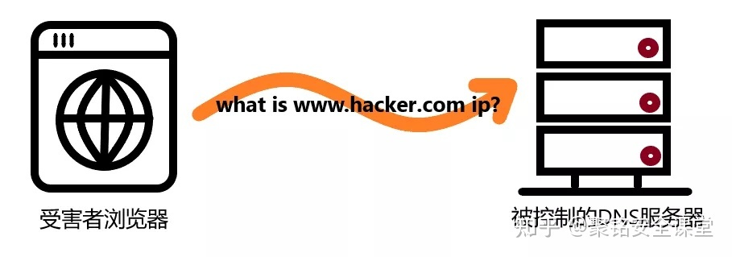
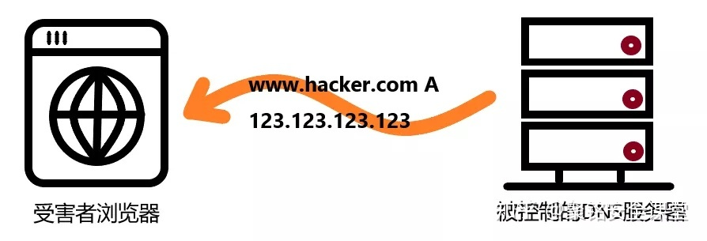
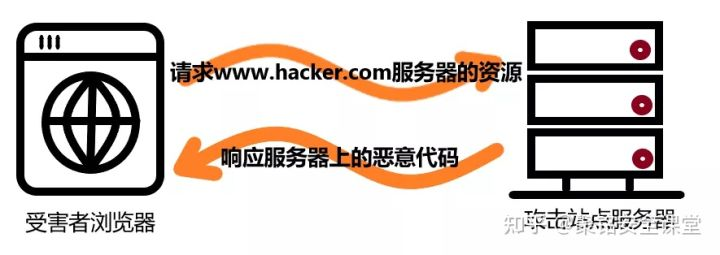
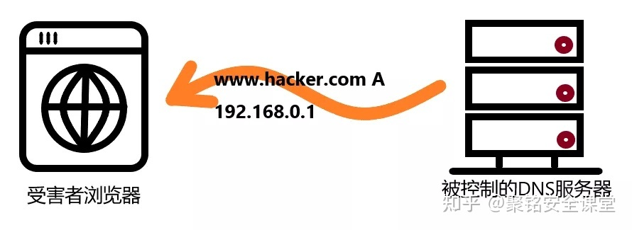
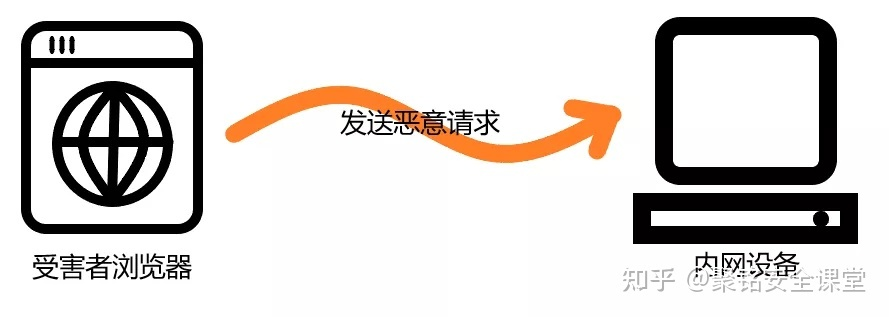
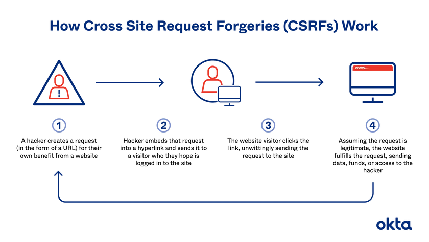

# 安全學習筆記

## 待學習資源

* [資安補漏洞，越補越大洞學習筆記](https://ithelp.ithome.com.tw/users/20107304/ironman/2006)

## 綜述

* 理論
    * 攻擊手法
        * 編碼攻擊 (Encoding)
            * 將指令重新編碼，來躲避網站的安全檢查或使網站程式發生錯誤。
        * 標頭竄改 (Header Tampering)
            * 修改 Request 的 Header 以躲過安全機制的檢查。
        * 路徑挖掘 (Path Traversal)
            * 猜測網站路徑，以進入網站根目錄之外的資料夾或檔案。
        * SQL隱碼注入 (SQL Injection)
            * 目前最出名也最有殺傷力的攻擊手段之一。利用SQL程式指令迴避安全檢查，竊取管理權限，可對整個網站進行毀滅性的破壞。
        * 跨站腳本攻擊 (Cross site Scripting, XSS)
            * 是注入攻擊的一種。其特點是不對服務器端造成任何傷害，而是通過一些正常的站內交互途徑，例如發佈評論，提交含有 JavaScript 內容的文本。如果服務器端沒有過濾或轉義掉這些腳本，作為內容發佈到了頁面上，其他用戶訪問這個頁面的時候就會運行這些腳本。
            * 兩種攻擊類型
                * Reflected XSS
                    * 用戶點擊攻擊鏈接，服務器解析後響應，在回傳的內容出現攻擊者的 XSS 代碼，被瀏覽器執行。一來一去，XSS 攻擊腳本被伺服器反射回來給瀏覽器執行，所以稱為反射型XSS。
                        * 某一個頁面 `http://marco79423.net/?user=marco` 會在網站顯示 hello marco
                        * 將 `http://marco79423.net/?user=<script>alert("xss")</script>` 藏在連結中
                        * 用戶點擊連結，而且網站沒有對內容做過濾，就會執行 `alert("xss")`
                * Stored XSS / Persistent XSS
                    * 通過某種方式將惡意資料存入資料庫，讓其他用戶在查看相關資料時被攻擊，如在論壇留言，將惡意程式碼塞進評論裡，當其他用戶查看評論時，就會執行。
                        ```html
                        
                        ```
            * 防禦方式
                * 原則
                    * 不要相信客戶輸入的任何東西
                * 方式
                    * 限制輸入的內容，驗證用戶提供的資料，比如說僅接受指定長度、格式的內容，其他都會忽略或出錯。
                        * 常見需要過濾的內容像是： `<`、`>`、`"`、`'`、`&`、`#`、`\`、`onclick=`、`<script>` 等
                    * 對需要輸出的內容進行編碼，如 HTMLEncode
                    * 將重要的 cookie 標記為 http only，這樣一來，正常發起 Req 時一樣會帶上 cookie，但能避免攻擊者利用 JS 的 document.cookie 拿到 cookie。
        * 跨站請求偽造 (Cross Site Request Forgery, CSRF)
            * 參考資料
                * 
        * 執行遠端命令 (Remote Command Execution
            * 基本上就是透過 web 介面使網站程式執行遠端指令，不過這種攻擊多半要搭配網站程式漏洞執行。
        * 探針 (Probes)
            * 你可以把「探針」想像成一種能夠搜索漏洞的小程式。攻擊者通常會把「探針」放在一些已經被入侵的熱門網站上，當你瀏覽這些網站時，探針就會被下載下來，並開始搜索你電腦中的安全漏洞，然後通知攻擊者發動攻擊。
        * 已知蠕蟲 (Known Worms)
            * 這個應該不用多解釋了，就是電腦蠕蟲囉，通常它們不會破壞系統本身，但卻會對網路發動攻擊，像是執行垃圾代碼，讓Web程式無法回應（這招就是底下的Denial of service）；或是大量傳送無意義訊息，吃掉網路頻寬等等。
        * 被盜用的伺服器 (Compromised Servers)
            * 應該可以說是「管理不良的伺服器」吧。舉例來說，有些管理者在架好資料庫和網站之後，沒有修改預設的密碼，因此攻擊者可以輕鬆取得所有權限，這種伺服器就算是 Compromised Servers。
        * 垃圾回應機器人 (Spammer Bots)
            * 這也是目前很常見又很令人頭痛的攻擊之一，不過它比較像是間接傷害就是了。
        * 不良的使用者代理 (Bad User Agents)
            * 它是指一些行徑惡劣的蜘蛛（Spiders）、機器人（Robots）、爬行者（Crawler）、瀏覽器（Browser）或下載工具等等，它們可能會佔用過量的頻寬或竊取一些不應該公開的資料之類的
        * 阻斷服務攻擊(Denial of Service)
            * 這種攻擊手法是對主機傳送大量或特殊的網路封包，使主機陷入癱瘓或耗盡資源無法運作。它的「進階版」就是惡名昭彰的「DDoS」——分散式阻斷服務攻擊，由多個地方同時發動DoS攻擊，因此主機無法利用封鎖網段等方式來防堵。
        * 會話劫持 (Session Hijacking)
            * 這招有點算是冒用別人身份。一般來說，SessionID 會被當成 Cookie 存到用戶端電腦，攻擊者利用這個特性，竊取電腦裡的 SessionID ，冒充成使用者進入網站，然後就可以竊取網站中的使用者資料（如信用卡卡號）並進行後續破壞。
        * 竄改 Cookie (Cookie Tampering)
            * Cookie 基本上可以看成是網站上的使用者紀錄，通常甚至會包含使用者帳號、密碼等資料，這種手法可以看成是在網路上攔截Cookie封包，然後拿這個封包去欺騙伺服器，於是就可以偽裝成受害者，登入網站。
    * 防範技術
        * 同源政策 (Same-origin policy)
* 實作
  * API 設計
        * 盡可能只在必要的時候傳送敏感資訊
            * 避免用 query string 傳送敏感資訊，如 `https://marco79423.net/?password=password`
                * 因為 Web server 通常會將以 log 的形式紀錄使用者傳過來的 Url
                * Url 會記錄在瀏覽器的歷史中
                * Url 會包含在 Referrer header 中
                * 使用者分享連結時，不見得會注意到 Url 的細節

## 攻擊手法

### 旁路攻擊 (Side Channel Attack)

側信道攻擊/旁路攻擊(Side Channel Attack)，側信道攻擊是指利用信道外的信息，比如加解密的速度/加解密時晶元引腳的電壓/密文傳輸的流量和途徑等進行攻擊的方式，一個詞形容就是「旁敲側擊」。

1、信道外的信息與信道內的信息有「某種聯繫」
2、通過觀測信道外的信息，推斷出信道內的隱含信息

#### 時序攻擊 (Timing Attack)

一個計時攻擊的例子，某個函數負責比較用戶輸入的密碼和存放在系統內密碼是否相同，如果該函數是從第一位開始比較，發現不同就立即返回，那麼通過計算返回的速度就知道了大概是哪一位開始不同的，這樣就實現了電影中經常出現的按位破解密碼的場景。密碼破解複雜度成千上萬倍甚至百萬千萬倍的下降。

最簡單的防禦方法是：「發現錯誤的時候並不立即返回，而是設一個標誌位，直到完全比較完兩個字元串再返回」。

### DNS 重新綁定攻擊 (DNS Rebinding Attack)

因為DNS重綁定攻擊是利用了同源策略中存在的漏洞造成的，同源策略是指"協議+域名+端口"三者相同，即便兩個不同的域名指向同一個 ip 地址，也非同源。同源策略/SOP（Same origin policy）是一種約定，由 Netscape公司1995年引入瀏覽器，它是瀏覽器最核心也最基本的安全功能，現在所有支持JavaScript的瀏覽器都會使用這個策略。如果缺少了同源策略，瀏覽器很容易受到XSS、 CSFR等攻擊。

但同源是指“協議+域名+端口”三者相同，而不是“協議+IP+端口”。

因此，在網頁瀏覽過程中，用戶在地址欄中輸入包含域名的網址。瀏覽器通過DNS服務器將域名解析為IP地址，然後向對應的IP地址請求資源，最後展現給用戶。而對於域名所有者，他可以設置域名所對應的IP地址。當用戶第一次訪問，解析域名獲取一個IP地址；然後，域名持有者修改對應的IP地址；用戶再次請求該域名，就會獲取一個新的IP地址。對於瀏覽器來說，整個過程訪問的都是同一域名，所以認為是安全的。這就是 DNS Rebinding 攻擊。

通過DNS重綁定攻擊可以繞過同源策略，攻擊內網的其他設備。


攻擊的主要條件：

1. 攻擊者可以確保或者控制用戶請求的DNS服務器能回復特定域名的查詢，如 http://www.hacker.com。
2. 攻擊者可以誘導用戶在瀏覽器加載 http://www.hacker.com。可以通過多種方式，從網絡釣魚到惡意程序，來實現這一目標。
3. 攻擊者控制 http://www.hacker.com 服務器域名對應的IP地址。

攻擊流程：

1、受害者打開釣魚郵件的鏈接，他們的Web瀏覽器會發出DNS查詢請求，查詢http://www.hacker.com的IP地址。



2、攻擊者控制的DNS服務器收到受害者的DNS請求時，會使用http://www.attacker.com的真實IP地址如123.123.123.123進行響應。它還將響應的TTL值設置得特別短，以便受害者的機器不會長時間緩存它。



3、受害者的瀏覽器向攻擊網站服務器發出HTTP請求加載網頁，攻擊者進行HTTP響應，並通過JS加載一些惡意代碼，該頁面反復向http://www.hacker.com 發出POST請求。（該POST請求包含惡意代碼）。



4、因為之前DNS TTL設置為的時間很短，緩存很快就失效，所以瀏覽器繼續向惡意權威域名服務器發出查詢。


5、此時，惡意DNS服務器收到查詢後，回復一個內網設備的IP（也可以是一些物聯網設備），如192.168.0.1。



6、因為滿足同源策略，瀏覽器認為是安全的，於是向內網其他設備發送POST惡意請求。



防止DNS重綁定攻擊：

* 用戶的角度：更改路由器的配置，過濾DNS響應中的私有IP范圍等可疑IP地址。
* 開發人員的角度：內部的網絡設備應該驗證其自己的主機是否與所請求的主機匹配。如HTTP服務器添加“主機”標頭驗證。（Web服務器應驗證所請求的 Host 標頭是否與其預期值完全匹配，如果不滿足，則使用 403 Forbidden HTTP狀態代碼進行響應）。
* 使用 HTTPS 而不是HTTP，發生重新綁定時，目標服務將具有對 http://www.hacker.com 無效的SSL證書，因此安全警告將阻止你的請求。

### Cross Site Request Forgery 跨站請求偽造 (CSRF、XSRF)

跨站請求偽造（英語：Cross-site request forgery），通常縮寫為CSRF 或者XSRF。由於往往是使用者一個點擊就會造成攻擊， 又被稱作「one-click attack」。



在傳統的 Session 方案中，Session ID 會放在 Cookie，而 Cookie 會在瀏覽器發起請求時自動帶上，這個「自動」就有了 CSRF 的風險。

如果使用者點開惡意網站，瀏覽器依照惡意網站的內容發出轉帳請求給銀行，而因為使用者之前登入過銀行，還保持著 Session，瀏覽器也在請求中「自動」帶上了 Session ID。銀行伺服器收到請求後，認為該使用者已經登入過，就乖乖依照請求轉帳，成功攻擊。


## 安全機制

### 2 Factor Authentication (2FA)

2FA 全稱為 2 Factor Authentication，即雙因子認證，通常是結合密碼以及其他標志（如OTP、USB Key、短信驗證碼、指紋等生物特徵）進行認證的方式。現在2FA的使用已經比較普遍，許多廠家會結合風控系統在密碼驗證的同時結合其他認證方式，保證授權是可信的。比如說在新的設備上登錄社交App時，通常除了密碼之外，還會需要其他的認證方式。

### One-time password (OTP)

OTP 即一次性密碼（One-time password），OTP 的計算通常是基於時間戳的，密碼的生成具有有效期（通常是30s）。使用 OTP 能夠有效地避免“重放攻擊”，一般的靜態密碼，在使用時如果設備上有可以監聽鍵盤輸入的木馬等程序，很容易造成密碼的洩露。

OTP解決了這樣的問題，即保證了洩露的密碼也是沒有用的（因為只能使用一次，且在極短時間內有效）。通常會在安全性要求比較高的情況下使用。OTP 的缺點在於每次都要打開對應的軟件或者相關的 OTP 設備來獲取一次性密碼，使用的便捷程度上存在一定的不便。

## 加密和解密

### 對稱加密

對稱加密算法的特點是，在加密和解密的過程中，使用的密鑰是相同的，因此通訊的雙方需要交換並持有相同的密鑰。常見的對稱加密算法有AES/DES等。

優點：

* 加密和解密的算法比較簡單，因此計算速度要比非對稱加密高

缺點：

* 要求通訊雙方持有相同的密鑰，存在交換密鑰的過程

### 非對稱加密

和對稱加密不同的是，在非對稱加密中，需要一組密鑰對來進行加密和解密。這一組密鑰對我們稱為公鑰（可以公開的密鑰）和私鑰（需要保密的密鑰）。除了在WebAuthn中有用到之外，其他地方也非常常見，比如說JWT/HTTPS（HTTPS既有非對稱加密，也有對稱加密）/SSH等。非對稱加密有這樣的一些特點：

公鑰和私鑰都可以用來加密和解密：即可以用公鑰加密，再用私鑰解密；也可以使用私鑰加密，再用公鑰解密，但是這兩者的用途通常是不一樣的，私鑰加密公鑰解密的場景一般用來確認身份和防止偽造；而公鑰加密私鑰解密通常用來保護隱私數據。
可以由私鑰推導得到公鑰，但是反過來公鑰無法得出私鑰
常用的非對稱加密算法有RSA/ECC等。

優點

* 不存在私鑰交換的過程，因此安全性比對稱加密要高

缺點

* 計算復雜度比對稱加密要高，因此速度會略慢於對稱加密

## 參考文章

* [如何通俗地解釋時序攻擊(timing attack)?](https://www.getit01.com/p20180201620156213/)
* [銘說 | DNS重綁定攻擊研究](https://zhuanlan.zhihu.com/p/453168334)
