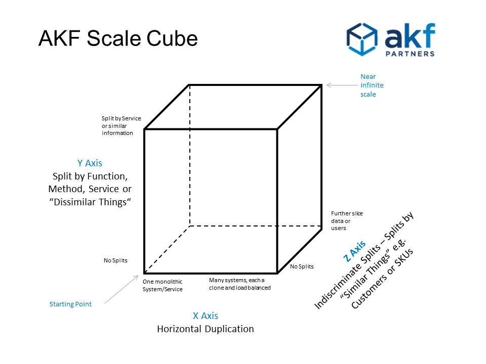

# 微服務學習筆記

## 簡介

微服務沒有正式的定義，簡單地說，微服務是一種架構風格，它將單個應用程序開發為一組專注於單個目的的小型服務。這種架構風格非常受歡迎，尤其是隨著 DevOps 空間的增長。

## 好處和壞處

### 好處

* 降低耦合
    * 將單體應用按業務模塊拆分成多個服務，如果某個功能需要改動，大多數情況，我們只需要弄清楚並改動對應的服務即可。只改動一小部分就能滿足要求，降低了其他業務模塊受影響的可能性，從而降低了業務模塊間的耦合性。
    * 單體架構中不同的業務，代碼耦合嚴重，隨著業務量增長，業務復雜後，一個小功能點的修改就可能影響到其他業務點，開發質量不可控，測試需要回歸，成本持續提高。
* 屏蔽與自身業務無關技術細節
    * 例如，很多業務需要查詢用戶信息，在單體應用的情況下，所有業務場景都通過DAO去查詢用戶信息，隨著業務發展，並發量增加，用戶信息需要加緩存，這樣所有業務場景都需要關注緩存，微服務化之後，緩存由各自服務維護，其他服務調用相關服務即可，不需要關注類似的緩存問題。
* 數據隔離
    * 避免不同業務模塊間的數據耦合，不同的服務對應不同數據庫表，服務之間通過服務調用的方式來獲取數據。
* 減少程式碼衝突
    * 在單體應用中，很多人在同一個工程上開發，會有大量的代碼沖突問題。微服務化後，按業務模塊拆分成多個服務，每個服務由專人負責，有效減少代碼沖突問題。
* 可復用
    * 減少代碼拷貝現象。

### 壞處

* 微服務系統穩定性問題
    * 微服務化後服務數量大幅增加，一個服務故障就可能引發大面積系統故障。比如服務雪崩、連鎖故障。當一個服務故障後，依賴他的服務受到牽連也發生故障。
* 服務調用關系錯綜復雜
    * 鏈路過長，問題難定位。微服務化後，服務數量劇增，大量的服務管理起來會變的更加復雜。由於調用鏈路變長，定位問題也會更加困難。
* 數據一致性問題
    * 微服務化後單體系統被拆分成多個服務，各服務訪問自己的數據庫。而我們的一次請求操作很可能要跨多個服務，同時要操作多個數據庫的數據，我們發現以前用的數據庫事務不好用了。跨服務的數據一致性和數據完整性問題也就隨之而來了。

## 設計注意事項

* 計算和存儲分離
    * 隨著業務對 CPU 能力和存儲需求的增長，這些資源具有非常不同的擴展成本和特性。從一開始就不必依賴本地存儲，這將能夠相對輕松地適應未來的工作負載。這既適用於文件系統等簡單的存儲形式，也適用於數據庫等更復雜的解決方案。
* 異步處理
    * 通過添加越來越多的相互調用的子進程或對象來逐步構建應用程序的傳統方法隨著工作負載的增長而停止工作，並且應用程序本身必須跨多台機器甚至數據中心擴展。將需要圍繞事件驅動模型重新構建應用程序。這意味著發送事件（而不是等待結果）而不是調用函數並同步等待結果。
* 擁抱消息總線
    * 這是必須實現異步處理模型的直接後果。隨著單體應用程序被分解為事件處理程序和事件發射器，就需要一個健壯、高性能和靈活的消息總線。
    * 有多種選擇，選擇取決於應用程序規模和復雜性。對於一個簡單的用例，像 Redis 這樣的東西就可以做到。如果需要應用程序真正是雲原生的並自行擴展和縮減，您可能需要能夠處理來自多個事件源的事件：從 Kafka 等流管道到基礎設施，甚至監控事件。
* API 版本控制
    * 由於微服務將使用彼此的 API 通過總線相互通信，因此設計用於保持向後兼容性的架構將是至關重要的。只需部署一個微服務的最新版本，開發人員就不應該要求其他人升級他們的代碼。這將是向整體方法向後兼容的一步，開發團隊必須在永遠支持舊 API 和保持更高的開發速度之間達成合理的妥協。這也意味著 API 設計成為一項重要的技能。頻繁的破壞性 API 更改是團隊無法高效開發復雜微服務的原因之一。
* 安全性
    * 許多開發人員沒有意識到這一點，但遷移到微服務為更好的安全模型創造了機會。由於每個微服務都是一個專門的進程，因此最好只允許它訪問所需的資源。這樣，僅一個微服務中的漏洞就不會將系統的其餘部分暴露給攻擊者。這與大型單體形成對比，後者傾向於以更高的特權（每個人都需要的超集）運行，並且可能導致更多的違規行為。

## 關注點

### 容器

容器只是具有應用受限制的 Linux 進程。限制的示例包括允許進程使用多少 CPU 或內存。Docker 之類的工具允許開發人員將他們的可執行文件與依賴項和附加配置打包在一起。這些包被稱為 鏡像，並且經常且容易混淆地也被稱為容器。

* 一個容器就是一個運行受限制的linux進程
* 容器鏡像是可執行進程的依賴和配置打包

容器鏡像是自給自足的。它們將在任何 Linux 機器上運行，因此容器化使得將代碼從開發人員的機器復制（部署）到任何環境變得更加容易。

簡單來說，容器是一種開發人員工具，通過隔離環境來簡化構建、運行和分發應用程序的過程。

* 容器是簡約的，並具有可移植性
* 容器支持可組合性（模塊化）
* 容器非常適合規模化並允許編排

### 容器編排 - Kubernetes

在容器化應用程序後，你將需要一些哪些工具比較好來管理容器化應用程序，以執行一些手動和自動操作，例如水平擴展。

這些工具能比較好為你的應用程序管理提供一些服務，例如自動負載均衡，保證服務的高可用性。

這種服務是通過定義多個管理器節點來完成的，如果一個節點管理器出現任何故障，其他管理器可以保持應用程序服務可用。

用 Kubernetes 可以自動幫我們解決：

* 在處理流量時處理負載均衡
* 自動部署和擴展容器
* 將替換並重啟失敗的容器

### 容器管理

管理容器的環境、配置、安全等。

為用戶提供了一個基於 GUI 的Docker 容器管理，可以使他們不必處理不舒服的 CLI。這些工具也為開發人員提供了豐富的 UI 來構建和發布他們的鏡像，還可以通過提供簡化的用戶界面來更輕松地執行一些操作任務，例如服務水平擴展。

可用工具：

* Portainer
* DockStation
* Kitematic
* Rancher

### API Gateway

API Gateway 可以被視為一種充當你的應用程序服務和客戶端之間的中間件。API 網關可以管理許多事情，例如：

* Routing ：網關接收所有 API 請求並將它們轉發到目標服務。
* Logging ：你將能夠在一處記錄所有請求。
* Authorization: 檢查你作為用戶是否有資格訪問該服務，如果沒有，可以拒絕該請求
* Performance profiling：你可以估計每個請求的執行時間並檢查你的應用程序瓶頸。
* Caching：通過在網關級別處理緩存，你將消除服務上的大量流量。

作為一個反向代理，客戶端只需要知道你的網關，應用服務就可以隱藏起來，不直接向其他系統暴露。

如果沒有 API 網關，你可能需要在每個服務中做一些橫切關注點，例如，如果你想記錄服務的請求和響應。此外，如果你的應用程序由多個服務組成，你的客戶端需要知道每個服務地址，並且在更改服務地址的情況下，應該更新多個地方。

可用工具：

* Kong
* Ocelot

### 負載均衡

我們選擇微服務架構最重要的原因是可擴展性，這意味著我們將能夠通過運行更多服務實例來處理更多請求，但問題是，哪個實例應該接收請求，或客戶端如何知道哪個服務實例應該處理請求？

這些問題的答案是負載均衡。負載均衡是高可用網絡基礎架構的關鍵組件,通常用於將工作負載分佈到多個服務器來提高網站、應用、數據庫或其他服務的性能和可靠性。

為了擴展你的獨立服務，你需要運行多個服務實例。使用負載均衡器，客戶端不需要知道服務的正確實例。

可用工具：

* Traefik
* NGINX
* Seesaw

### 服務發現

隨著你的應用服務的數量越來越多，服務需要知道彼此的服務實例地址，但是在有很多服務的大型應用中，這是無法處理的。因此我們需要服務發現，它負責提供應用程序中所有組件的地址，它們可以輕松地向服務發現系統發送請求並獲取可用的服務實例地址。

當你的應用程序中可以有多個服務時，服務發現對於你的應用程序來說是必不可少的。你的應用服務不需要知道每個服務實例地址，這意味著服務發現為你鋪平了道路。

可用工具：

* Consul
* Zookeeper
* Eureka
* etcd
* Keepalived

### 事件總線

在微服務架構模式中，你將使用兩種不同類型的通信，同步通信以及異步通信。同步通信是指服務之間通過 HTTP 或 GRPC 相互調用。異步通信意味著服務通過消息總線或事件總線相互交互，這意味著服務之間沒有直接連接。

你的架構可以同時使用兩種通信方式，例如在在線商店示例中，你可以在訂單注冊時發送消息，並且訂閱了特定頻道的服務將收到該消息。但有時你可能需要一些實時的查詢，例如，你需要知道一個物品的數量，你可能會在服務之間使用 GRPC 或 HTTP 調用來獲取響應。

如果你想要一個包含多個服務的可擴展應用程序，你將遵循的原則之一是創建鬆散耦合的服務，這些服務通過事件總線相互交互。此外，如果你需要創建一個能夠插入新服務以接收一系列特定消息的應用程序，則需要使用事件總線。

可用工具：

* RabbitMQ
* Kafka

### 日誌記錄

使用微服務架構模式時，最好將服務日誌集中起來。這些日誌將用於調試問題或根據其類型聚合日誌以供分析使用。

系統調試時，如果沒有提前集中在一個地方收集服務日誌，你可能會遇到困難。你還可以將與特定請求相關的日誌與唯一的相關 ID 關聯。這意味著與請求相關的不同服務中的所有日誌都可以通過此關聯 ID 訪問。

可用工具：

* ELK

### 監控和警報

在微服務架構中，如果你想要一個可靠的應用程序或服務，你必須監控應用程序的功能、性能、通信和任何其他方面，以實現一個負責任的應用程序。

你需要監控整體功能和服務健康狀況，還需要監控性能瓶頸，並准備解決故障的計劃。通過在關鍵點定義服務的早期警報來減少服務的停機時間，從而優化用戶體驗。當負載較重時等，可以監控服務的整體資源消耗。

可用工具：

* Prometheus
* Kibana
* Grafana

### 分佈式追蹤

調試始終是開發人員最關心的問題之一，因為你都有跟蹤或調試單體引用程序的經驗。那是非常直接和容易，但是在微服務架構上，因為一個請求可能會通過不同的服務，這使得調試和跟蹤變得困難，因為服務不在一個地方，所以分佈式追蹤工具將會有所幫助。

如果沒有分佈式跟蹤哪些工具比較好，通過不同的服務跟蹤你的請求會令人沮喪或不可能。你可以借助用於演示請求流的豐富 UI 輕松跟蹤請求和事件。

可用工具：

* OpenTelemetry
* Jeager
* Zipkin

### 數據持久化

在大多數系統中，我們需要持久化數據，將應用程序的數據寫入具有不同結構的物理文件中，以便數據用於進一步的處理或報告。

在單體應用程序中，我們曾經有一種或兩種不同的持久性類型，大多數單體應用程序使用關系數據庫，如 SQL Server、Oracle、MySQL。但是在微服務架構中，我們應該遵循“DataBase Per Service”模式，這意味著保持每個微服務的持久數據對該服務是私有的，並且只能通過其 API 訪問。

對於不同的用途和場景，你將擁有不同的數據庫。例如，數據展示服務可能會使用像 ElasticSearch 或 MongoDB 這樣的 NoSQL 數據庫，因為它們使用文檔基礎結構，這意味著這些數據庫中持久化數據的結構與關系數據庫不同，更適用於具有讀多寫少的服務。

另一方面，在某些微服務中，你可能需要 Oracle 或 SQL SERVER 等關系數據庫，或者你可能還需要一些支持圖結構或鍵值結構的數據庫。

所以，在微服務架構中，根據服務的使命，你會需要不同類型的數據庫。

關系數據庫：

* PostgreSQL
* MySQL
* SQL SERVRE
* Oracle

NoSQL 數據庫：

* MongoDB
* Cassandra
* Elasticsearch

### 緩存

緩存減少了微服務架構的服務到服務通信的延遲。緩存是高速數據存儲層。當從緩存中請求數據時，它的速度比訪問硬盤中的數據要快。

在微服務架構中，有許多策略可以通過這些方式實現緩存。考慮以下：

1. 嵌入式緩存（分佈式和非分佈式）
2. 客戶端-服務器緩存（分佈式）
3. 反向代理緩存（Sidecar）

為了減少延遲，可以在不同的層中實現緩存。此外，你還可以實現分佈式緩存，它可以被多個微服務訪問。它們還有不同的用途，比如限流，限流的目的是通過對並發訪問/請求進行限速或者一個時間窗口內的的請求進行限速來保護系統，一旦達到限制速率則可以拒絕服務。

可用工具：

* Redis (Remote Dictionary Server)
* Apache Ignite
* Hazelcast IMDG

### 雲供應商

雲服務提供商是一個第三方公司，提供基於雲的平台，基礎設施，應用程序或存儲服務。就像房主為電力或天然氣等公用事業付費一樣，公司通常只需根據業務需求為他們使用的雲服務數量付費。

雲提供商最重要的類別：

* 軟件即服務 (SaaS)。
* 平台即服務 (PaaS)。
* 基礎設施即服務 (IaaS)。

使用雲計算服務的一個好處是，公司可以避免搭建和維護自己的 IT 基礎設施的前期成本和復雜性，而只需在使用時為所用的東西付費。今天，公司可以租用從應用程序到存儲的任何東西，而不是擁有自己的計算基礎設施或數據中心。

可用工具：

* Amazon Web Services (AWS)
* Microsoft Azure
* Google Cloud
* Alibaba Cloud

## 知識點

### AKF 拆分原則

參考自此書 [The Art of Scalability: Scalable Web Architecture，Processes，and Organizations for the Modern Enterprise](https://akfpartners.com/books/the-art-of-scalability) 是一群技術專家總結出來對於單體應用拓展的三個維度(X-Y-Z軸).依照這擴展模式，可以將一個單體架構(大方塊就是一個單體系統)無限擴展.

* **X軸 - 水平擴容/複製**
    * 直接複製單體服務，再透過負載均衡服務針對 N 個實例進行請求分配，這樣每個實例只需要處理1/N 的負載即可，進而提高吞吐量與可用性。
    * 優點
        * 因為只是單純的複製，所以理論上比較容易，而且能快速實現
    * 缺點
        * 每個服務都能訪問到完整的數據，所以變成資料庫之間的數據要進行複製，成本很高，而且存放的資料很多，快取命中也不高。對於組織而言，每個人的職責難以切分，大家還是得面對同一個單體。

* **Z軸 - 數據分區**
    * Z軸擴展也是複製單體程序到多個實例上，但跟X軸不同的是，每個實例僅負責一部分的資料子集合.換句話說，就是根據某些規則絕對該請求到那一個實例程序上。
        * 像是根據用戶 ID 是奇數或偶數區分不同服務、電商根據品項區分不同服務、或是根據用戶請求地區等等。
    * 優點
        * 提供故障隔離性; 若有一區故障只有一部分資料與對應的客戶受影響，相對前者而言，因為資料數量變少了，自然快取命中就會上升，處理回應時間也會減少。
    * 缺點
        * 實現有的成本較高，資料不一定容易分區，程式的複雜性也較高，因為要處理分區問題
* **Y軸 - 功能/業務的分解**
    * Y 軸就是進行功能的切分，根據不同的業務來劃分。有的會依照「動詞 Verb」劃分，像是結帳、驗證、購買、註冊；也有是按照「名詞 Noun」來做分解，舉例:客戶、訂單、報表、商品列表等等，也有的是根據 DDD 的Subdomain 來拆分.
    * 優點
        * 程式的複雜度降低了、而且也有故障隔離性，由於每組服務只負責對應業務的資料快取，所以命中率也是很高，對組織而言，也可以按照業務來劃分。
    * 缺點
        * 服務管理難度較高

參考來源： <https://ithelp.ithome.com.tw/articles/10235057>

### 雪崩效應

微服務化後，服務變多，調用鏈路變長，如果一個調用鏈上某個服務節點出問題，很可能引發整個調用鏈路崩潰，也就是所謂的雪崩效應。

現在有A、B、C三個服務，A調B，B調C。假如C發生故障，B方法1調用C方法1的請求不能及時返回，B的線程會發生阻塞等待。B會在一定時間後因為線程阻塞耗盡線程池所有線程，這時B就會無法響應A的請求。A調用B的請求不能及時返回，A的線程池線程資源也會逐漸被耗盡，最終A也無法對外提供服務。

這樣就引發了連鎖故障，發生了雪崩。

* 縱向：C故障引發B故障，B故障引發A故障，最終發生連鎖故障。
* 橫向：方法1出問題，導致線程阻塞，進而線程池線程資源耗盡，最終服務內所有方法都無法訪問，這就是“線程池污染”。

常見原因：

* 流量突增
    * 節假日訪問量變大，常見於工具類APP，如美圖秀秀活動原因導致訪問量變大
* 程序bug
    * 內存洩漏、線程池中的線程使用之後未釋放等
* 硬件或者網絡異常
    * 機器硬盤故障
    * 所在的網段發生異常
* 同步等待
    * 因為程序設計原因，整個請求都在同步進行，後面的請求只有在前面的請求完成之後，才能被執行
* 緩存擊穿
    * 常見於秒殺系統或者熱門事件，短時間內大量緩存失效時大量的緩存不命中，使請求直擊後端，造成服務提供者超負荷運行，引起服務不可用

#### 解決思路

* 服務降級
    * 熔斷、限流、數據冗餘，都屬於服務降級的范疇。還有手動降級的例子，比如大促期間我們會關掉第三方物流接口，頁面上也關掉物流查詢功能，避免拖垮自己的服務。
    * 分為服務內降級和服務外降級兩種。
        * 服務內降級：指的是當本服務響應比較慢的時候，主動停掉本服務內一些不重要的業務，從而釋放機器資源給重要的業務。
        * 服務外降級：當下游服務響應慢或者無響應的時候，上游服務主動調用備用邏輯，停掉對下游服務的調用。
    * 策略
        * 關閉次要功能
            * 在服務壓力過大時，關閉非核心功能，避免核心功能被拖垮。
            * 例如，電商平台基本都支持物流查詢功能，而物流查詢往往要依賴第三方物流公司的系統接口。物流公司的系統性能往往不會太好。所以我們經常會在雙11這種大型促銷活動期間把物流接口屏蔽掉，在頁面上也關掉物流查詢功能。這樣就避免了我們自己的服務被拖垮，也保證了重要功能的正常運行。
        * 降低一致性之讀降級
            * 對於讀一致性要求不高的場景。在服務和數據庫壓力過大時，可以不讀數據庫，降級為只讀緩存數據。以這種方式來減小數據庫壓力，提高服務的吞吐量。
            * 例如把商品評論評價信息緩存在Redis中。在服務和數據庫壓力過大時，只讀緩存中的評論評價數據，不在緩存中的數據不展示給用戶。
        * 屏蔽寫入
            * 很多高並發場景下，查詢請求都會走緩存，這時數據庫的壓力主要是寫入壓力。所以對於某些不重要的服務，在服務和數據庫壓力過大時，可以關閉寫入功能，只保留查詢功能。這樣可以明顯減小數據庫壓力。
            * 例如，商品的評論評價功能。為了減小壓力，大促前可以關閉評論評價功能，關閉寫接口，用戶只能查看評論評價。而大部分查詢請求走查詢緩存，從而大幅減小數據庫和服務的訪問壓力。
        * 數據冗餘
            * 服務調用者可以冗餘它所依賴服務的數據。當依賴的服務故障時，服務調用者可以直接使用冗餘數據。
            * 在核心鏈路上，服務可以冗餘它依賴的服務的數據，依賴的服務故障時，服務盡量做到自保。比如訂單服務依賴庫存服務。我們可以在訂單服務冗餘庫存數據（注意控制合理的安全庫存、防超賣）。下單減庫存時，如果庫存服務掛了，我們可以直接從訂單服務取庫存。可以結合熔斷一起使用，作為熔斷的Fallback（後備）方案。
        * 限流
            * 通過限制調用端的流量數來達到限流的目的。比如控制實例每秒鐘的處理請求量，即控制QPS
            * 常見的QPS控制方法有令牌桶算法
            * 促銷活動或秒殺時，訪問量往往會猛增數倍。技術團隊在活動開始前一般都會根據預估訪問量適當增加節點，但是假如流量預估少了（實際訪問量遠大於預估的訪問量），系統就可能會被壓垮。所以我們可以在網關層（Zuul、Gateway、Nginx等）做限流，如果訪問量超出系統承載能力，就按照一定策略拋棄超出閾值的訪問請求（也要注意用戶體驗，可以給用戶返回一個友好的頁面提示）。
            * 限流的兩個主要目的：
                * 應對突發流量，避免系統被壓垮（全侷限流和IP限流）；
                * 防刷，防止機器人腳本等頻繁調用服務（userID限流和IP限流）
        * 熔斷
            * 解決服務間縱向連鎖故障問題。比如在A服務加熔斷，當B故障時，開啟熔斷，A調用B的請求不再發送到B，直接快速返回。這樣就避免了線程等待的問題。當然快速返回什麼，fallback方案是什麼，也需要根據具體場景，比如返回默認值或者調用其他備用服務接口。如果你的場景適合異步通信，可以採用消息隊列，這樣也可以有效避免同步調用的線程等待問題。
            * 在調用端即上游服務控制對下游服務的熔斷功能，在上游服務中，如果發現下游服務在一定時間內，其超時率達到了某個閾值，則開啟熔斷機制，即不對下游服務進行調用，或者只進行一定比例的調用，而對於剩下的流量，則直接返回空響應或者返回默認響應。
            * 熔斷是一種自動降級手段。當服務不可用時，用來避免連鎖故障，雪崩效應。發生在服務調用的時候，在調用方做熔斷處理。熔斷的意義在於，調用方快速失敗（Fail Fast），避免請求大量阻塞，並且保護被調用方。
* 擴容
    * 在流量突增的時候，微服務系統內某個實例因為機器資源或者別的原因，響應比較慢，這就是需要對該實例進行臨時擴容
* 增加Cache
    * 對下游服務正常響應的數據進行緩存，之後一段時間內直接向上游返回緩存中的數據。這樣可以有效降低對下游服務質量的敏感度，在一定程度上提升服務的穩定性。
        * 注意事項
            * 緩存穿透
                * 對於數據庫中根本不存在的值，請求緩存時要在緩存記錄一個空值，避免每次請求都打到數據庫。
            * 緩存雪崩
                * 在某一時間緩存數據集中失效，導致大量請求穿透到數據庫，將數據庫壓垮。可以在初始化數據時，差異化各個key的緩存失效時間，失效時間 = 一個較大的固定值 + 較小的隨機值。
            * 緩存熱點
                * 有些熱點數據訪問量會特別大，單個緩存節點（例如Redis）無法支撐這麼大的訪問量。如果是讀請求訪問量大，可以考慮讀寫分離，一主多從的方案，用從節點分攤讀流量；如果是寫請求訪問量大，可以採用集群分片方案，用分片分攤寫流量。以秒殺扣減庫存為例，假如秒殺庫存是100，可以分成5片，每片存20個庫存。
* 隔離
    * 部署隔離
        * 我們經常會遇到秒殺業務和日常業務依賴同一個服務，以及C端服務和內部運營系統依賴同一個服務的情況，比如說都依賴訂單服務。而秒殺系統的瞬間訪問量很高，可能會對服務帶來巨大的壓力，甚至壓垮服務。內部運營系統也經常有批量數據導出的操作，同樣會給服務帶來一定的壓力。這些都是不穩定因素。所以我們可以將這些共同依賴的服務分組部署，不同的分組服務於不同的業務，避免相互干擾。
    * 數據隔離
        * 極端情況下還需要緩存隔離，數據庫隔離。以秒殺為例，庫存和訂單的緩存（Redis）和數據庫需要單獨部署！數據隔離後，秒殺訂單和日常訂單不在相同的數據庫，之後的訂單查詢怎麼展示？可以採用相應的數據同步策略。比如，在創建秒殺訂單後發消息到消息隊列，日常訂單服務收到消息後將訂單寫入日常訂單庫。注意，要考慮數據的一致性，可以使用事務型消息。
    * 業務隔離
        * 還是以秒殺為例。從業務上把秒殺和日常的售賣區分開來，把秒殺做為營銷活動，要參與秒殺的商品需要提前報名參加活動，這樣我們就能提前知道哪些商家哪些商品要參與秒殺，可以根據提報的商品提前生成商品詳情靜態頁面並上傳到CDN預熱，提報的商品庫存也需要提前預熱，可以將商品庫存在活動開始前預熱到Redis，避免秒殺開始後大量訪問穿透到數據庫。

### 數據一致性

* 參考文章： [微服务应该这么搞，万字长文谈微服务经历！ | IDCF](https://mp.weixin.qq.com/s/mtpGtyjcHQzw4QMYiYT3Fg?utm_source=pocket_mylist])

### 分佈式鎖

參考文章：[深度剖析：Redis分佈式鎖到底安全嗎？看完這篇文章徹底懂了！](https://mp.weixin.qq.com/s/s8xjm1ZCKIoTGT3DCVA4aw)

### 分佈式系統

* 參考文章：[分佈式系統核心技術](https://poweichen.gitbook.io/blockchain-guide-zh/distribute_system)
* 參考文章：[《分布式系统模式》中文版](https://github.com/dreamhead/patterns-of-distributed-systems)

## 參考資料

* [微服务应该这么搞，万字长文谈微服务经历！ | IDCF](https://mp.weixin.qq.com/s/mtpGtyjcHQzw4QMYiYT3Fg])
* [微服務架構之雪崩效應](https://cloud.tencent.com/developer/article/1812615)
* [一张图，理清微服务架构路线](https://mp.weixin.qq.com/s/j7ycS92TJoe6XyHDqppsmg)
* [Kubermetrics — 使集群可視化變得簡單](https://mp.weixin.qq.com/s/hyrm0bkA5MgaSTQ6wrDzsA)
* [10 分鐘理解微服務、容器和 Kubernetes](https://mp.weixin.qq.com/s/HeDzS3XIBqwsIk2yz-7KiA)
