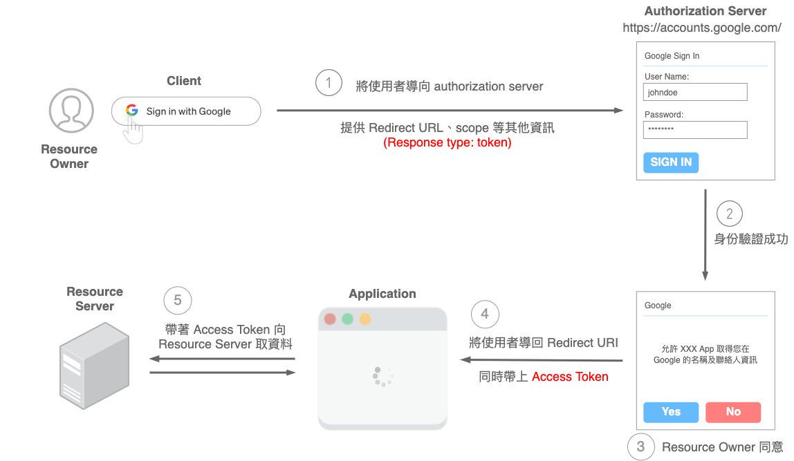
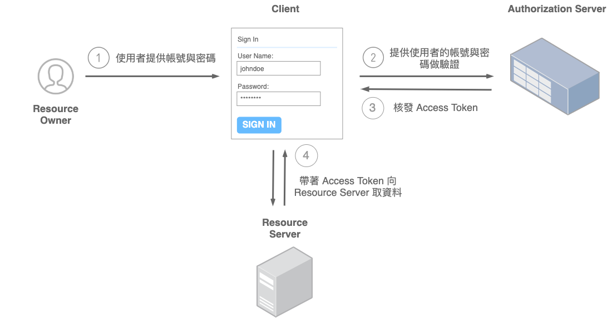
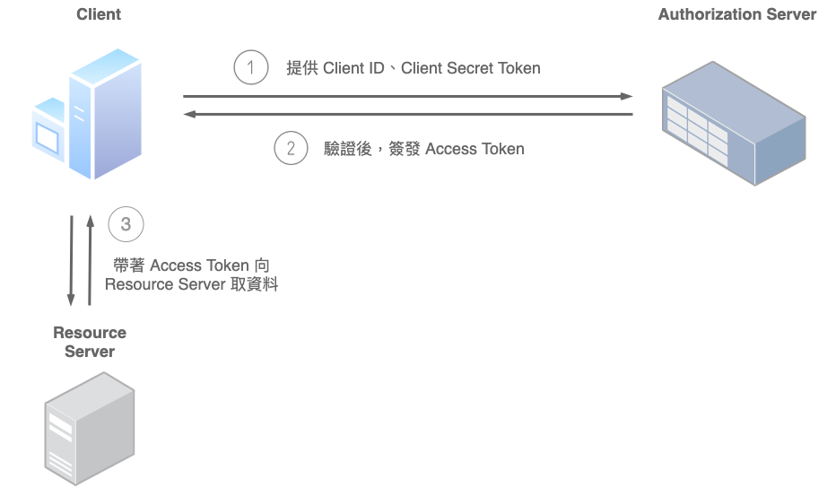

# 授權認證學習筆記

## OAuth 2.0

OAuth 是一個開發標準（Open Standard）用來處理有關「授權」（Authorization）相關的行為。

使用 OAuth 的流程白話來說：「我們允許並授權當前的應用程式（在這是指 Medium）有限度的取得我們在 Facebook、Google 或其他平台的相關資訊」——使用者身份驗證的工作基本上是委由選擇的平台完成，當驗證成功，且用戶同意，應用程式才得以前往取得所需要的資源。

### 流程

1. 瀏覽器將使用者導頁至 Authorization Server (如 Google 身份驗證)，並提供對方所需的資訊，常見的如：
    * Client Id：Client 在 Authorization Server 的身份識別
    * Redirect URI：告知當流程結束後，需要轉址的位置在哪
    * Response Type：告知想取得哪種 Authorization Grant
    * Scope：用來劃分應用程式能代使用者在 Google 取得一定範圍的資源
2. Authorization Server 會對用戶進行身份驗證
3. 身份驗證成功後，依據第一步設定的「scope」，使用者會被詢問是否同意讓應用程式取得特定的一些資料。
    * 舉例來說，應用程式可能會希望能取得使用者在 Google 的名稱、Email、大頭照等。
4. 使用者同意後，就會依照第一步設定的「Redirect URI」將使用者導回應用程式的指定路徑中，並依照 Response Type 回傳 Authorization grant；使用者也能選擇不同意，Authorization Server 會回傳相關錯誤訊息，那這個流程就在此結束了。
5. 此時，使用者已經同意，應用程式就能順利前往 Google 存放資料的對應地方，去取得所需要的相關資料。
    * 擁有 Authorization grant 其實還不能直接向 Resource Server 取得資源。應用程式必須拿著它重新向 Authorization Server 換取 Access Token。
        * 因為安全性考量，所以不直接發 Access Token
    * Authorization Server 在驗證 Authorization grant，以及應用程式身份後，才會正式核發 Access Token。
        * 這步會在後端做，通常是透過 HTTP Post 請求，夾帶著 Authorization grant 及應用程式的身份資訊（例如由 Google / Facebook 等平台提供給應用程式專屬的 Client ID、Secret Key，並且存放在後端）給 Authorization Server 進行驗證。也因為 Secret Key 只存放在後端伺服器，而非暴露在前端程式碼當中，因此安全性上就會比較高。
    * 應用程式最終就在取得資源的請求中夾帶著 Access Token 向 Resource Server 取得所需的資源。注意：這個 Access Token 的權限受限於在第一步所劃定 scope 清單。

### 名詞術語

* Client
    * 通常指稱想要取得受保護資源的「應用程式」。應用程式必須獲得 Resource Owner 的同意，才能代表使用者去取得相對應的資源。
* 服務提供商(HTTP service)
    * ，例如 Github
* Resource Owner
    * 能授予應用程式取得受保護資料的人——通常就是終端使用者（end-user），如 Github 用戶
    * 用戶有權同意或拒絕應用程式代你取得這些資訊做使用。
* 用戶代理(User Agent)
    * 通常是瀏覽器
* Authorization server
    * 專門處理授權請求的服務，驗證 Resource Owner 的身份，並且在獲得同意之後，發放「Access Token」給應用程式（Client）的伺服器。
    * 如 Google 用來驗證用戶的身份的伺服器，用戶會使用 Google 帳號與密碼進行身份驗證，並被詢問是否同意伺服器代表用戶取得用戶在 Google 中的資料。
* Resource server
    * 存放使用者受保護資料的伺服器，應用程式（Client）會需要帶著「Access Token」透過其 API 去取得資料。Resource Server 需要保護資料免於被未授權的他人取得，可以和 Authorization server 是同一服務，也可以是不同服務
    * 如 Google 存放用戶相關資料的伺服器
* Authorization Grant
    * 在流程中，是用來證明使用者同意賦予應用程式一定程度的授權、同意應用程式去做某些事、取得一個範圍內的資源。
    * 用來證明用戶已經同意第三方可以用戶的資料
* Redirect URI（Callback URL）
    * Authorization Server 在驗證完使用者身份並獲得授權同意後，將會把使用者帶回應用程式中指定的路徑。
* Access Token
    * Access Token 是 Authorization Server 簽發的。應用程式最終能拿著這個 Token 向 Resource Server 取得需要的資源。
* Scope
    * 使用者的授權時常並非一翻兩瞪眼，如果單純只是「可以取得我的所有資料」與「不可以取得我的所有資料」，彈性就相對很低。
    * 也因此通常 Authorization Server 會有個 scope 的清單，例如：可以取得使用者的名稱、可以編輯使用者的大頭貼、可以刪除我的某則貼文等不同權限。

### 授權類型 Grant Type

OAuth2.0 定義了四種應用程式取得 Access Token 的流程，又稱為「Grant Types」。

#### Authorization Code

這是最常見的類型，Server-side Application （Web server applications）最為適用——通常會由後端伺服器負責產生頁面（View）回傳給前端渲染。

如此一來，大部分的邏輯處理程式碼，以及像應用程式的 Client Secret 等重要機密資訊，都能在伺服器端被保存，而非完全公開。

流程：

* 同前例

#### Implicit

適合 Client-side 應用，適合整個應用程式都在前端運行的類型，例如單純的靜態網站或 Single Page Application(SPA)。

由於整個應用程式都在前端運行，所以會缺少「後端伺服器透過 Authorization Code Grant 交換 Access Token 」的步驟。取而代之的是請 Authorization Server 直接核發 Access Token。

由於是由前端獲得與管理 Access Token，並帶著 Access Token 發出請求前往取得資源，因此相對於 Authorization Code Flow 安全性「相對脆弱」。

流程：

* 應用程式將使用者導向 Authorization server 進行身份驗證和授權。
* 成功後，將依據 Redirect URI 將使用者導回應用程式指定路徑，並附上 Authoriation Grant ——以當前類型的流程來說，就是回傳「Access Token」。
* 最終應用程式就能拿著 Access Token 向 Resource Server 取得資料。

#### Resource Owner Password Credentials

此流程是由使用者提供帳號與密碼等資訊給應用程式，由應用程式直接向 Authorization Server 交換 Access Token，體驗上和以往的帳號密碼登入雷同。

帳號與密碼等機密資訊（credentials）可能會被應用程式儲存起來，作為往後交換 Access Token 使用。因此「必須是使用者高度信賴的應用程式」才適合使用，且唯有前兩種皆不可行時，才會考慮使用當前類型的流程。因此適用的情境可能像公司內部的系統。

#### Client Credentials

適合用在 machine-to-machine (M2M) applications——通常是由應用程式向 Authourization Server 請求取得 Access Token 以獲取「自己」的相關資源，而非使用者的資源。

這個流程已經跳脫使用者，因此，使用者身份驗證的流程將不再需要。取而代之是應用程式必須向 Authorization Server 提供驗證所需的自身資訊。

Client Credentials Flow 流程：

* 應用程式透過提供其 Client ID 及 Client Secret Token 等其他作為驗證的資訊（client credentials）給 Authorization Server 進行身份驗證。
* Authorization Server 驗證成功後，核發 Access Token 給應用程式。
* 應用程式取得 Access Token 後，即能代表自己向 Resource Server 取得自己的相關資料。

## 參考文章

* [[筆記] 認識 OAuth 2.0：一次了解各角色、各類型流程的差異](https://medium.com/%E9%BA%A5%E5%85%8B%E7%9A%84%E5%8D%8A%E8%B7%AF%E5%87%BA%E5%AE%B6%E7%AD%86%E8%A8%98/%E7%AD%86%E8%A8%98-%E8%AA%8D%E8%AD%98-oauth-2-0-%E4%B8%80%E6%AC%A1%E4%BA%86%E8%A7%A3%E5%90%84%E8%A7%92%E8%89%B2-%E5%90%84%E9%A1%9E%E5%9E%8B%E6%B5%81%E7%A8%8B%E7%9A%84%E5%B7%AE%E7%95%B0-c42da83a6015)
