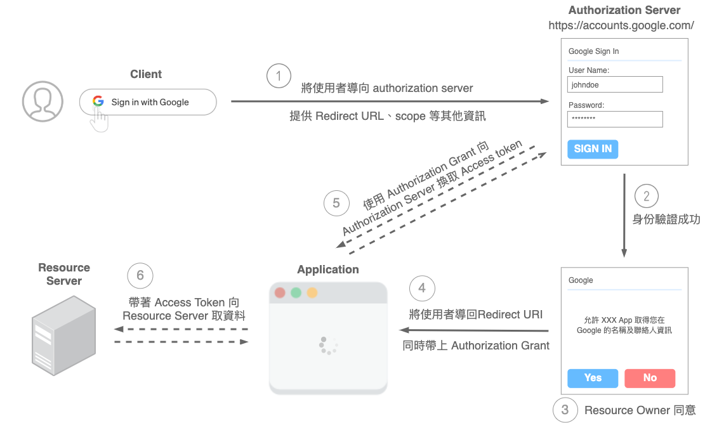

# 授權認證學習筆記

## JWT（Json Web Token）

JWT是一個開放的 JSON 格式 token 存儲標准。它定義了一種安全、緊湊的方式來保存數據，通過簽名的方式來校驗 token 的合法性，主要支持的簽名算法如 HMAC、RSA、ECDSA。

通常使用它來保存登錄信息，相比傳統的 session 方案，它的優點在於服務端無需維護登錄態，不再需要依賴第三方存儲（如 redis、memcached），所以說 JWT 是無狀態的。

但它也存在缺點。由於它只在客戶端維護，因此服務端無法方便的清除登錄狀態，相比傳統的 session 方案，只需要將 session 清除即可。你可能會說，可以直接將這個 token 刪除就算退出登錄了。但實際上這只是一種假注銷，若該用戶再次拿到相同的 token 還是會被認為是登錄的。

JWT 是由 header（頭部）、payload（負載）、signature（簽名）這三個部分組成的，中間用.來分隔開，寫成一行就是這個樣子的： `Header.Payload.Signature` 。

* Header
    * 一個 JSON 對象，描述 JWT 的元數據，通常是下面的樣子。
        ```json
        {
            "alg": "HS256",  // 表示簽名的算法（algorithm），默認是 HMAC SHA256（寫成 HS256）
            "typ": "JWT"     // 表示這個令牌（token）的類型（type），JWT 令牌默認統一寫為 JWT
        }
        ```
* Playload
    * 也是一個 JSON 對象，用來存放實際需要傳遞的數據。JWT 規定了 7 個官方字段供選用。除了官方的字段，還可以自定義一些其他字段。
        * iss (issuer)：簽發人
        * exp (expiration time)：過期時間
        * sub (subject)：主題
        * aud (audience)：受眾
        * nbf (Not Before)：生效時間
        * iat (Issued At)：簽發時間
        * jti (JWT ID)：編號
    * JWT 默認是不加密的，任何人都可以讀到，所以不要把秘密信息放在這個部分。這個 JSON 對象也要使用 Base64URL 算法轉成字符串。
* Signature
    * 該部分是對前兩部分的簽名，防止數據篡改。首先，需要指定一個密鑰（secret）。這個密鑰只有服務器才知道，不能洩露給用戶。然後，使用 Header 裡面指定的簽名算法（默認是 HMAC SHA256），按照下面的公式產生簽名。服務器收到JWT後通過對比簽名來確定Token是否被修改。
        ```json
        HMACSHA256(
            base64UrlEncode(header) + "." +
            base64UrlEncode(payload),
            secret
        )
        ```
        * Base64Url：這個算法跟 Base64 算法類似，但有一些不同。JWT 在有些場合可能會放到 URL（比如 api.example.com/?token=xxx）。Base64 有三個字符 `+`、`/` 和 `=`，在 URL 裡面有特殊含義，所以要被替換掉：`=` 被省略、`+` 替換成 `-`，`/` 替換成 `_`，這就是 Base64URL 算法。

特點：

* JWT 默認不加密，在 JWT 不加密的情況下不能將敏感數據寫入 JWT。
    * 生成原始 Token 以後，可以用密鑰再加密一次。
* JWT 不僅可以用於認證，也可以用於交換信息。有效使用 JWT 可以降低服務器查詢數據庫的次數。
* JWT 的最大缺點是，由於服務器不保存 session 狀態，因此無法在使用過程中廢止某個 token，或者更改 token 的權限。也就是說，一旦 JWT 簽發了，在到期之前就會始終有效，除非服務器部署額外的邏輯。
* JWT 本身包含了認證信息，一旦洩露任何人都可以獲得該令牌的所有權限。為了減少盜用，JWT 的有效期應該設置得比較短，並且 JWT 不應該使用 HTTP 協議明碼傳輸，要使用 HTTPS 協議傳輸。對於一些比較重要的權限，使用時應該再次對用戶進行認證。

## Cookie

Cookie 是服務器發送到用戶瀏覽器並保存在本地的一小塊數據，它會在瀏覽器下次向同一服務器再發起請求時被攜帶並發送到服務器上。通常它用於告知服務端兩個請求是否來自同一瀏覽器，如保持用戶的登錄狀態。Cookie 使基於無狀態的 HTTP 協議記錄穩定的狀態信息成為了可能。

有兩種類型的 Cookie：

* 一種是 Session Cookie (會話性 Cookie)
    * 如果 Cookie 不包含到期日期，則將其視為會話 Cookie。
    * 會話 Cookie 存儲在內存中，永遠不會寫入磁盤，當瀏覽器關閉時，此後 Cookie 將永久丟失。
* 一種是 Persistent Cookie (持久性 Cookie)
    * 如果 Cookie 包含有效期，則將其視為持久性 Cookie，到期後，Cookie 將從磁盤中刪除。

主要用途：

* 會話狀態管理（如用戶登錄狀態、購物車、游戲分數或其它需要記錄的信息）
* 個性化設置（如用戶自定義設置、主題等）
* 瀏覽器行為跟蹤（如跟蹤分析用戶行為等）

## Session

Session 代表著服務器和客戶端一次會話的過程。Session 對象存儲特定用戶會話所需的屬性及配置信息。這樣，當用戶在應用程序的 Web 頁之間跳轉時，存儲在 Session 對象中的變量將不會丟失，而是在整個用戶會話中一直存在下去。

常見誤區：Session 不是關閉瀏覽器就消失了。對 Session 來說，除非程序通知服務器刪除一個 Session，否則服務器會在Session 失效前一直保留。大多數情況下瀏覽器是不會在關閉網頁之前通知服務器的，所以服務器根本不知道瀏覽器已經關閉。

之所以會有這種錯覺，是大部分 session 機制都使用會話 cookie 來保存 session id，而關閉瀏覽器後這個 session id 就消失了，再次連接服務器時也就無法找到原來的 session。如果服務器設置的 cookie 被保存在硬盤上，或者使用某種手段改寫瀏覽器發出的 HTTP 請求頭，把原來的 session id 發送給服務器，則再次打開瀏覽器仍然能夠打開原來的 session。


服務器第一次接收到請求時，開辟了一塊 Session 空間（創建了Session 對象），同時生成一個 session id ，並通過響應頭的 Set-Cookie：JSESSIONID=XXXXXXX 命令，向客戶端發送要求設置 Cookie 的響應；客戶端收到響應後，在本機客戶端設置了一個JSESSIONID=XXXXXXX的 Cookie 信息，該 Cookie 的過期時間為瀏覽器會話結束。

接下來客戶端每次向同一個網站發送請求時，請求頭都會帶上該 Cookie 信息（包含 sessionId ）， 然後服務器通過讀取請求頭中的 Cookie 信息，獲取名稱為 JSESSIONID 的值，得到此次請求的 session id。

### Session 和 Cookie 比較

* 安全性
    * 由於 Session 是存儲在服務器端的，Cookie 是存儲在客戶端的，所以 Cookie 被盜用的可能性相較於Session會更高一些。
* 存取值的類型不同
    * Cookie 只支持存字符串數據，想要設置其他類型的數據，需要將其轉換成字符串，Session 可以存任意數據類型。
* 存儲大小不同
    * 單個 Cookie 保存的數據不能超過 4K，Session 可存儲數據遠高於 Cookie，但是當訪問量過多，會佔用過多的服務器資源。

### Session id 的攜帶方式

* Cookie
    * 保存session id的方式可以採用cookie，這樣在交互過程中瀏覽器可以自動的按照規則把這個標識發送給服務器。
* URL重寫
    * 由於cookie可以被人為的禁用，必須有其它的機制以便在 cookie 被禁用時仍然能夠把 session id 傳遞回服務器，經常採用的一種技術叫做 URL 重寫，就是把session id附加在URL路徑的後面，附加的方式也有兩種，一種是作為URL路徑的附加信息，另一種是作為 query 字符串附加在URL後面。網絡在整個交互過程中始終保持狀態，就必須在每個客戶端可能請求的路徑後面都包含這個session id。

## 單點登錄(Single sign-on, SSO)

SSO（Single sign-on）即單點登錄，一種對於許多相互關聯，但是又是各自獨立的軟件系統，提供訪問控制的方法。

單點登錄 (SSO) 發生在用戶登錄到一個應用程序，然後自動登錄到其他應用程序時，無論用戶使用何種平台、技術或域。例如，如果你登錄 Gmail 等 Google 服務，會自動通過 YouTube、AdSense、Google Analytics 和其他 Google 應用程序的身份驗證。同樣，如果退出 Gmail 或其他 Google 應用程序，將自動退出所有應用程序；這稱為單點注銷(SLO)。

SSO 體系中的角色：

* User：使用平台的用戶
* Web 應用：接入 CAS SSO 服務的平台
* SSO 認證中心(cas service)：提供 CAS SSO 服務的平台

## OAuth 2.0

OAuth 是一個開發標準（Open Standard）用來處理有關「授權」（Authorization）相關的行為。

在OAuth中 O 是 Open 的簡稱，表示「開放」的意思。Auth表示「授權」的意思，所以連起來 OAuth 表示「開放授權」的意思，它是一個關於授權（authorization）的開放網絡標准。OAuth 允許用戶授權第三方應用訪問他存儲在另外服務商裡的各種信息數據，而這種授權不需要提供用戶名和密碼提供給第三方應用。比較直接的例子就是第三方App使用微信或QQ來登錄，這些授權登錄採用的就是OAuth。

使用 OAuth 的流程白話來說：「我們允許並授權當前的應用程式（在這是指 Medium）有限度的取得我們在 Facebook、Google 或其他平台的相關資訊」——使用者身份驗證的工作基本上是委由選擇的平台完成，當驗證成功，且用戶同意，應用程式才得以前往取得所需要的資源。

### 名詞術語

* Client
    * 通常指稱想要取得受保護資源的「應用程式」。應用程式必須獲得 Resource Owner 的同意，才能代表使用者去取得相對應的資源。
* 服務提供商(HTTP service)
    * ，例如 Github
* Resource Owner
    * 能授予應用程式取得受保護資料的人——通常就是終端使用者（end-user），如 Github 用戶
    * 用戶有權同意或拒絕應用程式代你取得這些資訊做使用。
* 用戶代理(User Agent)
    * 通常是瀏覽器
* Authorization server
    * 專門處理授權請求的服務，驗證 Resource Owner 的身份，並且在獲得同意之後，發放「Access Token」給應用程式（Client）的伺服器。
    * 如 Google 用來驗證用戶的身份的伺服器，用戶會使用 Google 帳號與密碼進行身份驗證，並被詢問是否同意伺服器代表用戶取得用戶在 Google 中的資料。
* Resource server
    * 存放使用者受保護資料的伺服器，應用程式（Client）會需要帶著「Access Token」透過其 API 去取得資料。Resource Server 需要保護資料免於被未授權的他人取得，可以和 Authorization server 是同一服務，也可以是不同服務
    * 如 Google 存放用戶相關資料的伺服器
* Authorization Grant
    * 在流程中，是用來證明使用者同意賦予應用程式一定程度的授權、同意應用程式去做某些事、取得一個範圍內的資源。
    * 用來證明用戶已經同意第三方可以用戶的資料
* Redirect URI（Callback URL）
    * Authorization Server 在驗證完使用者身份並獲得授權同意後，將會把使用者帶回應用程式中指定的路徑。
* Access Token
    * Access Token 是 Authorization Server 簽發的。應用程式最終能拿著這個 Token 向 Resource Server 取得需要的資源。
* Scope
    * 使用者的授權時常並非一翻兩瞪眼，如果單純只是「可以取得我的所有資料」與「不可以取得我的所有資料」，彈性就相對很低。
    * 也因此通常 Authorization Server 會有個 scope 的清單，例如：可以取得使用者的名稱、可以編輯使用者的大頭貼、可以刪除我的某則貼文等不同權限。

### 流程



1. 瀏覽器將使用者導頁至 Authorization Server (如 Google 身份驗證)，並提供對方所需的資訊，常見的如：
    * Client Id：Client 在 Authorization Server 的身份識別
    * Redirect URI：告知當流程結束後，需要轉址的位置在哪
    * Response Type：告知想取得哪種 Authorization Grant
    * Scope：用來劃分應用程式能代使用者在 Google 取得一定範圍的資源
2. Authorization Server 會對用戶進行身份驗證
3. 身份驗證成功後，依據第一步設定的「scope」，使用者會被詢問是否同意讓應用程式取得特定的一些資料。
    * 舉例來說，應用程式可能會希望能取得使用者在 Google 的名稱、Email、大頭照等。
4. 使用者同意後，就會依照第一步設定的「Redirect URI」將使用者導回應用程式的指定路徑中，並依照 Response Type 回傳 Authorization grant；使用者也能選擇不同意，Authorization Server 會回傳相關錯誤訊息，那這個流程就在此結束了。
5. 此時，使用者已經同意，應用程式就能順利前往 Google 存放資料的對應地方，去取得所需要的相關資料。
    * 擁有 Authorization grant 其實還不能直接向 Resource Server 取得資源。應用程式必須拿著它重新向 Authorization Server 換取 Access Token。
        * 因為安全性考量，所以不直接發 Access Token
    * Authorization Server 在驗證 Authorization grant，以及應用程式身份後，才會正式核發 Access Token。
        * 這步會在後端做，通常是透過 HTTP Post 請求，夾帶著 Authorization grant 及應用程式的身份資訊（例如由 Google / Facebook 等平台提供給應用程式專屬的 Client ID、Secret Key，並且存放在後端）給 Authorization Server 進行驗證。也因為 Secret Key 只存放在後端伺服器，而非暴露在前端程式碼當中，因此安全性上就會比較高。
    * 應用程式最終就在取得資源的請求中夾帶著 Access Token 向 Resource Server 取得所需的資源。注意：這個 Access Token 的權限受限於在第一步所劃定 scope 清單。

簡易流程圖：


### 授權類型 Grant Type

OAuth2.0 定義了四種應用程式取得 Access Token 的流程，又稱為「Grant Types」。

#### 授權碼模式 Authorization Code

這是最常見的類型，Server-side Application （Web server applications）最為適用——通常會由後端伺服器負責產生頁面（View）回傳給前端渲染。

如此一來，大部分的邏輯處理程式碼，以及像應用程式的 Client Secret 等重要機密資訊，都能在伺服器端被保存，而非完全公開。

流程：

* 同前例


#### 簡化模式 Implicit

適合 Client-side 應用，適合整個應用程式都在前端運行的類型，例如單純的靜態網站或 Single Page Application(SPA)。

由於整個應用程式都在前端運行，所以會缺少「後端伺服器透過 Authorization Code Grant 交換 Access Token 」的步驟。取而代之的是請 Authorization Server 直接核發 Access Token。


由於是由前端獲得與管理 Access Token，並帶著 Access Token 發出請求前往取得資源，因此相對於 Authorization Code Flow 安全性「相對脆弱」。

流程：

* 應用程式將使用者導向 Authorization server 進行身份驗證和授權。
* 成功後，將依據 Redirect URI 將使用者導回應用程式指定路徑，並附上 Authoriation Grant ——以當前類型的流程來說，就是回傳「Access Token」。
* 最終應用程式就能拿著 Access Token 向 Resource Server 取得資料。


#### Resource Owner Password Credentials

此流程是由使用者提供帳號與密碼等資訊給應用程式，由應用程式直接向 Authorization Server 交換 Access Token，體驗上和以往的帳號密碼登入雷同。

帳號與密碼等機密資訊（credentials）可能會被應用程式儲存起來，作為往後交換 Access Token 使用。因此「必須是使用者高度信賴的應用程式」才適合使用，且唯有前兩種皆不可行時，才會考慮使用當前類型的流程。因此適用的情境可能像公司內部的系統。


#### Client Credentials

適合用在 machine-to-machine (M2M) applications——通常是由應用程式向 Authourization Server 請求取得 Access Token 以獲取「自己」的相關資源，而非使用者的資源。

這個流程已經跳脫使用者，因此，使用者身份驗證的流程將不再需要。取而代之是應用程式必須向 Authorization Server 提供驗證所需的自身資訊。


Client Credentials Flow 流程：

* 應用程式透過提供其 Client ID 及 Client Secret Token 等其他作為驗證的資訊（client credentials）給 Authorization Server 進行身份驗證。
* Authorization Server 驗證成功後，核發 Access Token 給應用程式。
* 應用程式取得 Access Token 後，即能代表自己向 Resource Server 取得自己的相關資料。


## WebAuthn

WebAuthn 使用的工作流一般分為兩種：

* 注冊（Registration）
    * 用來給系統添加用戶相關的身份認證信息
* 驗證（Authentication）
    * 用來校驗和檢查用戶的身份是否正確

### 註冊的流程

1. 瀏覽器向依賴方發送注冊請求：
    * 如點擊一個Button開始注冊用戶，這裡的協議和格式都不在 WebAuthn 的標准范圍之內，可以由客戶端自行實現
2. 依賴方向瀏覽器發送挑戰、依賴方信息和用戶信息：
    * 這裡的協議和格式也不在 WebAuthn 的標准范圍內，可以是基於 HTTPS 的XMLHttpRequest/Fetch實現，也可以使用任意其他協議（如ProtoBuf），只要客戶端能夠和服務端發送對應的請求消息即可，但是需要保證環境是安全的（HTTPS）
3. 瀏覽器向認證器發送用戶信息、依賴方信息和客戶端信息的Hash值
    * 在瀏覽器內部，瀏覽器將驗證參數並用默認值補全缺少的參數，然後這些參數會變為 clientDataJSON。調用 create() 的參數與 clientDataJSON 的 SHA-256 哈希一起傳遞到認證器（只有哈希被發送是因為與認證器的連接可能是低帶寬的 NFC 或藍牙連接，之後認證器只需對哈希簽名以確保它不會被篡改）
4. 認證器請求用戶確認，然後創建一對公私鑰，用私鑰創建證明
    * 在進行這一步時，認證器通常會以某種形式要求用戶確認，如輸入 PIN、使用指紋、人臉掃描等，以證明用戶在場並同意注冊。之後認證器將創建一個新的非對稱密鑰對，並安全地存儲私鑰以供將來驗證使用。公鑰則將成為證明的一部分，被在製作過程中燒錄於認證器內的私鑰進行簽名。這個私鑰會具有可以被驗證的證書鏈。
5. 認證器把簽名和公鑰以及憑證ID發送給瀏覽器
    * 新的公鑰、全局唯一的憑證 ID 和其他的證明數據會被返回到瀏覽器，成為 attestationObject。
6. 瀏覽器將證明數據和客戶端信息發送給依賴方
    * 這裡和前面一樣，可以使用任意的格式或協議，前提是需要保證環境安全
7. 依賴方用公鑰驗證發送的 challenge，如果成功則將對應的公鑰與用戶綁定存儲在數據庫中，完成注冊流程
    * 在這一步，服務器需要執行一系列檢查以確保注冊完成且數據未被篡改。步驟包括：
        * 驗證接收到的挑戰與發送的挑戰相同；
        * 確保 origin 與預期的一致；
        * 使用對應認證器型號的證書鏈驗證 clientDataHash 的簽名和證明；
        * 驗證步驟的完整列表可以在 WebAuthn 規范中找到；
        * 一旦驗證成功，服務器將會把新的公鑰與用戶帳戶相關聯以供將來用戶希望使用公鑰進行身份驗證時使用。

### 驗證的流程

在驗證中，瀏覽器向依賴方發送某個用戶的驗證請求後的行為如下：

1. 依賴方向瀏覽器發送挑戰
2. 瀏覽器向認證器發送依賴方ID、挑戰和客戶端信息的Hash值，
3. 認證器請求用戶確認，然後通過依賴方ID找到對應的私鑰，使用私鑰簽名挑戰（斷言）
4. 認證器將斷言信息和簽名後發送給瀏覽器
5. 瀏覽器將簽名、驗證器數據以及客戶端信息發送給服務器
6. 服務器使用用戶綁定的公鑰驗證挑戰是否與發送的一致，如果驗證通過則表示認證成功

## 細節

實作細節可以參考： [Web 應用身份驗證的未來？WebAuth 介紹](https://mp.weixin.qq.com/s?__biz=MzkxNTIwMzU5OQ%3D%3D&chksm=c1601823f6179135ed047dfd9ac003429a8f9db47edd952c3d0bda96d29bbbf7b3b287740ea7&idx=1&lang=zh_CN&mid=2247494467&sn=b55ed5c175b81c6f9141d98f2fe142cd&token=903578161)
## 參考文章

* [[筆記] 認識 OAuth 2.0：一次了解各角色、各類型流程的差異](https://medium.com/%E9%BA%A5%E5%85%8B%E7%9A%84%E5%8D%8A%E8%B7%AF%E5%87%BA%E5%AE%B6%E7%AD%86%E8%A8%98/%E7%AD%86%E8%A8%98-%E8%AA%8D%E8%AD%98-oauth-2-0-%E4%B8%80%E6%AC%A1%E4%BA%86%E8%A7%A3%E5%90%84%E8%A7%92%E8%89%B2-%E5%90%84%E9%A1%9E%E5%9E%8B%E6%B5%81%E7%A8%8B%E7%9A%84%E5%B7%AE%E7%95%B0-c42da83a6015)
* [前端应该掌握的登录认证知识](https://mp.weixin.qq.com/s/A1UBTZl0SIQgTVMl3IC_OA)
* [Web 應用身份驗證的未來？WebAuth 介紹](https://mp.weixin.qq.com/s?__biz=MzkxNTIwMzU5OQ%3D%3D&chksm=c1601823f6179135ed047dfd9ac003429a8f9db47edd952c3d0bda96d29bbbf7b3b287740ea7&idx=1&lang=zh_CN&mid=2247494467&sn=b55ed5c175b81c6f9141d98f2fe142cd&token=903578161)
