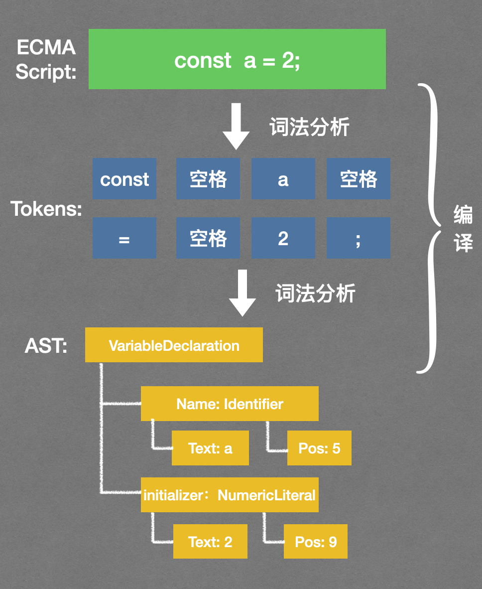
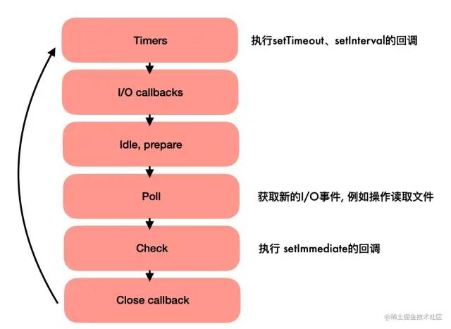

# JavaScript 學習筆記

## JS 加載位置

最好在 `</body>` 前加載 JS，這樣可確保該腳本不會阻礙其它內容的加載，同時在該腳本被下載和執行之前，頁面的內容已加載完畢，並可閱讀了。

## 模組化機制

由於歷史原因，JavaScript 模塊化系統一直沒有統一規范，大致發展過程是：CJS → AMD → CMD → UMD → ESM，這給設計一個跨應用使用的模塊帶來不少麻煩。

* CommonJS (CJS)
    * 在 NodeJS 中使用，用 `require` 和 `module.exports` 引入和匯出模組；
* Asynchronous Module Definition (AMD)
    * 在瀏覽器中使用，並用 `define` 函式定義模組；
* Universal Module Definition (UMD)
    * UMD 嚴格意義上不算規范，只是社區出的通用包模塊結合體的格式，兼容 CJS 和 AMD 格式。
* ES Modules (ESM)
    * JavaScript 從 ES6(ES2015) 開始支援的原生模組機制，使用 `import` 和 `export` 引入和匯出模組；

現階段選擇模塊規范的最佳實踐是：

* 共享配置模塊（跨前後端）
    * 同時打出 ESM、CJS 格式的包（目前 Node.js 運行時對 ESM 支持不是很好）
* UI 組件庫
    * 同時打出 ESM、CJS、UMD（umd 主要是為了讓前端項目可以做 external，減少構建時長）
* 面向 Node.js 項目
    * 目前只需要打出 CJS 格式

### CommonJS (CJS)

Node.js 的模塊標准，文件即模塊。

* 對 Tree Shaking 不友好
* 前端也可以使用 cjs 格式，依靠構建工具（webpack / rollup 等）

導出語法：

```js
module.exports = foo
exports.foo = 1;
```

使用語法：

```js
const foo = require('name');
const { foo } = require('name');
```

### Asynchronous Module Definition (AMD)


### Universal Module Definition (UMD)

UMD 嚴格意義上不算規范，只是社區出的通用包模塊結合體的格式，兼容 CJS 和 AMD 格式。
瀏覽器端用來掛載全局變量 （如：window.*）

適用於：

* Browser（external 場景）
* Node.js（較少）

導出語法：

```js
(function (root, factory) {
if (// amd) {
} else if (//cjs) {
} else (//global) {
}
})(this, function() {})
```

使用語法：

```js
window.React
window.ReactDOM
$
```

### ES Modules (ESM)

JavaScript 官方的標准化模塊系統（草案），在標准化道路上花了近 10 年時間。

* JS 標准，優先考慮使用該模塊
* Tree Shaking 友好

適用於：

* Browser
* Node.js ≥ 12.17

導出語法：

```js
export default foo
export const foo = 1;
export { bar as foo } from 'module'
```

使用語法：

```js
import foo from 'module'
import { foo } from 'module'
import { foo as bar } from 'nammodulee'
```

#### Node 使用 ESM 的方式

* Node 13.2.0 起開始正式支援 ES Modules 特性。
    * 注：雖然移除了 --experimental-modules 啟動引數，但是由於 ESM loader 還是實驗性的，所以執行 ES Modules 程式碼依然會有警告
* Node 使用 ESM 有兩種方式
    * 在 package.json 中，增加 type: "module" 配置；
    * 在 .mjs 檔案可以直接使用 import 和 export
    * 若不新增上述兩項中任一項，直接在 Node 中使用 ES Modules，則會丟擲警告

### 函式庫要包成 CommonJS 還是 ES Module？

如果接入方以SSR的形式在服務端接入組件，可能使用CJS規范。

CSR的情況通常使用ESM。

所以SDK組件在打包編譯時需要輸出ESM、CJS兩種規范的文件。

## 異常

ECMA-262 白皮書 13 版中描述了 8 種異常：

* SyntaxError：語法異常
* ReferenceError：引用異常
* RangeError：范圍異常
* Error：異常基類
* InternalError：內部異常
* TypeError: 類型異常
* EvalError: Eval 方法異常
* URIError: URI 相關方法產生的異常

### SyntaxError

在引擎執行代碼之前，編譯器需要對 js 進行編譯，編輯階段包括：詞法分析，語法分析



編譯階段發生的異常都是 SyntaxError，但 SyntaxError 不完全都發生於編譯階段；

```js
const a = '3;
```

比如這行代碼，缺少一個引號，就會發生: SyntaxError: Invalid or unexpected token.

其他常見的 SyntaxError：

* SyntaxError:Unexpected token u in JSON at position 0
* SyntaxError:Unexpected token '<'
* SyntaxError:Unexpected identifier

絕大部分 SyntaxError 都可以通過配置編輯器的校驗工具，從而在開發階段避免。

### ReferenceError

引用異常。

* ReferenceError:$ is not defined
* ReferenceError:Can't find variable: $

上面舉的 2 個引用異常例子其實是同一個異常，第一個是發生在 Android，第二個是在 iOS 下，異常對象的 message 有著兼容性的差別。

什麼情況下會發生引用異常呢？

這裡需要先提一下 LHS 查詢和 RHS 查詢。

比如 const a = 2; ，對於這一行代碼，引擎會為變量 a 進行 LHS 查詢。另外一個查找的類型叫作 RHS，即在賦值語句的 Left Hand Side 和 Right Hand Side。RHS 查詢與簡單地查找某個變量的值別無二致，而 LHS 查詢則是試圖找到變量的容器本身，即作用域。

LHS 和 RHS 的含義是 “賦值操作的左側或右側” 並不一定意味著就是 “=”。比如 console.log(a) 也會進行異常 RHS。我們再來看一個例子：

```js
function foo(a) {
    var b = a;
    return a + b;
}
var c = foo(2);
```

其中有 function foo；Var c；A = 2；Var b 這 4 次 LHS 和 4 次 RHS

為什麼區分 LHS 和 RHS 是一件重要的事情？

因為在變量還沒有聲明的情況下，這兩種查詢的行為是不一樣的。

如果 RHS 查詢在所有嵌套的作用域中遍尋不到所需的變量，引擎就會拋出 ReferenceError。

如果 RHS 查詢找到了一個變量，但是你嘗試對這個變量的值進行不合理的操作，會拋出另外一種類型的異常，叫作 TypeError。

### TypeError

TypeError 在對值進行不合理操作時會發生，比如試圖對一個非函數類型的值進行函數調用，或者引用 null 或 undefined 類型的值中的屬性，那麼引擎會拋出這種類型的異常。比如：

* TypeError:Cannot read property 'length' of undefined

這是個最常見的異常之一，在判斷數組長度時可能發生。

可以做前置條件判空，比如：

```js
if (obj) {
    res = obj.name;
}
```

也可以改寫成邏輯與運算 && 的表達式寫法

```js
res = obj && obj.name;
```

但如果屬性較多，這種方法就很難看了，可以使用可選鏈的寫法，如下：

```js
res = obj && obj.a && obj.a.b && obj.a.b.name

res = obj?.a?.b?.name;
```

雖然條件判斷、邏輯與判斷、可選鏈判斷都可以避免報錯，但是還是有 2 個缺點：

* js 對於變量進行 Bool 強制轉換的寫法還是不夠嚴謹，可能出現判斷失誤
* 這樣寫法在為空時本行代碼不會報錯，但是後續邏輯可能還會出問題；只是減少了異常，並沒有辦法解決這種情況。對於重要的邏輯代碼建議使用 try/catch 來處理，必要時可以加上日誌來分析。

### RangeError

範圍錯誤，比如:

new Array(-20) 會導致 RangeError: Invalid array length

遞歸等消耗內存的程序會導致 RangeError: Maximum call stack size exceeded

遞歸可以使用循環 + 棧或尾遞歸的方式來優化

```js
 //普通遞歸
 const sum = (n) => {
   if (n <= 1) return n;
   return n + sum(n-1)
 }

 //尾遞歸
 const sum = (n, prevSum = 0) => {
   if (n <= 1) return n + prevSum;
   return sum(n-1, n + prevSum)
 }
 ```

尾遞歸和一般的遞歸不同在對內存的佔用，普通遞歸創建 stack 累積而後計算收縮，尾遞歸只會佔用恆量的內存。當編譯器檢測到一個函數調用是尾遞歸的時候，它就覆蓋當前的活動記錄而不是在棧中去創建一個新的。

### Error 與自定義異常

Error 是所有錯誤的基類，其他錯誤類型繼承該類型。所有錯誤類型都共享相同的屬性。

* Error.prototype.message 錯誤消息。對於用戶創建的 Error 對象，這是構造函數的第一個參數提供的字符串。
* Error.prototype.name 錯誤名稱。這是由構造函數決定的。
* Error.prototype.stack 錯誤堆棧

通過繼承 Error 也可以創建自定義的錯誤類型。創建自定義錯誤類型時，需要提供 name 屬性和 message 屬性.

```js
class MyError extends Error {
    constructor(message) {
        super();
        this.name = 'MyError'
        this.message = message     }
}
```

大多流行框架會封裝一些自定義異常，比如 Axios 和 React.

### Error: Script Error

它是 Error 類型中最常見的一種；由於沒有具體異常堆棧和代碼行列號，成為可最神秘的異常之一。

由於瀏覽器基於安全考慮效避免敏感信息無意中被第三方 (不受控制的) 腳本捕獲到，瀏覽器只允許同域下的腳本捕獲具體的錯誤信息。

但大部分的 JS 文件都存放在 CDN 上面，跟頁面的域名不一致。做異常監控只能捕獲 Error: Script Error. 無法捕獲堆棧和准確的信息。2 步解決：

1、給 script 標簽增加 crossorigin 屬性，讓瀏覽器允許頁面請求資源。

```html
 <script src="http://def.com/demo.js" crossorigin="anonymous"></script>
```

這樣請求頭 sec-fetch-mode 值就會變成 cors, 默認是 no-cors.

但有些瀏覽器還不兼容此方法，加上 crossorigin 後仍不能發出 sec-fetch-mode：cors 請求

2、給靜態資源服務器增加響應頭允許跨域標記。

```http
Access-Control-Allow-Origin: *.58.com
```

大部分主流 CDN 默認添加了 Access-Control-Allow-Origin 屬性。

在加上跨域請求頭、響應頭後可能還有大量的 ScriptError，就要考慮以下幾種情況

* 通過 append Script 標簽異步加載 JS
* JSONP 請求
* 第三方 SDK

### InternalError

這種異常極為少見，在 JS 引擎內部發生，示例場景通常為某些成分過大，例如：

* “too many switch cases”（過多 case 子句）；
* “too many parentheses in regular expression”（正則表達式中括號過多）；
* “array initializer too large”（數組初始化器過大）；

### EvalError

在 eval() 方法執行過程中拋出 EvalError 異常。

根據 Ecma2018 版以後，此異常不再會被拋出，但是 EvalError 對象仍然保持兼容性。

### URIError

用來表示以一種錯誤的方式使用全局 URI 處理函數而產生的錯誤.

decodeURI, decodeURIComponent, encodeURI, encodeURIComponent 這四個方法會產生這種異常；

比如執行 decodeURI('%%') 的異常：Uncaught URIError: URI malformed

### 異常處理

ECMA-262 第 3 版新增了 try/catch 語句，作為在 JavaScript 中處理異常的一種方式。基本的語法如下所示，跟 Java 中的 try/catch 語句一樣。

#### finally

finally 在 try-catch 語句中是可選的，finally 子句一經使用，其代碼無論如何都會執行。

```js
function a () {
    try {
        return '約會'
    } catch (e) {
        return '約會失敗'
    } finally {
        return '睡覺';
    }
}
console.log('函數結果:', a()) // '睡覺'
```
上
述代碼的結果是 ' 睡覺 '，finally 會阻止 return 語句的終止.

#### throw

```js 
throw new Error('Boom');
```

什麼時候應該手動拋出異常呢？

一個指導原則就是可預測程序在某種情況下不能正確進行下去，需要告訴調用者異常的詳細信息，而不僅僅是異常內容本身。比如上文提到的 React 自定義異常；

一個健壯的函數，會對參數進行類型有效性判斷；通常在實參不合理時，為了避免報錯阻斷程序運行，開發者會通過默認值，return 空等方式處理。

這種方式雖然沒有報錯，但是程序的結果未必符合預期，默認值設計不合理會造成語義化誤解；另外，也可能無法避免後續的代碼報錯；

#### 斷言

上文提到可預測，很容易聯想到 Node 中的斷言 assert，如果表達式不符合預期，就拋出一個錯誤。

assert 方法接受兩個參數，當第一個參數對應的布爾值為 true 時，不會有任何提示，返回 undefined。當第一個參數對應的布爾值為 false 時，會拋出一個錯誤，該錯誤的提示信息就是第二個參數設定的字符串。

```js
 var assert = require('assert');
 function add (a, b) {
   return a + b;
 }
 var expected = add(1,1);
 assert( expected === 2, '預期1加1等於2');
 ```

通常在 TDD 開發模式中，會用於編寫測試用例；

不過 ECMA 還沒有類似的設計，感興趣可以簡單封裝一個 assert 方法。瀏覽器環境中的 console 對像有類似的 assert 方法。

#### 異步中的異常

非同步的代碼，在事件循環中執行的，就無法通過 try catch 到。

主要注意的是，Promise 的 catch 方法用於處理 rejected 狀態，而非處理異常。Rejected 狀態未處理的話會觸發 Uncaught Rejection. 後者可以通過如下方式進行統一的監聽。

```js
window.onunhandledrejection = (event) => {
    console.warn(`REJECTION: ${event.reason}`);
};
```

tips: await 這種 Promise 的同步寫法，通常會被開發者忽略 rejected 的處理，可以用 try catch 來捕獲。

#### 異常監控

服務端通常會通過服務器的日誌進行異常監控，比如觀察單台服務器的日誌輸出，或 kibana 可視化查詢。

前端異常監控與之最大的不同，就是需要把客戶端發生的異常數據通過網絡再收集起來。

可以使用下面幾個方式來收集數據：

* window.onerror 捕獲語法異常
* 可以重寫 setTimeout、setInterval 等異步方法，用同步的寫法包裹 try 來捕獲異步函數中發生的錯誤
* window.addEventListener (‘unhandledrejection’,・・・); 捕獲未處理的異步 reject
* window.addEventListener (‘error’, …) 捕獲資源異常
* 重寫 fetch, XMLHttpRequest 來捕獲接口狀態

## Promise

已整理為文章： [淺談 JavaScript 的 Promise](https://marco79423.net/articles/%E6%B7%BA%E8%AB%87-javascript-%E7%9A%84-promise/)

## Javascript Workers

在 Web 中可以通過使用 Workers 在後台線程中運行腳本來實現類似多線程的模式，允許它們執行任務而不干擾主線程。Workers 是運行在單獨線程上的整個 JavaScript 作用域，沒有任何共享內存。

* Web Worker
    * Web Worker 是最通用的 worker 類型。
* Service Worker
    * Service Worker 是一種專門用於瀏覽器與網絡和/或緩存之間的代理。
* Worklet
    * Worklet 是一個非常輕量級的，高度特定的worker。

### Web Worker

Web workers 是最常用的 worker 類型。它不像另外兩種，它們除了運行在主線程外的特性外，沒有一個特殊的應用場景。所以，Web worker 可以用於減少主線程上大量的線程活動。


Web Worker 有以下幾個使用注意點：

* 同源限制
    * 分配給 Worker 線程運行的腳本文件，必須與主線程的腳本文件同源。
* DOM 限制
    * Worker 線程所在的全局對象，與主線程不一樣，無法讀取主線程所在網頁的 DOM 對象，也無法使用 document、window、parent 這些對象。但是，Worker 線程可以使用 navigator 對象和 location 對象。
* 通信聯系
    * Worker 線程和主線程不在同一個上下文環境，它們不能直接通信，必須通過消息（postMessage）完成。
* 腳本限制
    * Worker 線程不能執行 alert()方法和 confirm()方法，但可以使用 XMLHttpRequest 對象發出 AJAX 請求。
* 文件限制
    * Worker 線程無法讀取本地文件，即不能打開本機的文件系統（file://），它所加載的腳本，必須來自網絡。

### Service Worker

Service workers 主要是提供詳細的瀏覽器和網絡/緩存間的代理服務。它本質上是一種能在瀏覽器後台運行的獨立線程，能夠在網頁關閉後持續運行，能夠攔截網絡請求並根據網絡是否可用來採取適當的動作、更新來自服務器的的資源，從而實現攔截和加工網絡請求、消息推送、靜默更新、事件同步等一系列功能，是 PWA 應用的核心技術之一。

與普通 JS 運行環境相比，Service Workers 有如下特點：

* 無法直接訪問 DOM ， 可通過 postMessage 發送消息與頁面通信；
* 能夠控制頁面發送網絡請求；
* 必須在 HTTPS 協議下運行；
* 開發過程中可以通過 localhost 使用 service worker。


和 HTTP 緩存比較：

* HTTP 緩存中
    * Web 服務器可以使用 Expires 首部來通知 Web 客戶端，它可以使用資源的當前副本，直到指定的“過期時間”。反過來，瀏覽器可以緩存此資源，並且只有在有效期滿後才會再次檢查新版本。使用 HTTP 緩存意味著你要依賴服務器來告訴你何時緩存資源和何時過期（當然，HTTP 緩存控制還包括 cache-control,last-modified,etag 等字段）。
* Service Workers
    * Service Workers 的強大之處在於它們攔截 HTTP 請求的能力，接受任何傳入的 HTTP 請求，並決定想要如何響應。在你的 Service Worker 中，可以編寫邏輯來決定想要緩存的資源，以及需要滿足什麼條件和資源需要緩存多久。一切盡歸開發者掌控。
        * 所以出於安全考慮，Service Workers 要求只能由 Https 承載

注意事項：

* Service worker 運行在 worker 上下文（self） --> 不能訪問 DOM（這裡其實和 Web Worker 是一樣的）
* 它設計為完全異步，同步 API（如 XHR 和 localStorage）不能在 service worker 中使用
* 出於安全考量，Service workers 只能由 HTTPS 承載；
* 某些瀏覽器的用戶隱私模式，Service Worker 不可用
* 其生命週期與頁面無關（關聯頁面未關閉時，它也可以退出，沒有關聯頁面時，它也可以啟動）。

應用場景：

* 離線緩存
    * 配合 CacheStorage 可以將應用中不變化的資源或者很少變化的資源長久的存儲在用戶端，提升加載速度、降低流量消耗、降低服務器壓力，提高請求速度，讓用戶體驗更加絲滑
* 消息推送
    * 激活沉睡的用戶，推送即時消息、公告通知，激發更新等。如web資訊客戶端、web即時通訊工具、h5游戲等運營產品。
* 事件同步
    * 確保web端產生的任務即使在用戶關閉了web頁面也可以順利完成。如web郵件客戶端、web即時通訊工具等。
* 定時同步
    * 週期性的觸發Service Worker腳本中的定時同步事件，可借助它提前刷新緩存內容
* 結合CacheStorage、 Push API 和 Notification API

#### 生命週期

Service Worker 的生命週期完全獨立於網頁。生命週期 (install -> waiting -> activate -> fetch)：


完成流程：


其中， install 事件是 Service Worker 獲取的第一個事件，並且只發生一次。

#### 主要邏輯 & API

* register
* install
* activate
* fetch
* skipWaiting

```js
if ('serviceWorker' in navigator) {
    // 為了防止作用域污染，將安裝前注銷所有已生效的 Service Worker
    navigator.serviceWorker.getRegistrations()
        .then(regs => {
            for (let reg of regs) {
                reg.unregister()
            }
            navigator.serviceWorker.register('./sw.js')
        })
}

// sw.js
console.log('service worker 注冊成功')

self.addEventListener('install', () => {
    // 安裝回調的邏輯處理
    console.log('service worker 安裝成功')
})

self.addEventListener('activate', () => {
    // 激活回調的邏輯處理
    console.log('service worker 激活成功')
})

self.addEventListener('fetch', event => {
    console.log('service worker 抓取請求成功: ' + event.request.url)
})
```

#### 「waitUntil 機制」

`ExtendableEvent.waitUntil()` 方法告訴事件分發器該事件仍在進行。這個方法也可以用於檢測進行的任務是否成功。在服務工作線程中，這個方法告訴瀏覽器事件一直進行，直至 promise resolve，瀏覽器不應該在事件中的異步操作完成之前終止服務工作線程。

* skipWaiting
    * Service Worker 一旦更新，需要等所有的終端都關閉之後，再重新打開頁面才能激活新的 Service Worker，這個過程太復雜了。通常情況下，開發者希望當 Service Worker 一檢測到更新就直接激活新的 Service Worker。如果不想等所有的終端都關閉再打開的話，只能通過 skipWaiting 的方法了。

    * Service Worker 在全局提供了一個 skipWaiting() 方法，skipWaiting() 在 waiting 期間調用還是在之前調用並沒有什麼不同。一般情況下是在 install 事件中調用它。

* clients.claim
    * 如果使用了 skipWaiting 的方式跳過 waiting 狀態，直接激活了 Service Worker，可能會出現其他終端還沒有受當前終端激活的 Service Worker 控制的情況，切回其他終端之後，Service Worker 控制頁面的效果可能不符合預期，尤其是如果 Service Worker 需要動態攔截第三方請求的時候。

    * 為了保證 Service Worker 激活之後能夠馬上作用於所有的終端，通常在激活 Service Worker 後，通過在其中調用 self.clients.claim() 方法控制未受控制的客戶端。self.clients.claim() 方法返回一個 Promise，可以直接在 waitUntil() 方法中調用，如下代碼所示：
        ```js
        self.addEventListener('activate', event => {
            event.waitUntil(
                self.clients.claim()
                    .then(() => {
                        // 返回處理緩存更新的相關事情的 Promise
                    })
            )
        })
        ```

#### 如何處理 Service Worker 的更新

* 如果目前尚未有活躍的 SW ，那就直接安裝並激活。
* 如果已有 SW 安裝著，向新的 swUrl 發起請求，獲取內容和和已有的 SW 比較。如沒有差別，則結束安裝。如有差別，則安裝新版本的 SW（執行 install 階段），之後令其等待（進入 waiting 階段）
* 如果老的 SW 控制的所有頁面 「全部關閉」，則老的 SW 結束運行，轉而激活新的 SW（執行 activated 階段），使之接管頁面。

方法：

* skipWaiting
    * 問題：同一個頁面，前半部分的請求是由 sw.v1.js 控制，而後半部分是由 sw.v2.js 控制。這兩者的不一致性很容易導致問題，甚至網頁報錯崩潰

* skipWaiting + 刷新
    ```js
    let refreshing = false
    navigator.serviceWorker.addEventListener('controllerchange', () => {
        if (refreshing) {
            return
        }
        refreshing = true;
        window.location.reload();
    });
    ```
    * 問題：毫無徵兆的刷新頁面的確不可接受，影響用戶體驗
* 給用戶一個提示
    * 大致的流程是：
        * 瀏覽器檢測到存在新的（不同的）SW 時，安裝並讓它等待，同時觸發 updatefound 事件
        * 我們監聽事件，彈出一個提示條，詢問用戶是不是要更新 SW
        * 如果用戶確認，則向處在等待的 SW 發送消息，要求其執行 skipWaiting 並取得控制權
        * 因為 SW 的變化觸發 controllerchange 事件，我們在這個事件的回調中刷新頁面即可
    * 問題：
        * 弊端一：過於復雜
        * 弊端二：刷新邏輯的實現必須通過 JS 完成更新

#### Debug


* Offline
    * 復選框可以將 DevTools 切換至離線模式。它等同於 Network 窗格中的離線模式。
* Update on reload
    * 復選框可以強制 Service Worker 線程在每次頁面加載時更新。
* Bypass for network
    * 復選框可以繞過 Service Worker 線程並強制瀏覽器轉至網絡尋找請求的資源。
* Update
    * 按鈕可以對指定的 Service Worker 線程執行一次性更新。
* Push
    * 按鈕可以在沒有負載的情況下模擬推送通知。
* Sync
    * 按鈕可以模擬後台同步事件。
* Unregister
    * 按鈕可以注銷指定的 Service Worker 線程。
* Source
    * 告訴當前正在運行的 Service Worker 線程的安裝時間，鏈接是 Service Worker 線程源文件的名稱。點擊鏈接會將定向並跳轉至 Service Worker 線程來源。
* Status
    * 告訴 Service Worker 線程的狀態。此行上的數字指示 Service Worker 線程已被更新的次數。如果啟用 update on reload 復選框，接下來會注意到每次頁面加載時此數字都會增大。在狀態旁邊會看到 start 按鈕（如果 Service Worker 線程已停止）或 stop 按鈕（如果 Service Worker 線程正在運行）。Service Worker 線程設計為可由瀏覽器隨時停止和啟動。使用 stop 按鈕明確停止 Service Worker 線程可以模擬這一點。停止 Service Worker 線程是測試 Service Worker 線程再次重新啟動時的代碼行為方式的絕佳方法。它通常可以揭示由於對持續全局狀態的不完善假設而引發的錯誤。
* Clients
    * 告訴 Service Worker 線程作用域的原點。如果已啟用 show all 復選框，focus 按鈕將非常實用。在此復選框啟用時，系統會列出所有注冊的 Service Worker 線程。如果這時候點擊正在不同標簽中運行的 Service Worker 線程旁的 focus 按鈕，Chrome 會聚焦到該標簽。

#### 知識點


### Worklet

Worklet 是一個非常輕量級、高度具體的 worker。

它們使我們作為開發人員能夠連接到瀏覽器渲染過程的各個部分（鉤子），讓開發人員可以訪問渲染管道的底層部分。

## 事件循環

JS 做的任務分為同步和異步兩種，所謂 "異步"，簡單說就是一個任務不是連續完成的，先執行第一段，等做好了准備，再回過頭執行第二段，第二段也被叫做回調；同步則是連貫完成的。

像讀取文件、網絡請求這種任務屬於異步任務：花費時間很長，但中間的操作不需要 JS 引擎自己完成，它只用等別人准備好了，把數據給他，他再繼續執行回調部分。

如果沒有特殊處理，JS 引擎在執行異步任務時，應該是存在等待的，不去做任何其他事情。

實際上這是大多數多線程語言的處理辦法。但對於 JS 這種單線程語言來說，這種長時間的空閒等待是不可接受的：遇到其他緊急任務，Java 可以再開一個線程去處理，JS 卻只能忙等。

所以採取了以下的“異步任務回調通知”模式：

在等待異步任務准備的同時，JS 引擎去執行其他同步任務，等到異步任務准備好了，再去執行回調。這種模式的優勢顯而易見，完成相同的任務，花費的時間大大減少，這種方式也被叫做非阻塞式。

而實現這個“通知”的，正是事件循環，把異步任務的回調部分交給事件循環，等時機合適交還給 JS 線程執行。

事件循環是由一個隊列組成的，異步任務的回調遵循先進先出，在 JS 引擎空閒時會一輪一輪地被取出，所以被叫做循環。

根據隊列中任務的不同，分為宏任務和微任務。

事件循環由宏任務和在執行宏任務期間產生的所有微任務組成。完成當下的宏任務後，會立刻執行所有在此期間入隊的微任務。

這種設計是為了給緊急任務一個插隊的機會，否則新入隊的任務永遠被放在隊尾。區分了微任務和宏任務後，本輪循環中的微任務實際上就是在插隊，這樣微任務中所做的狀態修改，在下一輪事件循環中也能得到同步。

事件循環中的任務被分為宏任務和微任務，是為了給高優先級任務一個插隊的機會：微任務比宏任務有更高優先級。

node 端的事件循環比瀏覽器更復雜，它的宏任務分為六個優先級，微任務分為兩個優先級。node 端的執行規律是一個宏任務隊列搭配一個微任務隊列，而瀏覽器是一個單獨的宏任務搭配一個微任務隊列。但是在 node11 之後，node 和瀏覽器的規律趨同。

常見的宏任務有：

* script（整體代碼）
* setTimout
* setInterval
* setImmediate(node 獨有)
* requestAnimationFrame(瀏覽器獨有)
* IO
* UI render（瀏覽器獨有）

常見的微任務有：

* process.nextTick(node 獨有)
* Promise.then()
* Object.observe
* MutationObserver

### 瀏覽器的事件循環

瀏覽器的事件循環由一個宏任務隊列+多個微任務隊列組成。

首先，執行第一個宏任務：全局 Script 腳本。產生的的宏任務和微任務進入各自的隊列中。執行完 Script 後，把當前的微任務隊列清空。完成一次事件循環。

接著再取出一個宏任務，同樣把在此期間產生的回調入隊。再把當前的微任務隊列清空。以此往復。

宏任務隊列只有一個，而每一個宏任務都有一個自己的微任務隊列，每輪循環都是由一個宏任務+多個微任務組成。

### Node 的事件循環

node 的事件循環比瀏覽器復雜很多。由 6 個宏任務隊列+6 個微任務隊列組成。

宏任務按照優先級從高到低依次是：



其執行規律是：在一個宏任務隊列全部執行完畢後，去清空一次微任務隊列，然後到下一個等級的宏任務隊列，以此往復。

一個宏任務隊列搭配一個微任務隊列。六個等級的宏任務全部執行完成，才是一輪循環。

其中需要關注的是：Timers、Poll、Check 階段，因為我們所寫的代碼大多屬於這三個階段。

* Timers：定時器 setTimeout/setInterval；
* Poll ：獲取新的 I/O 事件, 例如操作讀取文件等；
* Check：setImmediate 回調函數在這裡執行；

除此之外，node 端微任務也有優先級先後：

* process.nextTick;
* promise.then 等;

清空微任務隊列時，會先執行 process.nextTick，然後才是微任務隊列中的其他。

## localStorage

[你还在直接用 localStorage 么？该提升下了](https://mp.weixin.qq.com/s/qI3-dO4RbPCajJ7PgiWNYA)

## 模組

### JSON

```js
JSON.stringify(
    value,
    replacer,  // [可選] 過濾器，只會包含列出的對象屬性
    space, // [可選] 決定縮排的空格數
)
```

replacer 代表過濾器 只會包含列出的對象屬性

```js
JSON.stringify(value, ['a', 'b']) 只會有 a 和 b
```

space 是決定縮排的空格數

```js
let jsonText = JSON.stringify(value, null, 4);
```

開發者可以自行定義物件的 toJSON 序列化的結果 (不能用箭頭函數)

```js
let value = {
  a: 'a',
  b: 'b',
  toJSON: function () {
    return this.a
  }
};
console.log(JSON.stringify(value));
```

> **註：**  stringify 會把 undefined, nan, infinity 轉為 null

### Temporal

新的代替 Date 的模組


* 參考文章： [取而代之！以后不用再 new Date() 了](https://mp.weixin.qq.com/s/49CDsOtS_GK3R6ljT3holw)

## 套件

### 原型鏈寫法

早期的模組化是利用了函數自執行來實現的，在單獨的函數範疇中執行程式碼可以避免外掛中定義的變數污染到全域變數，以下程式碼實現了一個簡單隨機數生成的外掛：

```js
;(function (global) {
    "use strict";

    var MyPlugin = function (name) {
        this.name = name
    };

    MyPlugin.prototype = {
        say: function () {
            console.log('歡迎你：', this.name)
        },
        random: function (min = 0, max = 1) {
            if (min <= Number.MAX_SAFE_INTEGER && max <= Number.MAX_SAFE_INTEGER) {
                return Math.floor(Math.random() * (max - min + 1)) + min
            }
        }
    };
    
    // 函數自執行將 this（全域下為window）傳入，並在其下面掛載方法
    global.MyPlugin = MyPlugin;
    // 相容CommonJs規範匯出
    if (typeof module !== 'undefined' && module.exports) module.exports = MyPlugin; 
})(this);
```

用法：

```js
var aFn = new MyPlugin()

var num = aFn.random(10, 20)
console.log(num) // 列印一個 10~20 之間的隨機數

var aFn = new MyPlugin('呀哈哈')
aFn.say() // 歡迎你: 呀哈哈

// 這種方法屬性能被直接修改
var aFn = new MyPlugin('呀哈哈')
aFn.name = null
aFn.say() // 歡迎你: null
```

### 閉包式寫法

那麼如果要建立私有變數，可以利用JS閉包原理來編寫外掛，可以使用工廠模式來建立函數，如下程式碼實現了一個簡單正則校驗的外掛：

```js
; (function (global) {
    "use strict";

    var MyPlugin = function (value) {
        var val = value
        var reg = {
            phone: /^1[3456789]\d{9}$/,
            number: /^-?\d*\.?\d+$/
        };
        return {
            getRegs() {
                return reg
            },
            setRegs(params) {
                reg = { ...reg, ...params }
            },
            isPhone() {
                reg.phone.test(val) && console.log('這是手機號')
                return this
            },
            isNumber() {
                reg.number.test(val) && console.log('這是數字')
                return this
            }
        };
    };

    // 函數自執行將 this（全域下為window）傳入，並在其下面掛載方法
    global.MyPlugin = MyPlugin;
    // 相容CommonJs規範匯出
    if (typeof module !== 'undefined' && module.exports) module.exports = MyPlugin;
})(this);
```

上面程式碼中我們在 isPhone isNumber 方法的最後都返回了 this，這是為了實現如下的鏈式呼叫：

```js
var aFn = new MyPlugin(13800138000)

aFn.isPhone().isNumber() // log: > 這是手機號 > 這是數字
```

### 仿 JQuery 寫法

這種寫法是仿造JQ實現的一種編寫模式，可以省去呼叫時new實例化的步驟，並實現類似 $(xxx).someFn(....) 這樣的呼叫方法。

```js
;(function (global) {
  "use strict";

  var MyPlugin = function (el) {
    return new MyPlugin.prototype.init(el)
  };

  MyPlugin.prototype = {
    init: function (el) {
      this.el = typeof el === "string" ? document.querySelector(el) : el;
    },
    setBg: function (bg) {
      this.el.style.background = bg;
      return this
    },
    setWidth: function (w) {
      this.el.style.width = w;
      return this
    },
    setHeight: function (h) {
      this.el.style.height = h;
      return this
    }
  };

  MyPlugin.prototype.init.prototype = MyPlugin.prototype
  // script標籤引入外掛後全域下掛載一個_$的方法
  global._$ = MyPlugin;
})(this || window);
```

使用：

```js
_$('#app').setBg('#ff0')
```

## 工具庫

### qs

一個輕量的 url 參數轉換的 JavaScript 庫

```js
import qs from 'qs'

qs.parse('user=tom&age=22') // => { user: "tom", age: "22" }
qs.stringify({ user: "tom", age: "22" }) // => user=tom&age=22
```

### js-cookie

一個簡單的、輕量的處理 cookies 的 js API
```js
import Cookies from 'js-cookie'

Cookies.set('name', 'value', { expires: 7 }) // 有效期7天
Cookies.get('name') // => 'value'
```

### vConsole

一個輕量、可拓展、針對手機網頁的前端開發者調試面板。 (可給手機用)

```js
import VConsole from 'vconsole'

const vConsole = new VConsole()
console.log('Hello world')
```

### lodash

使用時可以使用下列兩種外掛在在打包時去掉不必要的 lodash 程式碼，減小產物體積。

* babel-plugin-lodash
* lodash-webpack-plugin

字串操作：

```js
_.lowerFirst(str)
_.upperFirst(str)
_.capitalize(str) // 第一個字元大寫，其它字元小寫
```

命名風格轉換：

```js
_.snakeCase(str) // 蛇形寫法（snake case），如 foo_bar。
_.kebabCase(str) // 烤肉串寫法（kebab case），如 foo-bar。
_.camelCase(str) // 駝峰寫法（camel case），如 fooBar 。
_.upperFirst(_.camelCase(str)) // 大駝峰寫法（pascal case），如 FooBar。

// example
_.kebabCase("__FOO_BAR__") // 'foo-bar'
_.lowerCase("--Foo-Bar--") // 'foo bar'
_.upperCase("fooBar") // 'FOO BAR'
```

算術運算：

```js
_.sum(array) // 求總和
_.mean(array) // 求平均值


// 返回一個[lower,upper]之間的隨機數
// 如果lower和upper中有浮點數，或者floating為true，返回浮點數，否則，返回整數
_.random(lower=0,upper=1 [,floating])

// 生成一個範圍陣列
_.range([start=0,]end,step=1)

// 把一個數字就近限制在某個區間內
_.clamp(number,[lower=0,] upper)
_.clamp(-10, -5, 5);    // -5
_.clamp(10, -5, 5);    // 5
```

陣列操作：

```js
// 交集 intersection
_.intersection(...arrays);
_.intersectionWith(...arrays [, comparator]);
_.intersectionBy(...arrays [, iteratee]);

// 聯集
_.union(...arrays);
_.unionWith(...arrays [, comparator]);
_.unionBy(...arrays [, iteratee]);

// 集合差，A - B 表示屬於集合A但不屬於集合B的元素集合
_.difference(array, ...operands);
_.differenceWith(array, ...operands [, comparator]);
_.differenceBy(array, ...operands [, iteratee]);
```

分片/分區/分組：

分片（chunk）是指把陣列中的每 n 個元素分為一組（一片），如果不能整除，最後剩下的元素單獨一片。

```js
_.chunk(array [, size=1])
_.chunk(['a', 'b', 'c', 'd','e'], 2); // => [["a", "b"], ["c", "d"], ["e"]]

```

分區（partition）是利用一個斷言函數迭代每個元素，根據斷言的 true 和 false，把元素分成兩組。

```js
_.partition(collection [, predicate])
_.partition([4,5,6,7],num=>num>5) // =>[[6, 7], [4, 5]]
```

分組(group) 則是用一個函數遍歷每個元素，得到的結果作為該元素所在組的 key，相同 key 元素歸為同一組。

```js
_.groupBy(collection [, iteratee])
_.groupBy([6.1, 4.2, 6.3], Math.floor); // => { '4': [4.2], '6': [6.1, 6.3] }
```
元素操作：取樣/打亂/計數

```js
_.sample(collection) // 隨機返回一個元素
_.sampleSize(collection, [n=1]) // 隨機返回n個元素
_.shuffle(collection) // 打亂陣列

// 計數
_.countBy(collection [, iteratee])
_.countBy([6.1, 4.2, 6.3], Math.floor) // => { '4': 1, '6': 2 }

對象轉換：

``js
// 克隆
_.clone(value);
_.cloneWith(value, customizer);
_.cloneDeep(value);
_.cloneDeepWith(value, customizer);

// 同 Object.assign,把 sources 對象中的自有屬性賦值到 object 中
_.assign(object, ...sources);
// 轉化後賦值
_.assignWith(_.assignWith(object, sources, customizer));

// 類似_.assign, 但會賦值繼承屬性
_.assignIn(object, ...sources);
_.assignInWith(object, ...sources, customizer);

// 當object中不存在值時，才會賦值，經常用於合併預設值
_.defaults(object, ...sources);
// _.default 不適用多層對象，需要使用_.defaultsDeep
_.defaultsDeep(object, ...sources);

// 合併對象，類似 _.assign,但對象會遞迴深入，陣列會被拼接
_.merge(object, ...sources);
_.mergeWith(object, ...sources);
```

注意，上面這些函數都會直接修改 object 參數。

與此不同，pick 和 omit 操作則返回新對象，不修改參數：

```js
// 從對象中取出對應路徑的值，合成一個新對象
_.pick(object, [paths]);
_.pick({ a: 1, b: "2", c: 3 }, ["a", "c"]); // => { 'a': 1, 'c': 3 }
// 用一個斷言函數決定要不要取這個屬性，predicate(value,key)
_.pickBy(object, predicate);
_.pickBy({ a: 1, b: "2", c: 3 }, _.isNumber); // => { 'a': 1, 'c': 3 }

// 去掉指定屬性，把餘下部分合成一個新對象，性能差於 pick
_.omit(object, [paths]);
_.omit({ a: 1, b: "2", c: 3 }, ["a", "c"]); // => { 'b': '2' }
_.omitBy(object, predicate);
```

另外，對象還能像陣列一樣進行 map ：

```js
// iteratee(value,key,obj) 返回的結果作為新對象的key
_.mapKeys(object, iteratee);
_.mapKeys({ a: 1, b: 2 }, function (value, key) {
  return key + value;
}) // => { 'a1': 1, 'b2': 2 }

// iteratee(value,key,obj) 返回的結果作為新對象的value
_.mapValues(object, iteratee);
```

遍歷對象：

```js
// 遍歷自有屬性，類似 for...in 加 hasOwnProperty判斷。
_.forOwn(object, iteratee);

// 尋找符合條件的key，類似陣列的findIndex
_.findKey(object, iteratee);
_.findLastKey(object, iteratee);

// 尋找對象中的函數屬性
_.functions(object);
_.functionsIn(object);
```

安全的 get/set：

在 JavaScript 中，讀取和設定某一個路徑下的值，是不安全的：

```js
const object={a:1};
const=object.b.someKey;   // TypeError: Cannot read properties of undefined
object.c.someKey=v;       // TypeError: Cannot set properties of undefined
```

Lodash 為我們提供了更安全的 get 和 set 操作：

```js
_.get(object,path [, defaultValue]); // 當對應的值不存在時，返回undefined，而不是報錯。
_.set(object,path,value); // 一層層set,而不是報錯

// 根據該路徑現在的value，更新為updater返回後的值,updater(value)=>newValue
_.update(object,path,updater)
```

儘管最近的可選鏈 "?." 語法能取代 get 函數，但 set 操作依然沒有較好的原生支援。

函數操作：

防抖(debounce)：當函數呼叫時，等待一段時間再執行實際操作（內部函數），如果這段時間內涵數再次被呼叫，則本次呼叫不執行實際操作，新呼叫重新開始等待。

```js
_.debounce(func [, wait=0] [, options={}])

// 只會在停住之後重新佈局
window.addEventListener('resize', _.debounce(calculateLayout, 150));
```

```js
節流(throttle)：一段時間內多次呼叫函數，只執行一次實際操作。
_.throttle(func [, wait=0] [, options={}])

// 會持續更新位置，但150ms更新一次，避免卡頓
window.addEventListener('resize', _.throttle(updatePosition, 150));
```

也可以根據呼叫次數控制是否執行操作。

```js
// 函數隻呼叫一次
_.once(func);
// 只在前n次呼叫
_.before(func, n);
// 只在n次之後才呼叫
_.after(func, n);
```

延遲執行：

```js
_.defer(func, ...args); // 在本次呼叫堆疊被清空後執行
_.delay(func, wait, ...args); // 等待 wait ms 後執行，同setTimeout

// memorize 能快取函數結果，避免重複計算，是一種常見的性能最佳化手段。
_.memorize(func [, resolver]) // resolver用於計算快取key，當key相同時，使用快取。默認使用func的第一個參數為key
```

函數參數轉換：

```js
_.curry(func, (arity = func.length)); // 柯裡化
_.partial(func, ...args); // 繫結部分參數，但不繫結this

_.ary(func, n); // 只接收前n個參數，忽略額外參數
_.unary(func); // 只接收第一個參數,同 _.ary(func,1)
```

通用工具：

```js
// 流水線
_.flow([funcs]);
const pascalCase = _.flow(_.upperFirst, _.camelCase);

// 生成一個唯一 ID：
_.uniqueId((prefix = ""));
```

## 參考文章

* [[科普] Service Worker 入門指南](http://mp.weixin.qq.com/s?__biz=Mzg3OTYwMjcxMA==&mid=2247487147&idx=1&sn=77096d7a944c83e50a23bc806dfe5565&chksm=cf00b3d2f8773ac4a1251e14bc546b351328f008890dad56534b5f6d1fc204b37d029bebf09b#rd)
* [熟悉事件循环？那谈谈为什么会分为宏任务和微任务](https://mp.weixin.qq.com/s/L1rpAjAYLbTpg6ZBqwzCdA)
* [【第2706期】详聊前端异常原理](https://mp.weixin.qq.com/s/NhqIOCHQrR1h4DKbnCP_yw)
* [如何優雅地編寫一個高逼格的JS外掛？](https://mp.weixin.qq.com/s?__biz=MzIzNjQ0MjcwNw%3D%3D&chksm=e8d686badfa10facf82e4d62f513a3bca853d82eda2abe506ba580dc57db676c1a3ac435ec9b&idx=1&lang=zh_CN&mid=2247484294&sn=f6595bc93cc374c0703e9b13fb31ad7b&token=795841537)
* [都聽說過 lodash，但你會用嗎？](https://mp.weixin.qq.com/s/I4yfSto6BOaQqccudNN-HQ)
