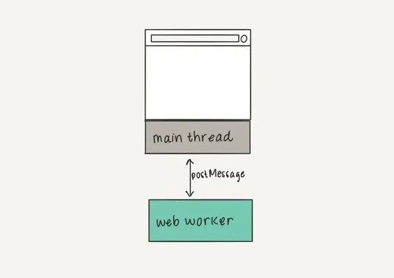
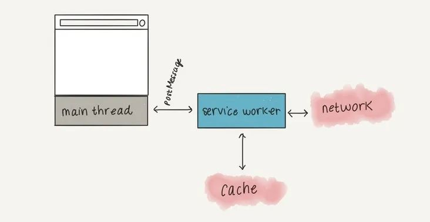
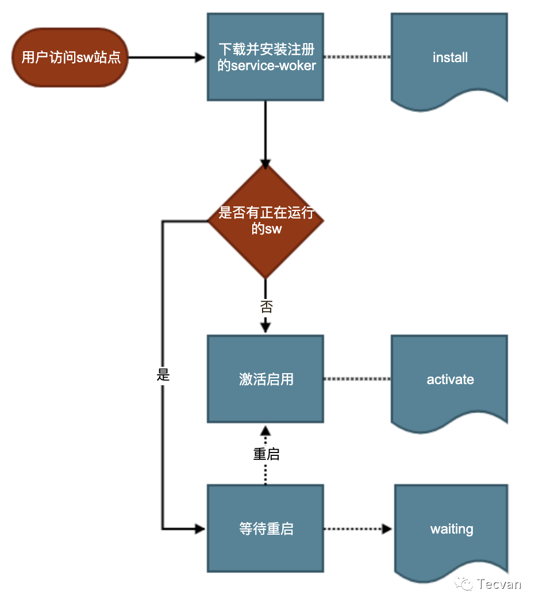
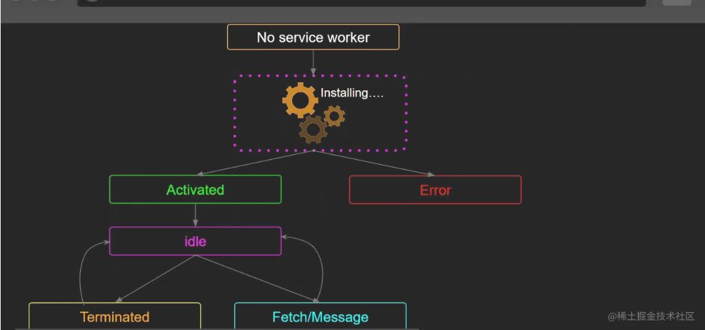
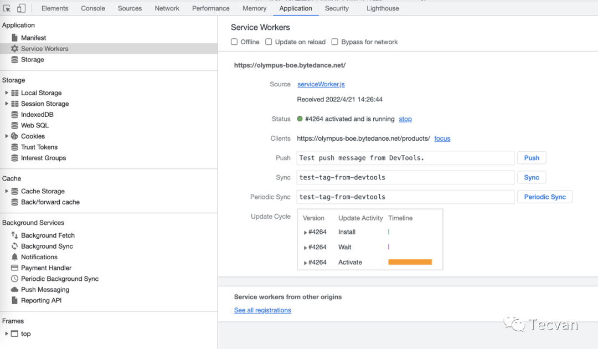
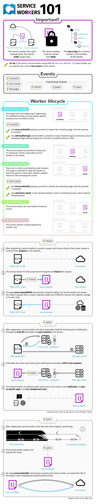
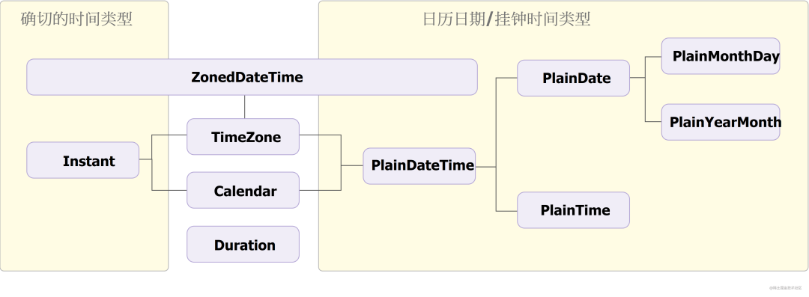
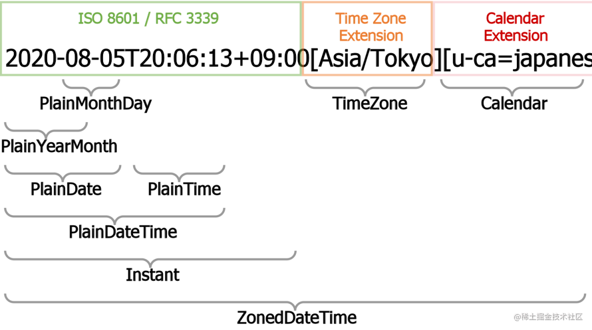

# JavaScript 學習筆記

## JS 加載位置

最好在 `</body>` 前加載 JS，這樣可確保該腳本不會阻礙其它內容的加載，同時在該腳本被下載和執行之前，頁面的內容已加載完畢，並可閱讀了。

## 模組化機制

* AMD (Asynchronous Module Definition)
    * 在瀏覽器中使用，並用 `define` 函式定義模組；
* CJS (CommonJS)
    * 在 NodeJS 中使用，用 `require` 和 `module.exports` 引入和匯出模組；
* ESM (ES Modules)
    * JavaScript 從 ES6(ES2015) 開始支援的原生模組機制，使用 `import` 和 `export` 引入和匯出模組；

## Node 使用 ESM 的方式

* Node 13.2.0 起開始正式支援 ES Modules 特性。
    * 注：雖然移除了 --experimental-modules 啟動引數，但是由於 ESM loader 還是實驗性的，所以執行 ES Modules 程式碼依然會有警告
* Node 使用 ESM 有兩種方式
    * 在 package.json 中，增加 type: "module" 配置；
    * 在 .mjs 檔案可以直接使用 import 和 export
    * 若不新增上述兩項中任一項，直接在 Node 中使用 ES Modules，則會丟擲警告

## Promise

已整理為文章： [淺談 JavaScript 的 Promise](https://marco79423.net/articles/%E6%B7%BA%E8%AB%87-javascript-%E7%9A%84-promise/)

## 函式庫要包成 CommonJS 還是 ES Module？

如果接入方以SSR的形式在服務端接入組件，可能使用CJS規范。

CSR的情況通常使用ESM。

所以SDK組件在打包編譯時需要輸出ESM、CJS兩種規范的文件。

## Javascript Workers

在 Web 中可以通過使用 Workers 在後台線程中運行腳本來實現類似多線程的模式，允許它們執行任務而不干擾主線程。Workers 是運行在單獨線程上的整個 JavaScript 作用域，沒有任何共享內存。

* Web Worker
    * Web Worker 是最通用的 worker 類型。
* Service Worker
    * Service Worker 是一種專門用於瀏覽器與網絡和/或緩存之間的代理。
* Worklet
    * Worklet 是一個非常輕量級的，高度特定的worker。

### Web Worker

Web workers 是最常用的 worker 類型。它不像另外兩種，它們除了運行在主線程外的特性外，沒有一個特殊的應用場景。所以，Web worker 可以用於減少主線程上大量的線程活動。



Web Worker 有以下幾個使用注意點：

* 同源限制
    * 分配給 Worker 線程運行的腳本文件，必須與主線程的腳本文件同源。
* DOM 限制
    * Worker 線程所在的全局對象，與主線程不一樣，無法讀取主線程所在網頁的 DOM 對象，也無法使用 document、window、parent 這些對象。但是，Worker 線程可以使用 navigator 對象和 location 對象。
* 通信聯系
    * Worker 線程和主線程不在同一個上下文環境，它們不能直接通信，必須通過消息（postMessage）完成。
* 腳本限制
    * Worker 線程不能執行 alert()方法和 confirm()方法，但可以使用 XMLHttpRequest 對象發出 AJAX 請求。
* 文件限制
    * Worker 線程無法讀取本地文件，即不能打開本機的文件系統（file://），它所加載的腳本，必須來自網絡。

### Service Worker

Service workers 主要是提供詳細的瀏覽器和網絡/緩存間的代理服務。它本質上是一種能在瀏覽器後台運行的獨立線程，能夠在網頁關閉後持續運行，能夠攔截網絡請求並根據網絡是否可用來採取適當的動作、更新來自服務器的的資源，從而實現攔截和加工網絡請求、消息推送、靜默更新、事件同步等一系列功能，是 PWA 應用的核心技術之一。

與普通 JS 運行環境相比，Service Workers 有如下特點：

* 無法直接訪問 DOM ， 可通過 postMessage 發送消息與頁面通信；
* 能夠控制頁面發送網絡請求；
* 必須在 HTTPS 協議下運行；
* 開發過程中可以通過 localhost 使用 service worker。



和 HTTP 緩存比較：

* HTTP 緩存中
    * Web 服務器可以使用 Expires 首部來通知 Web 客戶端，它可以使用資源的當前副本，直到指定的“過期時間”。反過來，瀏覽器可以緩存此資源，並且只有在有效期滿後才會再次檢查新版本。使用 HTTP 緩存意味著你要依賴服務器來告訴你何時緩存資源和何時過期（當然，HTTP 緩存控制還包括 cache-control,last-modified,etag 等字段）。
* Service Workers
    * Service Workers 的強大之處在於它們攔截 HTTP 請求的能力，接受任何傳入的 HTTP 請求，並決定想要如何響應。在你的 Service Worker 中，可以編寫邏輯來決定想要緩存的資源，以及需要滿足什麼條件和資源需要緩存多久。一切盡歸開發者掌控。
        * 所以出於安全考慮，Service Workers 要求只能由 Https 承載

注意事項：

* Service worker 運行在 worker 上下文（self） --> 不能訪問 DOM（這裡其實和 Web Worker 是一樣的）
* 它設計為完全異步，同步 API（如 XHR 和 localStorage）不能在 service worker 中使用
* 出於安全考量，Service workers 只能由 HTTPS 承載；
* 某些瀏覽器的用戶隱私模式，Service Worker 不可用
* 其生命週期與頁面無關（關聯頁面未關閉時，它也可以退出，沒有關聯頁面時，它也可以啟動）。

應用場景：

* 離線緩存
    * 配合 CacheStorage 可以將應用中不變化的資源或者很少變化的資源長久的存儲在用戶端，提升加載速度、降低流量消耗、降低服務器壓力，提高請求速度，讓用戶體驗更加絲滑
* 消息推送
    * 激活沉睡的用戶，推送即時消息、公告通知，激發更新等。如web資訊客戶端、web即時通訊工具、h5游戲等運營產品。
* 事件同步
    * 確保web端產生的任務即使在用戶關閉了web頁面也可以順利完成。如web郵件客戶端、web即時通訊工具等。
* 定時同步
    * 週期性的觸發Service Worker腳本中的定時同步事件，可借助它提前刷新緩存內容
* 結合CacheStorage、 Push API 和 Notification API

#### 生命週期

Service Worker 的生命週期完全獨立於網頁。生命週期 (install -> waiting -> activate -> fetch)：



完成流程：



其中， install 事件是 Service Worker 獲取的第一個事件，並且只發生一次。

#### 主要邏輯 & API

* register
* install
* activate
* fetch
* skipWaiting

```js
if ('serviceWorker' in navigator) {
    // 為了防止作用域污染，將安裝前注銷所有已生效的 Service Worker
    navigator.serviceWorker.getRegistrations()
        .then(regs => {
            for (let reg of regs) {
                reg.unregister()
            }
            navigator.serviceWorker.register('./sw.js')
        })
}

// sw.js
console.log('service worker 注冊成功')

self.addEventListener('install', () => {
    // 安裝回調的邏輯處理
    console.log('service worker 安裝成功')
})

self.addEventListener('activate', () => {
    // 激活回調的邏輯處理
    console.log('service worker 激活成功')
})

self.addEventListener('fetch', event => {
    console.log('service worker 抓取請求成功: ' + event.request.url)
})
```

#### 「waitUntil 機制」

`ExtendableEvent.waitUntil()` 方法告訴事件分發器該事件仍在進行。這個方法也可以用於檢測進行的任務是否成功。在服務工作線程中，這個方法告訴瀏覽器事件一直進行，直至 promise resolve，瀏覽器不應該在事件中的異步操作完成之前終止服務工作線程。

* skipWaiting
    * Service Worker 一旦更新，需要等所有的終端都關閉之後，再重新打開頁面才能激活新的 Service Worker，這個過程太復雜了。通常情況下，開發者希望當 Service Worker 一檢測到更新就直接激活新的 Service Worker。如果不想等所有的終端都關閉再打開的話，只能通過 skipWaiting 的方法了。

    * Service Worker 在全局提供了一個 skipWaiting() 方法，skipWaiting() 在 waiting 期間調用還是在之前調用並沒有什麼不同。一般情況下是在 install 事件中調用它。

* clients.claim
    * 如果使用了 skipWaiting 的方式跳過 waiting 狀態，直接激活了 Service Worker，可能會出現其他終端還沒有受當前終端激活的 Service Worker 控制的情況，切回其他終端之後，Service Worker 控制頁面的效果可能不符合預期，尤其是如果 Service Worker 需要動態攔截第三方請求的時候。

    * 為了保證 Service Worker 激活之後能夠馬上作用於所有的終端，通常在激活 Service Worker 後，通過在其中調用 self.clients.claim() 方法控制未受控制的客戶端。self.clients.claim() 方法返回一個 Promise，可以直接在 waitUntil() 方法中調用，如下代碼所示：
        ```js
        self.addEventListener('activate', event => {
            event.waitUntil(
                self.clients.claim()
                    .then(() => {
                        // 返回處理緩存更新的相關事情的 Promise
                    })
            )
        })
        ```

#### 如何處理 Service Worker 的更新

* 如果目前尚未有活躍的 SW ，那就直接安裝並激活。
* 如果已有 SW 安裝著，向新的 swUrl 發起請求，獲取內容和和已有的 SW 比較。如沒有差別，則結束安裝。如有差別，則安裝新版本的 SW（執行 install 階段），之後令其等待（進入 waiting 階段）
* 如果老的 SW 控制的所有頁面 「全部關閉」，則老的 SW 結束運行，轉而激活新的 SW（執行 activated 階段），使之接管頁面。

方法：

* skipWaiting
    * 問題：同一個頁面，前半部分的請求是由 sw.v1.js 控制，而後半部分是由 sw.v2.js 控制。這兩者的不一致性很容易導致問題，甚至網頁報錯崩潰

* skipWaiting + 刷新
    ```js
    let refreshing = false
    navigator.serviceWorker.addEventListener('controllerchange', () => {
        if (refreshing) {
            return
        }
        refreshing = true;
        window.location.reload();
    });
    ```
    * 問題：毫無徵兆的刷新頁面的確不可接受，影響用戶體驗
* 給用戶一個提示
    * 大致的流程是：
        * 瀏覽器檢測到存在新的（不同的）SW 時，安裝並讓它等待，同時觸發 updatefound 事件
        * 我們監聽事件，彈出一個提示條，詢問用戶是不是要更新 SW
        * 如果用戶確認，則向處在等待的 SW 發送消息，要求其執行 skipWaiting 並取得控制權
        * 因為 SW 的變化觸發 controllerchange 事件，我們在這個事件的回調中刷新頁面即可
    * 問題：
        * 弊端一：過於復雜
        * 弊端二：刷新邏輯的實現必須通過 JS 完成更新

#### Debug



* Offline
    * 復選框可以將 DevTools 切換至離線模式。它等同於 Network 窗格中的離線模式。
* Update on reload
    * 復選框可以強制 Service Worker 線程在每次頁面加載時更新。
* Bypass for network
    * 復選框可以繞過 Service Worker 線程並強制瀏覽器轉至網絡尋找請求的資源。
* Update
    * 按鈕可以對指定的 Service Worker 線程執行一次性更新。
* Push
    * 按鈕可以在沒有負載的情況下模擬推送通知。
* Sync
    * 按鈕可以模擬後台同步事件。
* Unregister
    * 按鈕可以注銷指定的 Service Worker 線程。
* Source
    * 告訴當前正在運行的 Service Worker 線程的安裝時間，鏈接是 Service Worker 線程源文件的名稱。點擊鏈接會將定向並跳轉至 Service Worker 線程來源。
* Status
    * 告訴 Service Worker 線程的狀態。此行上的數字指示 Service Worker 線程已被更新的次數。如果啟用 update on reload 復選框，接下來會注意到每次頁面加載時此數字都會增大。在狀態旁邊會看到 start 按鈕（如果 Service Worker 線程已停止）或 stop 按鈕（如果 Service Worker 線程正在運行）。Service Worker 線程設計為可由瀏覽器隨時停止和啟動。使用 stop 按鈕明確停止 Service Worker 線程可以模擬這一點。停止 Service Worker 線程是測試 Service Worker 線程再次重新啟動時的代碼行為方式的絕佳方法。它通常可以揭示由於對持續全局狀態的不完善假設而引發的錯誤。
* Clients
    * 告訴 Service Worker 線程作用域的原點。如果已啟用 show all 復選框，focus 按鈕將非常實用。在此復選框啟用時，系統會列出所有注冊的 Service Worker 線程。如果這時候點擊正在不同標簽中運行的 Service Worker 線程旁的 focus 按鈕，Chrome 會聚焦到該標簽。

#### 知識點



### Worklet

Worklet 是一個非常輕量級、高度具體的 worker。

它們使我們作為開發人員能夠連接到瀏覽器渲染過程的各個部分（鉤子），讓開發人員可以訪問渲染管道的底層部分。

## 模組

### JSON

```js
JSON.stringify(
    value,
    replacer,  // [可選] 過濾器，只會包含列出的對象屬性
    space, // [可選] 決定縮排的空格數
)
```

replacer 代表過濾器 只會包含列出的對象屬性

```js
JSON.stringify(value, ['a', 'b']) 只會有 a 和 b
```

space 是決定縮排的空格數

```js
let jsonText = JSON.stringify(value, null, 4);
```

開發者可以自行定義物件的 toJSON 序列化的結果 (不能用箭頭函數)

```js
let value = {
  a: 'a',
  b: 'b',
  toJSON: function () {
    return this.a
  }
};
console.log(JSON.stringify(value));
```

> **註：**  stringify 會把 undefined, nan, infinity 轉為 null

### Temporal

新的代替 Date 的模組





* 參考文章： [取而代之！以后不用再 new Date() 了](https://mp.weixin.qq.com/s/49CDsOtS_GK3R6ljT3holw)

## 工具庫

* qs
    * 一個輕量的 url 參數轉換的 JavaScript 庫
        ```js
        import qs from 'qs'

        qs.parse('user=tom&age=22') // => { user: "tom", age: "22" }
        qs.stringify({ user: "tom", age: "22" }) // => user=tom&age=22
        ```
* js-cookie
    * 一個簡單的、輕量的處理 cookies 的 js API
        ```js
        import Cookies from 'js-cookie'

        Cookies.set('name', 'value', { expires: 7 }) // 有效期7天
        Cookies.get('name') // => 'value'
        ```
* vConsole
    * 一個輕量、可拓展、針對手機網頁的前端開發者調試面板。 (可給手機用)
        ```js
        import VConsole from 'vconsole'

        const vConsole = new VConsole()
        console.log('Hello world')
        ```

## 參考文章

* [[科普] Service Worker 入門指南](http://mp.weixin.qq.com/s?__biz=Mzg3OTYwMjcxMA==&mid=2247487147&idx=1&sn=77096d7a944c83e50a23bc806dfe5565&chksm=cf00b3d2f8773ac4a1251e14bc546b351328f008890dad56534b5f6d1fc204b37d029bebf09b#rd)