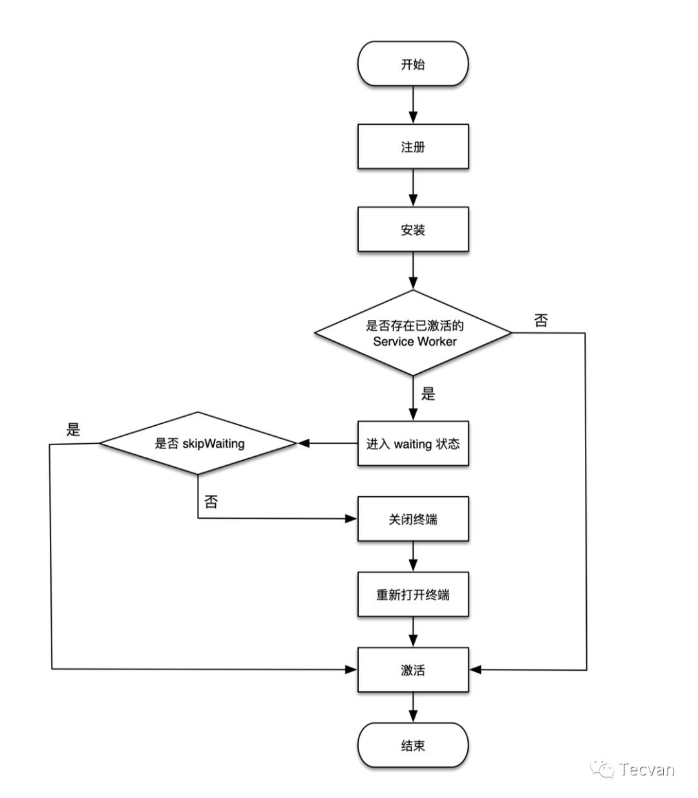

# JavaScript 學習筆記

## JS 加載位置

最好在 `</body>` 前加載 JS，這樣可確保該腳本不會阻礙其它內容的加載，同時在該腳本被下載和執行之前，頁面的內容已加載完畢，並可閱讀了。

## 模組化機制

* AMD (Asynchronous Module Definition)
    * 在瀏覽器中使用，並用 `define` 函式定義模組；
* CJS (CommonJS)
    * 在 NodeJS 中使用，用 `require` 和 `module.exports` 引入和匯出模組；
* ESM (ES Modules)
    * JavaScript 從 ES6(ES2015) 開始支援的原生模組機制，使用 `import` 和 `export` 引入和匯出模組；

## Node 使用 ESM 的方式

* Node 13.2.0 起開始正式支援 ES Modules 特性。
    * 注：雖然移除了 --experimental-modules 啟動引數，但是由於 ESM loader 還是實驗性的，所以執行 ES Modules 程式碼依然會有警告
* Node 使用 ESM 有兩種方式
    * 在 package.json 中，增加 type: "module" 配置；
    * 在 .mjs 檔案可以直接使用 import 和 export
    * 若不新增上述兩項中任一項，直接在 Node 中使用 ES Modules，則會丟擲警告

## Promise

已整理為文章： [淺談 JavaScript 的 Promise](https://marco79423.net/articles/%E6%B7%BA%E8%AB%87-javascript-%E7%9A%84-promise/)

## 函式庫要包成 CommonJS 還是 ES Module？

如果接入方以SSR的形式在服務端接入組件，可能使用CJS規范。

CSR的情況通常使用ESM。

所以SDK組件在打包編譯時需要輸出ESM、CJS兩種規范的文件。

## Javascript Workers

在 Web 中可以通過使用 Workers 在後台線程中運行腳本來實現類似多線程的模式，允許它們執行任務而不干擾主線程。Workers 是運行在單獨線程上的整個 JavaScript 作用域，沒有任何共享內存。

* Web Worker
    * Web Worker 是最通用的 worker 類型。
* Service Worker
    * Service Worker 是一種專門用於瀏覽器與網絡和/或緩存之間的代理。
* Worklet
    * Worklet 是一個非常輕量級的，高度特定的worker。

### Web Worker

Web workers 是最常用的 worker 類型。它不像另外兩種，它們除了運行在主線程外的特性外，沒有一個特殊的應用場景。所以，Web worker 可以用於減少主線程上大量的線程活動。


Web Worker 有以下幾個使用注意點：

* 同源限制
    * 分配給 Worker 線程運行的腳本文件，必須與主線程的腳本文件同源。
* DOM 限制
    * Worker 線程所在的全局對象，與主線程不一樣，無法讀取主線程所在網頁的 DOM 對象，也無法使用 document、window、parent 這些對象。但是，Worker 線程可以使用 navigator 對象和 location 對象。
* 通信聯系
    * Worker 線程和主線程不在同一個上下文環境，它們不能直接通信，必須通過消息（postMessage）完成。
* 腳本限制
    * Worker 線程不能執行 alert()方法和 confirm()方法，但可以使用 XMLHttpRequest 對象發出 AJAX 請求。
* 文件限制
    * Worker 線程無法讀取本地文件，即不能打開本機的文件系統（file://），它所加載的腳本，必須來自網絡。

### Service Worker

Service workers 主要是提供詳細的瀏覽器和網絡/緩存間的代理服務。


Service workers 的生命週期：



知識點：


和 HTTP 緩存比較：

* HTTP 緩存中
    * Web 服務器可以使用 Expires 首部來通知 Web 客戶端，它可以使用資源的當前副本，直到指定的“過期時間”。反過來，瀏覽器可以緩存此資源，並且只有在有效期滿後才會再次檢查新版本。使用 HTTP 緩存意味著你要依賴服務器來告訴你何時緩存資源和何時過期（當然，HTTP 緩存控制還包括 cache-control,last-modified,etag 等字段）。
* Service Workers
    * Service Workers 的強大之處在於它們攔截 HTTP 請求的能力，接受任何傳入的 HTTP 請求，並決定想要如何響應。在你的 Service Worker 中，可以編寫邏輯來決定想要緩存的資源，以及需要滿足什麼條件和資源需要緩存多久。一切盡歸開發者掌控。
        * 所以出於安全考慮，Service Workers 要求只能由 Https 承載

注意事項：

* Service worker 運行在 worker 上下文（self） --> 不能訪問 DOM（這裡其實和 Web Worker 是一樣的）
* 它設計為完全異步，同步 API（如 XHR 和 localStorage）不能在 service worker 中使用
* 出於安全考量，Service workers 只能由 HTTPS 承載；
* 某些瀏覽器的用戶隱私模式，Service Worker 不可用
* 其生命週期與頁面無關（關聯頁面未關閉時，它也可以退出，沒有關聯頁面時，它也可以啟動）。

### Worklet

Worklet 是一個非常輕量級、高度具體的 worker。

它們使我們作為開發人員能夠連接到瀏覽器渲染過程的各個部分（鉤子），讓開發人員可以訪問渲染管道的底層部分。

## 模組

### JSON

```js
JSON.stringify(
    value,
    replacer,  // [可選] 過濾器，只會包含列出的對象屬性
    space, // [可選] 決定縮排的空格數
)
```

replacer 代表過濾器 只會包含列出的對象屬性

```js
JSON.stringify(value, ['a', 'b']) 只會有 a 和 b
```

space 是決定縮排的空格數

```js
let jsonText = JSON.stringify(value, null, 4);
```

開發者可以自行定義物件的 toJSON 序列化的結果 (不能用箭頭函數)

```js
let value = {
  a: 'a',
  b: 'b',
  toJSON: function () {
    return this.a
  }
};
console.log(JSON.stringify(value));
```

> **註：**  stringify 會把 undefined, nan, infinity 轉為 null

### Temporal

新的代替 Date 的模組


* 參考文章： [取而代之！以后不用再 new Date() 了](https://mp.weixin.qq.com/s/49CDsOtS_GK3R6ljT3holw)

## 工具庫

* qs
    * 一個輕量的 url 參數轉換的 JavaScript 庫
        ```js
        import qs from 'qs'

        qs.parse('user=tom&age=22') // => { user: "tom", age: "22" }
        qs.stringify({ user: "tom", age: "22" }) // => user=tom&age=22
        ```
* js-cookie
    * 一個簡單的、輕量的處理 cookies 的 js API
        ```js
        import Cookies from 'js-cookie'

        Cookies.set('name', 'value', { expires: 7 }) // 有效期7天
        Cookies.get('name') // => 'value'
        ```
* vConsole
    * 一個輕量、可拓展、針對手機網頁的前端開發者調試面板。 (可給手機用)
        ```js
        import VConsole from 'vconsole'

        const vConsole = new VConsole()
        console.log('Hello world')
        ```
