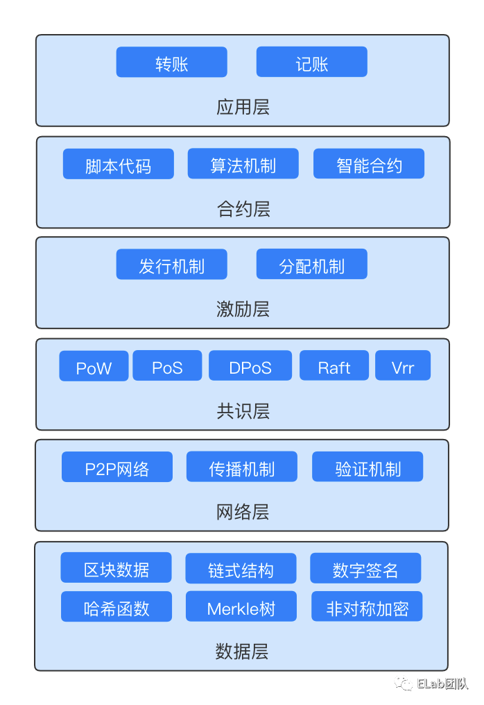
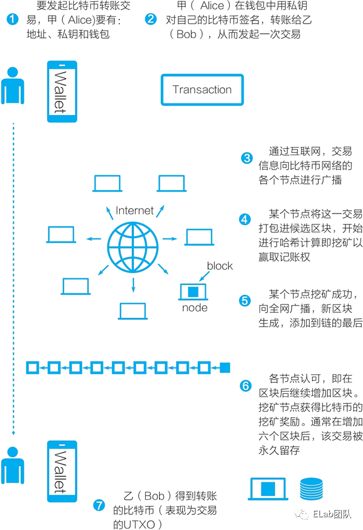
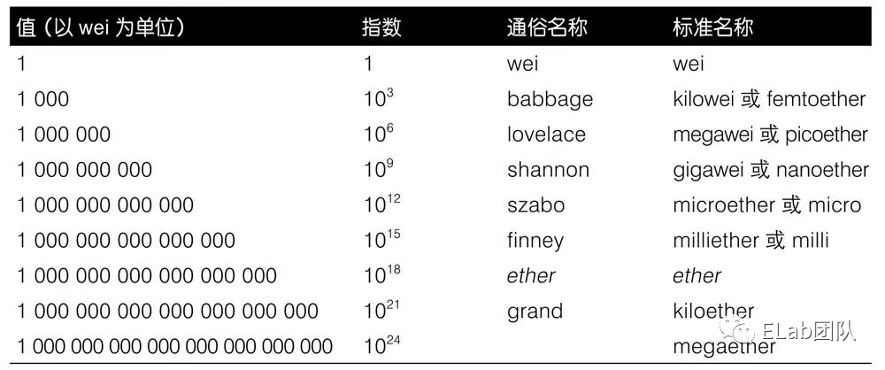
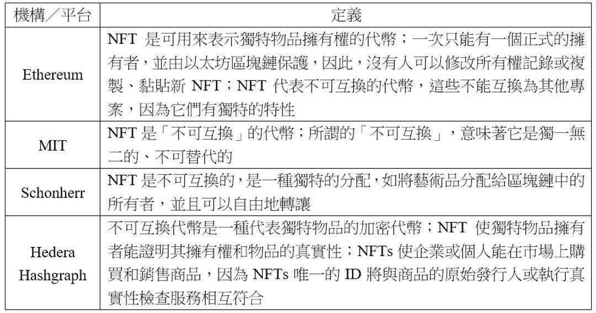

# 區塊鏈學習筆記

## 教學

* [區塊鏈技術指南](https://poweichen.gitbook.io/blockchain-guide-zh/)

## 基本概念

### 挖礦

挖礦是拿個鏟子去挖泥，找出裡面的礦物，也就是有價值的部分。挖礦所得的回報，對社會來說是全新創造的，本來並不存在，是從無到有的過程；礦工能賺錢，是因為提供了新的資源，產生了新的價值。

相對於挖礦創造出全新的價值，提供商品和服務則是增值的過程。無論是把貨品送到府上，優良的設計，還是貼心的服務，都是建基於現有的產品或服務提供額外的價值。

#### 工作證明（Proof of Work，PoW）

比特幣挖礦就是幫助社群用算力記帳。因為在比特幣區塊鏈，伴隨著每個新區塊都會產生出全新的、生態中本來並不存在的比特幣回報礦工。幫助社群記帳這行為是為區塊鏈提供的公共服務，因此挖礦回報不是個別任何人為獲得的服務埋單，而是整個群體的所有人為新產生的價值埋單。

中本聰的比特幣記賬設計，是讓礦工破解一條只能透過不斷試錯，很花時間和算力的數學題。試錯就像挖沙子，成功解開數學題就是在沙子中找到礦物，過程中所消耗的時間、電力和算力就是礦工的工作，因此這個機制稱為「工作證明」（Proof of Work，PoW）。

每當有一個區塊被「挖出」，系統會新鑄造一定數量的比特幣，獎勵第一個找出答案，又得到其他人確認答案正確的礦工。整個過程跟物理挖礦非常相似，礦工除了付出勞力，還需要帶點運氣才能挖到礦產，不過關鍵還是勞力。運氣的數學名稱不過就是「機率」，長線而言自然會扯平，在勞力達到一定水平的前提下，礦工的回報理應接近。

#### 權益證明（Proof of Stake，PoS）

比特幣的發明，無疑是人類儲存和交換價值的一大突破。然而作為第一代可用的分散式帳本，也有著交易時間長、容量低、大量耗電等各種缺點。

因此新一代的區塊鏈一般都使用改良的挖礦機制，其中最主流的是權益證明（Proof of Stake，PoS），第二大區塊鏈以太坊也正從工作證明過渡往權益證明。

權益證明，用淺白但非常粗疏的說法，就是用錢投票。解釋清楚一點，是所有負責記賬的礦工，需要押進一定數量的幣，如果賬目跟大部分人不同，會被視為不正確；無論是蓄意作弊，還是技術故障，輕則得不到報酬，重則被扣除押下的權益，以此驅使所有人正確記帳，又或者反過來說，防範有人出錯或作弊。

從勞力到算力，現在又到財力，類比開始扯遠，因此業界通常不把為權益證明區塊鏈記賬的人稱為礦工，而會稱為驗證人（validator），或者更中性地稱為節點（node）；而相關行為也不一定稱為挖礦。

#### X-to-earn

除了 PoW 和 PoS，透過做 X 而獲得對應的通證這個邏輯，還有很多不同的演繹，幾年下來，這種做法已經很少稱為「挖礦」了，改成近期流行使用的 X-to-earn。比如 STEPN 的 move-to-earn，用戶走路和跑步可賺取通證；Axie Infinity 等眾多遊戲的 play-to-earn 等。套用這個邏輯，LikeCoin，就是 write-to-earn。

跟工作證明及權益證明不同，X-to-earn 的 X 並非協助記帳。另外，相對於前者每產生一個區塊均會生成新的通證給礦工，X-to-earn 模式向提供價值的使用者所發的通證，一般是預先鑄造（pre-mint），託管在項目方的錢包。基於這個區別，業界漸漸使用挖礦以外的另一個說法，也確實有助說明概念。

### 空投

區塊鏈產業中，空投多數為一次性，出發點一般是推廣及獎勵早期參與者，而 X-to-earn 則通常是個持續的核心設計。另外，相對於 X-to-earn 模式中的「明碼實價」，空投的條件一般不會提前公開，反而會在毫無先兆的情況下宣布，並以過往的鏈上行為作空投條件的判斷；很多時，連有空投這回事都不在用戶的預期，甚至不在項目方本身的預期，而是發展到某一點才想到的部署。

就空投的出發點而言，用戶不知就裡是個優點，因為空投是為了獎勵早期參與者，越是對空投及相關條件沒有預期，用戶的行為越大機會出於真心。不過，當空投的手法被不同項目反覆使用，偶爾有些額度還非常高，就出現了越來越多「空投獵人」，預估某些潛力項目日後會空投，投機參與這些項目，並因此作出五花八門的鏈上參與，從執行一個簡單交易到社群治理都有。

空投獵人本來無可厚非，不過也讓空投的驚喜感與威力大大降低，用戶得到空投變得理所當然之餘，項目方也再難以分清真心假意，透過「忽然空投」獎勵真心的早期用戶這一招，已經開到荼蘼。

儘管如此，只要避免太過抱著投機的心態，或者不切實際，忽然會獲得一大筆空投的期望，慎選新項目，學習、試用、參與或以其他各種方法支持，持之以恆，總能得到意外驚喜。

## 區塊鏈架構

區塊鏈是一個去中心化的分佈式賬本，可以在數字世界中進行價值的表示和轉移。區塊鏈的架構自下而上分為六層，分別是數據層、網絡層、共識層、激勵層、合約層和應用層。

### 數據層

區塊鏈是通過區塊（block）存儲數據，每個數據節點之間都包含所有數據，即分佈式賬本。每個區塊都包括了區塊的大小、區塊頭、區塊所包含的交易數量及部分或所有的近期新交易。數據層主要是解決這些數據以什麼樣的形式組合在一起，形成一個有意義的區塊。

區塊鏈的數據結構中包括兩種哈希指針，它們均是不可篡改特性的數據結構基礎。

* 一個是形成“區塊+鏈”（block+chain）的鏈狀數據結構
* 另一個是哈希指針形成的梅克爾樹。鏈狀數據結構使得對某一區塊內的數據的修改很容易被發現 (對其中的任何交易數據的修改很容易被發現)。

參考資訊：

* [查看比特幣的區塊鏈交易數據](https://www.blockchain.com/explorer)
* [查看以太坊的區塊鏈交易數據](https://cn.etherscan.com/)

### 網絡層

區塊鏈使用的是去中心化的網絡架構，沒有中心化服務器，依靠用戶點對點交換信息，主要包括 P2P 組網機制、數據傳播和驗證機制。

正是由於節點的 P2P 特性，數據傳輸是分散在各個節點之間進行的，部分節點或網絡遭到破壞對其他部分影響很小。

節點指的是區塊鏈客戶端（比如比特幣客戶端、以太坊客戶端）。

一般分為：

* 全節點
    * 包含了所有區塊鏈的區塊數據
* 輕節點
    * 僅包括與自己相關的數據。

### 共識層

共識層的功能是讓高度分散的節點在 P2P 網絡中，針對區塊數據的有效性達成共識，決定了誰可以將新的區塊添加到主鏈中（挖礦機制）。

工作量證明共識機制（PoW），礦工需要將網絡中未確認的交易按梅克爾樹組裝成候選區塊，在候選區塊的頭部有一個 32 位的隨機數區域，礦工需要反復調整隨機數並計算，目標是讓整個區塊的哈希值小於一個“目標值”，誰先完成這個目標誰就有權力將交易記錄到區塊鏈分佈式賬本中並獲得一定的獎勵。

挖礦的過程比拚的就是各個礦工節點的算力，可以變相認為誰的算力高誰的工作量就高，就有權力記賬和獲得獎勵。比特幣使用的是 PoW 機制；以太坊開始使用的是 PoW 機制，後來改成了 PoS 機制，原因是該機制交易速度更快、資源消耗更低。

這種挖礦計算是非對稱的，挖礦可能需要經過許多次哈希計算，而要驗證的確找到有效的隨機數，只需要一次計算就可以，因此其他節點能夠很快驗證交易是否已經被記入賬本。

### 激勵層

激勵層的功能主要是提供一些激勵措施，鼓勵節點參與記賬，保證整個網絡的安全運行。通過共識機制勝出取得記賬權的節點能獲得一定的獎勵。

目前比特幣的激勵措施是新區塊產生時系統會獎勵礦工一定的比特幣（系統產生的新比特幣，也會記錄在分佈式賬本，來源地址是 0，因此整個過程叫挖礦），獎勵最初是 50 個比特幣，每四年減半一次，分別為 25 個、12.5 個，以此類推。當比特幣數量達到 2100 萬枚的上限後（2140 年），激勵就全靠交易的手續費了。以太坊交易是靠 gas 手續費來激勵礦工。

### 合約層

合約層封裝了各類腳本、算法和智能合約，使得區塊鏈具有可編程能力。

* 比特幣的腳本中規定了比特幣的交易方式和過程中的種種細節，不過這種腳本使用不夠便捷且不是圖靈完備的。
* 以太坊提出了智能合約的解決方案，提供了一種圖靈完備的高級編程語言來編寫智能合約，並使智能合約能夠運行在分佈式的以太坊虛擬機 EVM 上。

智能合約就是存儲在區塊鏈上的一段代碼，它們可以被區塊鏈上的交易所觸發，觸發後，這段代碼可以從區塊鏈上讀取數據或者向區塊鏈上寫入數據。區塊鏈系統（比特幣、以太坊）可以認為是一個分佈式狀態機，通過交易觸發合約（腳本、智能合約）運行來改變狀態機的狀態。

### 應用層

應用層封裝了區塊鏈的各種應用場景

## 比特幣

### 轉帳過程

以下為一筆比特幣轉賬交易的過程：

## 以太坊

### 以太坊帳戶

以太坊賬戶分為外部賬戶和合約賬戶。

* 外部賬戶
    * 是擁有私鑰的賬戶，擁有私鑰意味著控制對以太幣或合約的訪問。
* 合約賬戶
    * 具有地址但是沒有私鑰，合約賬戶具有智能合約代碼，而外部賬戶不具有。智能合約代碼是在合約賬戶創建時由以太坊區塊鏈記錄的軟件程序，由 EVM 執行。

### 以太坊錢包

錢包是用來管理以太坊賬戶的軟件應用程序 ，它控制對以太幣的訪問、管理私鑰和地址、跟蹤賬戶的余額、創建並簽名交易。可以說以太坊錢包是通往以太坊世界的大門。一個針對以太坊錢包的常見誤解是認為錢包中包含以太幣或者代幣。但其實錢包中只保存了密鑰，以太幣和其他各種代幣都保存在以太坊區塊鏈上。

當創建一個以太坊外部賬戶的時候，會用非對稱加密算法生成一對公鑰與私鑰，並保存在錢包裡，而地址是公鑰的哈希值。

交易的簽名和驗證過程如下（橢圓曲線數字簽名算法）：

    Sig=Fsig(Fkeccak256(m) , k)

其中：

* k 是用於簽名的私鑰
* m 是經過 RLP 編碼的交易數據包
* Fkeccak256 是 Keccak-256 哈希函數
* Fsig 是簽名算法
* Sig 是輸出的數字簽名

函數 Fsig 生成了一個簽名，這個簽名包含兩部分內容，通常稱為 r 和 s：Sig=(r, s)

簽名驗證算法的輸入包括交易數據包（其實是交易的哈希值的一部分）、簽名方的公鑰和簽名（r 和 s 值），如果針對消息和公鑰的簽名驗證成功，算法會返回 true。

### 以太幣和 gas

以太坊的貨幣單位稱為 ether，也常使用 ETH 表示，例如 1 ether 或者 1 ETH。以太幣可以被拆分成更小的單元，最小單元稱為 wei，1 ether = 10^18 wei。

以太幣的面額和單位名稱如下所示：

以太坊交易過程使用的是 gas 來支付手續費。gas 並不是以太幣，它是一種獨立的虛擬貨幣，跟以太幣之間存在匯率關系。gas 獨立於以太幣，是為了在以太幣價格大幅度波動的情況下，仍舊保護系統的靈活性，保證 gas 的價值相對穩定。

gas 的另一個作用是控制交易對資源的使用。交易數據會包含：

* gasPrice
    * 交易發起方願意支付的 gas 價格
* gasLimit
    * 交易發起方願意為這個交易支付的最大 gas 數量

而每一條智能合約代碼語句的運行都會消耗對應的 gas，當運行過程中累計的 gas 消耗超過了 gasLimit，合約就會終止執行，交易失敗。

失敗的交易仍舊會被作為一次失敗的嘗試而記錄在案，執行所花費的 gas 將從發起賬戶中被扣除，除此之外，它不會對合約或者賬戶狀態產生任何其他影響。

### 客戶端 Geth

Geth 是官方提供的 go 語言實現的以太坊客戶端。客戶端可以以全功能節點的方式運行，也可以以遠程調用的方式運行。全功能節點會下載全部的區塊數據，對系統的網絡和存儲有較高的要求。

從遠程調用以太坊的客戶端不在本地保存區塊鏈數據，也不參與區塊和交易驗證，這樣的客戶端提供錢包功能，也可以創建並廣播交易。以太坊客戶端會對外提供 API（例如 web3.js API、JSON-RPC API）來訪問以太坊網絡。

### 智能合約

智能合約是運行在以太坊的虛擬機上的計算機程序，一旦部署之後，智能合約的代碼就不能被更改，但是可以刪除。把合約注冊到區塊鏈上需要通過一個特殊的交易，這個交易的目標地址是 0x0000000000000000000000000000000000000000，也被稱為零地址。

當交易目標是合約地址時，它會導致該合約在 EVM 中運行，使用交易和交易的數據作為其輸入。由於合約賬戶沒有私鑰，因此無法啟動交易。只有外部賬戶才能啟動交易，但合約可以通過調用其他合約，構建復雜的執行路徑來對交易做出反應。智能合約永遠不會“自動運行”，或者“在後台運行”。

常用的以太坊智能合約編程語言為 solidity。

### token/代幣/通證

token、代幣、通證指的都是同一種東西。區塊鏈上的代幣是指基於區塊鏈的一種抽象資產，可以被持有並且用來代表資產、現金或訪問權限。

代幣與以太幣不同，因為以太坊協議本身跟代幣完全沒有任何關聯。發送以太幣是以太坊平台的內在動作，但發送或擁有代幣並不是以太坊協議中定義的內容。以太坊賬戶的以太幣余額在協議級別處理，而以太坊賬戶的代幣余額在智能合約級別處理。要在以太坊上創建新代幣，你必須創建一個新的智能合約。部署後，智能合約將處理所有內容，包括所有權，轉移和訪問權限。

代幣有可替代性代幣和不可替代性代幣，標准分別是ERC20[3]和ERC721[4]，目前市面上比較火爆的 NFT 就是一種不可替代性代幣。

## 應用

### Web 3.0

Web 3.0 的概念是由以太坊聯合創始人、 Polkadot 創造者 Gavin Wood 在 2014 年提出的，代表了下一代的去中心化互聯網，並賦予了個體價值。Web 3.0 關注的是通過區塊鏈等去中心化技術形成的“誰創造，誰擁有”的關系價值。

Web1.0 時代，網頁是「只讀的」，用戶只能搜索信息，瀏覽信息，無法參與創作。比如早期人們在互聯網上瀏覽新浪網站、搜狐網站的資訊等，只是在資訊下留言、評論、互動。Web2.0 時代，網站是「可寫可讀的」，即用戶不僅僅是內容的接收方，還可以參與創作內容，比如發短視頻、發微博、寫大眾點評等。

這兩個時代，都是中心化的形式，與用戶有關的所有數字資產，都從屬於某一家巨頭公司，用戶在平台上生產的內容，不屬於用戶；用戶在不同平台上的數據，也不能跨平台使用。比如，用戶在淘寶上的行為數據，微信並不能獲得並使用，抖音上的視頻內容，也不能直接轉到微信上等。

而在近期流傳的 Web3.0 時代概念裡，一切內容是「可讀可寫可持有的」。這是一種去中心化的模式，每個用戶都能掌握自己的數字資產和數據，主導權不在互聯網巨頭手中，而在用戶手中。

在 Web 3.0 時代，用戶到淘寶購物，它可以憑借用戶過往的行為數據，推薦用戶可能感興趣的商品。未來，平台想推薦商品，必須獲得用戶的授權，即數據的使用權掌握在用戶手裡，這是 Web3.0 基本的邏輯。

用戶可以暢游在 Web3.0 的世界，不用受巨頭生態隔離的限制。用戶數據隱私，將通過加密算法和分佈式存儲等技術手段獲得保護；用戶主導內容的誕生，並且還能直接獲得數據、內容帶給他們的價值。
 
Web3.0 就是構建在區塊鏈基礎上的，去中心化的一種新互聯網應用形態，背後是生產關系的創新。這其中，有兩個板塊必不可少，一個是區塊鏈技術，一個是 Crypto，即基於區塊鏈技術的加密貨幣。
 
區塊鏈是構建 Web3.0 的基礎，也是實現“可持有”的技術支撐。我們可以簡單將區塊鏈理解為一個共享的賬本，能儲存數據、交換價值，記錄交易活動，而且不受任何中心化的實體控制。總之，它為 Web3.0 提供了安全的執行層，使用戶可以在這裡創建、發行、交易加密資產。

而加密貨幣，可以理解為 Web3.0 裡的原生貨幣，和法定貨幣不同，僅用於支付 Web3.0 服務並參與 Web3.0 的治理。
 
必須提及的是，由於加密貨幣的介入，讓人對 Web3.0 的發展打上問號，也有媒體解讀，Web3.0 “非幣化”在國內才有落地機會，一位行業人士解釋，就像“只要區塊鏈技術，但不要後面的 Crypto”。

一位在美國硅谷從事區塊鏈項目創業的技術人士對深燃介紹，在美國，區塊鏈項目的展開邏輯是自下而上的，往往是出現一個創業公司，技術人員拿到投資後做出自己的鏈，就可以 ICO（籌措資金）套現，再用套現的現金付錢給開發者們，讓他們在這個鏈上做一些產品，聯合形成一個生態。
 
而在中國，更像是自上而下的邏輯，由政府主導，目前已經成熟應用到車道罰款、信息登記等政府類的項目裡，是在產業上佈局，而不是消費佈局，主要涉及的領域有農業、工業、碳交易、政務等。一些項目也在與騰訊、阿裡這類大廠合作。

不論哪種模式，整體來說，在 Web3.0 時代，用戶的時間、內容創造以及勞動投入，都會通過區塊鏈技術形成數字資產，交付到用戶手上。

以太坊官網對 Web 3.0 主要特點的總結如下：

* Web3 is decentralized
    * instead of large swathes of the internet controlled and owned by centralized entities, ownership gets distributed amongst its builders and users.
* Web3 is permissionless
    * everyone has equal access to participate in Web3, and no one gets excluded.
* Web3 has native payments
    * it uses cryptocurrency for spending and sending money online instead of relying on the outdated infrastructure of banks and payment processors.
* Web3 is trustless
    * it operates using incentives and economic mechanisms instead of relying on trusted third-parties.

#### Web 2.0 與 Web 3.0 開發範式對比

Web 2.0 開發範式：

* 需要開發登錄、注冊功能，讓用戶綁定郵箱、綁定手機，需要搭建數據庫來存儲用戶注冊信息以及用戶交互數據
* 使用前端代碼語言(JavaScript, HTML, CSS)來開發頁面邏輯，需要搭建一個服務器來部署前端頁面
* 使用後端代碼語言（像 Node.js, Java, Go 等）來開發業務邏輯，並需要搭建一個服務器來部署後端服務，並需要運維服務
* 所有代碼、數據都部署在中心化的服務器上，所有控制權歸開發者

Web 3.0 開發範式：

* 不需要用戶綁定郵箱，綁定手機，可以直接通過錢包登錄，也不需要存儲用戶信息
* 可以不需要搭建前端服務器，用戶可通過 IPFS 或 arweave 存儲前端頁面，並進行訪問
* 不需要搭建後端服務器，後端邏輯是用智能合約編寫的，運行在 EVM 上的
* 不需要搭建數據庫，歷史數據與數據庫操作通過 TheGraph 來實現

#### Web 3.0 開發教學

* [Web3.0 開發入門](https://mp.weixin.qq.com/s/9QxH0HKg72AVYw0cCXj0eA)

#### 市場和資本

大家對Web3.0 的佈局可以分為三大類。

* 礦圈
    * 挖礦，指通過類似電腦推演算法來獲取加密貨幣的過程，“礦”源自對采礦的比喻，礦圈即專注於挖礦的礦工圈子，大家投資的大多是礦機、礦池、挖礦組織。“礦工是最原始的，也是最有影響力、最有錢的陣營，會有人投資，不過不是主流 VC 關注的主力部分。
* 鏈圈
    * 鏈圈可以理解為專注於區塊鏈技術的研發、應用的圈子。投資的項目即為 Web3.0 提供技術相關的支持，如跨鏈橋、智能合約開發等，是主流投資人在關注的領域。
* 幣圈
    * 即 Defi，去中心化金融，是指投資依託於區塊鏈技術研發出來的加密貨幣項目。去中心化金融錨定的資產，還是主要在 Web3.0 裡，但根據現在的發展來看，有機會逐漸錨定更多實體資產。不過這極容易與炒幣掛鉤，需要排除一些割韭菜的項目。

### 非同質化代幣 （Non-fungible tokens，NFT）

最早可回溯至2015年以太坊（Ethereum），也就是去中心化的交易平台，最初推出時所提出的新概念，至此奠定NFT基礎。

在此之後，被公認為全球加密藝術品的起源推動者——CryptoPunks也以以太坊為基礎，隨機生成數個各有不同外表的角色，此一特性，類似NFT的非同質化，在公開的以太坊區塊鏈存儲合約裡，列出每件作品的正式所有權（只有一位用戶能正式擁有唯一的CryptoPunk）也被視為NFT所開展出來的商業模式。

除了CryptoPunks之外，CryptoKitties也提出NFT第一個主流化項目，允許用戶繁殖虛擬小貓，而每隻小貓都帶有不同特徵，小貓就是可交易的NFT，開發團隊也推出荷蘭拍賣合約，並且成為NFT主要價格發現機制。2018年初，NFT也進入了建設階段，此時數位藝術被證明適合使用非同質化貨幣，並且產生許多數碼藝術平台，供藝術家、投資者發布和發現數位藝術的空間。

#### 定義

NFT 最為核心的定義為－區塊鏈的「數位分類賬上的數據單元」，若進一步擴展到應用層面的定義，狹義上，NFT被認知為是具有「不可互換特性的加密貨幣」，廣義上，則可以被認知為是可以用來表示獨特物品「擁有權的代幣」。於不同應用，也可能產生定義交錯的情況。

* 發展核心其實都建立在收藏的情境中，每個 NFT 總會提到越獨特、稀有的物品會越珍貴，越能激起買家的收藏心理，讓買家產生收藏心理。
* 買賣交易，NFT 的發展可說是建立在作者和投資者的買賣交易上，沒有進行交易則無法體現此物品的價值。

#### NFT 應用

NFT交易平台上數位藝術品的買賣

* 應用情境
    * 將作品數位化後，放置在適合的 NFT 交易平台買賣，買賣前需取得NFT交易平台的帳號，將帳號與個人加密錢包連結，完成後才可將數位化作品鑄造（mint）成 NFT，並正式開始販售，買家則可在平台上購買作品。
* 商業模式
    * 鑄造過程之中，創作者需要支付將NFT放到區塊鏈上的「手續費」（礦工費），依交易平台的不同，有些可由賣家先設定交易底價；至於買家，在多數交易平台，需利用出價的方式來購買NFT，但有些 NFT 會以固定售價的方式交易。
    * 買家購買後，虛擬交易貨幣就會進入到買家對應的加密錢包，而買家當在購買時也需負擔手續費；購買後買家可獲得此作品交易的智能合約所形成之數位資產的所有權，但作者仍擁有作品的著作權，且買家通常不會擁有作品的所有權，未來若作品升值，NFT持有者便可藉轉賣來獲利

## 參考文章

* [NFT的底層概念是什麼？除了很貴的網路圖片，還有哪些應用與創新玩法？](https://www.thenewslens.com/article/162801/fullpage)
* [挖礦：本來無一物，勞動力結晶](https://ckxpress.com/mining/)
* [Web3.0 開發入門](https://mp.weixin.qq.com/s/9QxH0HKg72AVYw0cCXj0eA)
* [Web3.0 撕裂資本圈](https://mp.weixin.qq.com/s/iGUKthMUnFvITtrM7uG1Xw)
