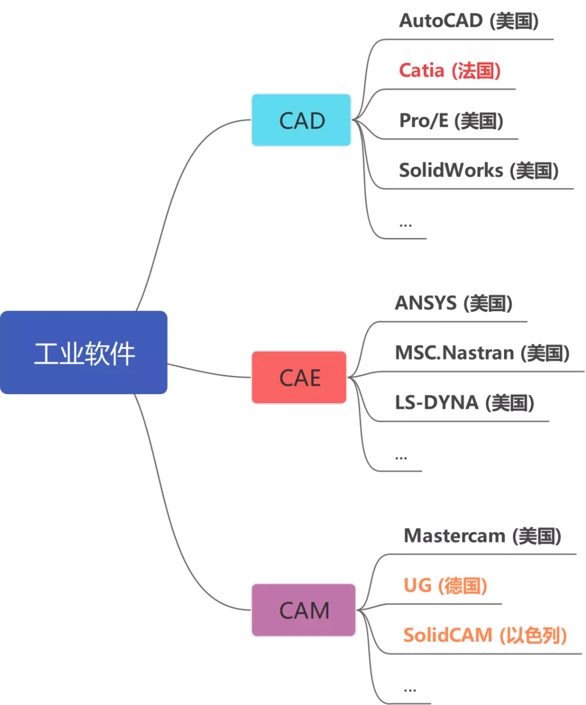

# 雜項

## regex

已整理為文章： https://marco79423.net/articles/%E6%B7%BA%E8%AB%87-regex-%E5%8F%8A%E5%85%B6%E6%87%89%E7%94%A8/

## 工業軟件

工業類軟件按照功能可分為三大類，CAD（計算機輔助設計）、CAE（計算機輔助工程）、CAM（計算機輔助製造），這三款軟件是如今工業行業必不可少的軟件，航空、船舶、汽車等產品的研發少不了它。而目前企業常用的這三大類軟件，基本上都被美、法、德三國所壟斷，尤其是在CAE領域，美國更是霸主般的存在



### CAD（計算機輔助設計）

* CAD軟件就是讓設計師能夠在電腦上畫圖的軟件，可以說，CAD軟件的出現徹底解放了設計師們手中的作圖工具，以往通過手工繪制的圖紙可以放在電腦上來完成。

### CAE（計算機輔助工程）

* CAE全程叫Computer Aided Engineering (計算機輔助工程)，就是把設計出來的產品，通過軟件的方法進行仿真分析，來驗證設計出來的產品是否達到規定的要求
* 單論代碼數量，世界上最大的軟件公司是美國的軍火商巨頭——洛克希德·馬丁，他們做的軟件大部分僅供自己使用，不對外銷售，其中就包括CAE軟件
* CAE軟件是工業軟件裡面開發難度最大的一類軟件，但也是最重要的一款軟件。
* CAE自誕生之日起，與CAD軟件一樣，主要服務於軍方，後來才逐步走向商業化
* 設計師們把產品在電腦上設計出來後，只要導入這款軟件，就能知道產品設計哪裡有不合理的地方，然後再更改設計圖紙，這是不是就像魔法一樣？這節約了多少後期試驗的成本。而且，在有些領域，你必須使用CAE軟件進行仿真分析，例如航空航天領域，這都是關乎每一位乘客人身安全的領域，必須經過軟件的驗證
* CAE軟件應用的領域涉及到航空、航天、電子等諸多高科技領域，可以說，工業軟件已經滲透進了中高端製造的各個領域。

### CAM（計算機輔助製造）

* 那麼汽車的零部件需要工業母機——機床來完成。
* 在數控機床加工零部件前有一個重要的工序，就是需要在計算機上實現模擬加工仿真，待准確無誤後，才能上機生產
* CAM軟件模擬仿真會根據你的程序准確計算出整個零件的加工過程，生成機床走刀路線，不僅可以檢查加工過程中是否有撞刀的危險，而且還可以檢查程序是否有過切或者欠切的現象。

### 難點

* 開發工業軟件是一門交叉學科
    * 工業級軟件需要掌握最基本的編程能力，更重要的是對多學科的交叉融合
    * 工業軟件是以數學為基礎，貫穿了物理、化學、力學、材料科學等諸多領域的交叉學科
* 先來者有肉吃，後來者連湯都喝不到
    * 工業軟件不同於應用級軟件，它要有足夠的健壯性與工程性，它要求絲毫不能差錯，一旦哪個環節出現問題，造成損失就難以估量，但是軟件一定會有bug，要想消除這些bug，必須經過大量的的用戶來充當“小白鼠”進行使用反饋測試，可如果一款軟件本身用戶量就很少，軟件廠商怎麼能獲得用戶回饋從而修復漏洞呢，所以，這就造成一個“強者愈強，弱者愈弱”的現象。


## Base64

* Base64 是一種基於 64 個可列印字元來表示二進位資料的表示方法。
* 每 6 個位元(Bit) 對應某個可列印字元，所以 3 個位元組(Bytes) 會對應 4 個 Base64 的顯示字元
* Base64 的可列印字元包括字母 A-Z、a-z、數字0-9，共 62 個字元 (26 + 26 + 10)，另外兩個可列印符號在不同的系統中而不同。
    * 一些如 uuencode 的其他編碼方法，和之後 BinHex 的版本使用不同的 64 字元集來代表 6 個二進位數字，但是不被稱為Base64。
* Base64常用於在通常處理文字資料的場合，表示、傳輸、儲存一些二進位資料，包括MIME的電子郵件及XML的一些複雜資料。
* 編碼從 000000 到 111111 依序是 `大寫 ABC` 到 `小寫 abc` 到 `數字 0-9` ，最後再加上 `+`, `-`。
* 如果要編碼的位元組數不能被 3 整除，最後會多出 1 個或 2 個位元組，那麼可以使用下面的方法進行處理：
    1. 先使用 0 位元組值在末尾補足，使其能夠被 3 整除，然後再進行Base64的編碼。
    2. 接著在編碼後的 Base64 文字後加上一個或兩個 `=` 號，代表補足的位元組數。
* 簡單來說就是缺幾位補幾個 0，然後補幾個 0 後面就要再加幾個 `=`
* 應用
    * MIME
        * 使用的字元包括大小寫拉丁字母各26個、數字10個、加號+和斜槓/，共64個字元，等號=用來作為字尾用途。
    * URL
        * 標準的Base64並不適合直接放在URL裡傳輸，因為URL編碼器會把標準Base64中的 `/` 和 `+` 字元變為形如 `%XX` 的形式，而這些 `%` 號在存入資料庫時還需要再進行轉換，因為 ANSI SQL 中已將 `%` 號用作萬用字元。為解決此問題，可採用一種用於URL的改進Base64編碼，它不在末尾填充 `=` 號，並將標準Base64中的 `+` 和 `/` 分別改成了`-`和 `_`，這樣就免去了在URL編解碼和資料庫儲存時所要做的轉換，避免了編碼資訊長度在此過程中的增加，並統一了資料庫、表單等處物件識別碼的格式。
* 在 JavaScript 中，有兩個函數被分別用來處理解碼和編碼 base64 字符串： `atob` 和 `btoa`。
    * 在多數瀏覽器中，使用 btoa() 對 Unicode 字符串進行編碼都會觸發 InvalidCharacterError 異常。
        * 一種選擇是轉義任何擴展字符，以便實際編碼的字符串是原始字符的 ASCII 表示形式。考慮這個例子，代碼來自 Johan Sundström：
            ```js
            // ucs-2 string to base64 encoded ascii
            function utoa(str) {
                return window.btoa(unescape(encodeURIComponent(str)));
            }
            // base64 encoded ascii to ucs-2 string
            function atou(str) {
                return decodeURIComponent(escape(window.atob(str)));
            }
            // Usage:
            utoa('✓ à la mode'); // 4pyTIMOgIGxhIG1vZGU=
            atou('4pyTIMOgIGxhIG1vZGU='); // "✓ à la mode"

            utoa('I \u2661 Unicode!'); // SSDimaEgVW5pY29kZSE=
            atou('SSDimaEgVW5pY29kZSE='); // "I ♡ Unicode!"
            ```
        * 更好、更可靠、性能更優異的解決方案是使用類型化數組進行轉換。
* Base64 格式的字符串或文件的尺寸約是原始尺寸的 133%（增加了大約 33%）。如果編碼的數據很少，增加的比例可能會更高。例如：字符串"a"的 length === 1 進行 Base64 編碼後是"YQ=="的length === 4，尺寸增加了 300%。
* 參考實作
    * https://github.com/MaxArt2501/base64-js
    * https://github.com/waitingsong/base64
    * https://github.com/beatgammit/base64-js

## 時間

科學上有兩種時間計量系統：

* 一種是基於地球自轉為基礎的世界時（簡稱 UT）
* 另一種是以原子振盪週期確定的原子時（簡稱 TAI）

原子時的時間尺度更為均勻，而世界時由於地球自轉速度不均勻，兩者之間會存在差異。當兩者之間的差異超過 0.9 秒時，國際地球自轉服務組織（IERS）就會負責將世界標準時間調快或撥慢一秒，這就是閏秒。

自 1972 年以來，全球各計時機構已經在國際原子時（TAI）標準時鐘上新增過 27 次閏秒。而具體方法並不是直接把午夜 23：59：59 直接計作 0：0：0，而是額外增加一個 23：59：60。

因為地球的自轉速度不規則地變化，所以閏秒的間隔也是不規則的。而從長遠來看，地球的自轉是相當不可預測的，這解釋了為什麼閏秒只提前六個月宣佈。

目前，我們只新增了正閏秒。在早期，就是通過簡單粗暴地增加一秒來完成的，從而產生一個不尋常的時間戳：23:59:59 -> 23:59:60 -> 00:00:00

但隨著地球自轉模式的變化，我們很可能在未來的某個時刻出現負閏秒。時間戳將如下所示：23:59:58 -> 00:00:00

正閏秒的跳躍會讓程式當掉或導致資料損壞；而更重要的是我們還從未大規模測試過負閏秒的破壞性影響。無論如何，對於管理硬體基礎設施的人來說，每一個閏秒都是痛苦的來源。

閏秒於 1972 年被引入，迄今為止已經增加了 27 個正閏秒。每一次增加閏秒，都會在整個軟體行業中引發問題。畢竟無數計算裝置需要依靠精確的計算伺服器網路，才能有序安排事件、記錄活動先後，比如向資料庫內新增資料條目，如果處理不好就會出現腦裂或其他問題。

閏秒的變化曾在 2012 年引發 Reddit 論壇的大規模中斷，同時給 Mozilla、LinkedIn、Yelp 以及船家預訂服務商 Amadeus 造成了不小的麻煩。

雖然瞭解了閏秒的影響，但 bug 並沒有因此而消失。最近一次閏秒是在 2017 年，網路基礎設施服務商 Cloudflare 還是因閏秒導致一部分客戶伺服器當機。當時 Cloudflare 軟體比較了兩種時間，並行現時間似乎在“倒退”，於是因無法處理這自相矛盾的結果而陷入崩潰。

為瞭解決電腦時鐘處理不了一分鐘 61 秒的難題，Google率先提出了“閏秒涂片”的辦法，通過調整內部的網路時間協議 (NTP) 伺服器，把閏秒拆分成許多微小的步長變化、分攤到一整天當中。Meta 也採用了類似方法，一個閏秒要花 17 個小時來“抹平”

不同系統的調整方法沒有一個統一標準，小網站則更多依賴公共時間伺服器，直接停 1 秒或者跳 1 秒，不會把時間切分成時間片；Google大廠的這些方法，在調整過程中如果有突發事件，比如某些伺服器宕掉了，還是會存在問題。

只要下一個閏秒還會出現，網際網路企業們就還得繼續面臨閏秒帶來的影響，花費額外精力去消除它，閏秒的那一秒也就成了“伺服器不能承受之重”。

## 參考文章

* [这才是中国被卡脖子最严重的软件！](https://mp.weixin.qq.com/s/u7jBite9x3RFFn7q7ICHTQ)
* [Base64 - 維基百科，自由的百科全書](https://zh.wikipedia.org/zh-tw/Base64)
* [Base64 的編碼與解碼 - 術語表 | MDN](https://developer.mozilla.org/zh-CN/docs/Glossary/Base64)
* [讓大廠抓狂的“額外一秒”：Google、微軟、Meta 和亞馬遜紛紛提議放棄](https://mp.weixin.qq.com/s/qMRjBa7vwneP7ErGmhzekw)
