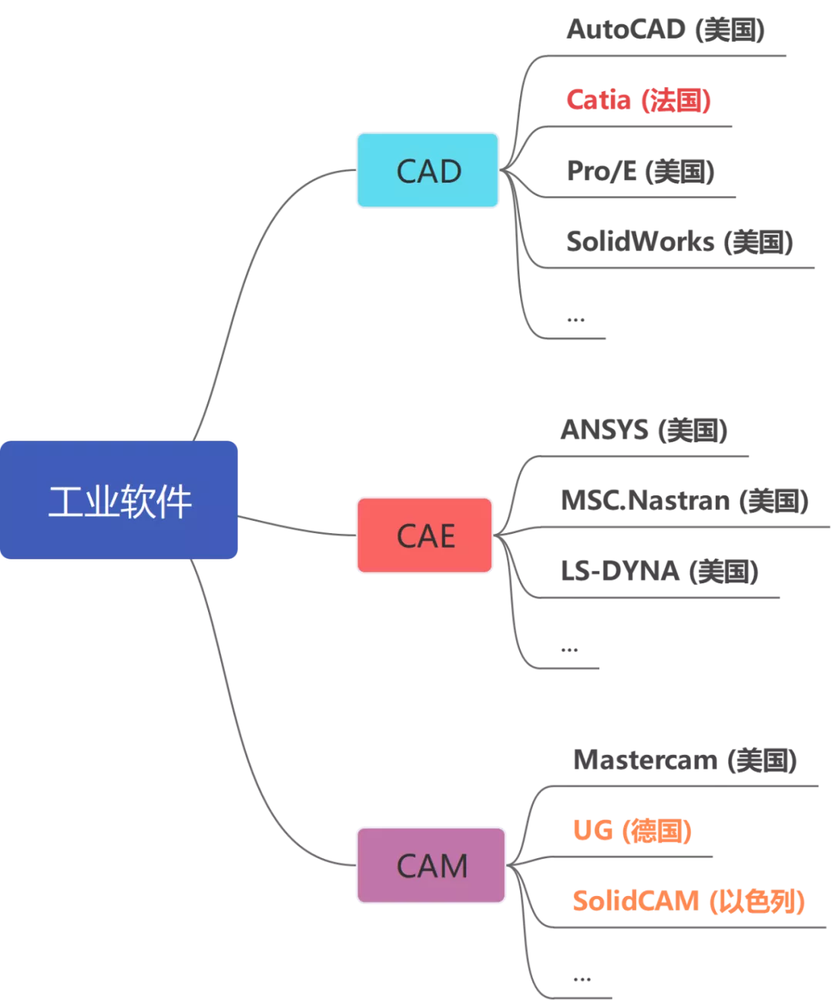

# 雜項

## 工業軟件

工業類軟件按照功能可分為三大類，CAD（計算機輔助設計）、CAE（計算機輔助工程）、CAM（計算機輔助製造），這三款軟件是如今工業行業必不可少的軟件，航空、船舶、汽車等產品的研發少不了它。而目前企業常用的這三大類軟件，基本上都被美、法、德三國所壟斷，尤其是在CAE領域，美國更是霸主般的存在

### CAD（計算機輔助設計）

* CAD軟件就是讓設計師能夠在電腦上畫圖的軟件，可以說，CAD軟件的出現徹底解放了設計師們手中的作圖工具，以往通過手工繪制的圖紙可以放在電腦上來完成。

### CAE（計算機輔助工程）
   
* CAE全程叫Computer Aided Engineering (計算機輔助工程)，就是把設計出來的產品，通過軟件的方法進行仿真分析，來驗證設計出來的產品是否達到規定的要求
* 單論代碼數量，世界上最大的軟件公司是美國的軍火商巨頭——洛克希德·馬丁，他們做的軟件大部分僅供自己使用，不對外銷售，其中就包括CAE軟件
* CAE軟件是工業軟件裡面開發難度最大的一類軟件，但也是最重要的一款軟件。
* CAE自誕生之日起，與CAD軟件一樣，主要服務於軍方，後來才逐步走向商業化
* 設計師們把產品在電腦上設計出來後，只要導入這款軟件，就能知道產品設計哪裡有不合理的地方，然後再更改設計圖紙，這是不是就像魔法一樣？這節約了多少後期試驗的成本。而且，在有些領域，你必須使用CAE軟件進行仿真分析，例如航空航天領域，這都是關乎每一位乘客人身安全的領域，必須經過軟件的驗證
* CAE軟件應用的領域涉及到航空、航天、電子等諸多高科技領域，可以說，工業軟件已經滲透進了中高端製造的各個領域。

### CAM（計算機輔助製造）

* 那麼汽車的零部件需要工業母機——機床來完成。
* 在數控機床加工零部件前有一個重要的工序，就是需要在計算機上實現模擬加工仿真，待准確無誤後，才能上機生產
* CAM軟件模擬仿真會根據你的程序准確計算出整個零件的加工過程，生成機床走刀路線，不僅可以檢查加工過程中是否有撞刀的危險，而且還可以檢查程序是否有過切或者欠切的現象。

### 難點

* 開發工業軟件是一門交叉學科
    * 工業級軟件需要掌握最基本的編程能力，更重要的是對多學科的交叉融合
    * 工業軟件是以數學為基礎，貫穿了物理、化學、力學、材料科學等諸多領域的交叉學科
* 先來者有肉吃，後來者連湯都喝不到
    * 工業軟件不同於應用級軟件，它要有足夠的健壯性與工程性，它要求絲毫不能差錯，一旦哪個環節出現問題，造成損失就難以估量，但是軟件一定會有bug，要想消除這些bug，必須經過大量的的用戶來充當“小白鼠”進行使用反饋測試，可如果一款軟件本身用戶量就很少，軟件廠商怎麼能獲得用戶回饋從而修復漏洞呢，所以，這就造成一個“強者愈強，弱者愈弱”的現象。
